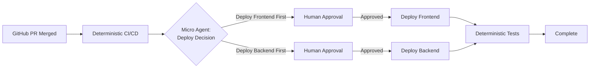

import { Callout, Card, Badge, Tabs, TabsContent, TabsList, TabsTrigger } from '@/components/ui'

# The 12-Factor Agent: Building Reliable LLM Applications Without the Magic

We've all been there. You spin up a new agent, wire it to your favorite framework, and within hours you're at 70-80% functionality. The CEO is excited. The team doubles. And then... reality hits.

That last 20% becomes a debugging nightmare. You're seven layers deep in a call stack, trying to reverse-engineer how prompts get built and why your agent keeps calling the wrong API in an infinite loop. Eventually, you either throw it all away and start from scratch, or worse—you realize this wasn't even a good problem for agents in the first place.

<Callout type="info" title="The DevOps Agent That Wasn't">
**Personal confession time**: My first agent was a DevOps automation bot. "Here's my Makefile," I told it. "Go build the project." Two hours later, after adding increasingly specific instructions to the prompt, I had essentially written a bash script in English. The realization? I could have written the actual bash script in 90 seconds.
</Callout>

## 🎯 The Problem with Agent Development Today

After talking to 100+ founders, builders, and engineers about their agent development experiences, I noticed something striking: **most production agents aren't that agentic at all**. They're mostly deterministic software with small, carefully controlled LLM interactions.

The teams succeeding weren't doing greenfield rewrites. They were applying small, modular patterns—patterns that didn't have names or definitions—to their existing code. And here's the kicker: **you don't need an AI background to implement these patterns**. This is software engineering, plain and simple.

## 📋 Introducing the 12 Factors

Just as Heroku defined what it meant to build cloud-native applications a decade ago, we need a similar framework for agent development. These 12 factors represent the core patterns I've seen working in production across dozens of successful agent implementations.

### Factor 1: JSON Extraction is Your Superpower 🔄

The most magical thing LLMs can do has nothing to do with loops, tools, or complex orchestration. It's this:

```python
# Input: Natural language
user_message = "Schedule a meeting with Sarah next Tuesday at 3pm"

# Output: Structured JSON
{
    "action": "schedule_meeting",
    "participant": "Sarah",
    "date": "next_tuesday",
    "time": "15:00"
}
```

**That's it**. That's the magic. Everything else—what you do with that JSON—is just regular software engineering.

### Factor 2: Own Your Prompts 📝

Those prompt abstractions that promise to handle everything for you? They'll get you to 80%. But when you need that last 20% of quality, you'll end up writing every token by hand.

<Tabs defaultValue="before" className="w-full">
  <TabsList>
    <TabsTrigger value="before">Framework Abstraction</TabsTrigger>
    <TabsTrigger value="after">Owned Prompt</TabsTrigger>
  </TabsList>
  <TabsContent value="before">
```python
# Hidden prompt construction
agent = FrameworkAgent(
    role="customer_service",
    tools=[email_tool, database_tool],
    personality="helpful"
)
response = agent.run(user_input)  # What prompt is this actually using?
```
  </TabsContent>
  <TabsContent value="after">
```python
# Explicit prompt control
def build_prompt(context, user_input, available_tools):
    return f"""You are a customer service agent with access to the following tools:
{format_tools(available_tools)}

Current context:
{format_context(context)}

User request: {user_input}

Respond with a JSON object containing:
- "reasoning": Your thought process
- "action": The tool to use or "respond" to answer directly
- "parameters": Tool parameters if applicable
- "message": Your response to the user if action is "respond"
"""
```
  </TabsContent>
</Tabs>

**Why this matters**: LLMs are pure functions. Tokens in, tokens out. The only thing determining your agent's reliability is the quality of tokens you get out, and the only thing determining that (besides the model itself) is being careful about what tokens you put in.

### Factor 3: Context Windows Need Active Management 🪟

The naive approach: Keep appending to the context window until the LLM says it's done. The problem? This breaks down fast with longer workflows.

```python
# ❌ What not to do
context = []
while not done:
    context.append(last_action)
    context.append(last_result)
    response = llm(context)  # Context grows unbounded
    
# ✅ Better approach
class ContextManager:
    def __init__(self, max_tokens=8000):
        self.max_tokens = max_tokens
        self.context = []
    
    def add_event(self, event):
        self.context.append(event)
        self._manage_window()
    
    def _manage_window(self):
        # Summarize old events
        if self._token_count() > self.max_tokens * 0.8:
            old_events = self.context[:-10]
            summary = self._summarize(old_events)
            self.context = [summary] + self.context[-10:]
```

### Factor 4: "Tool Use" is Harmful (The Abstraction, Not the Concept) 🔧

<Callout type="warning" title="Controversial Take Alert">
The term "tool use" makes us think of agents as magical entities interacting with the world. In reality, it's just JSON going into a switch statement.
</Callout>

```python
# Stop thinking of it as "tool use"
# Start thinking of it as "JSON to code routing"

def handle_agent_output(llm_response):
    action = llm_response["action"]
    
    match action:
        case "send_email":
            return email_service.send(**llm_response["parameters"])
        case "query_database":
            return db.query(**llm_response["parameters"])
        case "respond":
            return llm_response["message"]
        case _:
            return handle_unknown_action(action)
```

### Factor 5: Small, Focused Agents Beat Monoliths 🎯

The pattern that actually works in production: mostly deterministic workflows with small agent loops handling specific decisions.



**Real example from production**: Our deployment bot at HumanLayer is 90% deterministic code. The agent only handles:
1. Deciding deployment order based on PR content
2. Formatting notifications for human approval
3. Handling rollback decisions if tests fail

Each micro-agent handles 3-10 steps max. Manageable context. Clear responsibilities. Actually debuggable.

### Factor 6: Own Your Control Flow 🔄

Stop letting frameworks hide your control flow. An agent is just:
- A prompt (instructions for selecting next step)
- A switch statement (routing JSON to code)
- A context builder (managing what the LLM sees)
- A loop with exit conditions

```python
class Agent:
    def __init__(self, prompt_template, tools):
        self.prompt_template = prompt_template
        self.tools = tools
        self.context = ContextManager()
        
    async def run(self, initial_input):
        self.context.add_event({"type": "user_input", "content": initial_input})
        
        while not self._should_exit():
            # You own this
            prompt = self._build_prompt()
            
            # You own this
            response = await self.llm(prompt)
            
            # You own this
            result = await self._execute_action(response)
            
            # You own this
            self.context.add_event({"type": "action_result", "content": result})
            
        return self._final_response()
```

### Factor 7: Agents Should Be Stateless 🏗️

Your agent shouldn't manage state—your application should. This enables pause/resume, better testing, and actual production reliability.

```python
# Stateless agent that can be interrupted and resumed
class StatelessAgent:
    async def step(self, state: AgentState) -> AgentState:
        # Load context from state
        context = self._rebuild_context(state.events)
        
        # Make decision
        response = await self.llm(self._build_prompt(context))
        
        # Return new state (immutable)
        return AgentState(
            events=state.events + [response],
            status="continue" if response.needs_more else "complete"
        )

# Usage with external state management
async def run_interruptible_agent(agent, initial_state):
    state = initial_state
    
    while state.status == "continue":
        # Can save state to DB here for pause/resume
        await save_state(state)
        
        # Run one step
        state = await agent.step(state)
        
        # Can interrupt here based on external signals
        if await should_pause():
            return {"status": "paused", "state_id": state.id}
    
    return {"status": "complete", "result": state.final_result}
```

### Factor 8: Contact Humans as First-Class Operations 👥

Don't treat human interaction as an afterthought. Make it a first-class part of your agent's vocabulary.

```python
# Instead of special-casing human interaction
if needs_human_input:
    return special_human_handler()

# Make it part of the natural flow
{
    "action": "contact_human",
    "parameters": {
        "type": "clarification",
        "message": "Should I deploy frontend or backend first?",
        "options": ["frontend", "backend", "both_together"]
    }
}
```

### Factor 9: Meet Users Where They Are 📍

Nobody wants seven browser tabs open for different agents. Let them interact where they already work.

```python
class MultiChannelAgent:
    async def handle_email(self, email):
        return await self.process_input(email.body, channel="email")
    
    async def handle_slack(self, message):
        return await self.process_input(message.text, channel="slack")
    
    async def handle_api(self, request):
        return await self.process_input(request.json(), channel="api")
```

### Factor 10: Explicit Error Handling 🚨

Don't blindly append errors to context. Process them intelligently.

```python
class SmartErrorHandler:
    def handle_tool_error(self, error, context):
        # Don't just append the full stack trace
        if isinstance(error, APIRateLimitError):
            return {
                "type": "rate_limit",
                "message": "API limit reached. Waiting 60s.",
                "retry_after": 60
            }
        
        # Clear previous errors on success
        if context.last_action_succeeded:
            context.clear_pending_errors()
        
        # Summarize repeated errors
        if context.error_count(error.type) > 3:
            return {
                "type": "repeated_error",
                "message": f"Failed {error.type} 3+ times. Trying alternate approach."
            }
```

### Factor 11: Separate Business State from Execution State 💼

Your agent needs to track two different types of state:

```python
@dataclass
class ExecutionState:
    """How the agent is running"""
    current_step: int
    retry_count: int
    context_window: List[Event]
    
@dataclass 
class BusinessState:
    """What the agent is doing"""
    user_messages: List[Message]
    pending_approvals: List[Approval]
    completed_tasks: List[Task]
    
# Keep them separate for clarity
class ProductionAgent:
    def __init__(self):
        self.execution = ExecutionState()
        self.business = BusinessState()
```

### Factor 12: Find the Bleeding Edge 🚀

<Callout type="success" title="The NotebookLM Principle">
"Find something that is right at the boundary of what the model can do reliably—that it can't get right all the time—and figure out how to get it right reliably anyway. You will have created something magical."
</Callout>

This means:
- Push the model to its limits
- Engineer reliability into your system
- Create value that others can't easily replicate

## 🛠️ Putting It All Together: A Production Example

Here's how these factors combine in a real customer service agent:

```python
class CustomerServiceAgent:
    def __init__(self):
        # Factor 2: Own your prompts
        self.prompt = load_prompt("customer_service_v2.txt")
        
        # Factor 7: Stateless design
        self.state_manager = StateManager()
        
        # Factor 9: Multi-channel
        self.channels = {
            "email": EmailHandler(),
            "slack": SlackHandler(),
            "web": WebHandler()
        }
    
    async def handle_request(self, request, channel):
        # Factor 11: Separate state types
        exec_state = ExecutionState(request_id=request.id)
        biz_state = await self.load_business_state(request.customer_id)
        
        # Factor 5: Small, focused processing
        while exec_state.status == "processing":
            # Factor 3: Active context management
            context = self.build_context(exec_state, biz_state)
            
            # Factor 1: JSON extraction
            response = await self.llm.extract_json(
                self.prompt.format(context=context)
            )
            
            # Factor 4: "Tools" are just code
            result = await self.route_action(response)
            
            # Factor 10: Smart error handling
            if result.error:
                result = self.handle_error(result.error, exec_state)
            
            # Factor 8: Human interaction when needed
            if result.needs_human:
                await self.request_human_input(result, channel)
                
            # Factor 6: Own your control flow
            exec_state = self.update_execution_state(exec_state, result)
            biz_state = self.update_business_state(biz_state, result)
            
            # Factor 7: Can pause/resume here
            await self.save_state(exec_state, biz_state)
        
        return self.format_response(biz_state, channel)
```

## 🎬 The Path Forward

Agents are software. You already know how to build software. The magic isn't in the frameworks—it's in thoughtful application of engineering principles to a new domain.

Start small. Pick one factor that resonates with your current challenges. Implement it. See the improvement. Then add another.

Most importantly, remember: **the teams succeeding with agents aren't the ones with the most complex frameworks. They're the ones who understand that agents are just software, and software engineering principles still apply.**

## 📚 Resources and Next Steps

<Card className="p-6">
  <h3 className="text-xl font-semibold mb-4">Ready to Build Better Agents?</h3>
  <div className="space-y-3">
    <p>→ Check out the <a href="https://github.com/12factor-agents/12factor-agents" className="text-primary hover:underline">12-Factor Agents GitHub repo</a> for detailed documentation</p>
    <p>→ Join the discussion about production agent patterns</p>
    <p>→ Start with Factor 1 (JSON extraction) and Factor 2 (own your prompts)</p>
    <p>→ Measure your improvements—track reliability metrics before and after</p>
  </div>
</Card>

Remember: Every production agent started as an impressive demo that hit the 70% wall. The difference between the demos and the production systems? The builders who pushed through understood these patterns.

Now it's your turn. Go build something that actually works.

## 📺 Watch the Original Talk

This post is based on Dex Horthy's excellent presentation on 12-Factor Agents. Watch the full talk for additional insights, live demos, and Q&A with the audience:

<Card className="mt-4">
  <CardHeader>
    <CardTitle>12-Factor Agents: Patterns of Reliable LLM Applications</CardTitle>
  </CardHeader>
  <CardContent>
    <p className="mb-2">Dex Horthy from HumanLayer shares patterns from interviewing 100+ builders about what makes production agents actually work.</p>
    <a href="https://www.youtube.com/watch?v=8kMaTybvDUw" className="text-primary hover:underline font-semibold">
      Watch on YouTube →
    </a>
  </CardContent>
</Card>