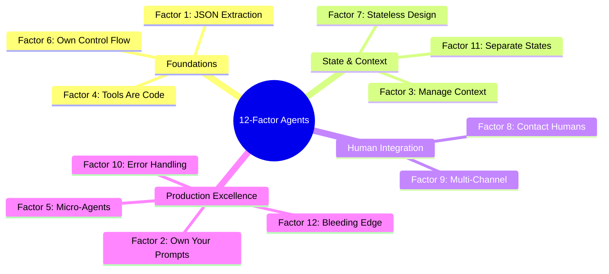
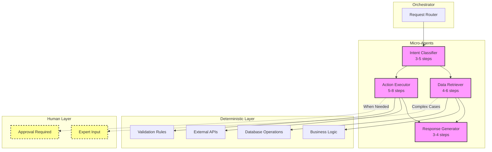
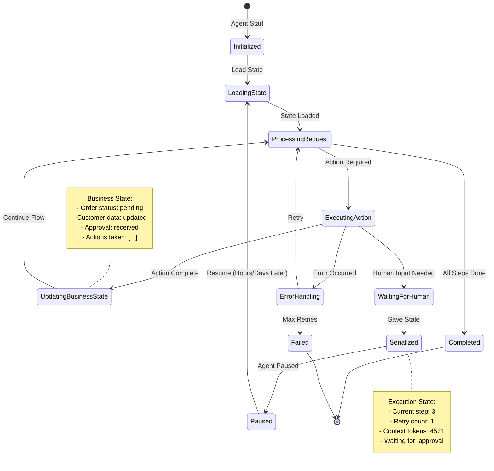

import { Card, CardContent, CardHeader, CardTitle } from '@/components/ui/card'
import { Callout } from '@/components/ui/callout'
import { Badge } from '@/components/ui/badge'

# Agent Architecture Patterns: A Production Guide for System Architects

## Core Philosophy: Agents Are Software, Not Magic

The fundamental insight from analyzing 100+ production agent implementations: **The most successful agents aren't the most "agentic"**. They're well-engineered software systems that leverage LLMs for specific, controlled transformations.

This document distills the patterns that separate production-ready agents from impressive demos.

---

## The 12 Factors at a Glance

### 1. **JSON Extraction as Foundation**
- The most powerful LLM capability is converting natural language to structured JSON
- Everything else builds on this simple transformation
- Focus on schema design and validation over complex orchestration

### 2. **Own Your Prompts**
- Framework abstractions get you to 80%, but production requires hand-crafted prompts
- Every token matters for reliability
- Version control and test your prompts like code

### 3. **Manage Context Windows Explicitly**
- Don't blindly append to context—actively manage what the LLM sees
- Implement summarization and pruning strategies
- Context window size directly impacts reliability

### 4. **Tools Are Just JSON and Code**
- "Tool use" is a harmful abstraction—it's just JSON routing to functions
- Makes debugging trivial when you think this way
- No magic, just switch statements

### 5. **Small, Focused Agents Over Monoliths**
- Micro-agents handling 3-10 steps are far more reliable
- Compose them into larger workflows
- Each agent has clear boundaries and responsibilities

### 6. **Own Your Control Flow**
- Agents are prompts + routers + context + loops
- Don't let frameworks hide this—you need direct control
- Explicit is better than magical

### 7. **Stateless Agent Design**
- Agents shouldn't manage state—your application should
- Enables pause/resume, better testing, and production reliability
- Think functional programming principles

### 8. **Contact Humans as First-Class Operations**
- Human interaction isn't an edge case—it's core functionality
- Build it into your agent's vocabulary from day one
- "contact_human" should be as natural as any other action

### 9. **Meet Users Where They Are**
- Email, Slack, Discord, SMS—don't force new interfaces
- Agents should integrate into existing workflows
- Multi-channel from the start, not as an afterthought

### 10. **Explicit Error Handling**
- Don't blindly append errors to context
- Implement intelligent retry strategies
- Clear errors on success, summarize repeated failures

### 11. **Separate Business State from Execution State**
- Execution state: how the agent runs (steps, retries, context)
- Business state: what the agent does (user data, approvals, tasks)
- Keep them separate for clarity and maintainability

### 12. **Find the Bleeding Edge**
- Push models to their limits, then engineer reliability
- The magic happens at the boundary of capability
- Create value others can't easily replicate

---

## Visual Overview of the 12 Factors

### The 12-Factor Agent Framework



---

## Implementation Patterns

### The Micro-Agent Architecture

### Micro-Agent Composition Pattern



**Key Benefits:**
- Bounded context windows
- Clear failure modes
- Easy to test and debug
- Composable into larger systems

### State Management Strategy

```python
# Execution state (HOW the agent runs)
{
    "step_count": 3,
    "retry_count": 1,
    "context_tokens": 4521,
    "last_action": "query_database"
}

# Business state (WHAT the agent does)
{
    "customer_id": "cust_123",
    "ticket_status": "pending_approval",
    "resolved_issues": ["password_reset"],
    "pending_tasks": ["refund_processing"]
}
```

**Keep them separate** for easier debugging, testing, and maintenance.

### State Management Flow



### Integration Architecture

```
┌──────────────────────────────────────────────┐
│             Multi-Channel Gateway             │
├────────────┬────────────┬────────────────────┤
│   Email    │   Slack    │   API/Webhooks    │
└────────────┴────────────┴────────────────────┘
                    │
                    ▼
┌──────────────────────────────────────────────┐
│            Stateless Agent Core              │
│  • JSON Extraction                           │
│  • Action Routing                            │
│  • Context Management                        │
└──────────────────────────────────────────────┘
                    │
                    ▼
┌──────────────────────────────────────────────┐
│         Deterministic Business Logic          │
└──────────────────────────────────────────────┘
```

---

## Business Value

### Reliability Improvements
- **70% → 95%+ success rates** by implementing proper context management
- **10x reduction in debugging time** through explicit control flow
- **Predictable failure modes** instead of mysterious agent behaviors

### Maintainability Benefits
- **New team members productive in days, not weeks**
- **Test coverage possible** with stateless design
- **Version control and rollback** for prompts and flows

### Team Velocity Gains
- **Rapid iteration** on prompts without framework fighting
- **Parallel development** with micro-agent architecture
- **Reusable components** across different use cases

---

## Action Items for Teams

### 1. **Audit Your Existing Agents**
- [ ] Map current architecture to the 12 factors
- [ ] Identify which factors you're violating
- [ ] Prioritize fixes based on pain points

### 2. **Start Small with High-Impact Changes**
- [ ] Factor 1: Implement explicit JSON extraction
- [ ] Factor 2: Take ownership of critical prompts
- [ ] Factor 4: Replace "tool use" with explicit routing

### 3. **Refactoring Strategy**
```
Week 1-2: Extract JSON schemas, own your prompts
Week 3-4: Implement proper context management
Week 5-6: Break monoliths into micro-agents
Week 7-8: Add human-in-the-loop capabilities
```

### 4. **Measurement Framework**
Track before and after:
- Success rates by operation type
- Average context window size
- Time to debug failures
- Developer velocity metrics

### 5. **Building New Agents**
For new development:
1. Start with JSON extraction, not frameworks
2. Build the smallest useful agent first
3. Add complexity only when proven necessary
4. Design for human collaboration from day one

---

## Common Anti-Patterns to Avoid

### ❌ **The Kitchen Sink Agent**
Trying to build one agent that does everything. Instead: compose micro-agents.

### ❌ **Context Window Hoarding**
Appending everything to context. Instead: actively manage and summarize.

### ❌ **Framework Lock-in**
Depending on framework magic. Instead: own your core abstractions.

### ❌ **Ignoring Humans**
Treating human interaction as an edge case. Instead: first-class operation.

### ❌ **State Soup**
Mixing execution and business state. Instead: clear separation of concerns.

---

## The Path Forward

The future of agent development isn't more magical frameworks—it's better software engineering applied to LLM capabilities. The teams succeeding today understand this.

Your agents are software. Treat them as such, and they'll reward you with reliability, maintainability, and capabilities your competitors can't match.

### Resources for Deep Dives
- **GitHub Repository**: [12factor-agents/12factor-agents](https://github.com/12factor-agents/12factor-agents)
- **Learning Path**: "12-Factor Agent Development" (10-hour comprehensive course)
- **Blog Post**: "The 12-Factor Agent: Building Reliable LLM Applications Without the Magic"

### Get Started Today
1. Pick your highest-pain agent
2. Apply factors 1, 2, and 4
3. Measure the improvement
4. Share your results with the community

---

*The best time to rethink your agent architecture was when you started. The second best time is now.*