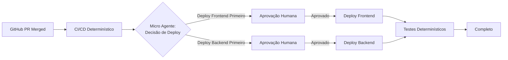

import { Callout, Card, Badge, Tabs, TabsContent, TabsList, TabsTrigger } from '@/components/ui'

# O Agente de 12 Fatores: Construindo Aplicações LLM Confiáveis Sem a Mágica

Todos nós já passamos por isso. Você cria um novo agente, conecta ao seu framework favorito e, em poucas horas, está com 70-80% de funcionalidade. O CEO está animado. A equipe dobra. E então... a realidade bate.

Aqueles últimos 20% se tornam um pesadelo de depuração. Você está sete camadas adentro em uma pilha de chamadas, tentando fazer engenharia reversa de como os prompts são construídos e por que seu agente continua chamando a API errada em um loop infinito. Eventualmente, você joga tudo fora e começa do zero, ou pior—percebe que esse nem era um bom problema para agentes em primeiro lugar.

<Callout type="info" title="O Agente DevOps Que Não Era">
**Hora da confissão pessoal**: Meu primeiro agente foi um bot de automação DevOps. "Aqui está meu Makefile", eu disse a ele. "Vá construir o projeto." Duas horas depois, após adicionar instruções cada vez mais específicas ao prompt, eu tinha essencialmente escrito um script bash em inglês. A percepção? Eu poderia ter escrito o script bash real em 90 segundos.
</Callout>

## 🎯 O Problema com o Desenvolvimento de Agentes Hoje

Após conversar com mais de 100 fundadores, construtores e engenheiros sobre suas experiências de desenvolvimento de agentes, notei algo impressionante: **a maioria dos agentes em produção não são tão agênticos assim**. Eles são principalmente software determinístico com pequenas interações LLM cuidadosamente controladas.

As equipes que estão tendo sucesso não estão fazendo reescritas completas. Elas estão aplicando padrões pequenos e modulares—padrões que não tinham nomes ou definições—ao seu código existente. E aqui está o ponto principal: **você não precisa de experiência em IA para implementar esses padrões**. Isso é engenharia de software, pura e simples.

## 📋 Apresentando os 12 Fatores

Assim como a Heroku definiu o que significava construir aplicações nativas da nuvem há uma década, precisamos de um framework similar para o desenvolvimento de agentes. Esses 12 fatores representam os padrões principais que vi funcionando em produção em dezenas de implementações bem-sucedidas de agentes.

### Fator 1: Extração JSON é Seu Superpoder 🔄

A coisa mais mágica que os LLMs podem fazer não tem nada a ver com loops, ferramentas ou orquestração complexa. É isto:

```python
# Entrada: Linguagem natural
user_message = "Agende uma reunião com Sarah na próxima terça às 15h"

# Saída: JSON estruturado
{
    "action": "schedule_meeting",
    "participant": "Sarah",
    "date": "next_tuesday",
    "time": "15:00"
}
```

**É isso**. Essa é a mágica. Todo o resto—o que você faz com esse JSON—é apenas engenharia de software regular.

### Fator 2: Seja Dono dos Seus Prompts 📝

Aquelas abstrações de prompt que prometem lidar com tudo para você? Elas vão te levar a 80%. Mas quando você precisar daqueles últimos 20% de qualidade, você acabará escrevendo cada token manualmente.

<Tabs defaultValue="before" className="w-full">
  <TabsList>
    <TabsTrigger value="before">Abstração do Framework</TabsTrigger>
    <TabsTrigger value="after">Prompt Próprio</TabsTrigger>
  </TabsList>
  <TabsContent value="before">
```python
# Construção de prompt oculta
agent = FrameworkAgent(
    role="customer_service",
    tools=[email_tool, database_tool],
    personality="helpful"
)
response = agent.run(user_input)  # Que prompt isso está realmente usando?
```
  </TabsContent>
  <TabsContent value="after">
```python
# Controle explícito do prompt
def build_prompt(context, user_input, available_tools):
    return f"""Você é um agente de atendimento ao cliente com acesso às seguintes ferramentas:
{format_tools(available_tools)}

Contexto atual:
{format_context(context)}

Solicitação do usuário: {user_input}

Responda com um objeto JSON contendo:
- "reasoning": Seu processo de pensamento
- "action": A ferramenta a usar ou "respond" para responder diretamente
- "parameters": Parâmetros da ferramenta se aplicável
- "message": Sua resposta ao usuário se a ação for "respond"
"""
```
  </TabsContent>
</Tabs>

**Por que isso importa**: LLMs são funções puras. Tokens entram, tokens saem. A única coisa que determina a confiabilidade do seu agente é a qualidade dos tokens que você obtém, e a única coisa que determina isso (além do próprio modelo) é ter cuidado com quais tokens você coloca.

### Fator 3: Janelas de Contexto Precisam de Gerenciamento Ativo 🪟

A abordagem ingênua: Continue anexando à janela de contexto até que o LLM diga que terminou. O problema? Isso quebra rapidamente com fluxos de trabalho mais longos.

```python
# ❌ O que não fazer
context = []
while not done:
    context.append(last_action)
    context.append(last_result)
    response = llm(context)  # Contexto cresce sem limites
    
# ✅ Melhor abordagem
class ContextManager:
    def __init__(self, max_tokens=8000):
        self.max_tokens = max_tokens
        self.context = []
    
    def add_event(self, event):
        self.context.append(event)
        self._manage_window()
    
    def _manage_window(self):
        # Resumir eventos antigos
        if self._token_count() > self.max_tokens * 0.8:
            old_events = self.context[:-10]
            summary = self._summarize(old_events)
            self.context = [summary] + self.context[-10:]
```

### Fator 4: "Uso de Ferramentas" é Prejudicial (A Abstração, Não o Conceito) 🔧

<Callout type="warning" title="Alerta de Opinião Controversa">
O termo "uso de ferramentas" nos faz pensar em agentes como entidades mágicas interagindo com o mundo. Na realidade, é apenas JSON entrando em uma declaração switch.
</Callout>

```python
# Pare de pensar nisso como "uso de ferramentas"
# Comece a pensar nisso como "roteamento de JSON para código"

def handle_agent_output(llm_response):
    action = llm_response["action"]
    
    match action:
        case "send_email":
            return email_service.send(**llm_response["parameters"])
        case "query_database":
            return db.query(**llm_response["parameters"])
        case "respond":
            return llm_response["message"]
        case _:
            return handle_unknown_action(action)
```

### Fator 5: Agentes Pequenos e Focados Vencem Monólitos 🎯

O padrão que realmente funciona em produção: fluxos de trabalho principalmente determinísticos com pequenos loops de agente lidando com decisões específicas.



**Exemplo real de produção**: Nosso bot de deploy na HumanLayer é 90% código determinístico. O agente apenas lida com:
1. Decidir a ordem de deploy baseado no conteúdo do PR
2. Formatar notificações para aprovação humana
3. Lidar com decisões de rollback se os testes falharem

Cada micro-agente lida com no máximo 3-10 passos. Contexto gerenciável. Responsabilidades claras. Realmente depurável.

### Fator 6: Seja Dono do Seu Fluxo de Controle 🔄

Pare de deixar frameworks esconderem seu fluxo de controle. Um agente é apenas:
- Um prompt (instruções para selecionar o próximo passo)
- Uma declaração switch (roteando JSON para código)
- Um construtor de contexto (gerenciando o que o LLM vê)
- Um loop com condições de saída

```python
class Agent:
    def __init__(self, prompt_template, tools):
        self.prompt_template = prompt_template
        self.tools = tools
        self.context = ContextManager()
        
    async def run(self, initial_input):
        self.context.add_event({"type": "user_input", "content": initial_input})
        
        while not self._should_exit():
            # Você é dono disso
            prompt = self._build_prompt()
            
            # Você é dono disso
            response = await self.llm(prompt)
            
            # Você é dono disso
            result = await self._execute_action(response)
            
            # Você é dono disso
            self.context.add_event({"type": "action_result", "content": result})
            
        return self._final_response()
```

### Fator 7: Agentes Devem Ser Sem Estado 🏗️

Seu agente não deve gerenciar estado—sua aplicação deve. Isso permite pausar/retomar, melhor teste e confiabilidade real em produção.

```python
# Agente sem estado que pode ser interrompido e retomado
class StatelessAgent:
    async def step(self, state: AgentState) -> AgentState:
        # Carregar contexto do estado
        context = self._rebuild_context(state.events)
        
        # Tomar decisão
        response = await self.llm(self._build_prompt(context))
        
        # Retornar novo estado (imutável)
        return AgentState(
            events=state.events + [response],
            status="continue" if response.needs_more else "complete"
        )

# Uso com gerenciamento de estado externo
async def run_interruptible_agent(agent, initial_state):
    state = initial_state
    
    while state.status == "continue":
        # Pode salvar estado no DB aqui para pausar/retomar
        await save_state(state)
        
        # Executar um passo
        state = await agent.step(state)
        
        # Pode interromper aqui baseado em sinais externos
        if await should_pause():
            return {"status": "paused", "state_id": state.id}
    
    return {"status": "complete", "result": state.final_result}
```

### Fator 8: Contatar Humanos como Operações de Primeira Classe 👥

Não trate a interação humana como uma reflexão tardia. Torne-a parte de primeira classe do vocabulário do seu agente.

```python
# Em vez de casos especiais para interação humana
if needs_human_input:
    return special_human_handler()

# Torne isso parte do fluxo natural
{
    "action": "contact_human",
    "parameters": {
        "type": "clarification",
        "message": "Devo fazer deploy do frontend ou backend primeiro?",
        "options": ["frontend", "backend", "ambos_juntos"]
    }
}
```

### Fator 9: Encontre os Usuários Onde Eles Estão 📍

Ninguém quer sete abas do navegador abertas para diferentes agentes. Deixe-os interagir onde já trabalham.

```python
class MultiChannelAgent:
    async def handle_email(self, email):
        return await self.process_input(email.body, channel="email")
    
    async def handle_slack(self, message):
        return await self.process_input(message.text, channel="slack")
    
    async def handle_api(self, request):
        return await self.process_input(request.json(), channel="api")
```

### Fator 10: Tratamento Explícito de Erros 🚨

Não anexe cegamente erros ao contexto. Processe-os inteligentemente.

```python
class SmartErrorHandler:
    def handle_tool_error(self, error, context):
        # Não apenas anexe o stack trace completo
        if isinstance(error, APIRateLimitError):
            return {
                "type": "rate_limit",
                "message": "Limite da API atingido. Aguardando 60s.",
                "retry_after": 60
            }
        
        # Limpar erros anteriores em caso de sucesso
        if context.last_action_succeeded:
            context.clear_pending_errors()
        
        # Resumir erros repetidos
        if context.error_count(error.type) > 3:
            return {
                "type": "repeated_error",
                "message": f"Falhou {error.type} 3+ vezes. Tentando abordagem alternativa."
            }
```

### Fator 11: Separe Estado de Negócios do Estado de Execução 💼

Seu agente precisa rastrear dois tipos diferentes de estado:

```python
@dataclass
class ExecutionState:
    """Como o agente está executando"""
    current_step: int
    retry_count: int
    context_window: List[Event]
    
@dataclass 
class BusinessState:
    """O que o agente está fazendo"""
    user_messages: List[Message]
    pending_approvals: List[Approval]
    completed_tasks: List[Task]
    
# Mantenha-os separados para clareza
class ProductionAgent:
    def __init__(self):
        self.execution = ExecutionState()
        self.business = BusinessState()
```

### Fator 12: Encontre o Limite Extremo 🚀

<Callout type="success" title="O Princípio NotebookLM">
"Encontre algo que está bem no limite do que o modelo pode fazer de forma confiável—que ele não consegue acertar o tempo todo—e descubra como fazê-lo acertar de forma confiável de qualquer maneira. Você terá criado algo mágico."
</Callout>

Isso significa:
- Empurre o modelo aos seus limites
- Engenharia confiabilidade em seu sistema
- Crie valor que outros não podem facilmente replicar

## 🛠️ Juntando Tudo: Um Exemplo de Produção

Veja como esses fatores se combinam em um agente real de atendimento ao cliente:

```python
class CustomerServiceAgent:
    def __init__(self):
        # Fator 2: Seja dono dos seus prompts
        self.prompt = load_prompt("customer_service_v2.txt")
        
        # Fator 7: Design sem estado
        self.state_manager = StateManager()
        
        # Fator 9: Multi-canal
        self.channels = {
            "email": EmailHandler(),
            "slack": SlackHandler(),
            "web": WebHandler()
        }
    
    async def handle_request(self, request, channel):
        # Fator 11: Separar tipos de estado
        exec_state = ExecutionState(request_id=request.id)
        biz_state = await self.load_business_state(request.customer_id)
        
        # Fator 5: Processamento pequeno e focado
        while exec_state.status == "processing":
            # Fator 3: Gerenciamento ativo de contexto
            context = self.build_context(exec_state, biz_state)
            
            # Fator 1: Extração JSON
            response = await self.llm.extract_json(
                self.prompt.format(context=context)
            )
            
            # Fator 4: "Ferramentas" são apenas código
            result = await self.route_action(response)
            
            # Fator 10: Tratamento inteligente de erros
            if result.error:
                result = self.handle_error(result.error, exec_state)
            
            # Fator 8: Interação humana quando necessário
            if result.needs_human:
                await self.request_human_input(result, channel)
                
            # Fator 6: Seja dono do seu fluxo de controle
            exec_state = self.update_execution_state(exec_state, result)
            biz_state = self.update_business_state(biz_state, result)
            
            # Fator 7: Pode pausar/retomar aqui
            await self.save_state(exec_state, biz_state)
        
        return self.format_response(biz_state, channel)
```

## 🎬 O Caminho Adiante

Agentes são software. Você já sabe construir software. A mágica não está nos frameworks—está na aplicação cuidadosa de princípios de engenharia a um novo domínio.

Comece pequeno. Escolha um fator que ressoa com seus desafios atuais. Implemente-o. Veja a melhoria. Então adicione outro.

Mais importante, lembre-se: **as equipes que estão tendo sucesso com agentes não são as que têm os frameworks mais complexos. São as que entendem que agentes são apenas software, e princípios de engenharia de software ainda se aplicam.**

## 📚 Recursos e Próximos Passos

<Card className="p-6">
  <h3 className="text-xl font-semibold mb-4">Pronto para Construir Agentes Melhores?</h3>
  <div className="space-y-3">
    <p>→ Confira o <a href="https://github.com/12factor-agents/12factor-agents" className="text-primary hover:underline">repositório GitHub dos Agentes de 12 Fatores</a> para documentação detalhada</p>
    <p>→ Junte-se à discussão sobre padrões de agentes em produção</p>
    <p>→ Comece com o Fator 1 (extração JSON) e Fator 2 (seja dono dos seus prompts)</p>
    <p>→ Meça suas melhorias—acompanhe métricas de confiabilidade antes e depois</p>
  </div>
</Card>

Lembre-se: Todo agente em produção começou como uma demo impressionante que atingiu o muro dos 70%. A diferença entre as demos e os sistemas em produção? Os construtores que perseveraram entenderam esses padrões.

Agora é sua vez. Vá construir algo que realmente funciona.

## 📺 Assista à Palestra Original

Este post é baseado na excelente apresentação de Dex Horthy sobre Agentes de 12 Fatores. Assista à palestra completa para insights adicionais, demos ao vivo e Q&A com a audiência:

<Card className="mt-4">
  <CardHeader>
    <CardTitle>Agentes de 12 Fatores: Padrões de Aplicações LLM Confiáveis</CardTitle>
  </CardHeader>
  <CardContent>
    <p className="mb-2">Dex Horthy da HumanLayer compartilha padrões de entrevistas com mais de 100 construtores sobre o que faz agentes em produção realmente funcionarem.</p>
    <a href="https://www.youtube.com/watch?v=8kMaTybvDUw" className="text-primary hover:underline font-semibold">
      Assistir no YouTube →
    </a>
  </CardContent>
</Card>