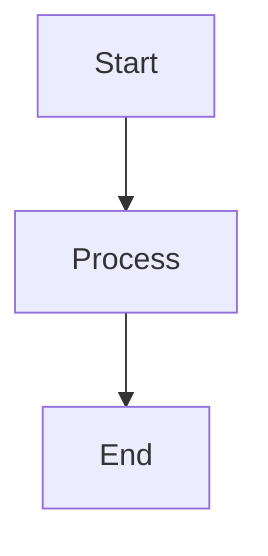

# Learning Module Creation Guide for LLMs

This guide provides comprehensive instructions for creating learning modules that match the existing style and structure of the AI Engineering portfolio's learning platform.

## Directory Structure

Learning content follows this hierarchy:
```
content/learn/
├── paths/                    # Learning path directories
│   ├── {path-id}/           # Individual learning path
│   │   ├── metadata.json    # Path metadata and configuration
│   │   ├── modules/         # Module content
│   │   │   ├── {order}-{module-id}.json  # Module metadata
│   │   │   └── {order}-{module-id}.mdx   # Module content
│   │   └── assets/          # Path-specific images/resources
│   └── pt-BR/               # Portuguese translations
├── schemas/                  # JSON schemas for validation
└── shared/                   # Shared resources across paths
    ├── assets/              # Shared images/diagrams
    └── templates/           # Content templates
```

## Learning Path Structure

### metadata.json
Every learning path requires a metadata.json file with this structure:

```json
{
  "id": "path-identifier",
  "title": "Path Title",
  "description": "Comprehensive description of the learning path",
  "level": "beginner|intermediate|advanced",
  "difficulty": "beginner|intermediate|advanced",
  "duration": "X-Y hours",
  "version": "1.0.0",
  "lastUpdated": "2024-01-15",
  "author": "Author Name",
  "prerequisites": ["path-id-1", "path-id-2"],
  "topics": ["Topic 1", "Topic 2"],
  "outcomes": [
    "Learning outcome 1",
    "Learning outcome 2"
  ],
  "modules": [
    "01-module-id",
    "02-module-id"
  ],
  "resources": [
    {
      "title": "Resource Title",
      "type": "reference|documentation|paper|tool|video|guide",
      "url": "https://...",
      "required": true|false
    }
  ],
  "tags": ["tag1", "tag2"]
}
```

### Internationalization Support
- For paths supporting multiple languages, use language subdirectories (en/, pt-BR/)
- For single-language paths, modules go directly in the modules/ directory
- Always provide translations for path metadata (title, description, prerequisites, etc.)

## Module Structure

### Module JSON File
Each module requires a JSON metadata file following this pattern:

```json
{
  "metadata": {
    "id": "module-identifier",
    "pathId": "parent-path-id",
    "title": "Module Title",
    "description": "What learners will accomplish",
    "duration": "30 minutes",
    "type": "theory|concept|practice|project|assessment",
    "difficulty": "beginner|intermediate|advanced",
    "order": 1,
    "prerequisites": [],
    "objectives": [
      "Objective 1",
      "Objective 2"
    ],
    "tags": ["tag1", "tag2"],
    "version": "1.0.0",
    "lastUpdated": "2024-01-15",
    "author": "Author Name"
  },
  "sections": [
    {
      "id": "section-id",
      "title": "Section Title",
      "type": "content|quiz|exercise|project",
      "order": 1,
      "estimatedDuration": "10 minutes",
      "content": {
        "type": "mdx",
        "source": "module-file.mdx#anchor",
        "codeExamples": []
      }
    }
  ],
  "resources": [],
  "assessmentCriteria": {
    "minimumScore": 70,
    "requiredSections": ["intro", "core-concepts"],
    "timeTracking": true,
    "completionCertificate": false
  }
}
```

### Module MDX File
Module content files use MDX format with frontmatter:

```mdx
---
title: "Module Title"
description: "Brief module description"
duration: "30 minutes"
difficulty: "beginner"
objectives:
  - "Learning objective 1"
  - "Learning objective 2"
tags:
  - "tag1"
  - "tag2"
lastUpdated: "2024-01-15"
author: "Author Name"
---

import { CodeExample } from '@/components/claude-sdk/CodeEditor'
import { Callout } from '@/components/ui/callout'
import { Quiz } from '@/components/claude-sdk/Quiz'
import { Diagram } from '@/components/claude-sdk/Diagram'

# Module Title

## Introduction {#introduction}

Start with context and why this topic matters...

<Callout type="info">
  **Key Point**: Important information highlighted here
</Callout>

## Core Concepts {#core-concepts}

### Concept Name

Explanation with examples...

<CodeExample
  title="Example Title"
  language="python"
  code={`
# Your code here
def example():
    return "Hello"
  `}
  highlightLines={[2]}
/>
```

## Code Organization Philosophy

### The 30-Line Rule
Research shows that code blocks longer than 30 lines significantly reduce comprehension. When creating learning modules:

1. **Break Complex Code**: Split implementations into logical segments
   - Interface/type definitions (5-15 lines)
   - Core functionality (15-25 lines)
   - Helper methods (10-20 lines)
   - Usage examples (5-10 lines)

2. **Add Context Between Segments**: Each code block should be preceded by:
   - What this code does
   - Why it's important
   - How it connects to the previous segment

3. **Example of Good Practice**:
   ```typescript
   // First block: Define the interface
   interface UserMemory {
     id: string;
     data: any;
   }
   ```
   
   This interface defines the structure of our memory system.
   
   ```typescript
   // Second block: Implement the core logic
   class MemoryManager {
     store(memory: UserMemory) {
       // Implementation details
     }
   }
   ```

### Simplicity-First Approach

**Core Principle**: Use the most basic example that completely demonstrates the concept.

1. **Start Minimal**: Begin with the simplest possible implementation
2. **Add Complexity Gradually**: Only introduce complexity when necessary
3. **Avoid Premature Optimization**: Don't include error handling, logging, or edge cases in initial examples
4. **Real-World Context Later**: Save production patterns for advanced sections

**Bad Example** (Too Complex for Introduction):
```typescript
class ComplexAgent {
  private logger: Logger;
  private errorHandler: ErrorHandler;
  private metricsCollector: MetricsCollector;
  
  constructor(config: AgentConfig) {
    // 50+ lines of initialization
  }
  
  async processWithRetry(input: string): Promise<Result> {
    // Complex retry logic with exponential backoff
  }
}
```

**Good Example** (Simple and Clear):
```typescript
class SimpleAgent {
  name: string;
  
  constructor(name: string) {
    this.name = name;
  }
  
  greet(): string {
    return `Hello, I'm ${this.name}`;
  }
}
```

### Progressive Disclosure Pattern

Build complexity incrementally:

1. **Level 1**: Basic concept (5-10 lines)
2. **Level 2**: Add one feature (10-15 lines)
3. **Level 3**: Handle edge cases (15-20 lines)
4. **Level 4**: Production-ready version (20-30 lines per segment)

## Content Patterns

### Anchors and Sections
- Every major section needs an anchor ID: `## Section Title {#section-id}`
- Anchors must match the section IDs referenced in the JSON file
- Use kebab-case for anchor IDs

### Interactive Components

#### 1. Callouts
```mdx
<Callout type="info|warning|success|error">
  **Title**: Message content
</Callout>
```

Types and usage:
- `info`: General information, tips, or insights
- `warning`: Common pitfalls or important warnings
- `success`: Best practices or success stories
- `error`: Things to avoid or error examples

#### 2. Code Examples
```mdx
<CodeExample
  title="Descriptive Title"
  language="typescript|python|javascript|bash|json|dockerfile|yaml"
  code={`
// Code content
  `}
  highlightLines={[1, 3, 5]}  // Optional
  runnable={true|false}       // Optional
/>
```

Best practices:
- Always provide a descriptive title
- Use appropriate language highlighting
- Highlight important lines
- Keep examples focused and concise
- **30-Line Rule**: No code block should exceed 30 lines
- **Break Long Code**: Split complex implementations into smaller, focused segments with explanatory text between them
- **Minimal Viable Examples**: Start with the simplest possible code that demonstrates the concept
- **Avoid Overengineering**: Don't write production-level code when a basic example suffices

**Important**: Use `<CodeExample>` instead of `<details>` for collapsible code sections. The `<details>` HTML element doesn't render properly in MDX and will show as raw HTML on the page.

#### 3. Quizzes
```mdx
<Quiz>
  <Question
    question="Question text?"
    options={[
      "Option A",
      "Option B",
      "Option C",
      "Option D"
    ]}
    correct={1}  // 0-based index
    explanation="Why this answer is correct"
  />
</Quiz>
```

Quiz guidelines:
- 5-10 questions per quiz
- Mix question difficulties
- Provide helpful explanations
- Focus on understanding, not memorization

#### 4. Diagrams
```mdx
<Diagram
  id="unique-diagram-id"
  title="Diagram Title"
  description="What this diagram shows"
/>

// Or inline Mermaid diagrams:

```

### Content Writing Style

#### Tone and Voice
- **Conversational**: Write as if explaining to a colleague
- **Encouraging**: Use positive language and celebrate progress
- **Clear**: Avoid jargon unless necessary, always define technical terms
- **Practical**: Focus on real-world applications

#### Structure Guidelines
1. **Introduction**: Set context, explain importance
2. **Core Content**: Break into digestible sections
3. **Examples**: Provide concrete, practical examples
4. **Practice**: Include hands-on exercises
5. **Summary**: Reinforce key takeaways
6. **Next Steps**: Guide learners forward

#### Common Patterns

**Concept Introduction**:
```mdx
### Concept Name

Brief one-sentence definition.

Think of [concept] like [analogy]. Just as [familiar example], 
[concept] works by [explanation].

**Key Points:**
- Point 1
- Point 2
- Point 3
```

**Before/After Comparisons**:
```mdx
**Before [Technology]:**
- Problem 1
- Problem 2

**After [Technology]:**
- Solution 1
- Solution 2
```

**Progressive Disclosure**:
```mdx
Let's start simple:

<CodeExample title="Basic Example" ...>

Now let's add complexity:

<CodeExample title="Advanced Example" ...>
```

## Exercise Structure

Exercises follow a specific pattern in the JSON:

```json
{
  "type": "exercise",
  "title": "Exercise Title",
  "description": "What learners will build",
  "exerciseType": "coding|conceptual|design|project",
  "difficulty": "easy|medium|hard",
  "instructions": [
    "Step 1",
    "Step 2"
  ],
  "hints": [
    {
      "level": 1,
      "content": "First hint",
      "revealDelay": 60
    }
  ],
  "validation": [],
  "starterCode": "...",
  "solution": "..."
}
```

## Project Modules

Capstone projects have additional requirements:

1. **Project Structure**: Show complete file organization
2. **Incremental Building**: Break into manageable exercises
3. **Production Considerations**: Include testing, deployment
4. **Multiple Solutions**: Show alternative approaches
5. **Real-World Context**: Connect to actual use cases

## Best Practices

### Module Organization
1. **Logical Flow**: Each module builds on previous knowledge
2. **Clear Objectives**: State what learners will achieve
3. **Time Estimates**: Be realistic about duration
4. **Difficulty Progression**: Start simple, increase complexity

### Code Examples
1. **Completeness**: Examples should be runnable
2. **Comments**: Explain non-obvious parts
3. **Error Handling**: Show production patterns
4. **Modern Syntax**: Use current best practices
5. **Length Limits**: Keep code blocks under 30 lines
6. **Simplicity First**: Use the most basic example that completely demonstrates the concept
7. **Progressive Complexity**: Build from simple to complex gradually

### Interactive Elements
1. **Strategic Placement**: Use interactivity to reinforce concepts
2. **Immediate Feedback**: Quizzes provide explanations
3. **Progressive Hints**: Help without giving away answers
4. **Visual Learning**: Use diagrams for complex concepts

### Common Mistakes to Avoid
1. **Information Overload**: Break complex topics into sections
2. **Assuming Knowledge**: Define all technical terms
3. **Lack of Examples**: Every concept needs concrete examples
4. **No Practice**: Include exercises for hands-on learning
5. **Missing Context**: Always explain the "why"
6. **Using Raw HTML**: Avoid `<details>`, `<summary>`, and other HTML elements that don't render properly in MDX

## Module Types

### 1. Concept Modules
- Focus on understanding ideas
- Heavy on explanations and analogies
- Include diagrams and visualizations
- Quiz for comprehension

### 2. Practice Modules
- Hands-on coding exercises
- Progressive difficulty
- Detailed hints and solutions
- Multiple approaches shown

### 3. Project Modules
- End-to-end implementation
- Real-world scenarios
- Production considerations
- Comprehensive testing

### 4. Assessment Modules
- Cumulative knowledge check
- Mix of question types
- Performance tracking
- Certificate worthy

## Localization Guidelines

When creating Portuguese (pt-BR) content:
1. **Translate Concepts**: Adapt technical terms appropriately
2. **Cultural Context**: Use region-appropriate examples
3. **Maintain Structure**: Keep same section IDs and anchors
4. **Professional Tone**: Match formality level

## Troubleshooting Common Issues

### Raw HTML Elements Showing on Page
**Problem**: You see `<details>`, `<summary>`, or other HTML tags rendering as text on the page.

**Solution**: Replace HTML elements with MDX components:
- `<details>` + `<summary>` → `<CodeExample title="...">` 
- `<iframe>` → `<Diagram>` or external links
- `<video>` → Link to video with description

**Example Fix**:
```mdx
<!-- Wrong -->
<details>
<summary>Starter Template</summary>
```code
</details>

<!-- Correct -->
<CodeExample title="Starter Template" language="javascript">
// Your code here
</CodeExample>
```

### MDX Import Errors
**Problem**: Components not rendering or import errors.

**Solution**: Ensure all components are properly imported at the top of the MDX file:
```mdx
import { CodeExample } from '@/components/claude-sdk/CodeEditor'
import { Callout } from '@/components/ui/callout'
import { Quiz } from '@/components/claude-sdk/Quiz'
import { Diagram } from '@/components/claude-sdk/Diagram'
```

## Quality Checklist

Before finalizing a module:
- [ ] Frontmatter is complete and accurate
- [ ] All sections have anchor IDs
- [ ] Code examples are tested and working
- [ ] **No code block exceeds 30 lines**
- [ ] **Long code is split into logical segments with explanations**
- [ ] **Examples start with the simplest possible implementation**
- [ ] **Complex features are introduced progressively**
- [ ] **No raw HTML elements (`<details>`, `<summary>`, etc.)**
- [ ] **All components are properly imported**
- [ ] Quizzes have explanations for all answers
- [ ] Callouts highlight key information
- [ ] Images have alt text
- [ ] Links are valid and HTTPS
- [ ] Time estimates are realistic
- [ ] Objectives are measurable
- [ ] Next steps are clear

## Example Module Patterns

### Pattern 1: Introduction Module
```mdx
## Welcome {#introduction}
[Set friendly tone, explain value]

## Why This Matters {#why-matters}
[Real-world motivation]

## What You'll Learn {#objectives}
[Clear learning outcomes]

## Prerequisites {#prerequisites}
[What learners need to know]
```

### Pattern 2: Technical Concept
```mdx
## Understanding [Concept] {#introduction}
[Definition and context]

## How It Works {#how-it-works}
[Technical explanation with diagrams]

## Practical Example {#example}
[Code example with explanation]

## Common Use Cases {#use-cases}
[Real-world applications]
```

### Pattern 3: Hands-On Tutorial
```mdx
## Project Overview {#overview}
[What we're building]

## Step 1: Setup {#setup}
[Environment preparation]

## Step 2: Implementation {#implementation}
[Core functionality]

## Step 3: Testing {#testing}
[Verification steps]

## Next Steps {#next-steps}
[Extensions and improvements]
```

Remember: The goal is to create engaging, practical content that helps learners progress from understanding concepts to building real-world AI systems.