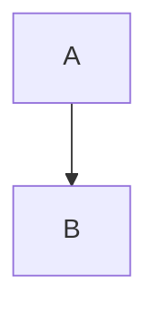
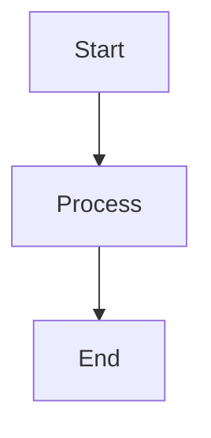

# Common Learning Module Issues & Solutions

This document outlines common issues encountered when creating or maintaining learning modules, along with their solutions.

## Module Loading Errors

### Issue: "Module file not found" Error
**Symptoms:**
- Error message: `Failed to load module [module-id] from path [path-id]: Error: Module file not found for [module-id]`
- Module page shows 404 or empty content

**Root Causes:**
1. **Missing JSON metadata files** - Each module needs both a `.json` and `.mdx` file
2. **Module ID mismatches** - IDs in different places don't align
3. **Numeric prefix confusion** - Inconsistent handling of numeric prefixes in module IDs

**Solutions:**

#### 1. Ensure Both JSON and MDX Files Exist
Every module requires two files in the `modules/` directory:
```
modules/
├── 01-module-name.json   # Metadata file
└── 01-module-name.mdx    # Content file
```

#### 2. Module ID Consistency
Module IDs must be consistent across:
- `metadata.json` in the learning path directory
- `lib/learn.ts` module definitions
- The `id` field inside module JSON files
- URL generation in components

**Important:** Module IDs should NOT include numeric prefixes, even though filenames do:
```json
// ✅ Correct in metadata.json
"modules": [
  "understanding-concepts",    // No numeric prefix
  "building-systems"
]

// ❌ Incorrect
"modules": [
  "01-understanding-concepts",  // Has numeric prefix
  "02-building-systems"
]
```

#### 3. Module JSON Structure
All module JSON files must have the proper structure with a `metadata` wrapper:
```json
{
  "metadata": {
    "id": "module-name",        // No numeric prefix!
    "pathId": "learning-path-id",
    "title": "Module Title",
    // ... other metadata fields
  },
  "sections": [
    // ... section definitions
  ]
}
```

## MDX Component Rendering Issues

### Issue: Raw JSX/Components Showing as Text
**Symptoms:**
- Components like `<Quiz>`, `<Question>`, `<Callout>`, `<CodeExample>` appear as raw text
- Mermaid diagrams show as code blocks instead of rendered diagrams

**Root Causes:**
1. **Component format mismatches** - ModuleRenderer expects different format than MDX uses
2. **Missing component parsers** - Some components aren't handled by the renderer
3. **Regex parsing limitations** - Complex nested components break regex patterns

**Solutions:**

#### 1. Callout Component Format
The MDX files use various Callout formats that need proper parsing:
```mdx
<!-- Format 1: Simple -->
<Callout type="info">
  Content here
</Callout>

<!-- Format 2: With title attribute -->
<Callout type="insight" title="The Title">
  Content here
</Callout>
```

#### 2. Diagram Component vs Mermaid Blocks
MDX files use both approaches:
```mdx
<!-- Approach 1: Diagram component -->
<Diagram>

</Diagram>

<!-- Approach 2: Direct mermaid block -->

```

#### 3. Quiz Component Structure
Ensure Quiz components follow the expected nested structure:
```mdx
<Quiz>
  <Question
    question="Question text?"
    options={[
      "Option A",
      "Option B",
      "Option C",
      "Option D"
    ]}
    correct={1}
    explanation="Why this is correct"
  />
</Quiz>
```

## File Organization Patterns

### Learning Path Structure
```
content/learn/paths/
├── path-name/
│   ├── metadata.json           # Path configuration
│   └── modules/
│       ├── 01-first-module.json
│       ├── 01-first-module.mdx
│       ├── 02-second-module.json
│       └── 02-second-module.mdx
└── another-path/
    └── ...
```

### Module Naming Convention
- **Files**: Use numeric prefixes (01-, 02-, etc.) for ordering
- **IDs**: Remove numeric prefixes in all JSON and code references
- **URLs**: Generated without numeric prefixes

## Debugging Tips

### 1. Check Console Logs
The module loading system logs helpful information:
```
Loading module: { slug: 'path-id', moduleId: 'module-id', locale: 'en' }
Module loaded successfully: yes/no
```

### 2. Verify File Names
```bash
# List all module files for a path
ls -la content/learn/paths/[path-name]/modules/

# Check if both JSON and MDX exist
ls content/learn/paths/[path-name]/modules/*module-name*
```

### 3. Validate JSON Structure
```bash
# Check JSON is valid
cat content/learn/paths/[path]/modules/[module].json | jq .

# Verify metadata wrapper exists
cat content/learn/paths/[path]/modules/[module].json | jq .metadata
```

### 4. Clear Caches
When module data seems stuck on old values:
```bash
# Clear Next.js cache
rm -rf .next/cache

# Restart dev server
npm run dev
```

## Common Patterns to Follow

### 1. Module Creation Checklist
- [ ] Create both .json and .mdx files with matching names
- [ ] Use numeric prefix in filename (01-name.json)
- [ ] Remove numeric prefix from ID in JSON metadata
- [ ] Add module ID to metadata.json (without prefix)
- [ ] Update lib/learn.ts if using static data
- [ ] Test module loads correctly

### 2. Component Usage in MDX
- [ ] Use supported component formats
- [ ] Keep component props simple (avoid complex JSX)
- [ ] Test rendering in development
- [ ] Check for console errors

### 3. Internationalization
- [ ] Create matching structure in language directories
- [ ] Maintain same IDs across languages
- [ ] Test both language versions

## Quick Fixes

### Module Not Loading
1. Check filename matches pattern: `XX-module-name.json`
2. Verify `metadata.id` has no numeric prefix
3. Ensure `metadata.json` lists correct module ID
4. Clear cache and restart server

### Components Not Rendering
1. Check ModuleRenderer.tsx handles the component
2. Verify component format matches parser expectations
3. Look for console errors about parsing
4. Simplify component props if needed

### Mermaid Diagrams Not Rendering
If you see error messages like "Error rendering diagram" with escaped content:

**Issue:** Mermaid diagrams fail to render due to JSON escaping or parsing issues

**Solution:**
1. Ensure mermaid is imported and initialized
2. Use proper escaping for complex diagrams
3. Check browser console for mermaid errors
4. Consider using direct mermaid code blocks instead of Diagram components:

```mdx
<!-- Option 1: Direct mermaid code block -->


<!-- Option 2: Diagram component -->
<Diagram>

</Diagram>
```

### HTML Elements Not Rendering
If HTML elements like `<details>`, `<summary>`, lists, etc. appear as raw text:

**Issue:** ReactMarkdown needs custom component mappings for HTML elements

**Recommended Solution:** Replace HTML elements with MDX components:
```mdx
<!-- Instead of <details> + <summary> -->
<details>
<summary>Starter Template</summary>
```code
</details>

<!-- Use CodeExample component -->
<CodeExample title="Starter Template" language="javascript">
// Your code here
</CodeExample>
```

**Alternative Solution:** Add component handlers in ModuleRenderer for common HTML elements:
```tsx
details: ({ children }) => (
  <details className="my-4 p-4 bg-gray-50 dark:bg-gray-900 rounded-lg">
    {children}
  </details>
),
summary: ({ children }) => (
  <summary className="cursor-pointer font-semibold">
    {children}
  </summary>
)
```

**Note:** The first approach (using MDX components) is preferred as it provides better styling, accessibility, and consistency with the design system.

Common HTML elements to consider:
- `<details>` / `<summary>` → `<CodeExample>` or `<Callout>`
- `<ol>` / `<ul>` / `<li>` - Lists (generally work fine)
- `<table>` / `<tr>` / `<td>` - Tables
- `<kbd>` - Keyboard input
- `<mark>` - Highlighted text

### Raw HTML Elements Showing on Page
1. **Quick Fix**: Replace `<details>`/`<summary>` with `<CodeExample>` components
2. **Example**: Change `<details><summary>Title</summary>` to `<CodeExample title="Title">`
3. **Test**: Verify the element renders properly in the browser
4. **Supported languages**: javascript, typescript, python, bash, json, dockerfile, yaml

### Wrong Module Order
1. Check numeric prefixes on filenames
2. Verify `order` field in module metadata
3. Ensure modules array in metadata.json is ordered correctly