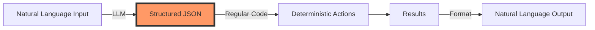

# Rethinking Agents as Software

## Introduction {#introduction}

Welcome to the first module of 12-Factor Agent Development. Before we dive into complex architectures and orchestration patterns, we need to establish a fundamental truth that will transform how you think about agent development.

<Callout type="story" title="A Common Journey">
You've probably been here: You start building an agent, grab a popular framework, and within hours you're at 70-80% functionality. The demo is impressive. The team is excited. Resources are allocated.

Then reality hits. That last 20% becomes a nightmare. You're debugging through layers of abstraction, trying to understand why your agent keeps calling the wrong API or getting stuck in loops. Eventually, you either rewrite from scratch or realize agents weren't the right solution.

**What if the problem isn't agents themselves, but how we think about them?**
</Callout>

### The Revelation

After analyzing 100+ production agent implementations, a clear pattern emerged: **The most successful agents aren't the most "agentic" ones**. They're mostly deterministic software with carefully controlled LLM interactions at specific decision points.

The teams succeeding aren't using the most sophisticated frameworks. They're applying software engineering principles to a new domain. And the foundation of their success? Understanding that the most magical thing LLMs can do has nothing to do with complex reasoning or autonomous behavior.

It's much simpler than that.

## Factor 1: JSON Extraction is Your Superpower {#json-extraction}

Let's start with the most fundamental capability that makes agents possible:

<CodeExample title="The Magic of JSON Extraction" language="python">
```python
# What seems like magic...
user_input = "Schedule a meeting with Sarah next Tuesday at 3pm about the Q4 planning"

# ...is really just this transformation:
extracted_json = {
    "intent": "schedule_meeting",
    "participants": ["Sarah"],
    "date": "next_tuesday",
    "time": "15:00",
    "topic": "Q4 planning"
}

# That's it. That's the superpower.
```
</CodeExample>

### Why This Matters

Every impressive agent demo, every complex workflow, every "autonomous" behavior—it all builds on this foundation. LLMs excel at taking unstructured human language and converting it into structured data that code can work with.

<Diagram type="flow" title="The Agent Reality">

</Diagram>

### Building Your First Extractor

Let's build a practical JSON extractor that you can use as a foundation:

<CodeExample title="Production-Ready JSON Extractor" language="python">
```python
import json
from typing import Dict, Any, Optional
from pydantic import BaseModel, ValidationError

class MeetingIntent(BaseModel):
    """Schema for meeting-related intents"""
    intent: str
    participants: list[str]
    date: Optional[str] = None
    time: Optional[str] = None
    topic: Optional[str] = None
    duration_minutes: Optional[int] = 60

class JSONExtractor:
    def __init__(self, llm_client):
        self.llm = llm_client
        
    def extract(self, user_input: str, schema: type[BaseModel]) -> Dict[str, Any]:
        """Extract structured data from natural language"""
        
        # Build a prompt that guides the LLM to produce valid JSON
        prompt = self._build_extraction_prompt(user_input, schema)
        
        # Get LLM response
        response = self.llm.complete(prompt)
        
        # Parse and validate
        try:
            data = json.loads(response)
            validated = schema(**data)
            return validated.dict()
        except (json.JSONDecodeError, ValidationError) as e:
            # Handle errors gracefully
            return self._handle_extraction_error(e, response, user_input)
    
    def _build_extraction_prompt(self, user_input: str, schema: type[BaseModel]) -> str:
        """Create a prompt that reliably produces JSON matching our schema"""
        
        schema_example = schema.schema()
        
        return f"""Extract structured information from the user's message.

User Message: {user_input}

Respond with a JSON object that matches this schema:
{json.dumps(schema_example, indent=2)}

Important:
- Output ONLY valid JSON, no additional text
- Include all fields that can be inferred from the message
- Use null for fields that cannot be determined
- Ensure the output can be parsed by json.loads()

JSON Output:"""

# Usage
extractor = JSONExtractor(llm_client)
user_message = "Set up a 30-minute call with the engineering team tomorrow at 2pm"

result = extractor.extract(user_message, MeetingIntent)
print(result)
# {
#     "intent": "schedule_meeting",
#     "participants": ["engineering team"],
#     "date": "tomorrow",
#     "time": "14:00",
#     "topic": null,
#     "duration_minutes": 30
# }
```
</CodeExample>

### The Power of Schema-Driven Development

Notice how we're using Pydantic models to define our expected output structure? This gives us:

1. **Type safety**: We know exactly what data we're working with
2. **Validation**: Invalid outputs are caught immediately
3. **Documentation**: The schema serves as documentation
4. **Flexibility**: Easy to extend or modify as requirements change

<Callout type="tip" title="Pro Tip: Start Simple">
Don't try to extract everything in one shot. Start with the absolute minimum fields you need, get that working reliably, then gradually add complexity. It's much easier to debug a schema with 3 fields than one with 30.
</Callout>

## Factor 4: 'Tool Use' is Just JSON and Code {#tools-are-code}

Now let's address one of the most misleading abstractions in agent development: "tool use."

### The Harmful Abstraction

When frameworks talk about agents "using tools," it creates a mental model of some ethereal AI entity reaching out into the world. This abstraction:

- Makes debugging harder (what's actually happening?)
- Hides the simple reality of what's going on
- Leads to over-engineering and unnecessary complexity

### The Reality

Here's what "tool use" actually is:

<CodeExample title="Demystifying Tool Use" language="python">
```python
# What frameworks call "tool use"...
@tool
def send_email(to: str, subject: str, body: str):
    """Send an email to a recipient"""
    # ... implementation ...

# ...is really just this:
def handle_agent_action(llm_output: dict):
    """Route JSON output to appropriate functions"""
    
    action = llm_output.get("action")
    params = llm_output.get("parameters", {})
    
    # Just a switch statement!
    match action:
        case "send_email":
            return send_email(**params)
        case "schedule_meeting":
            return schedule_meeting(**params)
        case "query_database":
            return query_database(**params)
        case "respond_to_user":
            return {"type": "message", "content": llm_output["message"]}
        case _:
            return {"type": "error", "message": f"Unknown action: {action}"}

# The LLM outputs JSON like:
{
    "action": "send_email",
    "parameters": {
        "to": "sarah@company.com",
        "subject": "Q4 Planning Meeting",
        "body": "Hi Sarah, confirming our meeting for next Tuesday at 3pm..."
    },
    "reasoning": "User wants to schedule a meeting, I should send a confirmation email"
}

# Your code routes it to the right function. That's it!
```
</CodeExample>

### Building a Production Router

Let's build a more robust action router that you might actually use in production:

<CodeExample title="Production Action Router" language="python">
```python
from typing import Dict, Any, Callable, Optional
from dataclasses import dataclass
import logging

@dataclass
class ActionResult:
    """Result of executing an action"""
    success: bool
    data: Optional[Any] = None
    error: Optional[str] = None
    metadata: Dict[str, Any] = None

class ActionRouter:
    """Routes LLM-generated actions to appropriate handlers"""
    
    def __init__(self):
        self.handlers: Dict[str, Callable] = {}
        self.logger = logging.getLogger(__name__)
        
    def register(self, action_name: str, handler: Callable) -> None:
        """Register a handler for an action"""
        self.handlers[action_name] = handler
        
    async def route(self, llm_output: Dict[str, Any]) -> ActionResult:
        """Route an LLM output to the appropriate handler"""
        
        # Extract action and parameters
        action = llm_output.get("action")
        if not action:
            return ActionResult(
                success=False,
                error="No action specified in LLM output"
            )
        
        # Find handler
        handler = self.handlers.get(action)
        if not handler:
            return ActionResult(
                success=False,
                error=f"No handler registered for action: {action}",
                metadata={"available_actions": list(self.handlers.keys())}
            )
        
        # Execute with error handling
        try:
            params = llm_output.get("parameters", {})
            
            # Log for debugging
            self.logger.info(f"Executing action: {action} with params: {params}")
            
            # Execute handler
            result = await handler(**params) if asyncio.iscoroutinefunction(handler) else handler(**params)
            
            return ActionResult(
                success=True,
                data=result,
                metadata={
                    "action": action,
                    "reasoning": llm_output.get("reasoning")
                }
            )
            
        except Exception as e:
            self.logger.error(f"Error executing {action}: {str(e)}")
            return ActionResult(
                success=False,
                error=str(e),
                metadata={"action": action, "error_type": type(e).__name__}
            )

# Usage
router = ActionRouter()

# Register your "tools" (aka functions)
router.register("send_email", email_service.send)
router.register("schedule_meeting", calendar_service.schedule)
router.register("query_database", db.query)

# Route LLM output
llm_output = {
    "action": "send_email",
    "parameters": {
        "to": "team@company.com",
        "subject": "Updates",
        "body": "Here are this week's updates..."
    },
    "reasoning": "User asked me to update the team"
}

result = await router.route(llm_output)
if result.success:
    print(f"Action completed: {result.data}")
else:
    print(f"Action failed: {result.error}")
```
</CodeExample>

### The Benefits of Thinking This Way

When you stop thinking of "tool use" and start thinking of "JSON routing":

1. **Debugging becomes trivial**: You can log the exact JSON and see what function gets called
2. **Testing is straightforward**: Just test your router with different JSON inputs
3. **No magic**: Everything is explicit and under your control
4. **Easy to extend**: Adding a new "tool" is just registering a new function

<Quiz id="tools-are-code-quiz">
  <Question
    question="If an agent 'uses a tool' to send an email, what's the actual execution flow?"
    options={[
      "The LLM directly calls the email API",
      "The framework magically handles everything",
      "The LLM outputs JSON, which your code routes to an email function",
      "The agent gains email-sending capabilities"
    ]}
    correctAnswer={2}
    explanation="The LLM outputs structured JSON indicating it wants to send an email. Your routing code receives this JSON and calls the appropriate email function with the provided parameters. There's no magic—just JSON and function calls."
  />
  <Question
    question="Why is thinking of 'tool use' as a harmful abstraction?"
    options={[
      "It makes agents seem more complex than they are",
      "It hides the simple JSON-to-function routing that's actually happening",
      "It prevents proper debugging and testing",
      "All of the above"
    ]}
    correctAnswer={3}
    explanation="The 'tool use' abstraction is harmful because it: 1) Makes debugging harder by hiding what's actually happening, 2) Creates a false mental model of AI entities with special powers, 3) Leads to over-engineering, and 4) Prevents developers from seeing the simple JSON routing pattern that's really at work."
  />
</Quiz>

## Putting It Together: Your First Real Agent Component

Let's combine JSON extraction and action routing into a simple but complete agent component:

<CodeExample title="Complete Agent Component" language="python">
```python
class SimpleAgent:
    """A simple agent that extracts intent and routes to actions"""
    
    def __init__(self, llm_client):
        self.llm = llm_client
        self.router = ActionRouter()
        self.extractor = JSONExtractor(llm_client)
        
        # Register available actions
        self._register_actions()
        
    def _register_actions(self):
        """Register all available actions"""
        self.router.register("send_email", self._send_email)
        self.router.register("schedule_meeting", self._schedule_meeting)
        self.router.register("search_knowledge_base", self._search_kb)
        self.router.register("respond", self._respond)
        
    async def process(self, user_input: str) -> Dict[str, Any]:
        """Process user input and execute appropriate action"""
        
        # Step 1: Extract structured intent from natural language
        extracted = self.extractor.extract(user_input, AgentAction)
        
        # Step 2: Route to appropriate handler
        result = await self.router.route(extracted)
        
        # Step 3: Format response
        if result.success:
            return {
                "status": "success",
                "action_taken": result.metadata["action"],
                "result": result.data
            }
        else:
            return {
                "status": "error",
                "error": result.error,
                "fallback": self._generate_fallback_response(user_input)
            }
    
    def _generate_fallback_response(self, user_input: str) -> str:
        """Generate a helpful response when action routing fails"""
        prompt = f"""The user said: "{user_input}"
        
We couldn't process this as a specific action. Generate a helpful response that:
1. Acknowledges their request
2. Explains what actions are available
3. Asks for clarification if needed

Response:"""
        
        return self.llm.complete(prompt)

# Using your agent
agent = SimpleAgent(llm_client)

response = await agent.process("Can you email John about tomorrow's meeting?")
print(response)
# {
#     "status": "success",
#     "action_taken": "send_email",
#     "result": {"email_id": "12345", "sent": True}
# }
```
</CodeExample>

## Key Takeaways

As we wrap up this first module, remember these crucial points:

<Card className="mb-4">
  <h3 className="text-xl font-semibold mb-2">🎯 The Foundation</h3>
  <p>The most powerful capability of LLMs in agent systems isn't complex reasoning—it's reliably converting natural language into structured JSON that your code can work with.</p>
</Card>

<Card className="mb-4">
  <h3 className="text-xl font-semibold mb-2">🔧 Tools Are Just Functions</h3>
  <p>"Tool use" is a harmful abstraction. It's really just JSON being routed to functions. When you understand this, debugging becomes trivial and extensions become obvious.</p>
</Card>

<Card className="mb-4">
  <h3 className="text-xl font-semibold mb-2">🏗️ Agents Are Software</h3>
  <p>Stop thinking of agents as magical AI entities. They're software components that use LLMs for specific transformations. This mental shift makes everything clearer.</p>
</Card>

## What's Next?

In the next module, we'll explore Factors 6 and 7: how to properly manage control flow and state in agent systems. You'll learn why the naive "append everything to context" approach breaks down and how to build agents that can be paused, resumed, and debugged like any other software.

But first, complete the exercise below to solidify your understanding of JSON extraction and action routing.

---

<Callout type="assignment" title="Module Exercise: Build a Customer Intent Classifier">
Your task is to build a simple but robust system that:
1. Extracts customer intent from support messages
2. Routes to appropriate handlers (respond, escalate, search_kb)
3. Handles errors gracefully
4. Provides helpful fallbacks
</Callout>

## Exercise: Customer Intent Classifier

Build a production-ready customer support agent that demonstrates the principles from this module.

### Requirements

Your system should:
1. Extract intent and entities from customer messages
2. Route to appropriate action handlers
3. Handle edge cases and errors gracefully
4. Provide helpful fallback responses

### Starter Code

<CodeExample title="Customer Intent Classifier - Starter Code" language="python">
```python
from typing import Dict, Any, Optional, List
from enum import Enum
from pydantic import BaseModel, Field
import json

# Define the intent schema
class CustomerIntent(BaseModel):
    """Schema for customer support intents"""
    intent: str = Field(..., description="The primary intent: question, complaint, request, or feedback")
    urgency: str = Field(default="normal", description="Urgency level: low, normal, high, critical")
    category: Optional[str] = Field(None, description="Category: billing, technical, account, general")
    entities: Dict[str, Any] = Field(default_factory=dict, description="Extracted entities like order_id, product_name")
    sentiment: str = Field(default="neutral", description="Customer sentiment: positive, neutral, negative")
    
class ActionType(Enum):
    RESPOND = "respond"
    ESCALATE = "escalate"
    SEARCH_KB = "search_kb"
    TRANSFER = "transfer"

# TODO: Implement the JSONExtractor for CustomerIntent
class CustomerIntentExtractor:
    def __init__(self, llm_client):
        self.llm = llm_client
        
    def extract(self, message: str) -> CustomerIntent:
        """Extract customer intent from message"""
        # TODO: Build prompt that extracts CustomerIntent
        # TODO: Call LLM and parse response
        # TODO: Validate with Pydantic model
        pass

# TODO: Implement the ActionRouter
class CustomerSupportRouter:
    def __init__(self):
        self.handlers = {}
        self._register_handlers()
        
    def _register_handlers(self):
        """Register all available handlers"""
        # TODO: Register handlers for each ActionType
        pass
        
    def route(self, intent: CustomerIntent) -> Dict[str, Any]:
        """Route intent to appropriate handler"""
        # TODO: Determine action based on intent
        # TODO: Execute appropriate handler
        # TODO: Return result with proper error handling
        pass
    
    # Handler methods to implement
    def _handle_respond(self, intent: CustomerIntent) -> Dict[str, Any]:
        """Generate direct response to customer"""
        # TODO: Implement response generation
        pass
        
    def _handle_escalate(self, intent: CustomerIntent) -> Dict[str, Any]:
        """Escalate to human agent"""
        # TODO: Implement escalation logic
        pass
        
    def _handle_search_kb(self, intent: CustomerIntent) -> Dict[str, Any]:
        """Search knowledge base for relevant information"""
        # TODO: Implement KB search
        pass

# TODO: Implement the main CustomerSupportAgent
class CustomerSupportAgent:
    def __init__(self, llm_client):
        self.extractor = CustomerIntentExtractor(llm_client)
        self.router = CustomerSupportRouter()
        
    def process_message(self, message: str) -> Dict[str, Any]:
        """Process a customer message end-to-end"""
        # TODO: Extract intent
        # TODO: Route to handler
        # TODO: Format response
        # TODO: Handle errors with fallback
        pass

# Test cases to handle
test_messages = [
    "I've been charged twice for my order #12345!",
    "How do I reset my password?",
    "Your service is amazing, thank you!",
    "URGENT: Website is down, losing customers!!!",
    "Can you help me track order 98765?",
    "I want to speak to a manager immediately",
    "What are your business hours?",
    "Bug report: Login button not working on mobile"
]
```
</CodeExample>

### Implementation Hints

1. **For Intent Extraction**:
   - Use clear examples in your prompt
   - Consider using few-shot examples
   - Validate urgency levels carefully

2. **For Routing Logic**:
   - High urgency + complaint = escalate
   - Questions = search KB first, then respond
   - Critical issues = immediate escalation

3. **For Error Handling**:
   - Always have a fallback response
   - Log errors for debugging
   - Never expose internal errors to customers

### Expected Output Example

```python
# Input
message = "I've been charged twice for my order #12345!"

# Expected extracted intent
{
    "intent": "complaint",
    "urgency": "high",
    "category": "billing",
    "entities": {"order_id": "12345", "issue": "duplicate_charge"},
    "sentiment": "negative"
}

# Expected routing decision
{
    "action": "escalate",
    "reason": "High urgency billing complaint",
    "data": {
        "priority": 1,
        "department": "billing",
        "initial_response": "I understand your concern about the duplicate charge..."
    }
}
```

### Bonus Challenges

1. **Add conversation context**: Maintain context across multiple messages
2. **Implement confidence scoring**: Add confidence levels to intent extraction
3. **Multi-language support**: Handle messages in different languages
4. **Rate limiting**: Prevent abuse with rate limiting per customer

### Solution Discussion

<details>
<summary>Click to see solution approach</summary>

The key insights for this exercise:

1. **Intent extraction is more than just classification** - you need to extract multiple dimensions (intent, urgency, entities)

2. **Routing logic should be explicit and testable** - avoid hiding business rules in prompts

3. **Error handling is critical** - customers should always get a helpful response, even when things go wrong

4. **The abstraction layers matter**:
   - Extraction layer (LLM interaction)
   - Routing layer (business logic)  
   - Handler layer (actions)
   - Agent layer (orchestration)

This separation makes the system maintainable, testable, and extensible.

</details>