# Control Flow and State Management

## The Control Flow Problem {#introduction}

In Module 1, we discovered that agents are fundamentally about JSON extraction. But knowing how to extract structured data is only the beginning. The real challenge? Managing what happens next.

<Callout type="warning" title="The Context Window Trap">
Picture this: Your agent starts processing a customer request. Call an API, add the result to context. Call another API, add that too. Check inventory, add it. Generate a response, add it. 

Five steps in, your context window is exploding. Ten steps in, the LLM is confused. Twenty steps? You've hit the token limit and everything crashes.

**This is why 70% of agent projects fail to reach production.**
</Callout>

The solution isn't bigger context windows or smarter models. It's owning your control flow and managing state like the software engineer you are.

### What You'll Build

By the end of this module, you'll understand:
- Why agents are just four simple components working together
- How to build agents that can pause mid-execution and resume hours later
- The critical difference between business state and execution state
- Control flow patterns that prevent the disasters above

Let's start by understanding what an agent really is.

## Factor 6: Own Your Control Flow {#own-your-control-flow}

### The Naive Approach (And Why It Fails)

Here's how most people build their first agent:

<CodeExample title="The Naive Agent Loop" language="python">
```python
def naive_agent_loop(user_input: str, llm_client):
    """The simplest possible agent - and why it doesn't scale"""
    context = [{"role": "user", "content": user_input}]
    
    while True:
        # Ask LLM what to do next
        response = llm_client.complete(context)
        action = extract_json(response)
        
        if action["type"] == "done":
            return action["result"]
        
        # Execute the action
        result = execute_tool(action["tool"], action["args"])
        
        # Add everything to context (HERE'S THE PROBLEM!)
        context.append({"role": "assistant", "content": response})
        context.append({"role": "user", "content": f"Result: {result}"})
```
</CodeExample>

This works great for demos. It fails catastrophically in production. Why?

```mermaid
graph TD
    A[Step 1: 500 tokens] -->|Add result| B[Step 2: 1,200 tokens]
    B -->|Add result| C[Step 3: 2,100 tokens]
    C -->|Add result| D[Step 4: 3,500 tokens]
    D -->|Add result| E[Step 5: 5,200 tokens]
    E -->|Add result| F[Step 6: 7,800 tokens]
    F -->|💥| G[Context Limit Exceeded]
    
    style G fill:#f66,stroke:#333,stroke-width:4px
```

<Diagram type="flow" title="Context Window Explosion">

</Diagram>

### The Four Components of Every Agent

After analyzing hundreds of production agents, here's the truth: **Every agent is just these four components**:

<CodeExample title="The Agent Equation" language="python">
```python
class Agent:
    """What an agent REALLY is"""
    
    def __init__(self):
        # 1. PROMPT: Instructions for selecting next step
        self.prompt = "Given the history, what should we do next?"
        
        # 2. SWITCH: Route JSON to actual code
        self.switch = {
            "search_inventory": self.search_inventory,
            "process_order": self.process_order,
            "contact_human": self.contact_human,
        }
        
        # 3. CONTEXT: Managed memory (not just appending!)
        self.context_manager = ContextManager()
        
        # 4. LOOP: Control when/how to continue
        self.loop_controller = LoopController()
```
</CodeExample>

That's it. No magic. Just software.

### Taking Control of Your Loop

Here's how production agents actually manage control flow:

<CodeExample title="Production Control Flow" language="python">
```python
class ProductionAgent:
    def __init__(self, llm_client, max_steps=20):
        self.llm = llm_client
        self.max_steps = max_steps
        
    def run(self, task: str) -> dict:
        """Production-ready agent with managed control flow"""
        state = {
            "task": task,
            "steps": [],
            "context_summary": "",
            "step_count": 0,
            "status": "running"
        }
        
        while state["status"] == "running":
            # Check loop conditions FIRST
            if state["step_count"] >= self.max_steps:
                state["status"] = "max_steps_exceeded"
                break
                
            # Build context intelligently
            context = self._build_smart_context(state)
            
            # Get next action
            response = self.llm.complete(context)
            action = extract_json(response)
            
            # Execute with proper error handling
            try:
                result = self._execute_action(action)
                state["steps"].append({
                    "action": action,
                    "result": result,
                    "timestamp": time.time()
                })
            except Exception as e:
                state["status"] = "error"
                state["error"] = str(e)
                break
            
            # Update state
            state["step_count"] += 1
            
            # Manage context window proactively
            if self._should_summarize(state):
                state["context_summary"] = self._summarize_progress(state)
                state["steps"] = state["steps"][-3:]  # Keep only recent steps
            
            # Check completion
            if action.get("type") == "complete":
                state["status"] = "completed"
                state["result"] = action.get("result")
        
        return state
    
    def _build_smart_context(self, state: dict) -> list:
        """Build context that won't explode"""
        messages = []
        
        # System prompt with task
        messages.append({
            "role": "system",
            "content": f"Task: {state['task']}\n\nYou are step {state['step_count'] + 1} of maximum {self.max_steps}."
        })
        
        # Include summary if we have one
        if state["context_summary"]:
            messages.append({
                "role": "user",
                "content": f"Progress summary: {state['context_summary']}"
            })
        
        # Only include recent steps
        for step in state["steps"][-3:]:
            messages.append({
                "role": "user",
                "content": f"Step {step['action']['type']}: {step['result']}"
            })
        
        return messages
```
</CodeExample>

### Key Control Flow Patterns

<Callout type="success" title="Production Patterns That Work">
1. **Step Limiting**: Always enforce maximum steps to prevent infinite loops
2. **Context Summarization**: Compress history before you hit limits  
3. **Early Exit Conditions**: Check for errors, timeouts, and stop signals
4. **Selective Memory**: Only keep recent, relevant steps in context
5. **Breakpoints**: Add checkpoints where the agent can pause for human input
</Callout>

## Factor 7: Stateless Agent Design {#stateless-design}

### Why Stateless?

Traditional software engineering taught us that stateless services are more reliable, scalable, and maintainable. The same applies to agents.

<Diagram type="architecture" title="Stateless Agent Architecture">

</Diagram>

### Building Pausable Agents

Here's how to implement an agent that can pause and resume:

<CodeExample title="Pausable Agent Implementation" language="python">
```python
import json
import uuid
from typing import Optional, Dict, Any
from dataclasses import dataclass, asdict

@dataclass
class AgentState:
    """Serializable agent state"""
    id: str
    task: str
    steps: list
    context_summary: str
    step_count: int
    status: str
    metadata: dict
    
    def to_json(self) -> str:
        return json.dumps(asdict(self))
    
    @classmethod
    def from_json(cls, data: str) -> 'AgentState':
        return cls(**json.loads(data))

class PausableAgent:
    def __init__(self, llm_client, state_store):
        self.llm = llm_client
        self.state_store = state_store
        
    async def start_task(self, task: str, metadata: dict = None) -> str:
        """Start a new task and return state ID"""
        state = AgentState(
            id=str(uuid.uuid4()),
            task=task,
            steps=[],
            context_summary="",
            step_count=0,
            status="running",
            metadata=metadata or {}
        )
        
        # Save initial state
        await self.state_store.save(state.id, state.to_json())
        
        # Try to make progress
        state = await self._execute_steps(state, max_steps=5)
        
        # Save updated state
        await self.state_store.save(state.id, state.to_json())
        
        return state.id
    
    async def resume_task(self, state_id: str, additional_info: str = None) -> dict:
        """Resume a paused task"""
        # Load state
        state_json = await self.state_store.load(state_id)
        state = AgentState.from_json(state_json)
        
        # Add any new information
        if additional_info:
            state.steps.append({
                "type": "human_input",
                "content": additional_info,
                "timestamp": time.time()
            })
        
        # Continue execution
        state = await self._execute_steps(state, max_steps=5)
        
        # Save updated state
        await self.state_store.save(state.id, state.to_json())
        
        return {
            "state_id": state.id,
            "status": state.status,
            "result": state.metadata.get("result")
        }
    
    async def _execute_steps(self, state: AgentState, max_steps: int) -> AgentState:
        """Execute up to max_steps, handling interruptions"""
        steps_executed = 0
        
        while state.status == "running" and steps_executed < max_steps:
            # Build context from state
            context = self._build_context_from_state(state)
            
            # Get next action
            response = await self.llm.complete(context)
            action = extract_json(response)
            
            # Check if action requires human approval
            if action.get("requires_approval"):
                state.status = "awaiting_approval"
                state.metadata["pending_action"] = action
                break
            
            # Execute action
            result = await self._execute_action(action)
            
            # Update state
            state.steps.append({
                "action": action,
                "result": result,
                "timestamp": time.time()
            })
            state.step_count += 1
            steps_executed += 1
            
            # Check completion
            if action.get("type") == "complete":
                state.status = "completed"
                state.metadata["result"] = result
                break
        
        return state
```
</CodeExample>

### State Serialization Strategies

Not all state is created equal. Here's how to serialize efficiently:

<CodeExample title="State Serialization Patterns" language="python">
```python
class EfficientStateManager:
    """Patterns for efficient state serialization"""
    
    def __init__(self, compression_threshold=1024):
        self.compression_threshold = compression_threshold
    
    def serialize_state(self, state: AgentState) -> bytes:
        """Serialize with compression for large states"""
        # Convert to JSON
        json_str = state.to_json()
        
        # Compress if large
        if len(json_str) > self.compression_threshold:
            import gzip
            return gzip.compress(json_str.encode())
        
        return json_str.encode()
    
    def deserialize_state(self, data: bytes) -> AgentState:
        """Deserialize with automatic decompression"""
        # Check if compressed
        if data[:2] == b'\x1f\x8b':  # gzip magic number
            import gzip
            json_str = gzip.decompress(data).decode()
        else:
            json_str = data.decode()
        
        return AgentState.from_json(json_str)
    
    def create_checkpoint(self, state: AgentState) -> dict:
        """Create a minimal checkpoint for fast resume"""
        return {
            "id": state.id,
            "task": state.task,
            "step_count": state.step_count,
            "status": state.status,
            "last_action": state.steps[-1] if state.steps else None,
            "context_summary": state.context_summary
        }
    
    def archive_completed_state(self, state: AgentState) -> dict:
        """Archive completed states with just essential data"""
        return {
            "id": state.id,
            "task": state.task,
            "completed_at": time.time(),
            "total_steps": state.step_count,
            "result": state.metadata.get("result"),
            # Don't store full step history for completed tasks
            "summary": self._generate_execution_summary(state)
        }
```
</CodeExample>

## Factor 11: Separate Business State from Execution State {#state-separation}

### Understanding the Distinction

The biggest mistake in agent state management? Mixing business state with execution state. They have different lifecycles, different persistence needs, and different access patterns.

<Diagram type="comparison" title="Business State vs Execution State">

</Diagram>

### Implementing Clean State Separation

<CodeExample title="State Architecture" language="python">
```python
from enum import Enum
from typing import Optional, Dict, Any
import json

class StateType(Enum):
    BUSINESS = "business"
    EXECUTION = "execution"

class SeparatedStateAgent:
    """Agent with clean separation of state concerns"""
    
    def __init__(self, llm_client, business_store, execution_store):
        self.llm = llm_client
        self.business_store = business_store
        self.execution_store = execution_store
    
    async def process_request(self, request_id: str, user_input: str) -> dict:
        """Process a request with proper state separation"""
        
        # Initialize business state
        business_state = {
            "request_id": request_id,
            "user_input": user_input,
            "messages": [],
            "data": {},
            "created_at": time.time()
        }
        await self.business_store.save(request_id, business_state)
        
        # Initialize execution state
        execution_state = {
            "request_id": request_id,
            "current_step": 0,
            "retry_count": 0,
            "workflow": "customer_service",
            "status": "processing",
            "context_tokens": 0,
            "started_at": time.time()
        }
        exec_id = f"exec_{request_id}"
        await self.execution_store.save(exec_id, execution_state, ttl=3600)  # 1 hour TTL
        
        # Process with state separation
        return await self._run_workflow(business_state, execution_state)
    
    async def _run_workflow(self, business_state: dict, execution_state: dict) -> dict:
        """Run workflow maintaining state separation"""
        
        while execution_state["status"] == "processing":
            # Build context from BOTH states appropriately
            context = self._build_context(business_state, execution_state)
            
            # Get next action
            response = await self.llm.complete(context)
            action = extract_json(response)
            
            # Update execution state
            execution_state["current_step"] += 1
            execution_state["context_tokens"] = count_tokens(context)
            
            # Execute action
            try:
                result = await self._execute_action(action)
                
                # Update business state with results
                if action["type"] == "collect_data":
                    business_state["data"][action["field"]] = result
                elif action["type"] == "send_message":
                    business_state["messages"].append({
                        "type": "agent",
                        "content": result,
                        "timestamp": time.time()
                    })
                
                # Reset retry count on success
                execution_state["retry_count"] = 0
                
            except Exception as e:
                execution_state["retry_count"] += 1
                if execution_state["retry_count"] > 3:
                    execution_state["status"] = "failed"
                    execution_state["error"] = str(e)
                    break
            
            # Check completion
            if action.get("type") == "complete":
                execution_state["status"] = "completed"
                business_state["completed_at"] = time.time()
        
        # Persist final states
        await self.business_store.save(
            business_state["request_id"], 
            business_state
        )
        
        # Execution state can be archived or deleted
        if execution_state["status"] == "completed":
            await self.execution_store.delete(f"exec_{business_state['request_id']}")
        
        return {
            "request_id": business_state["request_id"],
            "status": execution_state["status"],
            "result": business_state.get("data"),
            "messages": business_state.get("messages", [])
        }
    
    def _build_context(self, business_state: dict, execution_state: dict) -> list:
        """Build context with awareness of state types"""
        context = []
        
        # System message includes execution metadata
        context.append({
            "role": "system",
            "content": f"""Process customer request.
            Current step: {execution_state['current_step']}
            Workflow: {execution_state['workflow']}
            Previous retries: {execution_state['retry_count']}
            """
        })
        
        # Business context
        context.append({
            "role": "user",
            "content": business_state["user_input"]
        })
        
        # Include relevant business data
        if business_state.get("data"):
            context.append({
                "role": "user",
                "content": f"Collected data: {json.dumps(business_state['data'])}"
            })
        
        # Include recent messages only
        for message in business_state.get("messages", [])[-3:]:
            context.append({
                "role": message["type"],
                "content": message["content"]
            })
        
        return context
```
</CodeExample>

### Best Practices for State Management

<Callout type="info" title="State Management Principles">
**Business State:**
- Persist permanently in your primary database
- Include audit trails and versioning
- Optimize for queries and reporting
- Never include execution metadata

**Execution State:**
- Use fast, temporary storage (Redis, memory)
- Set TTLs to prevent accumulation
- Keep minimal - just what's needed to resume
- Archive summaries, not full histories

**Context Building:**
- Pull from both states intelligently
- Summarize old business state
- Include only relevant execution hints
- Never expose internal execution state to users
</Callout>

## Knowledge Check

<Quiz id="control-flow-quiz">
  <Question
    question="What are the four fundamental components of any agent according to Factor 6?"
    options={[
      "Model, Dataset, Training, Inference",
      "Input, Processing, Output, Storage",
      "Prompt, Switch Statement, Context Builder, Loop",
      "Request, Response, Database, Cache"
    ]}
    correctAnswer={2}
    explanation="Every agent boils down to four components: 1) A prompt that instructs how to select the next step, 2) A switch statement that routes model output to code, 3) A context builder that manages what the LLM sees, and 4) A loop that determines exit conditions."
  />
  <Question
    question="Why is designing agents to be stateless (Factor 7) crucial for production systems?"
    options={[
      "It makes them run faster",
      "It reduces memory usage",
      "It enables pause/resume, scaling, and better testing",
      "It simplifies the code"
    ]}
    correctAnswer={2}
    explanation="Stateless agents can be paused and resumed at any point, scaled horizontally across multiple instances, tested more easily with known states, and debugged by examining state at any step. The agent doesn't carry state between steps—your application does."
  />
  <Question
    question="What's the key difference between business state and execution state?"
    options={[
      "Business state is faster to access",
      "Execution state is more important",
      "Business state is permanent domain data; execution state is temporary workflow data",
      "They're the same thing with different names"
    ]}
    correctAnswer={2}
    explanation="Business state includes permanent domain data (user messages, orders, customer info) that should be persisted in your database. Execution state includes temporary workflow data (current step, retry count, loop position) that only matters during agent execution and can be stored in fast, temporary storage."
  />
</Quiz>

## Exercise: Build a Pauseable Customer Service Agent

Put your state management skills to practice by building an agent that can be paused and resumed mid-conversation.

### Requirements

Build an agent that:
1. Handles multi-step customer service workflows
2. Can be paused at any point and resumed later
3. Separates business state from execution state
4. Implements proper context window management
5. Supports human approval for certain actions

### Starter Code

<CodeExample title="Pauseable Agent - Starter Code" language="python">
```python
from typing import Dict, Any, Optional, List
from dataclasses import dataclass, field
from enum import Enum
import json
import time
import asyncio

# Define state structures
@dataclass
class BusinessState:
    """Permanent business data"""
    customer_id: str
    conversation_id: str
    messages: List[Dict[str, str]] = field(default_factory=list)
    customer_data: Dict[str, Any] = field(default_factory=dict)
    resolved_issues: List[str] = field(default_factory=list)
    
@dataclass
class ExecutionState:
    """Temporary execution data"""
    workflow_id: str
    current_step: str = "start"
    step_count: int = 0
    retry_count: int = 0
    pending_actions: List[str] = field(default_factory=list)
    context_tokens: int = 0
    status: str = "active"  # active, paused, completed, error

@dataclass
class AgentState:
    """Combined state for serialization"""
    business: BusinessState
    execution: ExecutionState
    checkpoint_data: Dict[str, Any] = field(default_factory=dict)

# TODO: Implement the StateManager
class StateManager:
    """Manages agent state persistence and retrieval"""
    def __init__(self, storage_backend="memory"):
        # TODO: Initialize storage (memory, redis, database)
        pass
        
    async def save_state(self, state: AgentState) -> str:
        """Save current state and return state_id"""
        # TODO: Serialize state
        # TODO: Store with unique ID
        # TODO: Set TTL for execution state
        pass
        
    async def load_state(self, state_id: str) -> Optional[AgentState]:
        """Load state by ID"""
        # TODO: Retrieve from storage
        # TODO: Deserialize
        # TODO: Validate state is still valid
        pass
        
    async def update_execution_state(self, state_id: str, execution: ExecutionState):
        """Update just the execution portion"""
        # TODO: Implement partial update
        pass

# TODO: Implement the ContextManager
class ContextWindowManager:
    """Manages context window to prevent explosion"""
    def __init__(self, max_tokens: int = 4000):
        self.max_tokens = max_tokens
        
    def build_context(self, state: AgentState) -> str:
        """Build context from state, managing size"""
        # TODO: Calculate current size
        # TODO: Summarize old messages if needed
        # TODO: Include relevant business state
        # TODO: Add execution hints
        pass
        
    def should_summarize(self, messages: List[Dict]) -> bool:
        """Determine if summarization is needed"""
        # TODO: Check token count
        # TODO: Check message count
        pass

# TODO: Implement the main PauseableAgent
class PauseableCustomerServiceAgent:
    def __init__(self, llm_client, state_manager: StateManager):
        self.llm = llm_client
        self.state_manager = state_manager
        self.context_manager = ContextWindowManager()
        
    async def start_conversation(self, customer_id: str, initial_message: str) -> str:
        """Start a new conversation"""
        # TODO: Create initial business and execution state
        # TODO: Save state
        # TODO: Process first message
        # TODO: Return state_id for future resumption
        pass
        
    async def resume_conversation(self, state_id: str, new_message: Optional[str] = None) -> Dict[str, Any]:
        """Resume from saved state"""
        # TODO: Load state
        # TODO: Validate state is resumable
        # TODO: Process new message if provided
        # TODO: Update state
        pass
        
    async def process_step(self, state: AgentState) -> AgentState:
        """Process one step of the conversation"""
        # TODO: Build context
        # TODO: Get LLM response
        # TODO: Route to action
        # TODO: Update state
        # TODO: Check if human approval needed
        pass
        
    async def pause_for_approval(self, state: AgentState, action: str) -> str:
        """Pause agent for human approval"""
        # TODO: Set status to paused
        # TODO: Save pending action
        # TODO: Save state
        # TODO: Return resumption token
        pass

# Action handlers
class ActionHandlers:
    @staticmethod
    async def handle_refund(amount: float, order_id: str) -> Dict[str, Any]:
        """Process refund - requires approval"""
        return {
            "action": "refund",
            "requires_approval": True,
            "details": {"amount": amount, "order_id": order_id}
        }
    
    @staticmethod
    async def handle_query(query: str) -> Dict[str, Any]:
        """Answer query - no approval needed"""
        return {
            "action": "query",
            "requires_approval": False,
            "response": f"Query response for: {query}"
        }

# Test scenarios
test_scenarios = [
    {
        "scenario": "Simple query",
        "messages": [
            "What are your business hours?",
            "Thank you!"
        ]
    },
    {
        "scenario": "Refund request requiring approval",
        "messages": [
            "I want a refund for order #12345",
            "Yes, the full amount of $99.99",
            "Thanks for processing this"
        ]
    },
    {
        "scenario": "Multi-step troubleshooting",
        "messages": [
            "My device won't turn on",
            "Yes, I tried charging it",
            "The light doesn't come on when plugged in",
            "OK, I'll try a different cable"
        ]
    }
]

# Usage example
async def demo_pause_resume():
    """Demonstrate pause and resume functionality"""
    # Initialize components
    state_manager = StateManager()
    agent = PauseableCustomerServiceAgent(llm_client, state_manager)
    
    # Start conversation
    state_id = await agent.start_conversation(
        customer_id="cust_123",
        initial_message="I need a refund for my order"
    )
    
    # Continue conversation
    result = await agent.resume_conversation(
        state_id=state_id,
        new_message="The order number is #12345 for $99.99"
    )
    
    if result["status"] == "paused_for_approval":
        print(f"Agent paused. Approval needed for: {result['pending_action']}")
        
        # Simulate human approval
        await asyncio.sleep(2)
        
        # Resume after approval
        result = await agent.resume_conversation(
            state_id=state_id,
            new_message="APPROVED: Process the refund"
        )
    
    print(f"Final result: {result}")
```
</CodeExample>

### Implementation Hints

1. **State Serialization**:
   - Use dataclasses.asdict() for easy serialization
   - Consider using pickle for complex objects
   - Always version your state schema

2. **Context Management**:
   - Count tokens accurately (tiktoken library helps)
   - Summarize conversations older than N messages
   - Keep critical information (order IDs, amounts) in all summaries

3. **Pause/Resume Logic**:
   - Save state before any external call
   - Use status field to track agent state
   - Include timestamp for state expiration

4. **Testing Approach**:
   - Test pause at each step type
   - Verify state reconstruction
   - Test with expired states

### Expected Behavior

```python
# Start conversation
agent = PauseableCustomerServiceAgent(llm, state_mgr)
state_id = await agent.start_conversation("cust_123", "I need help")

# Later, resume from another instance
agent2 = PauseableCustomerServiceAgent(llm, state_mgr)
result = await agent2.resume_conversation(state_id, "Order #12345")

# Should maintain full context and continue naturally
```

### Bonus Challenges

1. **Add conversation branching**: Support multiple conversation paths
2. **Implement state migration**: Handle schema changes gracefully  
3. **Add analytics**: Track pause points and resumption rates
4. **Multi-agent handoff**: Transfer state between specialized agents

## Summary and Next Steps

You've now mastered the control flow and state management patterns that separate toy agents from production systems. The key insights:

1. **Agents are just four components**: Prompt, switch, context, and loop
2. **Own your control flow**: Don't let context windows explode
3. **Design for statelessness**: Enable pause, resume, and scale
4. **Separate your states**: Business and execution have different needs

In the next module, we'll explore prompt and context engineering—the art of crafting inputs that produce reliable, production-ready outputs.

### Quick Reference Card

<Card title="Control Flow Checklist">
✓ Maximum step limits enforced  
✓ Context summarization implemented  
✓ State serialization tested  
✓ Business/execution states separated  
✓ Pause/resume functionality working  
✓ Error boundaries in place  
✓ Human approval hooks ready  
</Card>