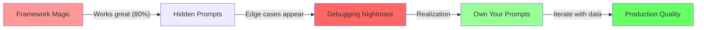

# Prompt and Context Engineering

## Introduction {#introduction}

You've built your stateless agent. You own your control flow. Everything is working beautifully... until you hit production. Suddenly, your agent starts hallucinating. It forgets important context. It gives inconsistent responses. The same prompt that worked perfectly in testing now produces garbage.

<Callout type="story" title="The 80% Wall">
Your demo was flawless. The CEO loved it. You got the green light to productionize. But something strange happened when real users started using it:

- The agent would work perfectly for simple requests but fail spectacularly on edge cases
- Token costs were 10x higher than projected because contexts kept exploding
- Users complained about inconsistent behavior—the same question got different answers
- Error messages were being treated as instructions, causing bizarre loops

You'd hit the 80% wall. And the only way through? **Hand-crafting every single token.**
</Callout>

### The Uncomfortable Truth

Here's what the framework vendors won't tell you: **There is no abstraction that can get you to 99% reliability.** The difference between a demo and a production system isn't better models or fancier frameworks—it's engineering discipline applied to every token.

This module will teach you:
- Why production prompts must be hand-crafted, not generated
- How to actively manage context windows before they manage you
- Error handling patterns that turn failures into improvements
- The engineering mindset that breaks through the 80% ceiling

Let's start with the foundation: owning your prompts.

## Factor 2: Own Your Prompts {#own-your-prompts}

LLMs are pure functions. Same tokens in, similar tokens out. This simple fact has a profound implication: **The only way to improve your agent's reliability is to control exactly what tokens go in.**

<Diagram type="flow" title="The Prompt Ownership Journey">

</Diagram>

### The Evolution of a Prompt

Let's watch a prompt evolve from prototype to production:

<CodeExample title="From Generic to Production Prompts" language="python">
```python
# Stage 1: The Framework Default (80% quality)
def framework_prompt(user_input):
    """What the framework gives you"""
    return f"You are a helpful assistant. User: {user_input}"

# Stage 2: Basic Customization (85% quality)
def basic_prompt(user_input, tools):
    """Adding some structure"""
    return f"""You are a customer service agent.
    
Available tools: {', '.join(tools)}

User: {user_input}

Respond helpfully."""

# Stage 3: Structured Prompt (90% quality)
def structured_prompt(user_input, tools, context):
    """Getting serious about structure"""
    return f"""You are a customer service agent for TechCorp.

Your capabilities:
{format_tools_detailed(tools)}

Current context:
- User ID: {context.user_id}
- Previous interactions: {len(context.history)}
- Current timestamp: {context.timestamp}

User request: {user_input}

Respond with a JSON object containing:
- "reasoning": Your thought process
- "action": The action to take
- "parameters": Action parameters
- "response": Message to user"""

# Stage 4: Production Prompt (95%+ quality)
class ProductionPromptBuilder:
    """Every token is intentional"""
    
    def __init__(self):
        self.version = "2.3.1"  # Yes, version your prompts!
        self.token_budget = {
            "system": 150,
            "tools": 200,
            "context": 300,
            "history": 500,
            "instructions": 250
        }
    
    def build(self, request):
        """Build prompt with token-level control"""
        sections = []
        
        # System prompt - every word chosen carefully
        sections.append(self._build_system_prompt(request))
        
        # Tools section - optimized descriptions
        sections.append(self._build_tools_section(request))
        
        # Context - compressed and relevant
        sections.append(self._build_context_section(request))
        
        # History - intelligently summarized
        sections.append(self._build_history_section(request))
        
        # Instructions - explicit and unambiguous
        sections.append(self._build_instructions(request))
        
        # Validate token budget
        prompt = "\n\n".join(sections)
        self._validate_token_count(prompt)
        
        return prompt
    
    def _build_system_prompt(self, request):
        """System instructions - the foundation"""
        return f"""# Customer Service Agent v{self.version}

You are a specialized customer service agent for TechCorp's enterprise clients.

Core principles:
- Accuracy over speed: Always verify before acting
- Security first: Never expose internal systems
- Empathy: Acknowledge customer frustration
- Efficiency: Minimize back-and-forth

Current session: {request.session_id}
Model: {request.model_name}"""

    def _build_tools_section(self, request):
        """Tool descriptions - optimized for clarity"""
        tools_desc = []
        for tool in request.available_tools:
            # Each description is carefully crafted
            desc = self._get_optimized_tool_description(tool)
            tools_desc.append(f"- {tool.name}: {desc}")
        
        return f"""## Available Actions

You may perform these actions:
{chr(10).join(tools_desc)}

Always verify parameters before using any action."""

    def _build_context_section(self, request):
        """Context - only what matters"""
        context_items = []
        
        # User context
        if request.user_profile:
            context_items.append(
                f"Customer: {request.user_profile.tier} tier, "
                f"Account age: {request.user_profile.account_age_days} days"
            )
        
        # Current state
        if request.workflow_state:
            context_items.append(
                f"Workflow: {request.workflow_state.current_step} "
                f"({request.workflow_state.progress}% complete)"
            )
        
        # Recent issues
        if request.recent_errors:
            summary = self._summarize_errors(request.recent_errors)
            context_items.append(f"Recent issues: {summary}")
        
        return f"""## Current Context

{chr(10).join(f'- {item}' for item in context_items)}"""

    def _build_instructions(self, request):
        """Instructions - explicit and testable"""
        return """## Response Format

You MUST respond with a valid JSON object:

{
    "reasoning": "Brief explanation of your decision process",
    "confidence": 0.0-1.0,
    "action": "action_name or 'respond'",
    "parameters": {...} or null,
    "response": "Message to user if action is 'respond'",
    "metadata": {
        "requires_human": boolean,
        "estimated_duration": "duration string",
        "risk_level": "low|medium|high"
    }
}

Invalid JSON will cause system failure. Validate before responding."""

    def _validate_token_count(self, prompt):
        """Ensure we stay within budget"""
        # Rough token estimation (use tiktoken in production)
        estimated_tokens = len(prompt) / 4
        total_budget = sum(self.token_budget.values())
        
        if estimated_tokens > total_budget:
            raise ValueError(
                f"Prompt exceeds token budget: "
                f"{estimated_tokens} > {total_budget}"
            )

# Why this matters:
# 1. Every token has a purpose
# 2. Versioning enables A/B testing
# 3. Token budgets prevent context explosion
# 4. Structured format reduces hallucination
# 5. Explicit instructions improve consistency
```
</CodeExample>

### Prompt Engineering Patterns

<CodeExample title="Token-Level Optimization" language="python">
```python
class PromptOptimizer:
    """Tools for squeezing maximum value from every token"""
    
    def __init__(self):
        self.abbreviations = {
            "customer": "cust",
            "account": "acct",
            "transaction": "txn",
            "configuration": "config"
        }
        self.stop_words = {"the", "a", "an", "to", "of", "in", "for"}
    
    def optimize_tool_description(self, tool):
        """Compress tool descriptions without losing clarity"""
        original = tool.description
        
        # Step 1: Remove redundant words
        optimized = self._remove_stop_words(original)
        
        # Step 2: Apply domain abbreviations
        optimized = self._apply_abbreviations(optimized)
        
        # Step 3: Convert to imperative mood
        optimized = self._make_imperative(optimized)
        
        # Ensure critical info preserved
        if not self._validates_critical_info(optimized, tool):
            return original  # Fall back if optimization goes too far
        
        return optimized
    
    def compress_error_context(self, errors):
        """Turn verbose errors into actionable summaries"""
        if not errors:
            return ""
        
        # Group by error type
        error_groups = {}
        for error in errors:
            error_type = self._classify_error(error)
            if error_type not in error_groups:
                error_groups[error_type] = []
            error_groups[error_type].append(error)
        
        # Summarize each group
        summaries = []
        for error_type, group in error_groups.items():
            if len(group) == 1:
                summary = self._summarize_single_error(group[0])
            else:
                summary = f"{error_type}: {len(group)} occurrences"
            summaries.append(summary)
        
        return "; ".join(summaries)
    
    def format_examples_efficiently(self, examples):
        """Include examples without token explosion"""
        if len(examples) <= 2:
            # Few examples: include fully
            return "\n".join(f"Example: {ex}" for ex in examples)
        
        # Many examples: show pattern
        return f"""Examples: {examples[0]}
Similar patterns: {len(examples)-1} more like above"""

class PromptTester:
    """Test prompts systematically"""
    
    def __init__(self, llm_client):
        self.llm = llm_client
        self.test_cases = []
    
    def add_test_case(self, name, input_data, expected_fields):
        """Define test cases for prompt reliability"""
        self.test_cases.append({
            "name": name,
            "input": input_data,
            "expected": expected_fields
        })
    
    async def test_prompt_version(self, prompt_builder, version):
        """Test a specific prompt version"""
        results = {
            "version": version,
            "passed": 0,
            "failed": 0,
            "errors": []
        }
        
        for test_case in self.test_cases:
            try:
                # Build prompt
                prompt = prompt_builder.build(test_case["input"])
                
                # Get LLM response
                response = await self.llm.complete(prompt)
                
                # Validate response
                parsed = json.loads(response)
                
                # Check expected fields
                for field in test_case["expected"]:
                    if field not in parsed:
                        raise ValueError(f"Missing field: {field}")
                
                results["passed"] += 1
                
            except Exception as e:
                results["failed"] += 1
                results["errors"].append({
                    "test": test_case["name"],
                    "error": str(e)
                })
        
        results["success_rate"] = results["passed"] / len(self.test_cases)
        return results

# A/B Testing Prompts in Production
class PromptABTester:
    """Test prompt variations with real traffic"""
    
    def __init__(self, variants):
        self.variants = variants  # {"v1": builder1, "v2": builder2}
        self.results = {name: {"count": 0, "success": 0} 
                       for name in variants}
    
    def select_variant(self, request):
        """Select variant based on request properties"""
        # Could use user_id hash, random selection, etc.
        import random
        return random.choice(list(self.variants.keys()))
    
    async def process_with_tracking(self, request):
        """Process request and track results"""
        variant_name = self.select_variant(request)
        variant_builder = self.variants[variant_name]
        
        # Build and execute
        prompt = variant_builder.build(request)
        start_time = time.time()
        
        try:
            response = await self._execute_prompt(prompt)
            success = self._validate_response(response)
            
            # Track results
            self.results[variant_name]["count"] += 1
            if success:
                self.results[variant_name]["success"] += 1
            
            # Log for analysis
            self._log_execution({
                "variant": variant_name,
                "request_id": request.id,
                "duration": time.time() - start_time,
                "success": success,
                "response_quality": self._measure_quality(response)
            })
            
            return response
            
        except Exception as e:
            self.results[variant_name]["count"] += 1
            self._log_error(variant_name, e)
            raise
    
    def get_results(self):
        """Get A/B test results"""
        results = {}
        for name, data in self.results.items():
            results[name] = {
                "success_rate": data["success"] / max(data["count"], 1),
                "sample_size": data["count"]
            }
        return results
```
</CodeExample>

## Factor 3: Context Windows Need Active Management {#context-window-management}

Context windows are like RAM for your agent. Leave them unmanaged, and you'll have the equivalent of a memory leak—except instead of crashing, your agent just gets progressively worse at its job.

<Callout type="warning" title="The Context Death Spiral">
Here's how it happens:
1. Agent starts with clean context (500 tokens)
2. Makes an API call, adds result (1500 tokens)
3. Encounters error, adds stack trace (2500 tokens)
4. Retries with full context (3500 tokens)
5. Gets confused by error in context, makes wrong call (4500 tokens)
6. Quality degrades, costs increase, users complain
7. You increase context limit, problem gets worse

**The solution isn't bigger contexts—it's smarter management.**
</Callout>

### Building a Production Context Manager

<CodeExample title="Dynamic Context Management" language="python">
```python
from typing import List, Dict, Any, Optional, Tuple
from dataclasses import dataclass
from abc import ABC, abstractmethod
import tiktoken

@dataclass
class ContextItem:
    """A single item in the context window"""
    type: str  # "message", "tool_result", "error", "summary"
    content: Any
    timestamp: float
    tokens: int
    priority: int  # 1-10, higher = more important
    compressible: bool = True
    
class ContextStrategy(ABC):
    """Base class for context management strategies"""
    
    @abstractmethod
    def select_items(self, items: List[ContextItem], 
                    token_budget: int) -> List[ContextItem]:
        """Select which items to include in context"""
        pass

class RecencyStrategy(ContextStrategy):
    """Keep most recent items (simple but effective)"""
    
    def select_items(self, items: List[ContextItem], 
                    token_budget: int) -> List[ContextItem]:
        # Sort by timestamp, newest first
        sorted_items = sorted(items, key=lambda x: x.timestamp, reverse=True)
        
        selected = []
        used_tokens = 0
        
        for item in sorted_items:
            if used_tokens + item.tokens <= token_budget:
                selected.append(item)
                used_tokens += item.tokens
            else:
                break
        
        # Return in chronological order
        return sorted(selected, key=lambda x: x.timestamp)

class PriorityStrategy(ContextStrategy):
    """Keep high-priority items + recent ones"""
    
    def select_items(self, items: List[ContextItem], 
                    token_budget: int) -> List[ContextItem]:
        # First pass: include all high-priority items
        high_priority = [i for i in items if i.priority >= 8]
        used_tokens = sum(i.tokens for i in high_priority)
        
        if used_tokens > token_budget:
            # Even high-priority items exceed budget
            # Take only the most recent high-priority ones
            high_priority = sorted(high_priority, 
                                 key=lambda x: x.timestamp, 
                                 reverse=True)
            selected = []
            used_tokens = 0
            for item in high_priority:
                if used_tokens + item.tokens <= token_budget:
                    selected.append(item)
                    used_tokens += item.tokens
            return sorted(selected, key=lambda x: x.timestamp)
        
        # Second pass: add recent items
        remaining_budget = token_budget - used_tokens
        other_items = [i for i in items if i.priority < 8]
        recent_items = RecencyStrategy().select_items(
            other_items, 
            remaining_budget
        )
        
        return sorted(high_priority + recent_items, 
                     key=lambda x: x.timestamp)

class SmartCompressionStrategy(ContextStrategy):
    """Compress older items to fit more context"""
    
    def __init__(self, compressor):
        self.compressor = compressor
    
    def select_items(self, items: List[ContextItem], 
                    token_budget: int) -> List[ContextItem]:
        # Separate compressible and non-compressible
        compressible = [i for i in items if i.compressible]
        non_compressible = [i for i in items if not i.compressible]
        
        # Start with non-compressible items
        selected = non_compressible[:]
        used_tokens = sum(i.tokens for i in selected)
        
        # Add recent compressible items uncompressed
        recent_threshold = time.time() - 300  # Last 5 minutes
        recent_items = [i for i in compressible 
                       if i.timestamp > recent_threshold]
        
        for item in sorted(recent_items, key=lambda x: x.priority, reverse=True):
            if used_tokens + item.tokens <= token_budget:
                selected.append(item)
                used_tokens += item.tokens
        
        # Compress and add older items
        older_items = [i for i in compressible 
                      if i.timestamp <= recent_threshold]
        
        if older_items and used_tokens < token_budget:
            # Compress older items into summaries
            compressed = self._compress_items(
                older_items, 
                token_budget - used_tokens
            )
            selected.extend(compressed)
        
        return sorted(selected, key=lambda x: x.timestamp)
    
    def _compress_items(self, items: List[ContextItem], 
                       token_budget: int) -> List[ContextItem]:
        """Compress multiple items into summaries"""
        # Group by type
        groups = {}
        for item in items:
            if item.type not in groups:
                groups[item.type] = []
            groups[item.type].append(item)
        
        compressed = []
        for item_type, group_items in groups.items():
            summary = self.compressor.summarize(group_items, item_type)
            compressed.append(ContextItem(
                type="summary",
                content=summary,
                timestamp=max(i.timestamp for i in group_items),
                tokens=self._count_tokens(summary),
                priority=max(i.priority for i in group_items),
                compressible=False
            ))
        
        # Select summaries that fit
        return PriorityStrategy().select_items(compressed, token_budget)

class ContextWindowManager:
    """Production context window management"""
    
    def __init__(self, 
                 max_tokens: int = 8000,
                 target_utilization: float = 0.8):
        self.max_tokens = max_tokens
        self.target_tokens = int(max_tokens * target_utilization)
        self.items: List[ContextItem] = []
        self.strategy = SmartCompressionStrategy(ContentCompressor())
        self.encoder = tiktoken.encoding_for_model("gpt-4")
        
        # Metrics
        self.compression_count = 0
        self.total_tokens_saved = 0
    
    def add_message(self, role: str, content: str, priority: int = 5):
        """Add a conversation message"""
        self.items.append(ContextItem(
            type="message",
            content={"role": role, "content": content},
            timestamp=time.time(),
            tokens=self._count_tokens(f"{role}: {content}"),
            priority=priority
        ))
        self._maybe_compress()
    
    def add_tool_result(self, tool: str, result: Any, priority: int = 6):
        """Add tool execution result"""
        # Intelligent preprocessing
        processed_result = self._process_tool_result(tool, result)
        
        self.items.append(ContextItem(
            type="tool_result",
            content={"tool": tool, "result": processed_result},
            timestamp=time.time(),
            tokens=self._count_tokens(str(processed_result)),
            priority=priority
        ))
        self._maybe_compress()
    
    def add_error(self, error: Exception, context: str, priority: int = 7):
        """Add error with intelligent processing"""
        # Don't add full stack traces
        error_summary = self._summarize_error(error, context)
        
        self.items.append(ContextItem(
            type="error",
            content=error_summary,
            timestamp=time.time(),
            tokens=self._count_tokens(error_summary),
            priority=priority,
            compressible=False  # Keep error context
        ))
        self._maybe_compress()
    
    def get_context(self) -> List[Dict[str, Any]]:
        """Get optimized context for LLM"""
        # Select items within budget
        selected = self.strategy.select_items(self.items, self.target_tokens)
        
        # Format for LLM consumption
        context = []
        for item in selected:
            if item.type == "message":
                context.append(item.content)
            elif item.type == "tool_result":
                context.append({
                    "role": "system",
                    "content": f"Tool '{item.content['tool']}' returned: {item.content['result']}"
                })
            elif item.type == "error":
                context.append({
                    "role": "system",
                    "content": f"Error encountered: {item.content}"
                })
            elif item.type == "summary":
                context.append({
                    "role": "system",
                    "content": f"Summary of earlier conversation: {item.content}"
                })
        
        return context
    
    def _maybe_compress(self):
        """Compress if approaching token limit"""
        total_tokens = sum(item.tokens for item in self.items)
        
        if total_tokens > self.max_tokens:
            # Force compression
            old_count = len(self.items)
            self._compress_old_items()
            new_count = len(self.items)
            
            self.compression_count += 1
            tokens_before = total_tokens
            tokens_after = sum(item.tokens for item in self.items)
            self.total_tokens_saved += (tokens_before - tokens_after)
            
            print(f"Compressed {old_count - new_count} items, "
                  f"saved {tokens_before - tokens_after} tokens")
    
    def _process_tool_result(self, tool: str, result: Any) -> Any:
        """Process tool results to minimize tokens"""
        if tool == "database_query":
            # Don't include all rows for large results
            if isinstance(result, list) and len(result) > 10:
                return {
                    "row_count": len(result),
                    "sample": result[:3],
                    "columns": list(result[0].keys()) if result else []
                }
        
        elif tool == "api_call":
            # Remove verbose headers, keep essential data
            if isinstance(result, dict) and "headers" in result:
                result = result.copy()
                result["headers"] = {
                    k: v for k, v in result["headers"].items()
                    if k.lower() in ["content-type", "status"]
                }
        
        return result
    
    def _summarize_error(self, error: Exception, context: str) -> str:
        """Create concise error summary"""
        error_type = type(error).__name__
        error_msg = str(error)
        
        # Remove redundant information
        if error_type in error_msg:
            summary = error_msg
        else:
            summary = f"{error_type}: {error_msg}"
        
        # Add context if meaningful
        if context and len(context) < 50:
            summary = f"{summary} (during {context})"
        
        # Truncate if too long
        if len(summary) > 200:
            summary = summary[:197] + "..."
        
        return summary
    
    def get_metrics(self) -> Dict[str, Any]:
        """Get context management metrics"""
        return {
            "total_items": len(self.items),
            "total_tokens": sum(item.tokens for item in self.items),
            "compression_count": self.compression_count,
            "tokens_saved": self.total_tokens_saved,
            "current_utilization": sum(item.tokens for item in self.items) / self.max_tokens
        }

class ContentCompressor:
    """Compress content while preserving key information"""
    
    def __init__(self, llm_client=None):
        self.llm = llm_client
        
    def summarize(self, items: List[ContextItem], 
                 item_type: str) -> str:
        """Summarize a group of items"""
        if item_type == "message":
            return self._summarize_messages(items)
        elif item_type == "tool_result":
            return self._summarize_tool_results(items)
        elif item_type == "error":
            return self._summarize_errors(items)
        else:
            return f"[{len(items)} {item_type} items]"
    
    def _summarize_messages(self, items: List[ContextItem]) -> str:
        """Summarize conversation history"""
        messages = [item.content for item in items]
        
        # Group by speaker
        exchanges = []
        current_speaker = None
        current_messages = []
        
        for msg in messages:
            if msg["role"] != current_speaker:
                if current_messages:
                    exchanges.append({
                        "role": current_speaker,
                        "messages": current_messages
                    })
                current_speaker = msg["role"]
                current_messages = [msg["content"]]
            else:
                current_messages.append(msg["content"])
        
        if current_messages:
            exchanges.append({
                "role": current_speaker,
                "messages": current_messages
            })
        
        # Summarize exchanges
        summary_parts = []
        for exchange in exchanges:
            if len(exchange["messages"]) == 1:
                summary_parts.append(
                    f"{exchange['role']}: {exchange['messages'][0][:100]}..."
                )
            else:
                summary_parts.append(
                    f"{exchange['role']}: {len(exchange['messages'])} messages"
                )
        
        return f"Previous conversation: {'; '.join(summary_parts)}"
    
    def _summarize_tool_results(self, items: List[ContextItem]) -> str:
        """Summarize tool execution history"""
        tool_counts = {}
        for item in items:
            tool = item.content["tool"]
            tool_counts[tool] = tool_counts.get(tool, 0) + 1
        
        summary_parts = []
        for tool, count in tool_counts.items():
            if count == 1:
                summary_parts.append(f"{tool} called")
            else:
                summary_parts.append(f"{tool} called {count} times")
        
        return f"Tool history: {', '.join(summary_parts)}"
```
</CodeExample>

### Context Compression Strategies

<CodeExample title="Context Compression Strategies" language="python">
```python
class AdvancedCompressionStrategies:
    """Sophisticated strategies for context compression"""
    
    def __init__(self, llm_client):
        self.llm = llm_client
        
    async def semantic_compression(self, 
                                 messages: List[Dict[str, str]], 
                                 target_tokens: int) -> str:
        """Use LLM to create semantic summary"""
        # Don't compress very recent messages
        recent_cutoff = 5
        if len(messages) <= recent_cutoff:
            return None
        
        to_compress = messages[:-recent_cutoff]
        
        compression_prompt = f"""Summarize this conversation history in {target_tokens // 4} words:

{self._format_messages(to_compress)}

Focus on:
1. Key decisions made
2. Important information discovered
3. Current task status
4. Unresolved issues

Summary:"""

        summary = await self.llm.complete(compression_prompt)
        return f"Earlier conversation summary: {summary}"
    
    def hierarchical_compression(self, items: List[ContextItem]) -> List[ContextItem]:
        """Compress in stages - older items get compressed more"""
        now = time.time()
        
        # Define age buckets
        buckets = [
            (300, 1.0),    # < 5 min: no compression
            (1800, 0.5),   # 5-30 min: 50% compression
            (3600, 0.2),   # 30-60 min: 80% compression
            (float('inf'), 0.1)  # > 60 min: 90% compression
        ]
        
        compressed_items = []
        
        for item in items:
            age = now - item.timestamp
            
            # Find appropriate compression ratio
            compression_ratio = 1.0
            for bucket_age, ratio in buckets:
                if age < bucket_age:
                    compression_ratio = ratio
                    break
            
            if compression_ratio == 1.0:
                # No compression
                compressed_items.append(item)
            else:
                # Compress based on type and ratio
                compressed = self._compress_item(item, compression_ratio)
                compressed_items.append(compressed)
        
        return compressed_items
    
    def _compress_item(self, item: ContextItem, ratio: float) -> ContextItem:
        """Compress a single item based on ratio"""
        if item.type == "message":
            compressed_content = self._compress_message(
                item.content, 
                int(item.tokens * ratio)
            )
        elif item.type == "tool_result":
            compressed_content = self._compress_tool_result(
                item.content, 
                int(item.tokens * ratio)
            )
        else:
            compressed_content = item.content
        
        return ContextItem(
            type=item.type,
            content=compressed_content,
            timestamp=item.timestamp,
            tokens=self._count_tokens(str(compressed_content)),
            priority=item.priority,
            compressible=False  # Already compressed
        )
    
    def domain_specific_compression(self, 
                                  content: Dict[str, Any], 
                                  domain: str) -> Dict[str, Any]:
        """Apply domain-specific compression rules"""
        
        if domain == "e-commerce":
            # E-commerce specific compressions
            if "product_list" in content and len(content["product_list"]) > 5:
                content["product_list"] = {
                    "count": len(content["product_list"]),
                    "sample": content["product_list"][:3],
                    "categories": list(set(p.get("category") 
                                         for p in content["product_list"]))
                }
            
            if "order_history" in content:
                content["order_history"] = {
                    "total_orders": len(content["order_history"]),
                    "recent_order": content["order_history"][0] 
                                   if content["order_history"] else None,
                    "total_spent": sum(o.get("total", 0) 
                                     for o in content["order_history"])
                }
        
        elif domain == "technical_support":
            # Tech support specific compressions
            if "error_logs" in content:
                content["error_logs"] = self._compress_error_logs(
                    content["error_logs"]
                )
            
            if "system_info" in content:
                # Keep only relevant system info
                content["system_info"] = {
                    k: v for k, v in content["system_info"].items()
                    if k in ["os", "version", "memory", "error_count"]
                }
        
        return content
    
    def _compress_error_logs(self, logs: List[Dict[str, Any]]) -> Dict[str, Any]:
        """Intelligently compress error logs"""
        if not logs:
            return {"count": 0}
        
        # Group by error type
        error_types = {}
        for log in logs:
            error_type = log.get("type", "unknown")
            if error_type not in error_types:
                error_types[error_type] = {
                    "count": 0,
                    "first_seen": log.get("timestamp"),
                    "last_seen": log.get("timestamp"),
                    "sample": log
                }
            error_types[error_type]["count"] += 1
            error_types[error_type]["last_seen"] = log.get("timestamp")
        
        return {
            "total_errors": len(logs),
            "unique_types": len(error_types),
            "by_type": error_types
        }

# Context Window Monitoring
class ContextWindowMonitor:
    """Monitor and alert on context window issues"""
    
    def __init__(self, 
                 alert_threshold: float = 0.9,
                 logger=None):
        self.alert_threshold = alert_threshold
        self.logger = logger or logging.getLogger(__name__)
        self.metrics = {
            "compressions": [],
            "token_usage": [],
            "overflow_events": 0
        }
    
    def record_compression(self, before_tokens: int, after_tokens: int):
        """Record compression event"""
        self.metrics["compressions"].append({
            "timestamp": time.time(),
            "before": before_tokens,
            "after": after_tokens,
            "ratio": after_tokens / before_tokens if before_tokens > 0 else 1
        })
    
    def check_token_usage(self, current_tokens: int, max_tokens: int):
        """Check token usage and alert if needed"""
        usage_ratio = current_tokens / max_tokens
        self.metrics["token_usage"].append({
            "timestamp": time.time(),
            "tokens": current_tokens,
            "ratio": usage_ratio
        })
        
        if usage_ratio > self.alert_threshold:
            self.logger.warning(
                f"Context window usage high: {usage_ratio:.1%} "
                f"({current_tokens}/{max_tokens} tokens)"
            )
            
        if usage_ratio >= 1.0:
            self.metrics["overflow_events"] += 1
            self.logger.error("Context window overflow!")
    
    def get_compression_stats(self) -> Dict[str, float]:
        """Get compression statistics"""
        if not self.metrics["compressions"]:
            return {"avg_ratio": 1.0, "total_saved": 0}
        
        ratios = [c["ratio"] for c in self.metrics["compressions"]]
        saved = sum(c["before"] - c["after"] 
                   for c in self.metrics["compressions"])
        
        return {
            "avg_ratio": sum(ratios) / len(ratios),
            "total_saved": saved,
            "compression_count": len(self.metrics["compressions"])
        }
```
</CodeExample>

## Factor 10: Explicit Error Handling {#error-handling}

Errors in agent systems aren't just failures—they're information. The difference between a fragile agent and a robust one is how that information is processed and used.

<Callout type="insight" title="The Error Paradox">
Most developers treat errors as something to hide from the LLM. But here's the counterintuitive truth: **Properly processed errors make your agent smarter.**

The key word is "processed." Raw stack traces confuse LLMs. But intelligent error summaries? They're learning opportunities.
</Callout>

### Intelligent Error Processing

<CodeExample title="Intelligent Error Processing" language="python">
```python
from typing import Dict, Any, Optional, List, Tuple
from enum import Enum
import traceback
import re

class ErrorType(Enum):
    """Categorize errors for appropriate handling"""
    RATE_LIMIT = "rate_limit"
    AUTH_FAILURE = "auth_failure"
    NETWORK = "network"
    VALIDATION = "validation"
    TIMEOUT = "timeout"
    PERMISSION = "permission"
    NOT_FOUND = "not_found"
    SERVER_ERROR = "server_error"
    UNKNOWN = "unknown"

class ErrorProcessor:
    """Turn raw errors into actionable intelligence"""
    
    def __init__(self):
        # Map error patterns to types
        self.error_patterns = {
            ErrorType.RATE_LIMIT: [
                r"rate limit",
                r"too many requests",
                r"429",
                r"quota exceeded"
            ],
            ErrorType.AUTH_FAILURE: [
                r"unauthorized",
                r"401",
                r"authentication failed",
                r"invalid credentials"
            ],
            ErrorType.NETWORK: [
                r"connection error",
                r"network",
                r"unreachable",
                r"dns"
            ],
            ErrorType.TIMEOUT: [
                r"timeout",
                r"timed out",
                r"deadline exceeded"
            ],
            ErrorType.VALIDATION: [
                r"validation error",
                r"invalid input",
                r"bad request",
                r"400"
            ],
            ErrorType.NOT_FOUND: [
                r"not found",
                r"404",
                r"does not exist"
            ]
        }
        
        # Track error patterns for learning
        self.error_history = []
        self.recovery_strategies = self._init_recovery_strategies()
    
    def process_error(self, 
                     error: Exception, 
                     context: Dict[str, Any]) -> Dict[str, Any]:
        """Process error into structured, actionable format"""
        
        # Classify the error
        error_type = self._classify_error(error)
        
        # Extract key information
        error_info = {
            "type": error_type.value,
            "message": self._extract_message(error),
            "recoverable": self._is_recoverable(error_type),
            "retry_possible": self._can_retry(error_type, context),
            "context_hint": self._get_context_hint(error_type, context),
            "suggested_action": self._suggest_action(error_type, context)
        }
        
        # Add to history for pattern learning
        self.error_history.append({
            "timestamp": time.time(),
            "type": error_type,
            "context": context.get("action"),
            "recovered": False  # Updated later if recovery succeeds
        })
        
        # Don't include sensitive information
        error_info = self._sanitize_error_info(error_info)
        
        return error_info
    
    def _classify_error(self, error: Exception) -> ErrorType:
        """Classify error based on patterns"""
        error_str = str(error).lower()
        
        # Check against known patterns
        for error_type, patterns in self.error_patterns.items():
            for pattern in patterns:
                if re.search(pattern, error_str, re.IGNORECASE):
                    return error_type
        
        # Check exception type
        if isinstance(error, TimeoutError):
            return ErrorType.TIMEOUT
        elif isinstance(error, ConnectionError):
            return ErrorType.NETWORK
        elif isinstance(error, PermissionError):
            return ErrorType.PERMISSION
        
        return ErrorType.UNKNOWN
    
    def _extract_message(self, error: Exception) -> str:
        """Extract concise, meaningful message"""
        message = str(error)
        
        # Remove noise
        noise_patterns = [
            r'\b[0-9a-f]{8}-[0-9a-f]{4}-[0-9a-f]{4}-[0-9a-f]{4}-[0-9a-f]{12}\b',  # UUIDs
            r'at 0x[0-9a-f]+',  # Memory addresses
            r'File "[^"]+", line \d+',  # File references
            r'\[\d+\]',  # Array indices
        ]
        
        for pattern in noise_patterns:
            message = re.sub(pattern, '', message)
        
        # Truncate if too long
        if len(message) > 200:
            message = message[:197] + "..."
        
        return message.strip()
    
    def _is_recoverable(self, error_type: ErrorType) -> bool:
        """Determine if error is recoverable"""
        recoverable_types = {
            ErrorType.RATE_LIMIT,
            ErrorType.TIMEOUT,
            ErrorType.NETWORK,
            ErrorType.SERVER_ERROR
        }
        return error_type in recoverable_types
    
    def _can_retry(self, error_type: ErrorType, 
                   context: Dict[str, Any]) -> bool:
        """Determine if retry makes sense"""
        # Check retry count
        retry_count = context.get("retry_count", 0)
        if retry_count >= 3:
            return False
        
        # Check error type
        if error_type in [ErrorType.VALIDATION, ErrorType.NOT_FOUND]:
            return False  # Retrying won't help
        
        # Check if we've seen this error repeatedly
        recent_errors = [e for e in self.error_history[-5:] 
                        if e["type"] == error_type]
        if len(recent_errors) >= 3:
            return False  # Pattern suggests systemic issue
        
        return True
    
    def _suggest_action(self, error_type: ErrorType, 
                       context: Dict[str, Any]) -> str:
        """Suggest next action based on error type"""
        
        strategies = self.recovery_strategies.get(
            error_type, 
            self.recovery_strategies[ErrorType.UNKNOWN]
        )
        
        # Select strategy based on context
        if context.get("retry_count", 0) == 0:
            return strategies["first_attempt"]
        elif context.get("retry_count", 0) < 3:
            return strategies["retry"]
        else:
            return strategies["final"]

    def _init_recovery_strategies(self) -> Dict[ErrorType, Dict[str, str]]:
        """Initialize recovery strategies"""
        return {
            ErrorType.RATE_LIMIT: {
                "first_attempt": "Wait 60 seconds before retrying",
                "retry": "Implement exponential backoff",
                "final": "Try alternative API or notify user of delay"
            },
            ErrorType.AUTH_FAILURE: {
                "first_attempt": "Verify credentials and retry",
                "retry": "Check token expiration",
                "final": "Request user to re-authenticate"
            },
            ErrorType.TIMEOUT: {
                "first_attempt": "Retry with longer timeout",
                "retry": "Try with smaller request size",
                "final": "Break operation into smaller chunks"
            },
            ErrorType.VALIDATION: {
                "first_attempt": "Review input parameters",
                "retry": "Simplify request parameters",
                "final": "Ask user for clarification"
            },
            ErrorType.UNKNOWN: {
                "first_attempt": "Log error and retry once",
                "retry": "Try alternative approach",
                "final": "Inform user and suggest manual intervention"
            }
        }

class SmartRetryHandler:
    """Implement intelligent retry logic"""
    
    def __init__(self, error_processor: ErrorProcessor):
        self.error_processor = error_processor
        self.retry_configs = {
            ErrorType.RATE_LIMIT: {
                "max_retries": 5,
                "base_delay": 60,
                "strategy": "exponential"
            },
            ErrorType.NETWORK: {
                "max_retries": 3,
                "base_delay": 1,
                "strategy": "exponential_jitter"
            },
            ErrorType.TIMEOUT: {
                "max_retries": 2,
                "base_delay": 0,
                "strategy": "immediate",
                "timeout_multiplier": 2
            },
            ErrorType.SERVER_ERROR: {
                "max_retries": 3,
                "base_delay": 5,
                "strategy": "linear"
            }
        }
    
    async def execute_with_retry(self, 
                                func: callable, 
                                context: Dict[str, Any]) -> Any:
        """Execute function with intelligent retry logic"""
        retry_count = 0
        last_error = None
        
        while retry_count <= self._get_max_retries(context):
            try:
                # Adjust parameters based on retry count
                adjusted_params = self._adjust_parameters(
                    context, 
                    retry_count
                )
                
                # Execute function
                result = await func(**adjusted_params)
                
                # Success - update error history
                if last_error:
                    self._mark_recovery_success(last_error)
                
                return result
                
            except Exception as e:
                # Process error
                error_info = self.error_processor.process_error(e, context)
                
                # Check if we should retry
                if not error_info["retry_possible"]:
                    raise
                
                # Calculate delay
                delay = self._calculate_delay(
                    error_info["type"], 
                    retry_count
                )
                
                # Log retry attempt
                logging.info(
                    f"Retry {retry_count + 1} after {delay}s: "
                    f"{error_info['suggested_action']}"
                )
                
                # Wait before retry
                if delay > 0:
                    await asyncio.sleep(delay)
                
                retry_count += 1
                last_error = error_info
                context["retry_count"] = retry_count
        
        # Max retries exceeded
        raise Exception(f"Max retries exceeded. Last error: {last_error}")
    
    def _calculate_delay(self, error_type: str, retry_count: int) -> float:
        """Calculate retry delay based on strategy"""
        config = self.retry_configs.get(
            ErrorType(error_type), 
            {"base_delay": 1, "strategy": "linear"}
        )
        
        base_delay = config["base_delay"]
        strategy = config["strategy"]
        
        if strategy == "exponential":
            return base_delay * (2 ** retry_count)
        elif strategy == "exponential_jitter":
            # Add random jitter to prevent thundering herd
            base = base_delay * (2 ** retry_count)
            jitter = random.uniform(0, base * 0.1)
            return base + jitter
        elif strategy == "linear":
            return base_delay * (retry_count + 1)
        else:  # immediate
            return 0

# Error-Aware Context Builder
class ErrorAwareContextBuilder:
    """Build context that learns from errors"""
    
    def __init__(self, error_processor: ErrorProcessor):
        self.error_processor = error_processor
        self.error_patterns = {}  # Track patterns
    
    def add_error_to_context(self, 
                           error_info: Dict[str, Any],
                           context: List[Dict[str, str]]) -> List[Dict[str, str]]:
        """Add processed error to context intelligently"""
        
        # Don't add duplicate errors
        if self._is_duplicate_error(error_info, context):
            return context
        
        # Create error context entry
        error_context = {
            "role": "system",
            "content": self._format_error_for_context(error_info)
        }
        
        # Insert at appropriate position
        # (not at end where it might confuse next action)
        insert_pos = self._find_error_insert_position(context)
        context.insert(insert_pos, error_context)
        
        # Clean up old errors if needed
        context = self._cleanup_old_errors(context)
        
        return context
    
    def _format_error_for_context(self, error_info: Dict[str, Any]) -> str:
        """Format error information for LLM consumption"""
        parts = [f"Previous action failed: {error_info['message']}"]
        
        if error_info.get("context_hint"):
            parts.append(f"Context: {error_info['context_hint']}")
        
        if error_info.get("suggested_action"):
            parts.append(f"Suggestion: {error_info['suggested_action']}")
        
        if error_info.get("recoverable"):
            parts.append("This error is recoverable.")
        
        return " ".join(parts)
    
    def _is_duplicate_error(self, 
                          error_info: Dict[str, Any],
                          context: List[Dict[str, str]]) -> bool:
        """Check if similar error already in context"""
        error_type = error_info["type"]
        
        for entry in context:
            if entry.get("role") == "system" and error_type in entry.get("content", ""):
                return True
        
        return False
    
    def _cleanup_old_errors(self, 
                          context: List[Dict[str, str]]) -> List[Dict[str, str]]:
        """Remove old or resolved errors from context"""
        # Keep only the most recent error of each type
        seen_types = set()
        cleaned = []
        
        # Process in reverse order (keep newer)
        for entry in reversed(context):
            if entry.get("role") == "system" and "failed:" in entry.get("content", ""):
                # Extract error type
                error_type = self._extract_error_type(entry["content"])
                if error_type not in seen_types:
                    cleaned.append(entry)
                    seen_types.add(error_type)
            else:
                cleaned.append(entry)
        
        return list(reversed(cleaned))

# Putting it all together
class ErrorResilientAgent:
    """Agent that handles errors gracefully"""
    
    def __init__(self, llm_client, tools):
        self.llm = llm_client
        self.tools = tools
        self.error_processor = ErrorProcessor()
        self.retry_handler = SmartRetryHandler(self.error_processor)
        self.context_builder = ErrorAwareContextBuilder(self.error_processor)
    
    async def execute_action(self, action: str, parameters: Dict[str, Any], 
                           context: List[Dict[str, str]]) -> Tuple[Any, List[Dict[str, str]]]:
        """Execute action with error handling"""
        
        action_context = {
            "action": action,
            "parameters": parameters,
            "retry_count": 0
        }
        
        try:
            # Execute with retry logic
            result = await self.retry_handler.execute_with_retry(
                lambda **p: self.tools[action](**p),
                action_context
            )
            
            # Success - add clean result to context
            context.append({
                "role": "system",
                "content": f"Action '{action}' completed successfully"
            })
            
            return result, context
            
        except Exception as e:
            # Process error
            error_info = self.error_processor.process_error(e, action_context)
            
            # Add to context for learning
            context = self.context_builder.add_error_to_context(
                error_info, 
                context
            )
            
            # Let agent decide next action based on error
            return None, context
```
</CodeExample>

### Error Recovery Patterns

<CodeExample title="Error Recovery Patterns" language="python">
```python
class RecoveryPatterns:
    """Common patterns for recovering from errors"""
    
    @staticmethod
    async def fallback_cascade(primary_func, fallback_funcs, context):
        """Try primary function, then fallbacks in order"""
        errors = []
        
        # Try primary
        try:
            return await primary_func(context)
        except Exception as e:
            errors.append(("primary", e))
        
        # Try fallbacks
        for i, fallback in enumerate(fallback_funcs):
            try:
                result = await fallback(context)
                logging.info(f"Fallback {i+1} succeeded after primary failure")
                return result
            except Exception as e:
                errors.append((f"fallback_{i+1}", e))
        
        # All failed
        raise Exception(f"All attempts failed: {errors}")
    
    @staticmethod
    async def circuit_breaker(func, failure_threshold=5, timeout=60):
        """Implement circuit breaker pattern"""
        if not hasattr(circuit_breaker, "states"):
            circuit_breaker.states = {}
        
        func_name = func.__name__
        state = circuit_breaker.states.get(func_name, {
            "failures": 0,
            "last_failure": 0,
            "state": "closed"  # closed, open, half-open
        })
        
        # Check if circuit is open
        if state["state"] == "open":
            if time.time() - state["last_failure"] > timeout:
                state["state"] = "half-open"
            else:
                raise Exception(f"Circuit breaker open for {func_name}")
        
        try:
            result = await func()
            
            # Success - reset failures
            if state["state"] == "half-open":
                logging.info(f"Circuit breaker for {func_name} closing")
            state["failures"] = 0
            state["state"] = "closed"
            
            return result
            
        except Exception as e:
            state["failures"] += 1
            state["last_failure"] = time.time()
            
            if state["failures"] >= failure_threshold:
                state["state"] = "open"
                logging.warning(
                    f"Circuit breaker for {func_name} opened after "
                    f"{state['failures']} failures"
                )
            
            raise
        
        finally:
            circuit_breaker.states[func_name] = state
    
    @staticmethod
    async def degraded_mode(full_func, degraded_func, health_check):
        """Switch to degraded mode when system unhealthy"""
        is_healthy = await health_check()
        
        if is_healthy:
            try:
                return await full_func()
            except Exception as e:
                logging.warning(f"Full function failed, switching to degraded: {e}")
                return await degraded_func()
        else:
            logging.info("System unhealthy, using degraded mode")
            return await degraded_func()
    
    @staticmethod
    async def retry_with_backpressure(func, context, max_concurrent=10):
        """Retry with backpressure when system is overwhelmed"""
        if not hasattr(retry_with_backpressure, "active_requests"):
            retry_with_backpressure.active_requests = 0
        
        # Check if we should apply backpressure
        if retry_with_backpressure.active_requests >= max_concurrent:
            wait_time = random.uniform(1, 5)  # Random backoff
            logging.info(f"Applying backpressure, waiting {wait_time:.1f}s")
            await asyncio.sleep(wait_time)
        
        retry_with_backpressure.active_requests += 1
        
        try:
            return await func(context)
        finally:
            retry_with_backpressure.active_requests -= 1

# Error Learning System
class ErrorLearningSystem:
    """System that learns from errors to improve over time"""
    
    def __init__(self):
        self.error_database = []
        self.success_patterns = []
        self.failure_patterns = []
    
    def record_attempt(self, action: str, parameters: Dict[str, Any], 
                      error: Optional[Exception], success: bool):
        """Record attempt for pattern learning"""
        record = {
            "timestamp": time.time(),
            "action": action,
            "parameters": self._sanitize_parameters(parameters),
            "success": success,
            "error_type": type(error).__name__ if error else None,
            "error_message": str(error) if error else None
        }
        
        self.error_database.append(record)
        
        # Update patterns
        if success:
            self._update_success_patterns(record)
        else:
            self._update_failure_patterns(record)
    
    def suggest_parameters(self, action: str, 
                         original_parameters: Dict[str, Any]) -> Dict[str, Any]:
        """Suggest modified parameters based on learned patterns"""
        
        # Find similar successful attempts
        similar_successes = self._find_similar_attempts(
            action, 
            original_parameters, 
            success_only=True
        )
        
        if not similar_successes:
            return original_parameters
        
        # Extract parameter patterns
        suggested = original_parameters.copy()
        
        for param, value in original_parameters.items():
            successful_values = [
                s["parameters"].get(param) 
                for s in similar_successes 
                if param in s["parameters"]
            ]
            
            if successful_values:
                # Use most common successful value
                suggested[param] = max(
                    set(successful_values), 
                    key=successful_values.count
                )
        
        return suggested
    
    def get_error_likelihood(self, action: str, 
                           parameters: Dict[str, Any]) -> float:
        """Predict likelihood of error based on history"""
        similar_attempts = self._find_similar_attempts(action, parameters)
        
        if not similar_attempts:
            return 0.5  # Unknown
        
        failures = sum(1 for a in similar_attempts if not a["success"])
        return failures / len(similar_attempts)
    
    def _find_similar_attempts(self, action: str, 
                             parameters: Dict[str, Any],
                             success_only: bool = False) -> List[Dict[str, Any]]:
        """Find historically similar attempts"""
        similar = []
        
        for record in self.error_database:
            if record["action"] != action:
                continue
            
            if success_only and not record["success"]:
                continue
            
            # Calculate similarity
            similarity = self._calculate_similarity(
                parameters, 
                record["parameters"]
            )
            
            if similarity > 0.7:  # Threshold
                similar.append(record)
        
        return similar
    
    def generate_learning_report(self) -> Dict[str, Any]:
        """Generate report on learned error patterns"""
        if not self.error_database:
            return {"status": "no_data"}
        
        # Group by action
        by_action = {}
        for record in self.error_database:
            action = record["action"]
            if action not in by_action:
                by_action[action] = {"success": 0, "failure": 0, "errors": {}}
            
            if record["success"]:
                by_action[action]["success"] += 1
            else:
                by_action[action]["failure"] += 1
                error_type = record["error_type"]
                by_action[action]["errors"][error_type] = \
                    by_action[action]["errors"].get(error_type, 0) + 1
        
        # Calculate success rates and common errors
        report = {}
        for action, stats in by_action.items():
            total = stats["success"] + stats["failure"]
            report[action] = {
                "success_rate": stats["success"] / total,
                "total_attempts": total,
                "common_errors": sorted(
                    stats["errors"].items(), 
                    key=lambda x: x[1], 
                    reverse=True
                )[:3]
            }
        
        return report
```
</CodeExample>

## Putting It All Together

Now let's see how prompt and context engineering combine in a production agent:

<CodeExample title="Production Prompt and Context Agent" language="python">
```python
class ProductionAwareAgent:
    """Agent with production-grade prompt and context management"""
    
    def __init__(self, llm_client, tools):
        # Core components
        self.llm = llm_client
        self.tools = tools
        
        # Prompt management
        self.prompt_builder = ProductionPromptBuilder()
        self.prompt_optimizer = PromptOptimizer()
        
        # Context management
        self.context_manager = ContextWindowManager(
            max_tokens=8000,
            target_utilization=0.8
        )
        self.context_monitor = ContextWindowMonitor()
        
        # Error handling
        self.error_processor = ErrorProcessor()
        self.retry_handler = SmartRetryHandler(self.error_processor)
        self.error_learner = ErrorLearningSystem()
        
        # Metrics
        self.metrics = {
            "requests_processed": 0,
            "errors_recovered": 0,
            "context_compressions": 0,
            "average_response_time": 0
        }
    
    async def process_request(self, user_input: str, user_id: str) -> str:
        """Process user request with full production features"""
        
        start_time = time.time()
        request_id = str(uuid.uuid4())
        
        # Initialize context
        self.context_manager.add_message(
            "user", 
            user_input, 
            priority=8  # User messages are high priority
        )
        
        # Build initial state
        state = {
            "request_id": request_id,
            "user_id": user_id,
            "iteration": 0,
            "max_iterations": 10,
            "completed": False
        }
        
        try:
            # Main processing loop
            while not state["completed"] and state["iteration"] < state["max_iterations"]:
                state["iteration"] += 1
                
                # Get optimized context
                context = self.context_manager.get_context()
                
                # Check context health
                self.context_monitor.check_token_usage(
                    sum(c.tokens for c in self.context_manager.items),
                    self.context_manager.max_tokens
                )
                
                # Build prompt with all optimizations
                prompt = self._build_optimized_prompt(context, state)
                
                # Get LLM response
                response = await self._get_llm_response(prompt)
                
                # Process response
                result = await self._process_response(response, state)
                
                if result["type"] == "final_response":
                    state["completed"] = True
                    final_response = result["content"]
                elif result["type"] == "tool_call":
                    # Execute with error handling
                    tool_result = await self._execute_tool_safely(
                        result["tool"],
                        result["parameters"],
                        state
                    )
                    
                    # Add to context intelligently
                    self.context_manager.add_tool_result(
                        result["tool"],
                        tool_result,
                        priority=6
                    )
                
                # Update metrics
                self.metrics["requests_processed"] += 1
            
            # Record successful completion
            duration = time.time() - start_time
            self._update_metrics(duration, success=True)
            
            return final_response
            
        except Exception as e:
            # Process error
            error_info = self.error_processor.process_error(e, state)
            
            # Try to recover
            recovery_response = await self._attempt_recovery(error_info, state)
            
            if recovery_response:
                self.metrics["errors_recovered"] += 1
                return recovery_response
            else:
                # Graceful failure
                return self._generate_failure_response(error_info)
    
    def _build_optimized_prompt(self, context: List[Dict[str, str]], 
                               state: Dict[str, Any]) -> str:
        """Build fully optimized prompt"""
        
        # Prepare request object
        request = PromptRequest(
            session_id=state["request_id"],
            model_name=self.llm.model,
            available_tools=list(self.tools.keys()),
            user_profile=self._get_user_profile(state["user_id"]),
            workflow_state={
                "current_step": f"iteration_{state['iteration']}",
                "progress": (state["iteration"] / state["max_iterations"]) * 100
            }
        )
        
        # Build base prompt
        prompt = self.prompt_builder.build(request)
        
        # Apply optimizations
        if self.context_manager.compression_count > 0:
            # Context has been compressed, adjust prompt
            prompt = self._adjust_prompt_for_compression(prompt)
        
        # Add context
        context_text = self._format_context_for_prompt(context)
        prompt = prompt.replace("{{CONTEXT}}", context_text)
        
        return prompt
    
    async def _execute_tool_safely(self, tool: str, 
                                  parameters: Dict[str, Any],
                                  state: Dict[str, Any]) -> Any:
        """Execute tool with full error handling"""
        
        # Check error likelihood
        error_likelihood = self.error_learner.get_error_likelihood(
            tool, 
            parameters
        )
        
        if error_likelihood > 0.7:
            # High chance of failure - suggest alternatives
            suggested_params = self.error_learner.suggest_parameters(
                tool, 
                parameters
            )
            if suggested_params != parameters:
                logging.info(f"Modifying parameters based on learning: {suggested_params}")
                parameters = suggested_params
        
        # Execute with retry logic
        try:
            result = await self.retry_handler.execute_with_retry(
                lambda **p: self.tools[tool](**p),
                {"action": tool, "parameters": parameters}
            )
            
            # Record success
            self.error_learner.record_attempt(
                tool, 
                parameters, 
                None, 
                success=True
            )
            
            return result
            
        except Exception as e:
            # Record failure
            self.error_learner.record_attempt(
                tool, 
                parameters, 
                e, 
                success=False
            )
            
            # Process and add to context
            error_info = self.error_processor.process_error(e, state)
            self.context_manager.add_error(
                e,
                f"during {tool} execution",
                priority=7
            )
            
            raise
    
    def get_diagnostics(self) -> Dict[str, Any]:
        """Get comprehensive diagnostics"""
        return {
            "metrics": self.metrics,
            "context": self.context_manager.get_metrics(),
            "compression": self.context_monitor.get_compression_stats(),
            "errors": self.error_learner.generate_learning_report(),
            "prompt_version": self.prompt_builder.version
        }

# Example usage
async def main():
    # Initialize production agent
    agent = ProductionAwareAgent(
        llm_client=LLMClient(),
        tools={
            "search_knowledge": search_knowledge_base,
            "update_ticket": update_support_ticket,
            "send_email": send_customer_email
        }
    )
    
    # Process request
    response = await agent.process_request(
        user_input="My order #12345 hasn't arrived and it's been 2 weeks",
        user_id="user_789"
    )
    
    # Get diagnostics
    diagnostics = agent.get_diagnostics()
    print(f"Context compressions: {diagnostics['context']['compression_count']}")
    print(f"Errors recovered: {diagnostics['metrics']['errors_recovered']}")
    print(f"Success rates by tool: {diagnostics['errors']}")
```
</CodeExample>

## Next Steps

You've now mastered the critical patterns for prompt and context engineering:

- **Own your prompts** - Every token must be intentional
- **Manage context actively** - Don't let it manage you  
- **Process errors intelligently** - Turn failures into improvements

These patterns, combined with the control flow and state management from Module 2, give you the foundation for building production-ready agents.

Remember: The difference between 80% and 99% reliability isn't better models or fancier frameworks. It's engineering discipline applied to every token, every context update, and every error.

In the next modules, we'll explore the remaining factors that complete the 12-Factor Agent framework. But the principles you've learned here—ownership, active management, and intelligent processing—will apply to everything that follows.

## Quiz {#quiz}

<Quiz>
  <Question 
    question="What is the fundamental reason why production prompts must be hand-crafted rather than generated?" 
    options={[
      "Hand-crafted prompts are cheaper to produce",
      "LLMs are pure functions: consistent tokens in means predictable behavior out",
      "Generated prompts are against most API terms of service",
      "Hand-crafted prompts use fewer tokens"
    ]}
    correctAnswer={1}
    explanation="LLMs are pure functions - the same input tokens will produce similar output tokens. This means the only way to improve reliability is to control exactly what tokens go into the model. Framework-generated prompts hide this control from you, making it impossible to achieve the precision needed for 99% reliability."
  />
  
  <Question 
    question="Which strategy for context window management is most effective when dealing with a long-running conversation that's approaching token limits?" 
    options={[
      "Simply increase the context window size to accommodate more tokens",
      "Delete all messages older than 5 minutes",
      "Use hierarchical compression: older items get compressed more aggressively",
      "Always keep the full conversation history and let the model handle it"
    ]}
    correctAnswer={2}
    explanation="Hierarchical compression is the most effective strategy because it preserves recent context (which is usually most relevant) while still maintaining important information from earlier in the conversation through progressive compression. Simply increasing context size leads to the 'context death spiral', while deleting old messages loses potentially important information."
  />
  
  <Question 
    question="When implementing error handling for production agents, what should you do with error information before adding it to the context?" 
    options={[
      "Include the full stack trace for maximum debugging information",
      "Ignore errors to avoid confusing the LLM",
      "Process errors into concise summaries with actionable suggestions",
      "Only log errors externally and never show them to the LLM"
    ]}
    correctAnswer={2}
    explanation="Raw error information (especially stack traces) confuses LLMs and wastes tokens. By processing errors into concise summaries with context hints and suggested actions, you turn failures into learning opportunities. The key is 'intelligent processing' - extracting the meaningful information while removing noise like memory addresses, UUIDs, and implementation details."
  />
</Quiz>

## Exercise: Context Window Optimizer {#exercise}

Build a context window optimizer that prevents the "context death spiral" by intelligently managing what information stays in the conversation:

<CodeExample title="Context Window Optimizer Exercise" language="python">
```python
from typing import List, Dict, Any, Tuple
from dataclasses import dataclass
import time

@dataclass
class ContextItem:
    """Represents an item in the context window"""
    type: str  # "message", "tool_result", "error", "summary"
    content: Any
    timestamp: float
    tokens: int
    priority: int  # 1-10, higher = more important
    compressible: bool = True

class ContextOptimizer:
    """
    Your task: Implement a production-ready context optimizer
    that prevents context overflow while maintaining conversation quality.
    """
    
    def __init__(self, max_tokens: int = 4000):
        self.max_tokens = max_tokens
        self.items: List[ContextItem] = []
        # TODO: Add any additional instance variables you need
    
    def add_message(self, role: str, content: str, priority: int = 5):
        """
        Add a conversation message to the context.
        
        Requirements:
        - Track token count (estimate: len(content) / 4)
        - Set appropriate priority based on role
        - Trigger compression if approaching limits
        """
        # TODO: Implement this method
        pass
    
    def add_tool_result(self, tool: str, result: Any, priority: int = 6):
        """
        Add tool execution result to the context.
        
        Requirements:
        - Process large results (e.g., truncate lists, summarize data)
        - Set priority based on tool importance
        - Mark as compressible for future optimization
        """
        # TODO: Implement this method
        pass
    
    def add_error(self, error: Exception, context: str):
        """
        Add error information to the context.
        
        Requirements:
        - Extract only essential error information
        - Remove stack traces and memory addresses
        - Set high priority (errors are learning opportunities)
        - Mark as non-compressible
        """
        # TODO: Implement this method
        pass
    
    def get_optimized_context(self) -> List[Dict[str, str]]:
        """
        Get the optimized context for the LLM.
        
        Requirements:
        - Stay within token budget
        - Preserve high-priority items
        - Compress older items intelligently
        - Return in LLM-ready format
        """
        # TODO: Implement this method
        pass
    
    def _compress_old_items(self):
        """
        Compress older items to free up token space.
        
        Requirements:
        - Group similar items (e.g., multiple tool calls)
        - Create concise summaries
        - Preserve key information
        - Update token counts
        """
        # TODO: Implement this method
        pass
    
    def _estimate_tokens(self, content: str) -> int:
        """Estimate token count for content"""
        # Simple estimation: ~4 characters per token
        return len(str(content)) // 4

# Test your implementation
def test_context_optimizer():
    optimizer = ContextOptimizer(max_tokens=1000)
    
    # Simulate a conversation that will exceed token limits
    
    # Initial user message
    optimizer.add_message("user", "I need help with my order #12345", priority=8)
    
    # Tool calls and results
    optimizer.add_tool_result("search_order", {
        "order_id": "12345",
        "status": "shipped",
        "tracking": "1Z999AA1234567890",
        "items": ["Widget A", "Widget B", "Widget C"],
        "history": [
            {"date": "2024-01-01", "status": "ordered"},
            {"date": "2024-01-02", "status": "processing"},
            {"date": "2024-01-03", "status": "shipped"}
        ]
    })
    
    # Add multiple messages to approach token limit
    for i in range(10):
        optimizer.add_message("assistant", f"Checking information part {i}...")
        optimizer.add_message("user", f"What about detail {i}?")
    
    # Add an error
    try:
        raise ConnectionError("Failed to connect to shipping API: timeout after 30s")
    except Exception as e:
        optimizer.add_error(e, "while checking shipping status")
    
    # Add more content to trigger compression
    optimizer.add_tool_result("get_shipping_updates", {
        "updates": [
            {"timestamp": "2024-01-04 10:00", "location": "Origin Facility", "status": "Picked up"},
            {"timestamp": "2024-01-04 14:00", "location": "Regional Hub", "status": "In transit"},
            {"timestamp": "2024-01-05 08:00", "location": "Local Facility", "status": "Out for delivery"}
        ] * 10  # Simulate large result
    })
    
    # Get optimized context
    context = optimizer.get_optimized_context()
    
    # Verify requirements
    total_tokens = sum(len(str(item)) // 4 for item in context)
    print(f"Total tokens in context: {total_tokens}")
    print(f"Number of context items: {len(context)}")
    print(f"Context stays within limit: {total_tokens <= 1000}")
    
    # Print context structure
    for i, item in enumerate(context):
        print(f"\nItem {i}: {item.get('role', 'system')} - {len(str(item.get('content', '')))} chars")
        if item.get('role') == 'system':
            print(f"  Content preview: {item['content'][:100]}...")

# Bonus challenges:
# 1. Implement semantic compression using similarity detection
# 2. Add support for different compression strategies (recency, priority, hybrid)
# 3. Create metrics to track compression effectiveness
# 4. Implement "context budgets" for different types of content

if __name__ == "__main__":
    test_context_optimizer()
```
</CodeExample>

This exercise challenges you to build one of the most critical components of a production agent system. A good implementation will:
- Prevent context overflow before it happens
- Preserve the most important information
- Compress intelligently without losing meaning
- Handle errors as first-class information

Remember: The goal isn't to fit everything—it's to fit what matters.