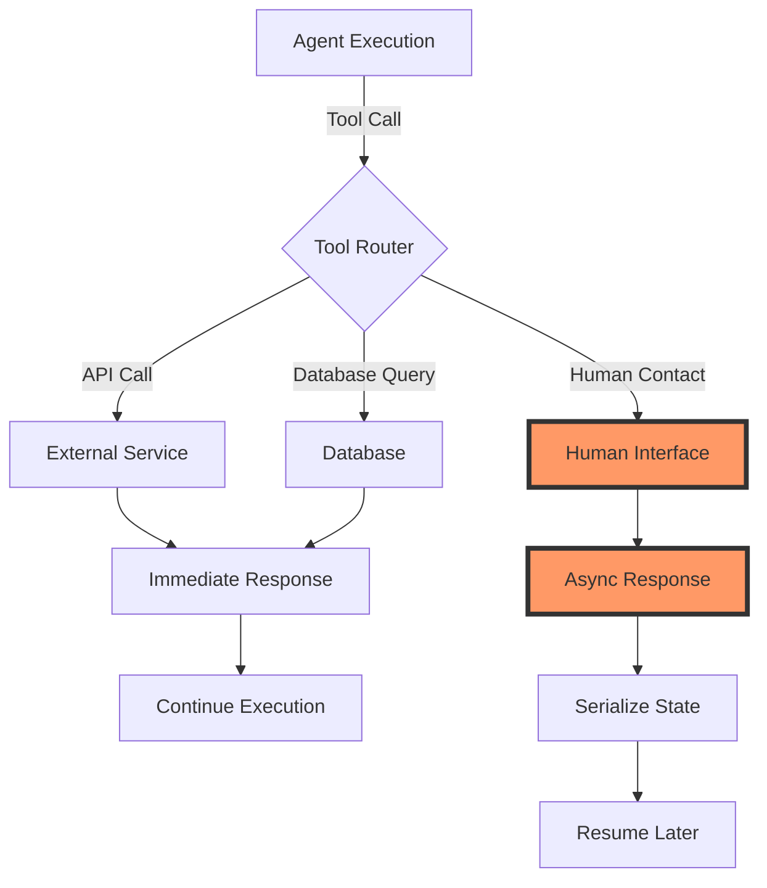
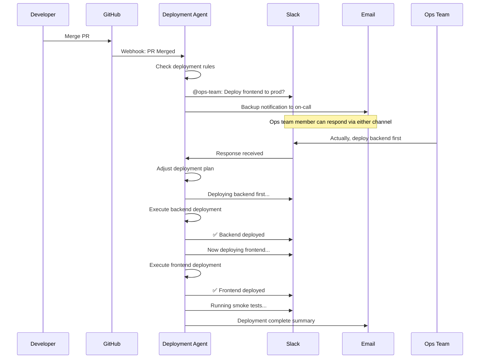
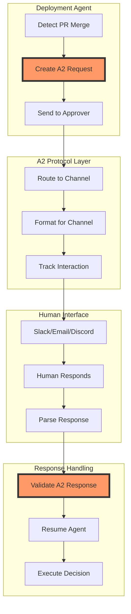

# Human-Agent Collaboration

## Introduction {#introduction}

Welcome to Module 4 of 12-Factor Agent Development. By now, you've learned that agents are just software, that JSON extraction is their superpower, and that owning your control flow is essential. But there's a critical factor we haven't addressed yet:

**What happens when your agent needs a human?**

<Callout type="story" title="The Seven-Tab Problem">
Picture this: Your organization has deployed seven different AI agents. There's the deployment bot, the code review assistant, the incident responder, the data analysis agent, the customer support bot, the expense approver, and the meeting scheduler.

Each one lives in its own web interface. Each one requires users to context-switch, log in, and learn a new UI. Your team spends more time managing the agents than the agents save them.

**What if there was a better way?**
</Callout>

### The Reality of Production Agents

After analyzing hundreds of production agent deployments, one pattern emerges clearly: **The best agents don't try to eliminate humans—they collaborate with them**.

This isn't about building "human-in-the-loop" as a fallback for when things go wrong. It's about recognizing that human judgment, creativity, and decision-making are features, not bugs, of well-designed agent systems.

In this module, you'll learn to:
- Treat human interaction as a first-class operation
- Build agents that work in Slack, email, Discord—wherever your users already are
- Implement the A2 protocol for standardized human-agent communication
- Design systems that gracefully handle the async nature of human responses

Let's build agents that augment human capabilities rather than trying to replace them.

## Factor 8: Contact Humans as First-Class Operations {#contact-humans-as-tools}

Here's a subtle but critical insight: Most agent frameworks treat human interaction as an exception—something that happens when the agent fails or needs help. This leads to brittle systems that break when humans don't respond immediately.

The solution? **Treat contacting a human exactly like calling any other tool**.

<Diagram type="flow" title="Human Contact as a Tool">

</Diagram>

### The Magic of Treating Humans as Tools

When you model human interaction as just another tool call, several things become possible:

1. **State Serialization**: The agent can save its entire execution state and resume later
2. **Timeout Handling**: You can set SLAs on human responses
3. **Delegation**: If one human doesn't respond, route to another
4. **Audit Trails**: Every human interaction is logged like any other tool call

<CodeExample title="Human Contact as a Tool Implementation" language="python">
```python
from typing import Dict, Any, Optional
from datetime import datetime, timedelta
import json
import uuid
from enum import Enum

class ToolType(Enum):
    API = "api"
    DATABASE = "database"
    HUMAN = "human"

class HumanContactTool:
    """Treat human interaction as a pausable, resumable tool"""
    
    def __init__(self, state_store, notification_service):
        self.state_store = state_store
        self.notification_service = notification_service
    
    async def execute(
        self,
        agent_state: Dict[str, Any],
        contact_request: Dict[str, Any]
    ) -> Dict[str, Any]:
        """Execute a human contact just like any other tool"""
        
        # Generate a unique interaction ID
        interaction_id = str(uuid.uuid4())
        
        # Serialize the entire agent state
        serialized_state = {
            "agent_id": agent_state["agent_id"],
            "execution_id": agent_state["execution_id"],
            "context_window": agent_state["context_window"],
            "tool_history": agent_state["tool_history"],
            "contact_request": contact_request,
            "timestamp": datetime.utcnow().isoformat(),
            "timeout": (datetime.utcnow() + timedelta(
                minutes=contact_request.get("timeout_minutes", 60)
            )).isoformat()
        }
        
        # Save state to persistent storage
        await self.state_store.save(interaction_id, serialized_state)
        
        # Send notification to human(s)
        await self._notify_humans(interaction_id, contact_request)
        
        # Return a "pending" response that includes the interaction ID
        return {
            "tool_type": ToolType.HUMAN.value,
            "status": "pending",
            "interaction_id": interaction_id,
            "message": "Waiting for human response",
            "timeout": serialized_state["timeout"]
        }
    
    async def _notify_humans(
        self,
        interaction_id: str,
        request: Dict[str, Any]
    ):
        """Route the request to the appropriate human(s)"""
        
        # Determine routing based on request type and urgency
        recipients = self._determine_recipients(request)
        
        # Format the message for each channel
        for recipient in recipients:
            if recipient["channel"] == "slack":
                await self.notification_service.send_slack(
                    channel=recipient["id"],
                    message=self._format_slack_message(interaction_id, request)
                )
            elif recipient["channel"] == "email":
                await self.notification_service.send_email(
                    to=recipient["id"],
                    subject=f"Action Required: {request['title']}",
                    body=self._format_email_body(interaction_id, request)
                )
            elif recipient["channel"] == "discord":
                await self.notification_service.send_discord(
                    user_id=recipient["id"],
                    message=self._format_discord_message(interaction_id, request)
                )
    
    async def handle_human_response(
        self,
        interaction_id: str,
        response: Dict[str, Any]
    ) -> Dict[str, Any]:
        """Resume agent execution when human responds"""
        
        # Load the serialized state
        state = await self.state_store.load(interaction_id)
        if not state:
            raise ValueError(f"No pending interaction found: {interaction_id}")
        
        # Check if response is within timeout
        if datetime.utcnow() > datetime.fromisoformat(state["timeout"]):
            return await self._handle_timeout(state)
        
        # Restore agent state
        agent_state = {
            "agent_id": state["agent_id"],
            "execution_id": state["execution_id"],
            "context_window": state["context_window"],
            "tool_history": state["tool_history"]
        }
        
        # Add human response to context
        human_response = {
            "tool_type": ToolType.HUMAN.value,
            "status": "completed",
            "interaction_id": interaction_id,
            "response": response,
            "response_time": datetime.utcnow().isoformat(),
            "responder": response.get("responder_id")
        }
        
        agent_state["tool_history"].append(human_response)
        agent_state["context_window"].append({
            "role": "tool",
            "content": json.dumps(human_response)
        })
        
        # Clean up stored state
        await self.state_store.delete(interaction_id)
        
        # Return the resumed agent state
        return agent_state
```
</CodeExample>

### Handling Async Human Responses

The key insight is that human responses are inherently asynchronous. Unlike API calls that return in milliseconds, humans might respond in minutes, hours, or days. Your agent architecture must embrace this reality:

<CodeExample title="Async State Management for Human Delays" language="typescript">
```typescript
interface AgentState {
  agentId: string;
  executionId: string;
  contextWindow: Message[];
  toolHistory: ToolCall[];
  currentStep: number;
  status: 'running' | 'waiting_for_human' | 'completed' | 'failed';
}

interface HumanInteraction {
  interactionId: string;
  agentState: AgentState;
  request: HumanRequest;
  timeout: Date;
  escalationPath?: string[];
}

class AgentOrchestrator {
  private stateStore: StateStore;
  private humanContactTool: HumanContactTool;
  
  async executeAgent(initialState: AgentState): Promise<void> {
    let state = initialState;
    
    while (state.status === 'running') {
      const nextAction = await this.determineNextAction(state);
      
      if (nextAction.type === 'tool_call') {
        const tool = this.getToolByName(nextAction.toolName);
        
        if (tool instanceof HumanContactTool) {
          // Special handling for human interactions
          const interaction = await tool.execute(state, nextAction.params);
          
          // Save state and pause execution
          await this.stateStore.saveInteraction({
            interactionId: interaction.interactionId,
            agentState: state,
            request: nextAction.params,
            timeout: new Date(interaction.timeout)
          });
          
          // Update status and exit loop
          state.status = 'waiting_for_human';
          break;
        } else {
          // Normal tool execution
          const result = await tool.execute(nextAction.params);
          state = this.updateStateWithToolResult(state, result);
        }
      }
    }
  }
  
  async resumeFromHumanResponse(
    interactionId: string,
    response: any
  ): Promise<void> {
    // Load the saved interaction
    const interaction = await this.stateStore.loadInteraction(interactionId);
    if (!interaction) {
      throw new Error(`Unknown interaction: ${interactionId}`);
    }
    
    // Check timeout
    if (new Date() > interaction.timeout) {
      await this.handleTimeout(interaction);
      return;
    }
    
    // Restore state and add human response
    let state = interaction.agentState;
    state.status = 'running';
    state.toolHistory.push({
      tool: 'human_contact',
      request: interaction.request,
      response: response,
      timestamp: new Date()
    });
    
    // Resume execution
    await this.executeAgent(state);
  }
  
  private async handleTimeout(interaction: HumanInteraction): Promise<void> {
    // Implement escalation logic
    if (interaction.escalationPath && interaction.escalationPath.length > 0) {
      const nextApprover = interaction.escalationPath[0];
      const remainingPath = interaction.escalationPath.slice(1);
      
      // Create new interaction for next approver
      const escalatedRequest = {
        ...interaction.request,
        escalated: true,
        originalTimeout: interaction.timeout,
        escalationReason: 'timeout'
      };
      
      await this.humanContactTool.execute(
        interaction.agentState,
        escalatedRequest
      );
    } else {
      // No escalation path - mark as failed
      interaction.agentState.status = 'failed';
      interaction.agentState.failureReason = 'Human response timeout';
      await this.stateStore.saveState(interaction.agentState);
    }
  }
}
```
</CodeExample>

### Best Practices for Human-as-a-Tool

1. **Always Set Timeouts**: Every human interaction should have a defined SLA
2. **Plan for Delegation**: Build escalation paths into your contact requests
3. **Preserve Full Context**: The human should see everything the agent sees
4. **Make Actions Clear**: Don't make humans guess what you need from them
5. **Handle Partial Responses**: Humans might answer only part of your question

<Callout type="warning" title="Common Pitfall">
Don't treat human responses as simple yes/no decisions. Humans often provide nuanced feedback that can redirect the agent's entire approach. Design your state handling to accommodate this flexibility.
</Callout>

## Factor 9: Meet Users Where They Are {#meet-users-where-they-are}

The second half of human-agent collaboration is equally important: **Don't make users come to your agent—bring your agent to them**.

<Callout type="insight" title="The Context-Switching Tax">
Every time a user has to switch from their primary workflow to interact with your agent, you're imposing a cognitive tax. The cost? Reduced adoption, slower response times, and frustrated users.

The solution? Build agents that live where your users already work.
</Callout>

### Multi-Channel Architecture

Here's how to build agents that can seamlessly operate across multiple communication channels:

<CodeExample title="Multi-Channel Agent Router" language="python">
```python
from abc import ABC, abstractmethod
from typing import Dict, Any, List, Optional
import asyncio
from dataclasses import dataclass

@dataclass
class Message:
    """Channel-agnostic message format"""
    channel: str  # 'slack', 'email', 'discord', etc.
    sender_id: str
    content: str
    metadata: Dict[str, Any]
    thread_id: Optional[str] = None
    attachments: List[Dict[str, Any]] = None

class ChannelAdapter(ABC):
    """Abstract base for channel adapters"""
    
    @abstractmethod
    async def send_message(self, recipient: str, message: Message) -> str:
        """Send a message and return message ID"""
        pass
    
    @abstractmethod
    async def send_interactive(
        self,
        recipient: str,
        prompt: str,
        options: List[Dict[str, Any]]
    ) -> str:
        """Send an interactive message (buttons, select menus, etc.)"""
        pass
    
    @abstractmethod
    async def edit_message(self, message_id: str, new_content: str) -> None:
        """Edit an existing message"""
        pass
    
    @abstractmethod
    def format_rich_text(self, content: Dict[str, Any]) -> str:
        """Format rich content for this channel"""
        pass

class SlackAdapter(ChannelAdapter):
    """Slack-specific implementation"""
    
    def __init__(self, slack_client):
        self.client = slack_client
    
    async def send_message(self, recipient: str, message: Message) -> str:
        """Send Slack message with blocks"""
        blocks = self._build_blocks(message)
        
        response = await self.client.chat_postMessage(
            channel=recipient,
            text=message.content,  # Fallback text
            blocks=blocks,
            thread_ts=message.thread_id
        )
        
        return response['ts']
    
    async def send_interactive(
        self,
        recipient: str,
        prompt: str,
        options: List[Dict[str, Any]]
    ) -> str:
        """Send message with buttons"""
        blocks = [
            {
                "type": "section",
                "text": {"type": "mrkdwn", "text": prompt}
            },
            {
                "type": "actions",
                "elements": [
                    {
                        "type": "button",
                        "text": {"type": "plain_text", "text": opt['label']},
                        "value": opt['value'],
                        "action_id": f"action_{opt['value']}"
                    }
                    for opt in options
                ]
            }
        ]
        
        response = await self.client.chat_postMessage(
            channel=recipient,
            blocks=blocks
        )
        
        return response['ts']
    
    def format_rich_text(self, content: Dict[str, Any]) -> str:
        """Convert rich content to Slack markdown"""
        if content['type'] == 'code':
            return f"```{content.get('language', '')}\n{content['code']}\n```"
        elif content['type'] == 'link':
            return f"<{content['url']}|{content['text']}>"
        # ... more formatting rules

class EmailAdapter(ChannelAdapter):
    """Email-specific implementation"""
    
    def __init__(self, email_service):
        self.service = email_service
    
    async def send_message(self, recipient: str, message: Message) -> str:
        """Send email with proper formatting"""
        html_body = self._build_html_email(message)
        
        # Thread handling via References header
        headers = {}
        if message.thread_id:
            headers['References'] = f"<{message.thread_id}>"
            headers['In-Reply-To'] = f"<{message.thread_id}>"
        
        message_id = await self.service.send(
            to=recipient,
            subject=self._extract_subject(message),
            html=html_body,
            headers=headers
        )
        
        return message_id
    
    async def send_interactive(
        self,
        recipient: str,
        prompt: str,
        options: List[Dict[str, Any]]
    ) -> str:
        """Send email with action buttons"""
        # Generate unique action URLs
        action_urls = {}
        for option in options:
            action_id = self._generate_action_id()
            action_urls[action_id] = {
                'value': option['value'],
                'label': option['label']
            }
            option['action_url'] = f"https://agent.company.com/action/{action_id}"
        
        html_body = self._build_interactive_email(prompt, options)
        
        message_id = await self.service.send(
            to=recipient,
            subject=f"Action Required: {prompt[:50]}...",
            html=html_body
        )
        
        # Store action mappings
        await self._store_email_actions(message_id, action_urls)
        
        return message_id

class MultiChannelAgent:
    """Agent that works across all channels"""
    
    def __init__(self):
        self.adapters: Dict[str, ChannelAdapter] = {}
        self.user_preferences = {}  # User -> preferred channel
        self.active_conversations = {}  # Thread tracking
    
    def register_adapter(self, channel: str, adapter: ChannelAdapter):
        """Register a channel adapter"""
        self.adapters[channel] = adapter
    
    async def send_to_user(
        self,
        user_id: str,
        content: str,
        require_response: bool = False,
        options: Optional[List[Dict[str, Any]]] = None
    ) -> str:
        """Send message to user on their preferred channel"""
        
        # Determine best channel for user
        channel = await self._get_user_channel(user_id)
        adapter = self.adapters[channel]
        
        # Get or create thread
        thread_id = self.active_conversations.get(user_id)
        
        # Build channel-agnostic message
        message = Message(
            channel=channel,
            sender_id='agent',
            content=content,
            metadata={'require_response': require_response},
            thread_id=thread_id
        )
        
        # Send appropriately
        if require_response and options:
            message_id = await adapter.send_interactive(
                recipient=self._get_channel_recipient(user_id, channel),
                prompt=content,
                options=options
            )
        else:
            message_id = await adapter.send_message(
                recipient=self._get_channel_recipient(user_id, channel),
                message=message
            )
        
        # Track conversation
        if not thread_id:
            self.active_conversations[user_id] = message_id
        
        return message_id
    
    async def handle_user_response(
        self,
        channel: str,
        user_id: str,
        content: str,
        metadata: Dict[str, Any]
    ) -> None:
        """Handle response from any channel"""
        
        # Normalize the response
        normalized_message = Message(
            channel=channel,
            sender_id=user_id,
            content=content,
            metadata=metadata,
            thread_id=self.active_conversations.get(user_id)
        )
        
        # Route to appropriate agent logic
        await self._process_user_message(normalized_message)
    
    async def _get_user_channel(self, user_id: str) -> str:
        """Determine best channel for user"""
        
        # Check user preferences
        if user_id in self.user_preferences:
            return self.user_preferences[user_id]
        
        # Check where user is currently active
        for channel, adapter in self.adapters.items():
            if await self._is_user_active(user_id, channel):
                return channel
        
        # Default fallback
        return 'email'  # Everyone has email
```
</CodeExample>

### Channel-Specific Considerations

Different channels have different capabilities and user expectations:

<CodeExample title="Channel-Agnostic Message Handler" language="typescript">
```typescript
interface ChannelCapabilities {
  supportsThreading: boolean;
  supportsButtons: boolean;
  supportsRichText: boolean;
  maxMessageLength: number;
  supportsEditing: boolean;
  supportsPersistence: boolean;
}

class ChannelRegistry {
  private capabilities: Map<string, ChannelCapabilities> = new Map([
    ['slack', {
      supportsThreading: true,
      supportsButtons: true,
      supportsRichText: true,
      maxMessageLength: 40000,
      supportsEditing: true,
      supportsPersistence: true
    }],
    ['email', {
      supportsThreading: true,
      supportsButtons: false,  // Must use links
      supportsRichText: true,
      maxMessageLength: Infinity,
      supportsEditing: false,
      supportsPersistence: true
    }],
    ['discord', {
      supportsThreading: true,
      supportsButtons: true,
      supportsRichText: true,
      maxMessageLength: 2000,
      supportsEditing: true,
      supportsPersistence: true
    }],
    ['sms', {
      supportsThreading: false,
      supportsButtons: false,
      supportsRichText: false,
      maxMessageLength: 160,
      supportsEditing: false,
      supportsPersistence: false
    }]
  ]);
  
  async sendAdaptiveMessage(
    channel: string,
    recipient: string,
    message: RichMessage
  ): Promise<void> {
    const caps = this.capabilities.get(channel);
    if (!caps) throw new Error(`Unknown channel: ${channel}`);
    
    // Adapt message based on channel capabilities
    if (!caps.supportsButtons && message.actions) {
      // Convert buttons to numbered list for email/SMS
      message = this.convertButtonsToList(message);
    }
    
    if (!caps.supportsRichText && message.formatting) {
      // Strip formatting for plain text channels
      message = this.stripFormatting(message);
    }
    
    if (message.content.length > caps.maxMessageLength) {
      // Handle message splitting for length-limited channels
      const chunks = this.splitMessage(message, caps.maxMessageLength);
      for (const chunk of chunks) {
        await this.sendToChannel(channel, recipient, chunk);
      }
    } else {
      await this.sendToChannel(channel, recipient, message);
    }
  }
  
  private convertButtonsToList(message: RichMessage): RichMessage {
    if (!message.actions) return message;
    
    let content = message.content + '\n\nPlease reply with one of:\n';
    message.actions.forEach((action, index) => {
      content += `${index + 1}. ${action.label}\n`;
    });
    
    return {
      ...message,
      content,
      actions: undefined,
      metadata: {
        ...message.metadata,
        actionMapping: message.actions.map(a => a.value)
      }
    };
  }
}
```
</CodeExample>

### Real-World Example: Multi-Channel Deployment Bot

Let's see how this works in practice with a deployment approval bot that works across channels:

<Diagram type="sequence" title="Multi-Channel Deployment Flow">

</Diagram>

### Best Practices for Multi-Channel Agents

1. **Abstract Channel Differences**: Your core agent logic shouldn't know about channels
2. **Graceful Degradation**: Adapt rich features to simpler channels automatically
3. **Maintain Context**: Thread conversations appropriately in each channel
4. **Respect Channel Norms**: Slack is casual, email is formal—adapt your tone
5. **Handle Channel Failures**: Always have a fallback communication method

<Callout type="tip" title="Pro Tip">
Start with 2-3 channels maximum. Each channel adds complexity. Master Slack + email before adding Discord, Teams, SMS, etc.
</Callout>

## The A2 Protocol: Standardizing Human-Agent Communication {#a2-protocol}

As agents become more prevalent, we need standards for how they communicate—both with humans and with each other. Enter the A2 (Agent-to-Agent) Protocol.

### Why Standards Matter

Without standards, every agent implements human interaction differently:
- Different approval formats
- Inconsistent timeout handling  
- No interoperability between agents
- Duplicate notification logic

The A2 Protocol provides a common language for agent interactions:

<CodeExample title="A2 Protocol Implementation" language="python">
```python
from typing import Dict, Any, List, Optional, Union
from datetime import datetime, timezone
from enum import Enum
import json

class A2MessageType(Enum):
    """Standard A2 message types"""
    REQUEST = "request"
    RESPONSE = "response"
    NOTIFICATION = "notification"
    QUERY = "query"
    COMMAND = "command"
    EVENT = "event"

class A2Priority(Enum):
    """Standard priority levels"""
    CRITICAL = "critical"      # Immediate attention required
    HIGH = "high"              # Within 1 hour
    NORMAL = "normal"          # Within business hours
    LOW = "low"                # Best effort

class A2ResponseType(Enum):
    """Expected response types"""
    APPROVAL = "approval"      # Yes/No/Delegate
    CHOICE = "choice"          # Select from options
    INPUT = "input"            # Freeform text
    CONFIRMATION = "confirmation"  # Acknowledge receipt

class A2Message:
    """A2 Protocol compliant message"""
    
    def __init__(
        self,
        message_type: A2MessageType,
        sender: str,
        recipient: str,
        content: Dict[str, Any],
        priority: A2Priority = A2Priority.NORMAL,
        requires_response: bool = False,
        response_type: Optional[A2ResponseType] = None,
        timeout_seconds: Optional[int] = None,
        context: Optional[Dict[str, Any]] = None
    ):
        self.id = self._generate_id()
        self.version = "1.0"
        self.type = message_type
        self.sender = sender
        self.recipient = recipient
        self.content = content
        self.priority = priority
        self.requires_response = requires_response
        self.response_type = response_type
        self.timeout_seconds = timeout_seconds
        self.context = context or {}
        self.timestamp = datetime.now(timezone.utc).isoformat()
        self.thread_id = None
        self.correlation_id = None
    
    def to_dict(self) -> Dict[str, Any]:
        """Serialize to A2 format"""
        return {
            "a2_version": self.version,
            "id": self.id,
            "type": self.type.value,
            "sender": self.sender,
            "recipient": self.recipient,
            "timestamp": self.timestamp,
            "priority": self.priority.value,
            "content": self.content,
            "requires_response": self.requires_response,
            "response_type": self.response_type.value if self.response_type else None,
            "timeout_seconds": self.timeout_seconds,
            "context": self.context,
            "thread_id": self.thread_id,
            "correlation_id": self.correlation_id
        }
    
    @classmethod
    def from_dict(cls, data: Dict[str, Any]) -> 'A2Message':
        """Deserialize from A2 format"""
        msg = cls(
            message_type=A2MessageType(data["type"]),
            sender=data["sender"],
            recipient=data["recipient"],
            content=data["content"],
            priority=A2Priority(data["priority"]),
            requires_response=data["requires_response"],
            response_type=A2ResponseType(data["response_type"]) if data.get("response_type") else None,
            timeout_seconds=data.get("timeout_seconds"),
            context=data.get("context", {})
        )
        msg.id = data["id"]
        msg.timestamp = data["timestamp"]
        msg.thread_id = data.get("thread_id")
        msg.correlation_id = data.get("correlation_id")
        return msg

class A2HumanInterface:
    """A2-compliant human interaction handler"""
    
    def __init__(self, channel_registry):
        self.channel_registry = channel_registry
        self.pending_interactions: Dict[str, A2Message] = {}
    
    async def request_human_approval(
        self,
        agent_id: str,
        human_id: str,
        action: str,
        details: Dict[str, Any],
        context: Dict[str, Any],
        timeout_seconds: int = 3600,
        priority: A2Priority = A2Priority.NORMAL
    ) -> str:
        """Request approval using A2 protocol"""
        
        message = A2Message(
            message_type=A2MessageType.REQUEST,
            sender=agent_id,
            recipient=human_id,
            content={
                "action": action,
                "details": details,
                "approval_options": [
                    {"value": "approve", "label": "Approve"},
                    {"value": "reject", "label": "Reject"},
                    {"value": "delegate", "label": "Delegate"}
                ]
            },
            priority=priority,
            requires_response=True,
            response_type=A2ResponseType.APPROVAL,
            timeout_seconds=timeout_seconds,
            context=context
        )
        
        # Store pending interaction
        self.pending_interactions[message.id] = message
        
        # Send via appropriate channel
        await self._route_message(message)
        
        return message.id
    
    async def request_human_choice(
        self,
        agent_id: str,
        human_id: str,
        prompt: str,
        options: List[Dict[str, str]],
        context: Dict[str, Any],
        timeout_seconds: int = 1800
    ) -> str:
        """Request choice selection using A2 protocol"""
        
        message = A2Message(
            message_type=A2MessageType.REQUEST,
            sender=agent_id,
            recipient=human_id,
            content={
                "prompt": prompt,
                "options": options
            },
            requires_response=True,
            response_type=A2ResponseType.CHOICE,
            timeout_seconds=timeout_seconds,
            context=context
        )
        
        self.pending_interactions[message.id] = message
        await self._route_message(message)
        
        return message.id
    
    async def handle_human_response(
        self,
        message_id: str,
        response_content: Any,
        responder_id: str
    ) -> A2Message:
        """Process human response in A2 format"""
        
        # Retrieve original message
        original = self.pending_interactions.get(message_id)
        if not original:
            raise ValueError(f"No pending request: {message_id}")
        
        # Validate response based on type
        validated_response = self._validate_response(
            original.response_type,
            response_content
        )
        
        # Create response message
        response = A2Message(
            message_type=A2MessageType.RESPONSE,
            sender=responder_id,
            recipient=original.sender,
            content={
                "response": validated_response,
                "original_request": original.content
            },
            context=original.context
        )
        response.correlation_id = original.id
        response.thread_id = original.thread_id or original.id
        
        # Clean up
        del self.pending_interactions[message_id]
        
        return response
    
    async def _route_message(self, message: A2Message) -> None:
        """Route A2 message to appropriate channel"""
        
        # Determine recipient's preferred channel
        channel = await self._get_recipient_channel(message.recipient)
        
        # Format for channel
        if channel == "slack":
            await self._send_slack_a2(message)
        elif channel == "email":
            await self._send_email_a2(message)
        elif channel == "discord":
            await self._send_discord_a2(message)
        else:
            # Fallback to email
            await self._send_email_a2(message)
    
    def _validate_response(
        self,
        expected_type: A2ResponseType,
        content: Any
    ) -> Any:
        """Validate response matches expected type"""
        
        if expected_type == A2ResponseType.APPROVAL:
            if content not in ["approve", "reject", "delegate"]:
                raise ValueError(f"Invalid approval response: {content}")
        
        elif expected_type == A2ResponseType.CHOICE:
            # Validate against original options
            pass  # Implementation depends on stored options
        
        elif expected_type == A2ResponseType.INPUT:
            if not isinstance(content, str):
                raise ValueError("Input response must be string")
        
        return content
```
</CodeExample>

### A2 Protocol Benefits

1. **Interoperability**: Agents from different vendors can communicate
2. **Consistency**: Users get the same interaction patterns across agents
3. **Auditability**: Standard format makes compliance and auditing easier
4. **Extensibility**: New message types can be added without breaking existing agents

### Implementing A2 in Your Agents

Here's a practical example of building an A2-compliant deployment agent:

<Diagram type="flow" title="A2 Deployment Approval Flow">

</Diagram>

<Callout type="success" title="A2 Protocol Adoption">
The A2 Protocol is gaining adoption across the industry. By building A2-compliant agents today, you're future-proofing your human-agent interactions for tomorrow's multi-agent ecosystems.
</Callout>

## Putting It All Together

Let's build a complete example that combines all these concepts:

<CodeExample title="Complete Human-Agent Collaboration System" language="python">
```python
class CollaborativeDeploymentAgent:
    """Production deployment agent with human collaboration"""
    
    def __init__(self):
        self.a2_interface = A2HumanInterface(channel_registry)
        self.state_manager = AgentStateManager()
        self.deployment_service = DeploymentService()
    
    async def handle_pr_merged(self, pr_event: Dict[str, Any]) -> None:
        """Handle PR merge with human approval workflow"""
        
        # Initialize agent state
        state = {
            "agent_id": "deployment-agent-01",
            "execution_id": str(uuid.uuid4()),
            "pr": pr_event,
            "deployment_plan": await self._create_deployment_plan(pr_event),
            "status": "planning"
        }
        
        # Determine if human approval needed
        if self._requires_approval(state["deployment_plan"]):
            # Find approvers based on deployment impact
            approvers = await self._find_approvers(
                state["deployment_plan"]["environment"],
                state["deployment_plan"]["services"]
            )
            
            # Create A2 approval request
            approval_id = await self.a2_interface.request_human_approval(
                agent_id=state["agent_id"],
                human_id=approvers[0],  # Primary approver
                action="Deploy to Production",
                details={
                    "pr_title": pr_event["title"],
                    "pr_number": pr_event["number"],
                    "services": state["deployment_plan"]["services"],
                    "environment": state["deployment_plan"]["environment"],
                    "estimated_duration": "15 minutes",
                    "rollback_plan": "Automated rollback on failure"
                },
                context={
                    "pr_url": pr_event["html_url"],
                    "diff_stats": pr_event["diff_stats"],
                    "test_results": state["deployment_plan"]["test_results"]
                },
                timeout_seconds=3600,  # 1 hour
                priority=A2Priority.HIGH
            )
            
            # Save state and pause
            state["status"] = "awaiting_approval"
            state["approval_id"] = approval_id
            state["approvers"] = approvers
            await self.state_manager.save(state["execution_id"], state)
            
        else:
            # Auto-deploy for non-critical changes
            await self._execute_deployment(state)
    
    async def handle_approval_response(
        self,
        approval_id: str,
        response: str,
        responder_id: str
    ) -> None:
        """Handle human approval response"""
        
        # Process A2 response
        a2_response = await self.a2_interface.handle_human_response(
            approval_id,
            response,
            responder_id
        )
        
        # Find and restore agent state
        state = await self.state_manager.find_by_approval(approval_id)
        if not state:
            return  # Already handled or timed out
        
        if response == "approve":
            state["status"] = "approved"
            state["approved_by"] = responder_id
            state["approved_at"] = datetime.utcnow().isoformat()
            
            # Notify and start deployment
            await self._notify_deployment_start(state)
            await self._execute_deployment(state)
            
        elif response == "reject":
            state["status"] = "rejected"
            state["rejected_by"] = responder_id
            state["rejected_at"] = datetime.utcnow().isoformat()
            
            # Notify rejection
            await self._notify_deployment_rejected(state)
            
        elif response == "delegate":
            # Move to next approver
            if len(state["approvers"]) > 1:
                next_approver = state["approvers"][1]
                state["approvers"] = state["approvers"][1:]
                
                # Create new approval request
                new_approval_id = await self.a2_interface.request_human_approval(
                    agent_id=state["agent_id"],
                    human_id=next_approver,
                    action="Deploy to Production (Delegated)",
                    details={
                        **a2_response.content["original_request"]["details"],
                        "delegated_by": responder_id
                    },
                    context=a2_response.context,
                    timeout_seconds=1800,  # 30 minutes for delegated
                    priority=A2Priority.CRITICAL
                )
                
                state["approval_id"] = new_approval_id
                await self.state_manager.save(state["execution_id"], state)
            else:
                # No more approvers - timeout
                await self._handle_no_approvers(state)
    
    async def _execute_deployment(self, state: Dict[str, Any]) -> None:
        """Execute deployment with progress updates"""
        
        state["status"] = "deploying"
        
        for service in state["deployment_plan"]["services"]:
            # Update progress
            await self._notify_progress(
                state,
                f"Deploying {service['name']} to {service['environment']}"
            )
            
            try:
                # Execute deployment
                result = await self.deployment_service.deploy(
                    service=service['name'],
                    version=service['version'],
                    environment=service['environment']
                )
                
                service['deployment_result'] = result
                service['status'] = 'success'
                
            except Exception as e:
                service['status'] = 'failed'
                service['error'] = str(e)
                
                # Ask human for guidance
                recovery_id = await self.a2_interface.request_human_choice(
                    agent_id=state["agent_id"],
                    human_id=state.get("approved_by", state["approvers"][0]),
                    prompt=f"Deployment of {service['name']} failed: {e}\nHow should I proceed?",
                    options=[
                        {"value": "retry", "label": "Retry deployment"},
                        {"value": "skip", "label": "Skip this service"},
                        {"value": "rollback", "label": "Rollback everything"},
                        {"value": "abort", "label": "Abort deployment"}
                    ],
                    context={
                        "service": service,
                        "error": str(e),
                        "deployed_so_far": [s for s in state["deployment_plan"]["services"] if s.get('status') == 'success']
                    },
                    timeout_seconds=600  # 10 minutes for recovery
                )
                
                # Save state and wait for response
                state["status"] = "awaiting_recovery_decision"
                state["recovery_id"] = recovery_id
                await self.state_manager.save(state["execution_id"], state)
                return
        
        # All deployments successful
        state["status"] = "completed"
        state["completed_at"] = datetime.utcnow().isoformat()
        await self._notify_deployment_complete(state)
        await self.state_manager.save(state["execution_id"], state)
```
</CodeExample>

## Summary

Human-agent collaboration isn't about building fallbacks for when your agent fails. It's about recognizing that the best systems augment human intelligence rather than trying to replace it.

Key takeaways:
1. **Treat humans as tools** - This enables proper state management and async handling
2. **Meet users where they are** - Multi-channel support dramatically improves adoption
3. **Use standards like A2** - Interoperability becomes crucial as agent ecosystems grow
4. **Design for async** - Humans operate on different timescales than machines
5. **Preserve context** - Both humans and agents need full context to make good decisions

In the next module, we'll explore how to build production micro-agents that compose into larger systems while maintaining these collaboration patterns.

<Callout type="next" title="Coming Up Next">
**Module 5: Building Production Micro-Agents**

Learn why small, focused agents beat monolithic systems and how to compose them into powerful agent networks.
</Callout>

## Quiz {#quiz}

<Quiz>
  <Question 
    question="What is the key architectural insight behind treating human contact as a 'tool' in agent systems?" 
    options={[
      "It reduces the cost of human interactions",
      "It enables state serialization, timeout handling, and proper async management",
      "It makes humans respond faster to agent requests",
      "It eliminates the need for human approvals"
    ]}
    correctAnswer={1}
    explanation="When you model human interaction as just another tool call, you gain the ability to serialize the agent's entire execution state, set timeouts on responses, implement delegation chains, and create audit trails. This transforms human interaction from an exception case into a first-class, manageable operation."
  />
  
  <Question 
    question="Why is multi-channel support critical for production agent adoption?" 
    options={[
      "It allows agents to send more notifications",
      "Different channels have different rate limits",
      "Users shouldn't have to context-switch from their primary workflow to interact with agents",
      "Multi-channel systems are easier to build"
    ]}
    correctAnswer={2}
    explanation="Every time users have to switch from their primary workflow (Slack, email, etc.) to a dedicated agent interface, you impose a cognitive tax that reduces adoption and slows response times. By bringing agents to where users already work, you remove friction and improve the entire human-agent collaboration experience."
  />
  
  <Question 
    question="What is the primary benefit of implementing the A2 (Agent-to-Agent) Protocol for human interactions?" 
    options={[
      "It makes messages shorter and use fewer tokens",
      "It provides a standard format that enables interoperability, consistency, and auditability",
      "It forces all agents to use the same programming language",
      "It eliminates the need for channel-specific adapters"
    ]}
    correctAnswer={1}
    explanation="The A2 Protocol standardizes how agents communicate with both humans and other agents. This creates interoperability between agents from different vendors, ensures consistent interaction patterns for users, makes compliance and auditing easier, and allows the protocol to be extended without breaking existing implementations."
  />
</Quiz>

## Exercise: Multi-Channel Notification System {#exercise}

Build a multi-channel notification system that can intelligently route agent requests to humans across different communication platforms:

<CodeExample title="Multi-Channel Notification System Exercise" language="python">
```python
from typing import Dict, Any, List, Optional, Tuple
from dataclasses import dataclass
from enum import Enum
from datetime import datetime, timedelta
import asyncio

class Channel(Enum):
    SLACK = "slack"
    EMAIL = "email"
    DISCORD = "discord"
    SMS = "sms"

@dataclass
class NotificationRequest:
    """Request to notify a human"""
    recipient_id: str
    message: str
    priority: str  # "critical", "high", "normal", "low"
    requires_response: bool
    options: Optional[List[Dict[str, str]]] = None  # For interactive messages
    timeout_minutes: Optional[int] = None
    context: Dict[str, Any] = None

@dataclass
class UserPreferences:
    """User channel preferences"""
    primary_channel: Channel
    backup_channel: Optional[Channel] = None
    quiet_hours: Optional[Tuple[int, int]] = None  # (start_hour, end_hour)
    escalation_delay_minutes: int = 30

class MultiChannelNotifier:
    """
    Your task: Implement a production-ready multi-channel notification system
    that intelligently routes messages based on user preferences, channel 
    availability, and message priority.
    """
    
    def __init__(self):
        # TODO: Initialize channel adapters and user preference store
        self.user_preferences: Dict[str, UserPreferences] = {}
        self.pending_responses: Dict[str, NotificationRequest] = {}
        pass
    
    async def send_notification(
        self, 
        request: NotificationRequest
    ) -> str:
        """
        Send notification to user via appropriate channel(s).
        
        Requirements:
        - Respect user preferences (primary/backup channels)
        - Honor quiet hours for non-critical messages
        - Use backup channel if primary fails
        - Return a unique notification ID for tracking
        """
        # TODO: Implement multi-channel notification logic
        pass
    
    async def send_to_channel(
        self,
        channel: Channel,
        recipient: str,
        request: NotificationRequest
    ) -> bool:
        """
        Send notification to specific channel.
        
        Requirements:
        - Format message appropriately for channel
        - Handle interactive elements (buttons/options)
        - Implement channel-specific features
        - Return True if successful, False otherwise
        """
        # TODO: Implement channel-specific sending
        pass
    
    async def handle_channel_response(
        self,
        channel: Channel,
        notification_id: str,
        response: Any
    ) -> Dict[str, Any]:
        """
        Process response from any channel.
        
        Requirements:
        - Normalize response format across channels
        - Validate response matches expected type
        - Clean up pending notifications
        - Return normalized response data
        """
        # TODO: Implement response handling
        pass
    
    def should_use_channel(
        self,
        channel: Channel,
        priority: str,
        user_prefs: UserPreferences
    ) -> bool:
        """
        Determine if channel should be used based on context.
        
        Requirements:
        - Check if within quiet hours
        - Verify channel availability
        - Consider message priority
        - Return True if channel should be used
        """
        # TODO: Implement channel selection logic
        pass
    
    async def escalate_notification(
        self,
        notification_id: str,
        original_channel: Channel
    ) -> bool:
        """
        Escalate to backup channel or next approver.
        
        Requirements:
        - Try backup channel if configured
        - Implement escalation delay
        - Update notification tracking
        - Return True if escalation successful
        """
        # TODO: Implement escalation logic
        pass

# Channel-specific formatters
class ChannelFormatter:
    """Format messages for different channels"""
    
    @staticmethod
    def format_for_slack(request: NotificationRequest) -> Dict[str, Any]:
        """
        Format notification for Slack.
        
        Requirements:
        - Use blocks for rich formatting
        - Add buttons for interactive messages
        - Include context in thread
        """
        # TODO: Implement Slack formatting
        pass
    
    @staticmethod
    def format_for_email(request: NotificationRequest) -> Dict[str, Any]:
        """
        Format notification for email.
        
        Requirements:
        - Create HTML email with proper styling
        - Convert buttons to links with tracking
        - Include all context in email body
        """
        # TODO: Implement email formatting
        pass
    
    @staticmethod
    def format_for_discord(request: NotificationRequest) -> Dict[str, Any]:
        """
        Format notification for Discord.
        
        Requirements:
        - Use embeds for rich content
        - Add reaction options for choices
        - Respect 2000 char limit
        """
        # TODO: Implement Discord formatting
        pass

# Test your implementation
async def test_multi_channel_notifier():
    notifier = MultiChannelNotifier()
    
    # Set up user preferences
    notifier.user_preferences["user123"] = UserPreferences(
        primary_channel=Channel.SLACK,
        backup_channel=Channel.EMAIL,
        quiet_hours=(22, 8),  # 10 PM to 8 AM
        escalation_delay_minutes=15
    )
    
    # Test 1: Normal priority message during business hours
    notification_id1 = await notifier.send_notification(
        NotificationRequest(
            recipient_id="user123",
            message="Please review the deployment plan for the API service",
            priority="normal",
            requires_response=True,
            options=[
                {"value": "approve", "label": "Approve"},
                {"value": "reject", "label": "Request changes"}
            ],
            timeout_minutes=60,
            context={"service": "api", "environment": "staging"}
        )
    )
    print(f"Notification 1 sent: {notification_id1}")
    
    # Test 2: Critical message during quiet hours
    notification_id2 = await notifier.send_notification(
        NotificationRequest(
            recipient_id="user123",
            message="CRITICAL: Production database is down!",
            priority="critical",
            requires_response=True,
            options=[
                {"value": "acknowledge", "label": "Acknowledged"},
                {"value": "escalate", "label": "Escalate to on-call"}
            ],
            timeout_minutes=5,
            context={"severity": "P1", "service": "database"}
        )
    )
    print(f"Notification 2 sent: {notification_id2}")
    
    # Simulate channel failure and escalation
    await asyncio.sleep(2)
    
    # Test 3: Handle response
    response = await notifier.handle_channel_response(
        Channel.SLACK,
        notification_id1,
        {"value": "approve", "user": "user123", "timestamp": datetime.now()}
    )
    print(f"Response received: {response}")
    
    # Test 4: Test escalation after timeout
    await asyncio.sleep(16 * 60)  # Wait past escalation delay
    escalated = await notifier.escalate_notification(
        notification_id2,
        Channel.SLACK
    )
    print(f"Escalation successful: {escalated}")

# Bonus challenges:
# 1. Implement message batching to avoid notification fatigue
# 2. Add support for scheduled notifications
# 3. Create analytics on response times per channel
# 4. Implement smart routing based on historical response patterns

if __name__ == "__main__":
    asyncio.run(test_multi_channel_notifier())
```
</CodeExample>

This exercise challenges you to build a real-world notification system that handles the complexities of multi-channel communication. A good implementation will:
- Route intelligently based on user preferences and availability
- Handle failures gracefully with fallback channels
- Format messages appropriately for each platform
- Track and escalate unanswered notifications

Remember: The goal is to meet users where they are, not force them to come to you.