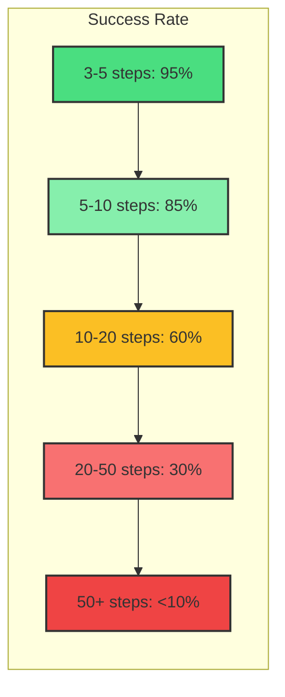
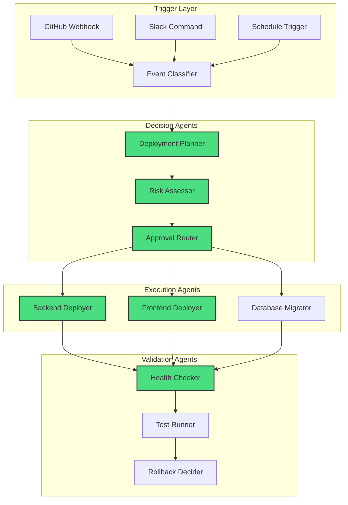

# Building Production Micro-Agents

## Introduction {#introduction}

Welcome to Module 5 of 12-Factor Agent Development. You've learned that agents are software, that JSON extraction is fundamental, and that human collaboration is essential. Now it's time to tackle one of the most important architectural decisions in agent development:

**Should you build one smart agent or many focused ones?**

<Callout type="story" title="The Monolith Trap">
We've all been there. You start with a simple agent: "Just handle customer inquiries." But then:
- "Can it also process refunds?"
- "And update the inventory?"
- "Oh, and send follow-up emails?"
- "Maybe generate reports too?"

Six months later, you have a 5,000-line prompt, a context window that's always full, and an agent that fails in ways you can't debug. Every change risks breaking something else. New team members are afraid to touch it.

**There's a better way.**
</Callout>

### The Micro-Agent Philosophy

Just as microservices revolutionized backend architecture, micro-agents are transforming how we build AI systems. The core insight is simple:

**Small, focused agents that do one thing well are more reliable, maintainable, and composable than monolithic agents trying to do everything.**

In this module, you'll learn:
- Why 3-10 step agents outperform 100-step workflows
- How to identify natural agent boundaries
- Patterns for composing micro-agents into larger systems
- Real-world case studies from production deployments
- How to find and exploit the bleeding edge of LLM capabilities

Let's build agents that are small, focused, and production-ready.

## Factor 5: Small, Focused Agents Beat Monoliths {#small-focused-agents}

The data is clear: agents with 3-10 steps have exponentially higher success rates than those with 20+ steps. But why?

<Diagram type="chart" title="Agent Success Rate vs Complexity">

</Diagram>

### Why Small Agents Win

1. **Manageable Context**: Each agent maintains a focused context window
2. **Clear Responsibility**: One agent, one job, done well
3. **Easier Debugging**: When something fails, you know exactly where
4. **Independent Optimization**: Each agent can be tuned without affecting others
5. **Predictable Behavior**: Fewer steps mean fewer compounding errors

### The Micro-Agent Architecture

Here's how to build production-grade micro-agents:

<CodeExample title="Micro-Agent Architecture" language="python">
```python
from abc import ABC, abstractmethod
from typing import Dict, Any, List, Optional, Callable
from dataclasses import dataclass
import json
import asyncio
from enum import Enum

class AgentStatus(Enum):
    READY = "ready"
    RUNNING = "running"
    COMPLETED = "completed"
    FAILED = "failed"
    WAITING = "waiting"

@dataclass
class AgentResult:
    """Result from a micro-agent execution"""
    status: AgentStatus
    output: Any
    metadata: Dict[str, Any]
    next_agent: Optional[str] = None
    error: Optional[str] = None

class MicroAgent(ABC):
    """Base class for all micro-agents"""
    
    def __init__(
        self,
        name: str,
        description: str,
        max_steps: int = 10,
        timeout_seconds: int = 300
    ):
        self.name = name
        self.description = description
        self.max_steps = max_steps
        self.timeout_seconds = timeout_seconds
        self.steps_executed = 0
        
    @abstractmethod
    async def execute(
        self,
        input_data: Dict[str, Any],
        context: Dict[str, Any]
    ) -> AgentResult:
        """Execute the agent's task"""
        pass
    
    @abstractmethod
    def validate_input(self, input_data: Dict[str, Any]) -> bool:
        """Validate input data before execution"""
        pass
    
    async def run(
        self,
        input_data: Dict[str, Any],
        context: Optional[Dict[str, Any]] = None
    ) -> AgentResult:
        """Run the agent with timeout and step limiting"""
        
        # Validate input
        if not self.validate_input(input_data):
            return AgentResult(
                status=AgentStatus.FAILED,
                output=None,
                metadata={"reason": "Invalid input"},
                error="Input validation failed"
            )
        
        # Execute with timeout
        try:
            result = await asyncio.wait_for(
                self.execute(input_data, context or {}),
                timeout=self.timeout_seconds
            )
            
            # Check step limit
            if self.steps_executed > self.max_steps:
                return AgentResult(
                    status=AgentStatus.FAILED,
                    output=result.output,
                    metadata={**result.metadata, "steps": self.steps_executed},
                    error=f"Exceeded max steps: {self.max_steps}"
                )
            
            return result
            
        except asyncio.TimeoutError:
            return AgentResult(
                status=AgentStatus.FAILED,
                output=None,
                metadata={"steps": self.steps_executed},
                error=f"Timeout after {self.timeout_seconds}s"
            )

# Example: Intent Classification Micro-Agent
class IntentClassifier(MicroAgent):
    """Classifies customer intent into specific categories"""
    
    def __init__(self, llm_client):
        super().__init__(
            name="intent_classifier",
            description="Classifies customer messages into intent categories",
            max_steps=3  # Simple classification shouldn't need many steps
        )
        self.llm = llm_client
        self.intents = [
            "order_status",
            "refund_request", 
            "product_question",
            "technical_support",
            "billing_inquiry",
            "general_feedback",
            "escalation_needed"
        ]
    
    def validate_input(self, input_data: Dict[str, Any]) -> bool:
        return "message" in input_data and isinstance(input_data["message"], str)
    
    async def execute(
        self,
        input_data: Dict[str, Any],
        context: Dict[str, Any]
    ) -> AgentResult:
        """Classify the intent with confidence scoring"""
        
        message = input_data["message"]
        customer_history = context.get("customer_history", [])
        
        # Build focused prompt for classification
        prompt = self._build_classification_prompt(message, customer_history)
        
        # Get classification from LLM
        response = await self.llm.extract_json(
            prompt=prompt,
            schema={
                "intent": {"type": "string", "enum": self.intents},
                "confidence": {"type": "number", "minimum": 0, "maximum": 1},
                "entities": {"type": "object"},
                "requires_human": {"type": "boolean"},
                "reasoning": {"type": "string"}
            }
        )
        
        self.steps_executed += 1
        
        # Determine next agent based on intent
        next_agent_map = {
            "order_status": "order_status_agent",
            "refund_request": "refund_processor",
            "product_question": "knowledge_retriever",
            "technical_support": "tech_support_agent",
            "billing_inquiry": "billing_agent",
            "general_feedback": "feedback_recorder",
            "escalation_needed": "human_escalation"
        }
        
        return AgentResult(
            status=AgentStatus.COMPLETED,
            output={
                "intent": response["intent"],
                "confidence": response["confidence"],
                "entities": response["entities"]
            },
            metadata={
                "reasoning": response["reasoning"],
                "requires_human": response["requires_human"]
            },
            next_agent=next_agent_map.get(response["intent"])
        )
    
    def _build_classification_prompt(
        self,
        message: str,
        history: List[Dict[str, Any]]
    ) -> str:
        """Build a focused prompt for intent classification"""
        
        return f"""Classify the customer's intent from their message.
        
Customer Message: {message}

Previous Interactions: {len(history)} messages in last 30 days

Available Intents:
- order_status: Asking about order delivery, tracking, or status
- refund_request: Wanting to return product or get refund  
- product_question: Questions about product features, availability
- technical_support: Technical issues, bugs, or errors
- billing_inquiry: Questions about charges, invoices, payments
- general_feedback: Suggestions, complaints, or compliments
- escalation_needed: Complex issues requiring human support

Analyze the message and provide:
1. The primary intent (must be from the list above)
2. Confidence score (0-1)
3. Key entities extracted (names, order numbers, products, etc.)
4. Whether human intervention is needed
5. Brief reasoning for your classification

Focus on the primary intent even if multiple intents are present."""

# Example: Micro-Agent Composer
class MicroAgentComposer:
    """Composes micro-agents into workflows"""
    
    def __init__(self):
        self.agents: Dict[str, MicroAgent] = {}
        self.workflows: Dict[str, List[str]] = {}
        self.execution_history: List[Dict[str, Any]] = []
    
    def register_agent(self, agent: MicroAgent) -> None:
        """Register a micro-agent"""
        self.agents[agent.name] = agent
    
    def define_workflow(
        self,
        name: str,
        agents: List[str],
        conditions: Optional[Dict[str, Callable]] = None
    ) -> None:
        """Define a workflow of micro-agents"""
        self.workflows[name] = {
            "agents": agents,
            "conditions": conditions or {}
        }
    
    async def execute_workflow(
        self,
        workflow_name: str,
        initial_input: Dict[str, Any],
        context: Optional[Dict[str, Any]] = None
    ) -> List[AgentResult]:
        """Execute a workflow of micro-agents"""
        
        if workflow_name not in self.workflows:
            raise ValueError(f"Unknown workflow: {workflow_name}")
        
        workflow = self.workflows[workflow_name]
        results = []
        current_input = initial_input
        current_context = context or {}
        
        for agent_name in workflow["agents"]:
            if agent_name not in self.agents:
                raise ValueError(f"Unknown agent: {agent_name}")
            
            # Check conditions
            condition = workflow["conditions"].get(agent_name)
            if condition and not condition(current_input, results):
                continue
            
            # Execute agent
            agent = self.agents[agent_name]
            result = await agent.run(current_input, current_context)
            results.append(result)
            
            # Track execution
            self.execution_history.append({
                "workflow": workflow_name,
                "agent": agent_name,
                "input": current_input,
                "result": result,
                "timestamp": asyncio.get_event_loop().time()
            })
            
            # Handle failure
            if result.status == AgentStatus.FAILED:
                break
            
            # Prepare input for next agent
            current_input = result.output
            current_context["previous_results"] = results
            
            # Dynamic routing
            if result.next_agent:
                # Switch to suggested agent if it exists
                if result.next_agent in self.agents:
                    remaining_agents = [result.next_agent]
                    workflow["agents"] = remaining_agents
        
        return results
    
    async def execute_single_agent(
        self,
        agent_name: str,
        input_data: Dict[str, Any],
        context: Optional[Dict[str, Any]] = None
    ) -> AgentResult:
        """Execute a single micro-agent"""
        
        if agent_name not in self.agents:
            raise ValueError(f"Unknown agent: {agent_name}")
        
        agent = self.agents[agent_name]
        return await agent.run(input_data, context)
```
</CodeExample>

### Composition Patterns

Micro-agents shine when composed together. Here are the key patterns:

<CodeExample title="Agent Composition Patterns" language="typescript">
```typescript
// Pattern 1: Sequential Pipeline
interface Pipeline {
  name: string;
  agents: MicroAgent[];
  transformers?: Map<string, (data: any) => any>;
}

class SequentialPipeline {
  async execute(pipeline: Pipeline, input: any): Promise<any> {
    let data = input;
    
    for (const agent of pipeline.agents) {
      const result = await agent.execute(data);
      
      if (result.status === 'failed') {
        throw new Error(`Pipeline failed at ${agent.name}: ${result.error}`);
      }
      
      // Transform data between agents if needed
      const transformer = pipeline.transformers?.get(agent.name);
      data = transformer ? transformer(result.output) : result.output;
    }
    
    return data;
  }
}

// Pattern 2: Conditional Routing
interface ConditionalRouter {
  condition: (input: any) => string;
  routes: Map<string, MicroAgent>;
  fallback: MicroAgent;
}

class RouterAgent {
  async route(router: ConditionalRouter, input: any): Promise<any> {
    const route = router.condition(input);
    const agent = router.routes.get(route) || router.fallback;
    
    return agent.execute(input);
  }
}

// Pattern 3: Parallel Execution with Aggregation
interface ParallelExecutor {
  agents: MicroAgent[];
  aggregator: (results: any[]) => any;
  failureStrategy: 'fail-fast' | 'best-effort';
}

class ParallelAgent {
  async execute(executor: ParallelExecutor, input: any): Promise<any> {
    const promises = executor.agents.map(agent => 
      agent.execute(input).catch(error => ({
        status: 'failed',
        error: error.message,
        agent: agent.name
      }))
    );
    
    if (executor.failureStrategy === 'fail-fast') {
      const results = await Promise.all(promises);
      const failed = results.find(r => r.status === 'failed');
      if (failed) throw new Error(`Agent ${failed.agent} failed: ${failed.error}`);
      return executor.aggregator(results);
    } else {
      const results = await Promise.allSettled(promises);
      const successful = results
        .filter(r => r.status === 'fulfilled')
        .map(r => (r as PromiseFulfilledResult<any>).value);
      return executor.aggregator(successful);
    }
  }
}

// Pattern 4: Retry with Backoff
interface RetryConfig {
  maxAttempts: number;
  backoffMs: number;
  backoffMultiplier: number;
  shouldRetry: (error: any) => boolean;
}

class RetryableAgent {
  constructor(
    private agent: MicroAgent,
    private config: RetryConfig
  ) {}
  
  async execute(input: any): Promise<any> {
    let lastError: any;
    let delay = this.config.backoffMs;
    
    for (let attempt = 1; attempt <= this.config.maxAttempts; attempt++) {
      try {
        return await this.agent.execute(input);
      } catch (error) {
        lastError = error;
        
        if (!this.config.shouldRetry(error) || attempt === this.config.maxAttempts) {
          throw error;
        }
        
        await new Promise(resolve => setTimeout(resolve, delay));
        delay *= this.config.backoffMultiplier;
      }
    }
    
    throw lastError;
  }
}

// Pattern 5: Circuit Breaker
class CircuitBreaker {
  private failures = 0;
  private lastFailureTime = 0;
  private state: 'closed' | 'open' | 'half-open' = 'closed';
  
  constructor(
    private agent: MicroAgent,
    private threshold: number = 5,
    private timeout: number = 60000
  ) {}
  
  async execute(input: any): Promise<any> {
    if (this.state === 'open') {
      if (Date.now() - this.lastFailureTime > this.timeout) {
        this.state = 'half-open';
      } else {
        throw new Error(`Circuit breaker open for ${this.agent.name}`);
      }
    }
    
    try {
      const result = await this.agent.execute(input);
      if (this.state === 'half-open') {
        this.state = 'closed';
        this.failures = 0;
      }
      return result;
    } catch (error) {
      this.failures++;
      this.lastFailureTime = Date.now();
      
      if (this.failures >= this.threshold) {
        this.state = 'open';
      }
      
      throw error;
    }
  }
}
```
</CodeExample>

### Identifying Agent Boundaries

How do you know where to split your monolithic agent? Look for these signals:

1. **Natural State Transitions**: Each major state change is a candidate for a new agent
2. **Different Expertise Required**: If the prompt changes significantly between steps
3. **Reusability Opportunities**: Can this subset of steps be used elsewhere?
4. **Different Failure Modes**: Steps that fail differently should be separate
5. **Performance Characteristics**: Fast steps shouldn't wait for slow ones

<Callout type="tip" title="The Restaurant Analogy">
Think of micro-agents like a restaurant kitchen. You don't have one chef doing everything. You have:
- A garde manger (cold prep)
- A saucier (sauces)
- A grill chef
- A pastry chef

Each specializes in their domain, and they coordinate to deliver the final dish. That's how micro-agents should work.
</Callout>

## Case Study: Production Deployment Bot {#deployment-bot-case-study}

Let's examine a real production system that demonstrates micro-agent architecture:

<Diagram type="flow" title="Deployment Bot Architecture">

</Diagram>

<CodeExample title="Deployment Micro-Agent Implementation" language="python">
```python
# Real-world deployment bot built with micro-agents

class DeploymentPlanner(MicroAgent):
    """Plans deployment strategy based on changes"""
    
    def __init__(self, llm_client, github_client):
        super().__init__(
            name="deployment_planner",
            description="Analyzes changes and creates deployment plan",
            max_steps=5
        )
        self.llm = llm_client
        self.github = github_client
    
    async def execute(
        self,
        input_data: Dict[str, Any],
        context: Dict[str, Any]
    ) -> AgentResult:
        """Create deployment plan from PR data"""
        
        pr_data = input_data["pull_request"]
        
        # Fetch PR diff and analyze changes
        diff = await self.github.get_pr_diff(pr_data["number"])
        files_changed = self._analyze_diff(diff)
        
        # Determine what needs deployment
        prompt = f"""Analyze these changes and create a deployment plan:
        
Changed files:
{json.dumps(files_changed, indent=2)}

PR Title: {pr_data['title']}
PR Description: {pr_data['body']}

Determine:
1. Which services need deployment (backend, frontend, workers)
2. Deployment order (consider dependencies)
3. Whether database migrations are needed
4. Risk level (low, medium, high)
5. Recommended deployment strategy (blue-green, canary, direct)
"""
        
        plan = await self.llm.extract_json(
            prompt=prompt,
            schema={
                "services": {
                    "type": "array",
                    "items": {
                        "type": "object",
                        "properties": {
                            "name": {"type": "string"},
                            "order": {"type": "integer"},
                            "changes": {"type": "array", "items": {"type": "string"}},
                            "requires_migration": {"type": "boolean"}
                        }
                    }
                },
                "risk_level": {"type": "string", "enum": ["low", "medium", "high"]},
                "strategy": {"type": "string", "enum": ["blue-green", "canary", "direct"]},
                "estimated_duration_minutes": {"type": "integer"}
            }
        )
        
        self.steps_executed += 1
        
        # Determine next agent based on risk
        next_agent = "risk_assessor" if plan["risk_level"] in ["medium", "high"] else "approval_router"
        
        return AgentResult(
            status=AgentStatus.COMPLETED,
            output={
                "deployment_plan": plan,
                "pr_data": pr_data,
                "files_changed": files_changed
            },
            metadata={
                "total_services": len(plan["services"]),
                "requires_migration": any(s["requires_migration"] for s in plan["services"])
            },
            next_agent=next_agent
        )

class RiskAssessor(MicroAgent):
    """Assesses deployment risks and suggests mitigations"""
    
    def __init__(self, llm_client, metrics_client):
        super().__init__(
            name="risk_assessor",
            description="Analyzes deployment risks",
            max_steps=3
        )
        self.llm = llm_client
        self.metrics = metrics_client
    
    async def execute(
        self,
        input_data: Dict[str, Any],
        context: Dict[str, Any]
    ) -> AgentResult:
        """Assess risks and suggest mitigations"""
        
        plan = input_data["deployment_plan"]
        
        # Gather current system metrics
        metrics = await self._gather_metrics()
        
        # Analyze risks
        risk_analysis = await self.llm.extract_json(
            prompt=self._build_risk_prompt(plan, metrics),
            schema={
                "risks": {
                    "type": "array",
                    "items": {
                        "type": "object",
                        "properties": {
                            "category": {"type": "string"},
                            "description": {"type": "string"},
                            "severity": {"type": "string", "enum": ["low", "medium", "high", "critical"]},
                            "mitigation": {"type": "string"}
                        }
                    }
                },
                "overall_risk_score": {"type": "number", "minimum": 0, "maximum": 10},
                "proceed_with_deployment": {"type": "boolean"},
                "required_approvals": {"type": "array", "items": {"type": "string"}}
            }
        )
        
        self.steps_executed += 1
        
        return AgentResult(
            status=AgentStatus.COMPLETED,
            output={
                **input_data,
                "risk_analysis": risk_analysis,
                "system_metrics": metrics
            },
            metadata={
                "high_risks": len([r for r in risk_analysis["risks"] if r["severity"] in ["high", "critical"]])
            },
            next_agent="approval_router"
        )
    
    async def _gather_metrics(self) -> Dict[str, Any]:
        """Gather system metrics for risk assessment"""
        return {
            "current_load": await self.metrics.get_system_load(),
            "error_rate": await self.metrics.get_error_rate(minutes=60),
            "active_users": await self.metrics.get_active_users(),
            "peak_hours": await self.metrics.is_peak_hours()
        }

class ServiceDeployer(MicroAgent):
    """Deploys a specific service"""
    
    def __init__(self, service_name: str, deploy_client):
        super().__init__(
            name=f"{service_name}_deployer",
            description=f"Deploys {service_name} service",
            max_steps=8  # Build, push, deploy, verify
        )
        self.service_name = service_name
        self.deploy = deploy_client
    
    async def execute(
        self,
        input_data: Dict[str, Any],
        context: Dict[str, Any]
    ) -> AgentResult:
        """Execute deployment for this service"""
        
        plan = input_data["deployment_plan"]
        service_config = next(
            s for s in plan["services"] 
            if s["name"] == self.service_name
        )
        
        steps = []
        
        try:
            # 1. Build
            steps.append("Starting build")
            build_id = await self.deploy.build(
                service=self.service_name,
                commit=input_data["pr_data"]["merge_commit_sha"]
            )
            self.steps_executed += 1
            
            # 2. Run tests
            steps.append("Running tests")
            test_result = await self.deploy.test(build_id)
            if not test_result["passed"]:
                raise Exception(f"Tests failed: {test_result['failures']}")
            self.steps_executed += 1
            
            # 3. Push to registry
            steps.append("Pushing to registry")
            image_tag = await self.deploy.push(build_id)
            self.steps_executed += 1
            
            # 4. Deploy based on strategy
            strategy = plan["strategy"]
            steps.append(f"Deploying with {strategy} strategy")
            
            if strategy == "blue-green":
                deployment_id = await self._deploy_blue_green(image_tag)
            elif strategy == "canary":
                deployment_id = await self._deploy_canary(image_tag, percentage=10)
            else:
                deployment_id = await self._deploy_direct(image_tag)
            
            self.steps_executed += 1
            
            # 5. Health check
            steps.append("Running health checks")
            health = await self._health_check(deployment_id, retries=3)
            if not health["healthy"]:
                raise Exception(f"Health check failed: {health['errors']}")
            
            self.steps_executed += 1
            
            return AgentResult(
                status=AgentStatus.COMPLETED,
                output={
                    "service": self.service_name,
                    "deployment_id": deployment_id,
                    "image_tag": image_tag,
                    "steps_completed": steps,
                    "health_status": health
                },
                metadata={
                    "duration_seconds": context.get("elapsed_time", 0)
                },
                next_agent="health_checker"
            )
            
        except Exception as e:
            return AgentResult(
                status=AgentStatus.FAILED,
                output={
                    "service": self.service_name,
                    "steps_completed": steps,
                    "failed_at": steps[-1] if steps else "initialization"
                },
                error=str(e),
                next_agent="rollback_decider"
            )
    
    async def _deploy_blue_green(self, image_tag: str) -> str:
        """Blue-green deployment strategy"""
        # Deploy to green environment
        green_id = await self.deploy.deploy_to_env(
            service=self.service_name,
            image=image_tag,
            environment="green"
        )
        
        # Warm up green
        await self.deploy.warmup(green_id)
        
        # Switch traffic
        await self.deploy.switch_traffic(
            service=self.service_name,
            to_environment="green"
        )
        
        return green_id
    
    async def _health_check(
        self,
        deployment_id: str,
        retries: int = 3
    ) -> Dict[str, Any]:
        """Check deployment health with retries"""
        for attempt in range(retries):
            health = await self.deploy.check_health(deployment_id)
            if health["healthy"]:
                return health
            
            if attempt < retries - 1:
                await asyncio.sleep(10 * (attempt + 1))  # Exponential backoff
        
        return health

# Composing the deployment bot
class DeploymentBot:
    """Main deployment bot that orchestrates micro-agents"""
    
    def __init__(self):
        self.composer = MicroAgentComposer()
        self._register_agents()
        self._define_workflows()
    
    def _register_agents(self):
        """Register all micro-agents"""
        
        # Decision agents
        self.composer.register_agent(
            DeploymentPlanner(llm_client, github_client)
        )
        self.composer.register_agent(
            RiskAssessor(llm_client, metrics_client)
        )
        self.composer.register_agent(
            ApprovalRouter(a2_interface)
        )
        
        # Execution agents
        for service in ["backend", "frontend", "worker"]:
            self.composer.register_agent(
                ServiceDeployer(service, deploy_client)
            )
        
        # Validation agents
        self.composer.register_agent(HealthChecker(monitor_client))
        self.composer.register_agent(TestRunner(test_client))
        self.composer.register_agent(RollbackDecider(llm_client))
    
    def _define_workflows(self):
        """Define deployment workflows"""
        
        # Standard deployment
        self.composer.define_workflow(
            "standard_deployment",
            agents=[
                "deployment_planner",
                "risk_assessor",
                "approval_router",
                "backend_deployer",
                "frontend_deployer",
                "health_checker",
                "test_runner"
            ],
            conditions={
                "risk_assessor": lambda input, results: 
                    input.get("deployment_plan", {}).get("risk_level") != "low",
                "frontend_deployer": lambda input, results:
                    any(s["name"] == "frontend" for s in input.get("deployment_plan", {}).get("services", []))
            }
        )
        
        # Emergency rollback
        self.composer.define_workflow(
            "emergency_rollback",
            agents=[
                "rollback_decider",
                "approval_router",
                "rollback_executor",
                "health_checker"
            ]
        )
    
    async def handle_pr_merged(self, pr_event: Dict[str, Any]) -> None:
        """Handle PR merge event"""
        
        results = await self.composer.execute_workflow(
            "standard_deployment",
            initial_input={"pull_request": pr_event},
            context={"triggered_by": "pr_merge"}
        )
        
        # Send summary
        await self._send_deployment_summary(results)
```
</CodeExample>

### Key Insights from the Deployment Bot

1. **Clear Boundaries**: Each agent has 3-8 steps and one clear responsibility
2. **Shared Context**: Agents pass structured data, not raw LLM outputs
3. **Graceful Failures**: Each agent can fail independently without crashing the system
4. **Dynamic Routing**: Agents can suggest the next agent based on their findings
5. **Human Integration**: Critical decisions route through the approval system

<Callout type="insight" title="The Power of Composition">
Notice how the deployment bot achieves complex behavior through simple agents? The magic isn't in any individual agent—it's in how they work together. This is the essence of micro-agent architecture.
</Callout>

## Factor 12: Find the Bleeding Edge {#finding-the-bleeding-edge}

The final factor is perhaps the most important for building truly exceptional agents:

**Find something that LLMs can almost do reliably, then engineer your system to make it work every time.**

<CodeExample title="Pushing LLM Boundaries" language="python">
```python
class BleedingEdgeEngineer:
    """Techniques for achieving reliable results at the edge of LLM capabilities"""
    
    def __init__(self, llm_client):
        self.llm = llm_client
        self.reliability_threshold = 0.95
    
    async def find_capability_boundary(
        self,
        task: str,
        test_cases: List[Dict[str, Any]],
        initial_prompt: str
    ) -> Dict[str, Any]:
        """Find the exact boundary of what an LLM can do reliably"""
        
        results = []
        
        # Test baseline performance
        baseline_score = await self._test_prompt(
            initial_prompt,
            test_cases
        )
        
        results.append({
            "approach": "baseline",
            "prompt": initial_prompt,
            "score": baseline_score
        })
        
        # Try different techniques to push the boundary
        techniques = [
            self._add_examples,
            self._decompose_task,
            self._add_reasoning_steps,
            self._constrain_output_space,
            self._add_validation_loop,
            self._ensemble_approaches
        ]
        
        for technique in techniques:
            enhanced_prompt = technique(initial_prompt, test_cases)
            score = await self._test_prompt(enhanced_prompt, test_cases)
            
            results.append({
                "approach": technique.__name__,
                "prompt": enhanced_prompt,
                "score": score,
                "improvement": score - baseline_score
            })
        
        # Find the best approach
        best = max(results, key=lambda r: r["score"])
        
        return {
            "task": task,
            "baseline_reliability": baseline_score,
            "best_reliability": best["score"],
            "best_approach": best["approach"],
            "at_bleeding_edge": best["score"] < self.reliability_threshold,
            "techniques_tested": len(techniques),
            "results": results
        }
    
    def _add_examples(
        self,
        prompt: str,
        test_cases: List[Dict[str, Any]]
    ) -> str:
        """Add few-shot examples to push reliability"""
        
        # Select diverse examples
        examples = self._select_diverse_examples(test_cases[:5])
        
        example_text = "Here are some examples:\n\n"
        for ex in examples:
            example_text += f"Input: {ex['input']}\n"
            example_text += f"Output: {ex['expected_output']}\n\n"
        
        return example_text + prompt
    
    def _decompose_task(
        self,
        prompt: str,
        test_cases: List[Dict[str, Any]]
    ) -> str:
        """Break complex task into smaller steps"""
        
        return f"""{prompt}

Break this down into steps:
1. First, identify the key components
2. Then, analyze each component
3. Finally, combine your analysis into the final answer

Show your work for each step."""
    
    def _add_reasoning_steps(
        self,
        prompt: str,
        test_cases: List[Dict[str, Any]]
    ) -> str:
        """Add chain-of-thought reasoning"""
        
        return f"""{prompt}

Before providing your final answer:
1. State what you understand about the task
2. Identify any edge cases or special considerations  
3. Explain your reasoning step by step
4. Double-check your logic
5. Then provide your final answer"""
    
    def _constrain_output_space(
        self,
        prompt: str,
        test_cases: List[Dict[str, Any]]
    ) -> str:
        """Reduce the output space to improve reliability"""
        
        # Analyze test cases to find constraints
        constraints = self._analyze_output_patterns(test_cases)
        
        constraint_text = "\nOutput constraints:\n"
        for constraint in constraints:
            constraint_text += f"- {constraint}\n"
        
        return prompt + constraint_text
    
    async def _ensemble_approaches(
        self,
        prompt: str,
        test_cases: List[Dict[str, Any]]
    ) -> str:
        """Use multiple prompts and aggregate results"""
        
        # This is meta - we're returning a prompt that tells the LLM
        # to act as if it's using ensemble methods
        return f"""{prompt}

Approach this problem from three different angles:
1. As a systematic analyzer
2. As a creative problem solver  
3. As a critical reviewer

Provide each perspective, then synthesize them into your final answer."""

# Real-world example: Pushing the boundary on code understanding
class CodeUnderstandingAgent(MicroAgent):
    """Agent that pushes LLM boundaries for code comprehension"""
    
    def __init__(self, llm_client):
        super().__init__(
            name="code_understanding",
            description="Deep code analysis at the edge of LLM capabilities",
            max_steps=5
        )
        self.llm = llm_client
        self.engineer = BleedingEdgeEngineer(llm_client)
    
    async def execute(
        self,
        input_data: Dict[str, Any],
        context: Dict[str, Any]
    ) -> AgentResult:
        """Analyze code with techniques that push LLM boundaries"""
        
        code = input_data["code"]
        analysis_type = input_data["analysis_type"]
        
        # This is at the bleeding edge - LLMs can sometimes do this
        # but not reliably without engineering
        if analysis_type == "security_vulnerabilities":
            result = await self._analyze_security_bleeding_edge(code)
        elif analysis_type == "performance_bottlenecks":
            result = await self._analyze_performance_bleeding_edge(code)
        elif analysis_type == "architectural_patterns":
            result = await self._analyze_architecture_bleeding_edge(code)
        else:
            result = await self._standard_analysis(code)
        
        return AgentResult(
            status=AgentStatus.COMPLETED,
            output=result,
            metadata={
                "confidence": result.get("confidence", 0),
                "techniques_used": result.get("techniques_used", [])
            }
        )
    
    async def _analyze_security_bleeding_edge(
        self,
        code: str
    ) -> Dict[str, Any]:
        """Push boundaries on security analysis"""
        
        # Technique 1: Break into smaller chunks
        chunks = self._smart_chunk_code(code)
        chunk_analyses = []
        
        for chunk in chunks:
            # Technique 2: Multiple passes with different focus
            passes = [
                ("injection", self._injection_focused_prompt),
                ("auth", self._auth_focused_prompt),
                ("crypto", self._crypto_focused_prompt)
            ]
            
            chunk_results = {}
            for pass_name, prompt_builder in passes:
                prompt = prompt_builder(chunk)
                
                # Technique 3: Ensemble with temperature variation
                results = []
                for temp in [0.0, 0.3, 0.7]:
                    result = await self.llm.analyze(
                        prompt=prompt,
                        temperature=temp
                    )
                    results.append(result)
                
                # Technique 4: Consensus mechanism
                chunk_results[pass_name] = self._find_consensus(results)
            
            chunk_analyses.append(chunk_results)
        
        # Technique 5: Cross-reference and validate
        validated_issues = self._cross_validate_findings(chunk_analyses)
        
        return {
            "vulnerabilities": validated_issues,
            "confidence": self._calculate_confidence(validated_issues),
            "techniques_used": [
                "smart_chunking",
                "focused_passes", 
                "temperature_ensemble",
                "consensus_mechanism",
                "cross_validation"
            ]
        }
    
    def _smart_chunk_code(self, code: str) -> List[Dict[str, Any]]:
        """Intelligently chunk code preserving context"""
        # Implementation details...
        pass
    
    def _find_consensus(self, results: List[Any]) -> Any:
        """Find consensus among multiple results"""
        # Implementation details...
        pass
```
</CodeExample>

### Finding Your Bleeding Edge

Every domain has tasks that LLMs can almost do well. The key is identifying these opportunities:

1. **Look for 70-90% Success Rates**: These are prime candidates for engineering
2. **Pattern Recognition Tasks**: LLMs excel here with the right structure
3. **Translation Between Formats**: Code to docs, specs to tests, etc.
4. **Consistency Checking**: Finding discrepancies across documents
5. **Creative Variations**: Generating options within constraints

<Callout type="success" title="The NotebookLM Principle">
The team behind NotebookLM said it best: "Find something that is right at the boundary of what the model can do reliably. If you can figure out how to get it right reliably anyway, you will have created something magical."

This is your competitive advantage—not using better models, but engineering better systems around the models we have.
</Callout>

## Production Observability for Micro-Agents {#observability-monitoring}

You can't improve what you can't measure. Here's how to build comprehensive observability:

<CodeExample title="Agent Telemetry System" language="python">
```python
from dataclasses import dataclass
from typing import Dict, Any, List, Optional
import time
import json
from datetime import datetime
from opentelemetry import trace, metrics
from opentelemetry.trace import Status, StatusCode

@dataclass
class AgentSpan:
    """Represents a span of agent execution"""
    agent_name: str
    operation: str
    start_time: float
    end_time: Optional[float] = None
    status: Optional[str] = None
    error: Optional[str] = None
    metadata: Dict[str, Any] = None
    
    @property
    def duration_ms(self) -> Optional[float]:
        if self.end_time:
            return (self.end_time - self.start_time) * 1000
        return None

class AgentTelemetry:
    """Comprehensive telemetry for micro-agent systems"""
    
    def __init__(self, service_name: str):
        self.service_name = service_name
        self.tracer = trace.get_tracer(service_name)
        self.meter = metrics.get_meter(service_name)
        
        # Define metrics
        self.agent_duration = self.meter.create_histogram(
            name="agent.duration",
            description="Agent execution duration",
            unit="ms"
        )
        
        self.agent_errors = self.meter.create_counter(
            name="agent.errors",
            description="Agent execution errors"
        )
        
        self.token_usage = self.meter.create_counter(
            name="agent.tokens",
            description="LLM token usage"
        )
        
        self.agent_status = self.meter.create_counter(
            name="agent.status",
            description="Agent completion status"
        )
        
        # In-memory storage for analysis
        self.spans: List[AgentSpan] = []
        self.agent_metrics: Dict[str, Dict[str, Any]] = {}
    
    def start_agent_span(
        self,
        agent_name: str,
        operation: str,
        metadata: Optional[Dict[str, Any]] = None
    ) -> AgentSpan:
        """Start tracking an agent operation"""
        
        span = AgentSpan(
            agent_name=agent_name,
            operation=operation,
            start_time=time.time(),
            metadata=metadata or {}
        )
        
        self.spans.append(span)
        return span
    
    def end_agent_span(
        self,
        span: AgentSpan,
        status: str,
        error: Optional[str] = None,
        token_count: Optional[int] = None
    ):
        """Complete an agent span"""
        
        span.end_time = time.time()
        span.status = status
        span.error = error
        
        # Record metrics
        labels = {
            "agent": span.agent_name,
            "operation": span.operation,
            "status": status
        }
        
        # Duration
        if span.duration_ms:
            self.agent_duration.record(span.duration_ms, labels)
        
        # Status
        self.agent_status.add(1, labels)
        
        # Errors
        if error:
            self.agent_errors.add(1, labels)
        
        # Token usage
        if token_count:
            self.token_usage.add(token_count, {**labels, "model": "gpt-4"})
        
        # Update agent-specific metrics
        self._update_agent_metrics(span)
    
    def _update_agent_metrics(self, span: AgentSpan):
        """Update running metrics for specific agent"""
        
        agent_name = span.agent_name
        if agent_name not in self.agent_metrics:
            self.agent_metrics[agent_name] = {
                "total_executions": 0,
                "successful_executions": 0,
                "failed_executions": 0,
                "total_duration_ms": 0,
                "avg_duration_ms": 0,
                "error_rate": 0,
                "last_execution": None
            }
        
        metrics = self.agent_metrics[agent_name]
        metrics["total_executions"] += 1
        
        if span.status == "success":
            metrics["successful_executions"] += 1
        else:
            metrics["failed_executions"] += 1
        
        if span.duration_ms:
            metrics["total_duration_ms"] += span.duration_ms
            metrics["avg_duration_ms"] = (
                metrics["total_duration_ms"] / metrics["total_executions"]
            )
        
        metrics["error_rate"] = (
            metrics["failed_executions"] / metrics["total_executions"]
        )
        
        metrics["last_execution"] = {
            "timestamp": datetime.fromtimestamp(span.end_time).isoformat(),
            "status": span.status,
            "duration_ms": span.duration_ms
        }
    
    def get_agent_health(self, agent_name: str) -> Dict[str, Any]:
        """Get health metrics for specific agent"""
        
        if agent_name not in self.agent_metrics:
            return {"status": "no_data"}
        
        metrics = self.agent_metrics[agent_name]
        
        # Calculate health score
        health_score = 100
        
        # Deduct for high error rate
        if metrics["error_rate"] > 0.1:
            health_score -= 30
        elif metrics["error_rate"] > 0.05:
            health_score -= 15
        
        # Deduct for slow performance
        avg_duration = metrics["avg_duration_ms"]
        if avg_duration > 5000:
            health_score -= 20
        elif avg_duration > 2000:
            health_score -= 10
        
        # Deduct for inactivity
        if metrics["last_execution"]:
            last_exec = datetime.fromisoformat(metrics["last_execution"]["timestamp"])
            hours_since = (datetime.now() - last_exec).total_seconds() / 3600
            if hours_since > 24:
                health_score -= 10
        
        return {
            "health_score": max(0, health_score),
            "status": self._health_status(health_score),
            "metrics": metrics,
            "recommendations": self._get_recommendations(agent_name, metrics)
        }
    
    def _health_status(self, score: int) -> str:
        if score >= 90:
            return "healthy"
        elif score >= 70:
            return "degraded"
        elif score >= 50:
            return "unhealthy"
        else:
            return "critical"
    
    def _get_recommendations(
        self,
        agent_name: str,
        metrics: Dict[str, Any]
    ) -> List[str]:
        """Generate recommendations based on metrics"""
        
        recommendations = []
        
        if metrics["error_rate"] > 0.1:
            recommendations.append(
                f"High error rate ({metrics['error_rate']:.1%}). "
                "Review recent failures and improve error handling."
            )
        
        if metrics["avg_duration_ms"] > 5000:
            recommendations.append(
                f"Slow average response time ({metrics['avg_duration_ms']:.0f}ms). "
                "Consider optimizing prompts or breaking into smaller agents."
            )
        
        if metrics["total_executions"] < 10:
            recommendations.append(
                "Low execution count. Monitor for adequate test coverage."
            )
        
        return recommendations
    
    def get_system_dashboard(self) -> Dict[str, Any]:
        """Get overall system health dashboard"""
        
        total_agents = len(self.agent_metrics)
        healthy_agents = sum(
            1 for agent in self.agent_metrics
            if self.get_agent_health(agent)["status"] == "healthy"
        )
        
        total_executions = sum(
            m["total_executions"] for m in self.agent_metrics.values()
        )
        
        total_errors = sum(
            m["failed_executions"] for m in self.agent_metrics.values()
        )
        
        return {
            "timestamp": datetime.now().isoformat(),
            "summary": {
                "total_agents": total_agents,
                "healthy_agents": healthy_agents,
                "health_percentage": (healthy_agents / total_agents * 100) if total_agents > 0 else 0,
                "total_executions": total_executions,
                "total_errors": total_errors,
                "overall_error_rate": (total_errors / total_executions) if total_executions > 0 else 0
            },
            "agents": {
                agent: self.get_agent_health(agent)
                for agent in self.agent_metrics
            },
            "recent_failures": self._get_recent_failures(),
            "performance_trends": self._calculate_trends()
        }
    
    def _get_recent_failures(self, limit: int = 5) -> List[Dict[str, Any]]:
        """Get recent failure details"""
        
        failures = [
            {
                "agent": span.agent_name,
                "operation": span.operation,
                "error": span.error,
                "timestamp": datetime.fromtimestamp(span.end_time).isoformat(),
                "duration_ms": span.duration_ms
            }
            for span in self.spans
            if span.status == "failed" and span.end_time
        ]
        
        # Sort by timestamp descending
        failures.sort(key=lambda f: f["timestamp"], reverse=True)
        
        return failures[:limit]

# Integration with micro-agents
class ObservableMicroAgent(MicroAgent):
    """Base class for micro-agents with built-in observability"""
    
    def __init__(self, *args, telemetry: AgentTelemetry, **kwargs):
        super().__init__(*args, **kwargs)
        self.telemetry = telemetry
    
    async def run(
        self,
        input_data: Dict[str, Any],
        context: Optional[Dict[str, Any]] = None
    ) -> AgentResult:
        """Run with telemetry tracking"""
        
        # Start span
        span = self.telemetry.start_agent_span(
            agent_name=self.name,
            operation="execute",
            metadata={
                "input_size": len(json.dumps(input_data)),
                "has_context": context is not None
            }
        )
        
        try:
            # Execute agent
            result = await super().run(input_data, context)
            
            # Record success
            self.telemetry.end_agent_span(
                span=span,
                status="success" if result.status == AgentStatus.COMPLETED else "failed",
                error=result.error,
                token_count=result.metadata.get("token_count")
            )
            
            return result
            
        except Exception as e:
            # Record failure
            self.telemetry.end_agent_span(
                span=span,
                status="error",
                error=str(e)
            )
            raise

# Usage example
telemetry = AgentTelemetry("customer-support-system")

# Create observable agents
intent_classifier = ObservableIntentClassifier(
    llm_client=llm,
    telemetry=telemetry
)

response_generator = ObservableResponseGenerator(
    llm_client=llm,
    telemetry=telemetry
)

# After running for a while, check health
dashboard = telemetry.get_system_dashboard()
print(json.dumps(dashboard, indent=2))
```
</CodeExample>

### Monitoring Best Practices

1. **Track Every Agent Execution**: You need data to improve
2. **Monitor Token Usage**: LLM costs can spiral quickly
3. **Set SLAs**: Define acceptable performance for each agent
4. **Alert on Degradation**: Don't wait for complete failure
5. **Regular Health Checks**: Automated monitoring catches issues early

<Callout type="warning" title="The Observability Tax">
Yes, comprehensive monitoring adds overhead. But the cost of debugging production issues without proper telemetry is far higher. Invest in observability from day one.
</Callout>

## Summary

Building production micro-agents isn't about using the latest framework or the most powerful model. It's about:

1. **Keeping agents small and focused** (3-10 steps)
2. **Composing them thoughtfully** into larger systems
3. **Finding and exploiting the bleeding edge** of LLM capabilities
4. **Monitoring everything** to maintain reliability

The deployment bot case study shows this in action: simple agents working together to achieve complex, production-grade functionality.

Key takeaways:
- **Small is beautiful**: Micro-agents are easier to build, test, and maintain
- **Composition over complexity**: Many simple agents beat one complex agent
- **Push boundaries carefully**: Find what LLMs almost do well, then engineer reliability
- **Observe everything**: You can't improve what you don't measure
- **Production is different**: Plan for failures, delays, and edge cases

In the next module, we'll explore advanced patterns for agent orchestration and learn how to build agent systems that scale.

<Callout type="next" title="What's Next?">
You've completed the core modules on rethinking agents, human collaboration, and micro-agent architecture. The next modules in the 12-Factor Agent Development path will cover:

- **Module 6**: Advanced Orchestration Patterns
- **Module 7**: Agent Security and Safety
- **Module 8**: Scaling Agent Systems
- **Module 9**: Testing and Validation Strategies
- **Module 10**: Performance Optimization
- **Module 11**: Agent Economics and Cost Management
- **Module 12**: Future-Proofing Your Agent Architecture

Keep building, keep experimenting, and remember: agents are just software.
</Callout>

## Quiz {#quiz}

<Quiz>
  <Question 
    question="According to production data, what is the optimal number of steps for a micro-agent to maintain high reliability?" 
    options={[
      "20-50 steps for comprehensive coverage",
      "3-10 steps for focused execution",
      "50+ steps for handling complex scenarios",
      "The number of steps doesn't impact reliability"
    ]}
    correctAnswer={1}
    explanation="Data shows that agents with 3-10 steps have exponentially higher success rates (85-95%) compared to those with 20+ steps (30-60%). This is because smaller agents maintain manageable context, have clearer responsibilities, are easier to debug, can be optimized independently, and exhibit more predictable behavior with fewer compounding errors."
  />
  
  <Question 
    question="What is the 'bleeding edge' principle in Factor 12?" 
    options={[
      "Always use the latest, most powerful LLM models available",
      "Push agents to handle as many tasks as possible",
      "Find tasks LLMs can almost do reliably, then engineer systems to make them work every time",
      "Avoid any task where LLMs show less than 99% accuracy"
    ]}
    correctAnswer={2}
    explanation="The bleeding edge principle is about finding tasks that LLMs can perform at 70-90% reliability and then using engineering techniques (like smart chunking, ensemble methods, consensus mechanisms, and validation loops) to push that reliability to production levels. This creates competitive advantage by achieving reliable results at the boundary of LLM capabilities."
  />
  
  <Question 
    question="Which composition pattern is most effective when you need multiple micro-agents to work on the same input simultaneously?" 
    options={[
      "Sequential Pipeline with transformers between each agent",
      "Conditional Router with fallback agents",
      "Parallel Execution with an aggregator function",
      "Circuit Breaker pattern with retry logic"
    ]}
    correctAnswer={2}
    explanation="Parallel Execution with an aggregator function is ideal when multiple agents need to process the same input simultaneously. This pattern allows agents to work independently and then combines their results using an aggregation function. It's particularly useful for tasks like multi-perspective analysis, ensemble decision-making, or when you need results from multiple specialized agents quickly."
  />
</Quiz>

## Exercise: Build Your Own Micro-Agent Composer {#exercise}

Create a micro-agent composition system that can orchestrate multiple small agents to solve a complex task:

<CodeExample title="Micro-Agent Composer Exercise" language="python">
```python
from typing import Dict, Any, List, Optional, Callable, Union
from dataclasses import dataclass
from enum import Enum
import asyncio
import json
from abc import ABC, abstractmethod

class AgentStatus(Enum):
    READY = "ready"
    RUNNING = "running"
    COMPLETED = "completed"
    FAILED = "failed"

@dataclass
class AgentResult:
    status: AgentStatus
    output: Any
    error: Optional[str] = None
    metadata: Dict[str, Any] = None

class MicroAgent(ABC):
    """Base class for micro-agents"""
    
    def __init__(self, name: str, max_steps: int = 10):
        self.name = name
        self.max_steps = max_steps
        self.steps_executed = 0
    
    @abstractmethod
    async def execute(self, input_data: Dict[str, Any]) -> AgentResult:
        """Execute the agent's task"""
        pass

class MicroAgentComposer:
    """
    Your task: Build a composer that can orchestrate micro-agents
    using different composition patterns.
    """
    
    def __init__(self):
        self.agents: Dict[str, MicroAgent] = {}
        self.execution_log: List[Dict[str, Any]] = []
        # TODO: Add any additional initialization
    
    def register_agent(self, agent: MicroAgent) -> None:
        """
        Register a micro-agent with the composer.
        
        Requirements:
        - Store agent by name
        - Validate agent doesn't already exist
        - Log registration
        """
        # TODO: Implement agent registration
        pass
    
    async def sequential_pipeline(
        self,
        agents: List[str],
        initial_input: Dict[str, Any],
        transformers: Optional[Dict[str, Callable]] = None
    ) -> List[AgentResult]:
        """
        Execute agents in sequence, passing output to next agent.
        
        Requirements:
        - Execute agents in order
        - Pass output of agent N as input to agent N+1
        - Apply optional transformers between agents
        - Stop on first failure
        - Return all results
        """
        # TODO: Implement sequential pipeline
        pass
    
    async def parallel_execution(
        self,
        agents: List[str],
        input_data: Dict[str, Any],
        aggregator: Callable[[List[AgentResult]], Any],
        fail_fast: bool = True
    ) -> Any:
        """
        Execute agents in parallel and aggregate results.
        
        Requirements:
        - Run all agents simultaneously
        - Handle fail_fast vs best_effort modes
        - Apply aggregator function to results
        - Track execution timing
        """
        # TODO: Implement parallel execution
        pass
    
    async def conditional_routing(
        self,
        input_data: Dict[str, Any],
        router: Callable[[Dict[str, Any]], str],
        routes: Dict[str, List[str]],
        default_route: List[str]
    ) -> List[AgentResult]:
        """
        Route to different agent pipelines based on conditions.
        
        Requirements:
        - Use router function to determine route
        - Execute appropriate pipeline
        - Fall back to default if no match
        - Support nested pipelines
        """
        # TODO: Implement conditional routing
        pass
    
    async def retry_with_fallback(
        self,
        primary_agents: List[str],
        fallback_agents: List[str],
        input_data: Dict[str, Any],
        max_retries: int = 3
    ) -> AgentResult:
        """
        Try primary agents with retry, fall back if all fail.
        
        Requirements:
        - Retry primary pipeline on failure
        - Fall back to secondary pipeline after max retries
        - Track retry attempts
        - Return first successful result
        """
        # TODO: Implement retry with fallback
        pass
    
    def get_execution_summary(self) -> Dict[str, Any]:
        """
        Get summary of all executions.
        
        Requirements:
        - Total executions by agent
        - Success/failure rates
        - Average execution times
        - Recent failures
        """
        # TODO: Implement execution summary
        pass

# Example micro-agents for testing
class TextClassifierAgent(MicroAgent):
    """Classifies text into categories"""
    
    async def execute(self, input_data: Dict[str, Any]) -> AgentResult:
        # Simulate classification
        text = input_data.get("text", "")
        
        # Simple rule-based classification for testing
        if "urgent" in text.lower() or "critical" in text.lower():
            category = "high_priority"
        elif "question" in text.lower() or "?" in text:
            category = "inquiry"
        else:
            category = "general"
        
        return AgentResult(
            status=AgentStatus.COMPLETED,
            output={"category": category, "confidence": 0.85},
            metadata={"method": "rule_based"}
        )

class SentimentAnalyzerAgent(MicroAgent):
    """Analyzes sentiment of text"""
    
    async def execute(self, input_data: Dict[str, Any]) -> AgentResult:
        text = input_data.get("text", "")
        
        # Simple sentiment analysis
        positive_words = ["great", "excellent", "good", "happy", "love"]
        negative_words = ["bad", "terrible", "hate", "angry", "worst"]
        
        positive_count = sum(1 for word in positive_words if word in text.lower())
        negative_count = sum(1 for word in negative_words if word in text.lower())
        
        if positive_count > negative_count:
            sentiment = "positive"
        elif negative_count > positive_count:
            sentiment = "negative"
        else:
            sentiment = "neutral"
        
        return AgentResult(
            status=AgentStatus.COMPLETED,
            output={"sentiment": sentiment, "score": 0.7},
            metadata={"positive_signals": positive_count, "negative_signals": negative_count}
        )

class EntityExtractorAgent(MicroAgent):
    """Extracts entities from text"""
    
    async def execute(self, input_data: Dict[str, Any]) -> AgentResult:
        text = input_data.get("text", "")
        
        # Simple entity extraction
        entities = []
        
        # Extract email-like patterns
        import re
        emails = re.findall(r'\b[A-Za-z0-9._%+-]+@[A-Za-z0-9.-]+\.[A-Z|a-z]{2,}\b', text)
        for email in emails:
            entities.append({"type": "email", "value": email})
        
        # Extract phone-like patterns
        phones = re.findall(r'\b\d{3}[-.]?\d{3}[-.]?\d{4}\b', text)
        for phone in phones:
            entities.append({"type": "phone", "value": phone})
        
        return AgentResult(
            status=AgentStatus.COMPLETED,
            output={"entities": entities},
            metadata={"patterns_checked": ["email", "phone"]}
        )

# Test your implementation
async def test_composer():
    composer = MicroAgentComposer()
    
    # Register agents
    composer.register_agent(TextClassifierAgent("classifier"))
    composer.register_agent(SentimentAnalyzerAgent("sentiment"))
    composer.register_agent(EntityExtractorAgent("entities"))
    
    # Test 1: Sequential pipeline
    print("Test 1: Sequential Pipeline")
    results = await composer.sequential_pipeline(
        agents=["classifier", "sentiment"],
        initial_input={"text": "This is an urgent question about my order!"},
        transformers={
            "classifier": lambda result: {"text": "This is an urgent question about my order!", 
                                         "category": result["output"]["category"]}
        }
    )
    print(f"Sequential results: {len(results)} agents executed")
    
    # Test 2: Parallel execution
    print("\nTest 2: Parallel Execution")
    
    def aggregate_insights(results: List[AgentResult]) -> Dict[str, Any]:
        insights = {}
        for result in results:
            if result.status == AgentStatus.COMPLETED:
                insights.update(result.output)
        return insights
    
    aggregated = await composer.parallel_execution(
        agents=["classifier", "sentiment", "entities"],
        input_data={"text": "Great service! Please contact me at john@example.com"},
        aggregator=aggregate_insights,
        fail_fast=False
    )
    print(f"Aggregated insights: {aggregated}")
    
    # Test 3: Conditional routing
    print("\nTest 3: Conditional Routing")
    
    def route_by_length(input_data: Dict[str, Any]) -> str:
        text_length = len(input_data.get("text", ""))
        if text_length < 50:
            return "short"
        elif text_length < 200:
            return "medium"
        else:
            return "long"
    
    routing_results = await composer.conditional_routing(
        input_data={"text": "Quick test"},
        router=route_by_length,
        routes={
            "short": ["classifier"],
            "medium": ["classifier", "sentiment"],
            "long": ["classifier", "sentiment", "entities"]
        },
        default_route=["classifier"]
    )
    print(f"Routing executed {len(routing_results)} agents")
    
    # Test 4: Get execution summary
    print("\nExecution Summary:")
    summary = composer.get_execution_summary()
    print(json.dumps(summary, indent=2))

# Bonus challenges:
# 1. Implement a workflow DSL for defining complex agent compositions
# 2. Add support for conditional branching within pipelines
# 3. Implement backpressure handling for resource-intensive agents
# 4. Create visualization of agent execution flow
# 5. Add support for streaming results from long-running agents

if __name__ == "__main__":
    asyncio.run(test_composer())
```
</CodeExample>

This exercise challenges you to build the core infrastructure for micro-agent composition. A good implementation will:
- Support multiple composition patterns (sequential, parallel, conditional)
- Handle failures gracefully with appropriate strategies
- Track execution metrics for observability
- Enable complex workflows through simple, composable primitives

Remember: The power of micro-agents comes from composition, not complexity.