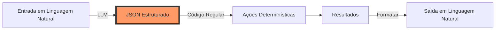

# Repensando Agentes como Software

## Introdução {#introduction}

Bem-vindo ao primeiro módulo do Desenvolvimento de Agentes 12 Fatores. Antes de mergulharmos em arquiteturas complexas e padrões de orquestração, precisamos estabelecer uma verdade fundamental que transformará como você pensa sobre desenvolvimento de agentes.

<Callout type="story" title="Uma Jornada Comum">
Você provavelmente já passou por isso: Você começa a construir um agente, pega um framework popular e, em poucas horas, está com 70-80% de funcionalidade. A demonstração é impressionante. A equipe está animada. Recursos são alocados.

Então a realidade bate. Aqueles últimos 20% se tornam um pesadelo. Você está depurando através de camadas de abstração, tentando entender por que seu agente continua chamando a API errada ou ficando preso em loops. Eventualmente, você reescreve do zero ou percebe que agentes não eram a solução certa.

**E se o problema não fossem os agentes em si, mas como pensamos sobre eles?**
</Callout>

### A Revelação

Após analisar mais de 100 implementações de agentes em produção, um padrão claro emergiu: **Os agentes mais bem-sucedidos não são os mais "agênticos"**. Eles são principalmente software determinístico com interações LLM cuidadosamente controladas em pontos específicos de decisão.

As equipes que estão tendo sucesso não estão usando os frameworks mais sofisticados. Elas estão aplicando princípios de engenharia de software a um novo domínio. E a base do seu sucesso? Entender que a coisa mais mágica que os LLMs podem fazer não tem nada a ver com raciocínio complexo ou comportamento autônomo.

É muito mais simples que isso.

## Fator 1: Extração JSON é Seu Superpoder {#json-extraction}

Vamos começar com a capacidade mais fundamental que torna os agentes possíveis:

<CodeExample title="A Mágica da Extração JSON" language="python">
```python
# O que parece mágica...
user_input = "Agende uma reunião com a Sara na próxima terça às 15h sobre o planejamento do Q4"

# ...é realmente apenas esta transformação:
extracted_json = {
    "intent": "schedule_meeting",
    "participants": ["Sara"],
    "date": "proxima_terca",
    "time": "15:00",
    "topic": "planejamento do Q4"
}

# É isso. Esse é o superpoder.
```
</CodeExample>

### Por Que Isso Importa

Toda demonstração impressionante de agente, todo fluxo de trabalho complexo, todo comportamento "autônomo"—tudo se baseia nesta fundação. LLMs se destacam em pegar linguagem humana não estruturada e convertê-la em dados estruturados com os quais o código pode trabalhar.

<Diagram type="flow" title="A Realidade dos Agentes">

</Diagram>

### Construindo Seu Primeiro Extrator

Vamos construir um extrator JSON prático que você pode usar como fundação:

<CodeExample title="Extrator JSON Pronto para Produção" language="python">
```python
import json
from typing import Dict, Any, Optional
from pydantic import BaseModel, ValidationError

class MeetingIntent(BaseModel):
    """Schema para intenções relacionadas a reuniões"""
    intent: str
    participants: list[str]
    date: Optional[str] = None
    time: Optional[str] = None
    topic: Optional[str] = None
    duration_minutes: Optional[int] = 60

class JSONExtractor:
    def __init__(self, llm_client):
        self.llm = llm_client
        
    def extract(self, user_input: str, schema: type[BaseModel]) -> Dict[str, Any]:
        """Extrai dados estruturados de linguagem natural"""
        
        # Constrói um prompt que guia o LLM a produzir JSON válido
        prompt = self._build_extraction_prompt(user_input, schema)
        
        # Obtém resposta do LLM
        response = self.llm.complete(prompt)
        
        # Analisa e valida
        try:
            data = json.loads(response)
            validated = schema(**data)
            return validated.dict()
        except (json.JSONDecodeError, ValidationError) as e:
            # Trata erros graciosamente
            return self._handle_extraction_error(e, response, user_input)
    
    def _build_extraction_prompt(self, user_input: str, schema: type[BaseModel]) -> str:
        """Cria um prompt que produz JSON confiável correspondente ao nosso schema"""
        
        schema_example = schema.schema()
        
        return f"""Extraia informações estruturadas da mensagem do usuário.

Mensagem do Usuário: {user_input}

Responda com um objeto JSON que corresponda a este schema:
{json.dumps(schema_example, indent=2)}

Importante:
- Produza APENAS JSON válido, nenhum texto adicional
- Inclua todos os campos que podem ser inferidos da mensagem
- Use null para campos que não podem ser determinados
- Garanta que a saída possa ser analisada por json.loads()

Saída JSON:"""

# Uso
extractor = JSONExtractor(llm_client)
user_message = "Configure uma chamada de 30 minutos com a equipe de engenharia amanhã às 14h"

result = extractor.extract(user_message, MeetingIntent)
print(result)
# {
#     "intent": "schedule_meeting",
#     "participants": ["equipe de engenharia"],
#     "date": "amanhã",
#     "time": "14:00",
#     "topic": null,
#     "duration_minutes": 30
# }
```
</CodeExample>

### O Poder do Desenvolvimento Orientado por Schema

Observe como estamos usando modelos Pydantic para definir nossa estrutura de saída esperada? Isso nos dá:

1. **Segurança de tipos**: Sabemos exatamente com quais dados estamos trabalhando
2. **Validação**: Saídas inválidas são capturadas imediatamente
3. **Documentação**: O schema serve como documentação
4. **Flexibilidade**: Fácil de estender ou modificar conforme os requisitos mudam

<Callout type="tip" title="Dica Pro: Comece Simples">
Não tente extrair tudo de uma vez. Comece com o mínimo absoluto de campos que você precisa, faça isso funcionar de forma confiável, depois adicione complexidade gradualmente. É muito mais fácil depurar um schema com 3 campos do que um com 30.
</Callout>

## Fator 4: 'Uso de Ferramentas' é Apenas JSON e Código {#tools-are-code}

Agora vamos abordar uma das abstrações mais enganosas no desenvolvimento de agentes: "uso de ferramentas."

### A Abstração Prejudicial

Quando frameworks falam sobre agentes "usando ferramentas", isso cria um modelo mental de alguma entidade de IA etérea alcançando o mundo. Esta abstração:

- Torna a depuração mais difícil (o que está realmente acontecendo?)
- Esconde a simples realidade do que está acontecendo
- Leva a engenharia excessiva e complexidade desnecessária

### A Realidade

Aqui está o que "uso de ferramentas" realmente é:

<CodeExample title="Desmistificando o Uso de Ferramentas" language="python">
```python
# O que frameworks chamam de "uso de ferramentas"...
@tool
def send_email(to: str, subject: str, body: str):
    """Envia um email para um destinatário"""
    # ... implementação ...

# ...é realmente apenas isso:
def handle_agent_action(llm_output: dict):
    """Roteia saída JSON para funções apropriadas"""
    
    action = llm_output.get("action")
    params = llm_output.get("parameters", {})
    
    # Apenas uma instrução switch!
    match action:
        case "send_email":
            return send_email(**params)
        case "schedule_meeting":
            return schedule_meeting(**params)
        case "query_database":
            return query_database(**params)
        case "respond_to_user":
            return {"type": "message", "content": llm_output["message"]}
        case _:
            return {"type": "error", "message": f"Ação desconhecida: {action}"}

# O LLM produz JSON como:
{
    "action": "send_email",
    "parameters": {
        "to": "sara@empresa.com",
        "subject": "Reunião de Planejamento Q4",
        "body": "Oi Sara, confirmando nossa reunião para próxima terça às 15h..."
    },
    "reasoning": "Usuário quer agendar uma reunião, devo enviar um email de confirmação"
}

# Seu código roteia para a função certa. É isso!
```
</CodeExample>

### Construindo um Roteador de Produção

Vamos construir um roteador de ações mais robusto que você realmente usaria em produção:

<CodeExample title="Roteador de Ações de Produção" language="python">
```python
from typing import Dict, Any, Callable, Optional
from dataclasses import dataclass
import logging

@dataclass
class ActionResult:
    """Resultado da execução de uma ação"""
    success: bool
    data: Optional[Any] = None
    error: Optional[str] = None
    metadata: Dict[str, Any] = None

class ActionRouter:
    """Roteia ações geradas por LLM para manipuladores apropriados"""
    
    def __init__(self):
        self.handlers: Dict[str, Callable] = {}
        self.logger = logging.getLogger(__name__)
        
    def register(self, action_name: str, handler: Callable) -> None:
        """Registra um manipulador para uma ação"""
        self.handlers[action_name] = handler
        
    async def route(self, llm_output: Dict[str, Any]) -> ActionResult:
        """Roteia uma saída LLM para o manipulador apropriado"""
        
        # Extrai ação e parâmetros
        action = llm_output.get("action")
        if not action:
            return ActionResult(
                success=False,
                error="Nenhuma ação especificada na saída do LLM"
            )
        
        # Encontra manipulador
        handler = self.handlers.get(action)
        if not handler:
            return ActionResult(
                success=False,
                error=f"Nenhum manipulador registrado para ação: {action}",
                metadata={"available_actions": list(self.handlers.keys())}
            )
        
        # Executa com tratamento de erros
        try:
            params = llm_output.get("parameters", {})
            
            # Log para depuração
            self.logger.info(f"Executando ação: {action} com params: {params}")
            
            # Executa manipulador
            result = await handler(**params) if asyncio.iscoroutinefunction(handler) else handler(**params)
            
            return ActionResult(
                success=True,
                data=result,
                metadata={
                    "action": action,
                    "reasoning": llm_output.get("reasoning")
                }
            )
            
        except Exception as e:
            self.logger.error(f"Erro executando {action}: {str(e)}")
            return ActionResult(
                success=False,
                error=str(e),
                metadata={"action": action, "error_type": type(e).__name__}
            )

# Uso
router = ActionRouter()

# Registre suas "ferramentas" (também conhecidas como funções)
router.register("send_email", email_service.send)
router.register("schedule_meeting", calendar_service.schedule)
router.register("query_database", db.query)

# Roteie saída do LLM
llm_output = {
    "action": "send_email",
    "parameters": {
        "to": "equipe@empresa.com",
        "subject": "Atualizações",
        "body": "Aqui estão as atualizações desta semana..."
    },
    "reasoning": "Usuário pediu para atualizar a equipe"
}

result = await router.route(llm_output)
if result.success:
    print(f"Ação concluída: {result.data}")
else:
    print(f"Ação falhou: {result.error}")
```
</CodeExample>

### Os Benefícios de Pensar Desta Forma

Quando você para de pensar em "uso de ferramentas" e começa a pensar em "roteamento JSON":

1. **A depuração se torna trivial**: Você pode registrar o JSON exato e ver qual função é chamada
2. **O teste é direto**: Apenas teste seu roteador com diferentes entradas JSON
3. **Sem mágica**: Tudo é explícito e sob seu controle
4. **Fácil de estender**: Adicionar uma nova "ferramenta" é apenas registrar uma nova função

<Quiz id="tools-are-code-quiz">
  <Question
    question="Se um agente 'usa uma ferramenta' para enviar um email, qual é o fluxo de execução real?"
    options={[
      "O LLM chama diretamente a API de email",
      "O framework magicamente lida com tudo",
      "O LLM produz JSON, que seu código roteia para uma função de email",
      "O agente ganha capacidades de envio de email"
    ]}
    correctAnswer={2}
    explanation="O LLM produz JSON estruturado indicando que quer enviar um email. Seu código de roteamento recebe este JSON e chama a função de email apropriada com os parâmetros fornecidos. Não há mágica—apenas JSON e chamadas de função."
  />
  <Question
    question="Por que pensar em 'uso de ferramentas' como uma abstração prejudicial?"
    options={[
      "Faz os agentes parecerem mais complexos do que são",
      "Esconde o simples roteamento JSON-para-função que está realmente acontecendo",
      "Impede depuração e testes adequados",
      "Todas as anteriores"
    ]}
    correctAnswer={3}
    explanation="A abstração de 'uso de ferramentas' é prejudicial porque: 1) Torna a depuração mais difícil ao esconder o que está realmente acontecendo, 2) Cria um modelo mental falso de entidades de IA com poderes especiais, 3) Leva a engenharia excessiva, e 4) Impede que desenvolvedores vejam o simples padrão de roteamento JSON que está realmente em funcionamento."
  />
</Quiz>

## Juntando Tudo: Seu Primeiro Componente de Agente Real

Vamos combinar extração JSON e roteamento de ações em um componente de agente simples mas completo:

<CodeExample title="Componente de Agente Completo" language="python">
```python
class SimpleAgent:
    """Um agente simples que extrai intenção e roteia para ações"""
    
    def __init__(self, llm_client):
        self.llm = llm_client
        self.router = ActionRouter()
        self.extractor = JSONExtractor(llm_client)
        
        # Registra ações disponíveis
        self._register_actions()
        
    def _register_actions(self):
        """Registra todas as ações disponíveis"""
        self.router.register("send_email", self._send_email)
        self.router.register("schedule_meeting", self._schedule_meeting)
        self.router.register("search_knowledge_base", self._search_kb)
        self.router.register("respond", self._respond)
        
    async def process(self, user_input: str) -> Dict[str, Any]:
        """Processa entrada do usuário e executa ação apropriada"""
        
        # Passo 1: Extrai intenção estruturada da linguagem natural
        extracted = self.extractor.extract(user_input, AgentAction)
        
        # Passo 2: Roteia para manipulador apropriado
        result = await self.router.route(extracted)
        
        # Passo 3: Formata resposta
        if result.success:
            return {
                "status": "success",
                "action_taken": result.metadata["action"],
                "result": result.data
            }
        else:
            return {
                "status": "error",
                "error": result.error,
                "fallback": self._generate_fallback_response(user_input)
            }
    
    def _generate_fallback_response(self, user_input: str) -> str:
        """Gera resposta útil quando roteamento de ação falha"""
        prompt = f"""O usuário disse: "{user_input}"
        
Não conseguimos processar isso como uma ação específica. Gere uma resposta útil que:
1. Reconheça a solicitação deles
2. Explique quais ações estão disponíveis
3. Peça esclarecimento se necessário

Resposta:"""
        
        return self.llm.complete(prompt)

# Usando seu agente
agent = SimpleAgent(llm_client)

response = await agent.process("Você pode enviar um email para João sobre a reunião de amanhã?")
print(response)
# {
#     "status": "success",
#     "action_taken": "send_email",
#     "result": {"email_id": "12345", "sent": True}
# }
```
</CodeExample>

## Principais Aprendizados

Ao encerrarmos este primeiro módulo, lembre-se destes pontos cruciais:

<Card className="mb-4">
  <h3 className="text-xl font-semibold mb-2">🎯 A Fundação</h3>
  <p>A capacidade mais poderosa dos LLMs em sistemas de agentes não é raciocínio complexo—é converter de forma confiável linguagem natural em JSON estruturado com o qual seu código pode trabalhar.</p>
</Card>

<Card className="mb-4">
  <h3 className="text-xl font-semibold mb-2">🔧 Ferramentas São Apenas Funções</h3>
  <p>"Uso de ferramentas" é uma abstração prejudicial. É realmente apenas JSON sendo roteado para funções. Quando você entende isso, a depuração se torna trivial e as extensões se tornam óbvias.</p>
</Card>

<Card className="mb-4">
  <h3 className="text-xl font-semibold mb-2">🏗️ Agentes São Software</h3>
  <p>Pare de pensar em agentes como entidades mágicas de IA. Eles são componentes de software que usam LLMs para transformações específicas. Essa mudança mental torna tudo mais claro.</p>
</Card>

## O Que Vem a Seguir?

No próximo módulo, exploraremos os Fatores 6 e 7: como gerenciar adequadamente o fluxo de controle e o estado em sistemas de agentes. Você aprenderá por que a abordagem ingênua de "anexar tudo ao contexto" falha e como construir agentes que podem ser pausados, retomados e depurados como qualquer outro software.

Mas primeiro, complete o exercício abaixo para solidificar sua compreensão de extração JSON e roteamento de ações.

---

<Callout type="assignment" title="Exercício do Módulo: Construa um Classificador de Intenção do Cliente">
Sua tarefa é construir um sistema simples mas robusto que:
1. Extrai intenção do cliente de mensagens de suporte
2. Roteia para manipuladores apropriados (responder, escalar, pesquisar_kb)
3. Trata erros graciosamente
4. Fornece respostas de fallback úteis
</Callout>

## Exercício: Classificador de Intenção do Cliente

Construa um agente de suporte ao cliente pronto para produção que demonstre os princípios deste módulo.

### Requisitos

Seu sistema deve:
1. Extrair intenção e entidades de mensagens de clientes
2. Rotear para manipuladores de ação apropriados
3. Tratar casos extremos e erros graciosamente
4. Fornecer respostas de fallback úteis

### Código Inicial

<CodeExample title="Classificador de Intenção do Cliente - Código Inicial" language="python">
```python
from typing import Dict, Any, Optional, List
from enum import Enum
from pydantic import BaseModel, Field
import json

# Define o schema de intenção
class CustomerIntent(BaseModel):
    """Schema para intenções de suporte ao cliente"""
    intent: str = Field(..., description="A intenção principal: pergunta, reclamação, solicitação ou feedback")
    urgency: str = Field(default="normal", description="Nível de urgência: baixo, normal, alto, crítico")
    category: Optional[str] = Field(None, description="Categoria: cobrança, técnico, conta, geral")
    entities: Dict[str, Any] = Field(default_factory=dict, description="Entidades extraídas como order_id, product_name")
    sentiment: str = Field(default="neutral", description="Sentimento do cliente: positivo, neutro, negativo")
    
class ActionType(Enum):
    RESPOND = "respond"
    ESCALATE = "escalate"
    SEARCH_KB = "search_kb"
    TRANSFER = "transfer"

# TODO: Implementar o JSONExtractor para CustomerIntent
class CustomerIntentExtractor:
    def __init__(self, llm_client):
        self.llm = llm_client
        
    def extract(self, message: str) -> CustomerIntent:
        """Extrai intenção do cliente da mensagem"""
        # TODO: Construir prompt que extrai CustomerIntent
        # TODO: Chamar LLM e analisar resposta
        # TODO: Validar com modelo Pydantic
        pass

# TODO: Implementar o ActionRouter
class CustomerSupportRouter:
    def __init__(self):
        self.handlers = {}
        self._register_handlers()
        
    def _register_handlers(self):
        """Registra todos os manipuladores disponíveis"""
        # TODO: Registrar manipuladores para cada ActionType
        pass
        
    def route(self, intent: CustomerIntent) -> Dict[str, Any]:
        """Roteia intenção para manipulador apropriado"""
        # TODO: Determinar ação baseada na intenção
        # TODO: Executar manipulador apropriado
        # TODO: Retornar resultado com tratamento adequado de erros
        pass
    
    # Métodos manipuladores para implementar
    def _handle_respond(self, intent: CustomerIntent) -> Dict[str, Any]:
        """Gera resposta direta ao cliente"""
        # TODO: Implementar geração de resposta
        pass
        
    def _handle_escalate(self, intent: CustomerIntent) -> Dict[str, Any]:
        """Escala para agente humano"""
        # TODO: Implementar lógica de escalação
        pass
        
    def _handle_search_kb(self, intent: CustomerIntent) -> Dict[str, Any]:
        """Pesquisa base de conhecimento por informações relevantes"""
        # TODO: Implementar pesquisa KB
        pass

# TODO: Implementar o CustomerSupportAgent principal
class CustomerSupportAgent:
    def __init__(self, llm_client):
        self.extractor = CustomerIntentExtractor(llm_client)
        self.router = CustomerSupportRouter()
        
    def process_message(self, message: str) -> Dict[str, Any]:
        """Processa mensagem de cliente de ponta a ponta"""
        # TODO: Extrair intenção
        # TODO: Rotear para manipulador
        # TODO: Formatar resposta
        # TODO: Tratar erros com fallback
        pass

# Casos de teste para tratar
test_messages = [
    "Fui cobrado duas vezes pelo meu pedido #12345!",
    "Como faço para redefinir minha senha?",
    "Seu serviço é incrível, obrigado!",
    "URGENTE: Site está fora do ar, perdendo clientes!!!",
    "Você pode me ajudar a rastrear o pedido 98765?",
    "Quero falar com um gerente imediatamente",
    "Quais são os horários comerciais?",
    "Relatório de bug: Botão de login não funciona no celular"
]
```
</CodeExample>

### Dicas de Implementação

1. **Para Extração de Intenção**:
   - Use exemplos claros em seu prompt
   - Considere usar exemplos few-shot
   - Valide níveis de urgência cuidadosamente

2. **Para Lógica de Roteamento**:
   - Alta urgência + reclamação = escalar
   - Perguntas = pesquisar KB primeiro, depois responder
   - Problemas críticos = escalação imediata

3. **Para Tratamento de Erros**:
   - Sempre tenha uma resposta de fallback
   - Registre erros para depuração
   - Nunca exponha erros internos aos clientes

### Exemplo de Saída Esperada

```python
# Entrada
message = "Fui cobrado duas vezes pelo meu pedido #12345!"

# Intenção extraída esperada
{
    "intent": "reclamação",
    "urgency": "alto",
    "category": "cobrança",
    "entities": {"order_id": "12345", "issue": "cobrança_duplicada"},
    "sentiment": "negativo"
}

# Decisão de roteamento esperada
{
    "action": "escalate",
    "reason": "Reclamação de cobrança de alta urgência",
    "data": {
        "priority": 1,
        "department": "cobrança",
        "initial_response": "Entendo sua preocupação sobre a cobrança duplicada..."
    }
}
```

### Desafios Bônus

1. **Adicionar contexto de conversa**: Manter contexto entre múltiplas mensagens
2. **Implementar pontuação de confiança**: Adicionar níveis de confiança à extração de intenção
3. **Suporte multi-idioma**: Lidar com mensagens em diferentes idiomas
4. **Limitação de taxa**: Prevenir abuso com limitação de taxa por cliente

### Discussão da Solução

<details>
<summary>Clique para ver a abordagem da solução</summary>

Os principais insights para este exercício:

1. **Extração de intenção é mais que apenas classificação** - você precisa extrair múltiplas dimensões (intenção, urgência, entidades)

2. **A lógica de roteamento deve ser explícita e testável** - evite esconder regras de negócio em prompts

3. **O tratamento de erros é crítico** - clientes devem sempre receber uma resposta útil, mesmo quando as coisas dão errado

4. **As camadas de abstração importam**:
   - Camada de extração (interação com LLM)
   - Camada de roteamento (lógica de negócio)  
   - Camada de manipulador (ações)
   - Camada de agente (orquestração)

Esta separação torna o sistema mantível, testável e extensível.

</details>