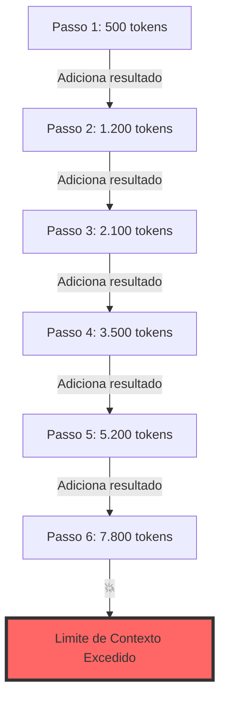
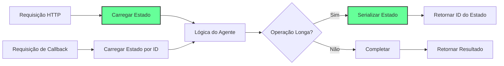
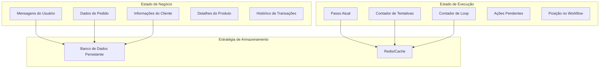

# Fluxo de Controle e Gerenciamento de Estado

## O Problema do Fluxo de Controle {#introduction}

No Módulo 1, descobrimos que agentes são fundamentalmente sobre extração JSON. Mas saber como extrair dados estruturados é apenas o começo. O verdadeiro desafio? Gerenciar o que acontece depois.

<Callout type="warning" title="A Armadilha da Janela de Contexto">
Imagine isto: Seu agente começa a processar uma solicitação de cliente. Chama uma API, adiciona o resultado ao contexto. Chama outra API, adiciona isso também. Verifica estoque, adiciona. Gera uma resposta, adiciona. 

Cinco passos depois, sua janela de contexto está explodindo. Dez passos depois, o LLM está confuso. Vinte passos? Você atingiu o limite de tokens e tudo trava.

**É por isso que 70% dos projetos de agentes falham em chegar à produção.**
</Callout>

A solução não são janelas de contexto maiores ou modelos mais inteligentes. É controlar seu fluxo e gerenciar estado como o engenheiro de software que você é.

### O Que Você Construirá

Ao final deste módulo, você entenderá:
- Por que agentes são apenas quatro componentes simples trabalhando juntos
- Como construir agentes que podem pausar no meio da execução e retomar horas depois
- A diferença crítica entre estado de negócio e estado de execução
- Padrões de fluxo de controle que evitam os desastres acima

Vamos começar entendendo o que um agente realmente é.

## Fator 6: Controle Seu Fluxo {#own-your-control-flow}

### A Abordagem Ingênua (E Por Que Ela Falha)

Aqui está como a maioria das pessoas constrói seu primeiro agente:

<CodeExample title="O Loop de Agente Ingênuo" language="python">
```python
def naive_agent_loop(user_input: str, llm_client):
    """O agente mais simples possível - e por que não escala"""
    context = [{"role": "user", "content": user_input}]
    
    while True:
        # Pergunta ao LLM o que fazer em seguida
        response = llm_client.complete(context)
        action = extract_json(response)
        
        if action["type"] == "done":
            return action["result"]
        
        # Executa a ação
        result = execute_tool(action["tool"], action["args"])
        
        # Adiciona tudo ao contexto (AQUI ESTÁ O PROBLEMA!)
        context.append({"role": "assistant", "content": response})
        context.append({"role": "user", "content": f"Resultado: {result}"})
```
</CodeExample>

Isso funciona ótimo para demonstrações. Falha catastroficamente em produção. Por quê?

<Diagram type="flow" title="Explosão da Janela de Contexto">

</Diagram>

### Os Quatro Componentes de Todo Agente

Após analisar centenas de agentes em produção, aqui está a verdade: **Todo agente é apenas estes quatro componentes**:

<CodeExample title="A Equação do Agente" language="python">
```python
class Agent:
    """O que um agente REALMENTE é"""
    
    def __init__(self):
        # 1. PROMPT: Instruções para selecionar próximo passo
        self.prompt = "Dado o histórico, o que devemos fazer em seguida?"
        
        # 2. SWITCH: Roteia JSON para código real
        self.switch = {
            "pesquisar_estoque": self.pesquisar_estoque,
            "processar_pedido": self.processar_pedido,
            "contatar_humano": self.contatar_humano,
        }
        
        # 3. CONTEXTO: Memória gerenciada (não apenas anexando!)
        self.context_manager = ContextManager()
        
        # 4. LOOP: Controla quando/como continuar
        self.loop_controller = LoopController()
```
</CodeExample>

É isso. Sem mágica. Apenas software.

### Assumindo o Controle do Seu Loop

Aqui está como agentes de produção realmente gerenciam fluxo de controle:

<CodeExample title="Fluxo de Controle de Produção" language="python">
```python
class ProductionAgent:
    def __init__(self, llm_client, max_steps=20):
        self.llm = llm_client
        self.max_steps = max_steps
        
    def run(self, task: str) -> dict:
        """Agente pronto para produção com fluxo de controle gerenciado"""
        state = {
            "task": task,
            "steps": [],
            "context_summary": "",
            "step_count": 0,
            "status": "running"
        }
        
        while state["status"] == "running":
            # Verifica condições do loop PRIMEIRO
            if state["step_count"] >= self.max_steps:
                state["status"] = "max_steps_exceeded"
                break
                
            # Constrói contexto inteligentemente
            context = self._build_smart_context(state)
            
            # Obtém próxima ação
            response = self.llm.complete(context)
            action = extract_json(response)
            
            # Executa com tratamento adequado de erros
            try:
                result = self._execute_action(action)
                state["steps"].append({
                    "action": action,
                    "result": result,
                    "timestamp": time.time()
                })
            except Exception as e:
                state["status"] = "error"
                state["error"] = str(e)
                break
            
            # Atualiza estado
            state["step_count"] += 1
            
            # Gerencia janela de contexto proativamente
            if self._should_summarize(state):
                state["context_summary"] = self._summarize_progress(state)
                state["steps"] = state["steps"][-3:]  # Mantém apenas passos recentes
            
            # Verifica conclusão
            if action.get("type") == "complete":
                state["status"] = "completed"
                state["result"] = action.get("result")
        
        return state
    
    def _build_smart_context(self, state: dict) -> list:
        """Constrói contexto que não explodirá"""
        messages = []
        
        # Prompt do sistema com tarefa
        messages.append({
            "role": "system",
            "content": f"Tarefa: {state['task']}\n\nVocê está no passo {state['step_count'] + 1} de no máximo {self.max_steps}."
        })
        
        # Inclui resumo se tivermos um
        if state["context_summary"]:
            messages.append({
                "role": "user",
                "content": f"Resumo do progresso: {state['context_summary']}"
            })
        
        # Inclui apenas passos recentes
        for step in state["steps"][-3:]:
            messages.append({
                "role": "user",
                "content": f"Passo {step['action']['type']}: {step['result']}"
            })
        
        return messages
```
</CodeExample>

### Padrões Chave de Fluxo de Controle

<Callout type="success" title="Padrões de Produção que Funcionam">
1. **Limitação de Passos**: Sempre imponha passos máximos para evitar loops infinitos
2. **Sumarização de Contexto**: Comprima histórico antes de atingir limites  
3. **Condições de Saída Antecipada**: Verifique erros, timeouts e sinais de parada
4. **Memória Seletiva**: Mantenha apenas passos recentes e relevantes no contexto
5. **Pontos de Interrupção**: Adicione checkpoints onde o agente pode pausar para entrada humana
</Callout>

## Fator 7: Design de Agente Sem Estado {#stateless-design}

### Por Que Sem Estado?

A engenharia de software tradicional nos ensinou que serviços sem estado são mais confiáveis, escaláveis e mantíveis. O mesmo se aplica aos agentes.

<Diagram type="architecture" title="Arquitetura de Agente Sem Estado">

</Diagram>

### Construindo Agentes Pausáveis

Aqui está como implementar um agente que pode pausar e retomar:

<CodeExample title="Implementação de Agente Pausável" language="python">
```python
import json
import uuid
from typing import Optional, Dict, Any
from dataclasses import dataclass, asdict

@dataclass
class AgentState:
    """Estado serializável do agente"""
    id: str
    task: str
    steps: list
    context_summary: str
    step_count: int
    status: str
    metadata: dict
    
    def to_json(self) -> str:
        return json.dumps(asdict(self))
    
    @classmethod
    def from_json(cls, data: str) -> 'AgentState':
        return cls(**json.loads(data))

class PausableAgent:
    def __init__(self, llm_client, state_store):
        self.llm = llm_client
        self.state_store = state_store
        
    async def start_task(self, task: str, metadata: dict = None) -> str:
        """Inicia uma nova tarefa e retorna ID do estado"""
        state = AgentState(
            id=str(uuid.uuid4()),
            task=task,
            steps=[],
            context_summary="",
            step_count=0,
            status="running",
            metadata=metadata or {}
        )
        
        # Salva estado inicial
        await self.state_store.save(state.id, state.to_json())
        
        # Tenta fazer progresso
        state = await self._execute_steps(state, max_steps=5)
        
        # Salva estado atualizado
        await self.state_store.save(state.id, state.to_json())
        
        return state.id
    
    async def resume_task(self, state_id: str, additional_info: str = None) -> dict:
        """Retoma uma tarefa pausada"""
        # Carrega estado
        state_json = await self.state_store.load(state_id)
        state = AgentState.from_json(state_json)
        
        # Adiciona qualquer informação nova
        if additional_info:
            state.steps.append({
                "type": "human_input",
                "content": additional_info,
                "timestamp": time.time()
            })
        
        # Continua execução
        state = await self._execute_steps(state, max_steps=5)
        
        # Salva estado atualizado
        await self.state_store.save(state.id, state.to_json())
        
        return {
            "state_id": state.id,
            "status": state.status,
            "result": state.metadata.get("result")
        }
    
    async def _execute_steps(self, state: AgentState, max_steps: int) -> AgentState:
        """Executa até max_steps, lidando com interrupções"""
        steps_executed = 0
        
        while state.status == "running" and steps_executed < max_steps:
            # Constrói contexto do estado
            context = self._build_context_from_state(state)
            
            # Obtém próxima ação
            response = await self.llm.complete(context)
            action = extract_json(response)
            
            # Verifica se ação requer aprovação humana
            if action.get("requires_approval"):
                state.status = "awaiting_approval"
                state.metadata["pending_action"] = action
                break
            
            # Executa ação
            result = await self._execute_action(action)
            
            # Atualiza estado
            state.steps.append({
                "action": action,
                "result": result,
                "timestamp": time.time()
            })
            state.step_count += 1
            steps_executed += 1
            
            # Verifica conclusão
            if action.get("type") == "complete":
                state.status = "completed"
                state.metadata["result"] = result
                break
        
        return state
```
</CodeExample>

### Estratégias de Serialização de Estado

Nem todo estado é criado igual. Aqui está como serializar eficientemente:

<CodeExample title="Padrões de Serialização de Estado" language="python">
```python
class EfficientStateManager:
    """Padrões para serialização eficiente de estado"""
    
    def __init__(self, compression_threshold=1024):
        self.compression_threshold = compression_threshold
    
    def serialize_state(self, state: AgentState) -> bytes:
        """Serializa com compressão para estados grandes"""
        # Converte para JSON
        json_str = state.to_json()
        
        # Comprime se grande
        if len(json_str) > self.compression_threshold:
            import gzip
            return gzip.compress(json_str.encode())
        
        return json_str.encode()
    
    def deserialize_state(self, data: bytes) -> AgentState:
        """Desserializa com descompressão automática"""
        # Verifica se está comprimido
        if data[:2] == b'\x1f\x8b':  # número mágico do gzip
            import gzip
            json_str = gzip.decompress(data).decode()
        else:
            json_str = data.decode()
        
        return AgentState.from_json(json_str)
    
    def create_checkpoint(self, state: AgentState) -> dict:
        """Cria checkpoint mínimo para retomada rápida"""
        return {
            "id": state.id,
            "task": state.task,
            "step_count": state.step_count,
            "status": state.status,
            "last_action": state.steps[-1] if state.steps else None,
            "context_summary": state.context_summary
        }
    
    def archive_completed_state(self, state: AgentState) -> dict:
        """Arquiva estados completos com apenas dados essenciais"""
        return {
            "id": state.id,
            "task": state.task,
            "completed_at": time.time(),
            "total_steps": state.step_count,
            "result": state.metadata.get("result"),
            # Não armazena histórico completo de passos para tarefas concluídas
            "summary": self._generate_execution_summary(state)
        }
```
</CodeExample>

## Fator 11: Separe Estado de Negócio do Estado de Execução {#state-separation}

### Entendendo a Distinção

O maior erro no gerenciamento de estado de agentes? Misturar estado de negócio com estado de execução. Eles têm ciclos de vida diferentes, necessidades de persistência diferentes e padrões de acesso diferentes.

<Diagram type="comparison" title="Estado de Negócio vs Estado de Execução">

</Diagram>

### Implementando Separação Limpa de Estado

<CodeExample title="Arquitetura de Estado" language="python">
```python
from enum import Enum
from typing import Optional, Dict, Any
import json

class StateType(Enum):
    BUSINESS = "business"
    EXECUTION = "execution"

class SeparatedStateAgent:
    """Agente com separação limpa de preocupações de estado"""
    
    def __init__(self, llm_client, business_store, execution_store):
        self.llm = llm_client
        self.business_store = business_store
        self.execution_store = execution_store
    
    async def process_request(self, request_id: str, user_input: str) -> dict:
        """Processa uma solicitação com separação adequada de estado"""
        
        # Inicializa estado de negócio
        business_state = {
            "request_id": request_id,
            "user_input": user_input,
            "messages": [],
            "data": {},
            "created_at": time.time()
        }
        await self.business_store.save(request_id, business_state)
        
        # Inicializa estado de execução
        execution_state = {
            "request_id": request_id,
            "current_step": 0,
            "retry_count": 0,
            "workflow": "customer_service",
            "status": "processing",
            "context_tokens": 0,
            "started_at": time.time()
        }
        exec_id = f"exec_{request_id}"
        await self.execution_store.save(exec_id, execution_state, ttl=3600)  # TTL de 1 hora
        
        # Processa com separação de estado
        return await self._run_workflow(business_state, execution_state)
    
    async def _run_workflow(self, business_state: dict, execution_state: dict) -> dict:
        """Executa workflow mantendo separação de estado"""
        
        while execution_state["status"] == "processing":
            # Constrói contexto de AMBOS os estados apropriadamente
            context = self._build_context(business_state, execution_state)
            
            # Obtém próxima ação
            response = await self.llm.complete(context)
            action = extract_json(response)
            
            # Atualiza estado de execução
            execution_state["current_step"] += 1
            execution_state["context_tokens"] = count_tokens(context)
            
            # Executa ação
            try:
                result = await self._execute_action(action)
                
                # Atualiza estado de negócio com resultados
                if action["type"] == "collect_data":
                    business_state["data"][action["field"]] = result
                elif action["type"] == "send_message":
                    business_state["messages"].append({
                        "type": "agent",
                        "content": result,
                        "timestamp": time.time()
                    })
                
                # Reseta contador de tentativas em sucesso
                execution_state["retry_count"] = 0
                
            except Exception as e:
                execution_state["retry_count"] += 1
                if execution_state["retry_count"] > 3:
                    execution_state["status"] = "failed"
                    execution_state["error"] = str(e)
                    break
            
            # Verifica conclusão
            if action.get("type") == "complete":
                execution_state["status"] = "completed"
                business_state["completed_at"] = time.time()
        
        # Persiste estados finais
        await self.business_store.save(
            business_state["request_id"], 
            business_state
        )
        
        # Estado de execução pode ser arquivado ou deletado
        if execution_state["status"] == "completed":
            await self.execution_store.delete(f"exec_{business_state['request_id']}")
        
        return {
            "request_id": business_state["request_id"],
            "status": execution_state["status"],
            "result": business_state.get("data"),
            "messages": business_state.get("messages", [])
        }
    
    def _build_context(self, business_state: dict, execution_state: dict) -> list:
        """Constrói contexto com consciência dos tipos de estado"""
        context = []
        
        # Mensagem do sistema inclui metadados de execução
        context.append({
            "role": "system",
            "content": f"""Processar solicitação do cliente.
            Passo atual: {execution_state['current_step']}
            Workflow: {execution_state['workflow']}
            Tentativas anteriores: {execution_state['retry_count']}
            """
        })
        
        # Contexto de negócio
        context.append({
            "role": "user",
            "content": business_state["user_input"]
        })
        
        # Inclui dados de negócio relevantes
        if business_state.get("data"):
            context.append({
                "role": "user",
                "content": f"Dados coletados: {json.dumps(business_state['data'])}"
            })
        
        # Inclui apenas mensagens recentes
        for message in business_state.get("messages", [])[-3:]:
            context.append({
                "role": message["type"],
                "content": message["content"]
            })
        
        return context
```
</CodeExample>

### Melhores Práticas para Gerenciamento de Estado

<Callout type="info" title="Princípios de Gerenciamento de Estado">
**Estado de Negócio:**
- Persista permanentemente no seu banco de dados principal
- Inclua trilhas de auditoria e versionamento
- Otimize para consultas e relatórios
- Nunca inclua metadados de execução

**Estado de Execução:**
- Use armazenamento rápido e temporário (Redis, memória)
- Configure TTLs para prevenir acumulação
- Mantenha mínimo - apenas o necessário para retomar
- Arquive resumos, não históricos completos

**Construção de Contexto:**
- Puxe de ambos os estados inteligentemente
- Sumarize estado de negócio antigo
- Inclua apenas dicas de execução relevantes
- Nunca exponha estado de execução interno aos usuários
</Callout>

## Verificação de Conhecimento

<Quiz id="control-flow-quiz">
  <Question
    question="Quais são os quatro componentes fundamentais de qualquer agente de acordo com o Fator 6?"
    options={[
      "Modelo, Dataset, Treinamento, Inferência",
      "Entrada, Processamento, Saída, Armazenamento",
      "Prompt, Instrução Switch, Construtor de Contexto, Loop",
      "Requisição, Resposta, Banco de Dados, Cache"
    ]}
    correctAnswer={2}
    explanation="Todo agente se resume a quatro componentes: 1) Um prompt que instrui como selecionar o próximo passo, 2) Uma instrução switch que roteia a saída do modelo para código, 3) Um construtor de contexto que gerencia o que o LLM vê, e 4) Um loop que determina condições de saída."
  />
  <Question
    question="Por que projetar agentes para serem sem estado (Fator 7) é crucial para sistemas de produção?"
    options={[
      "Faz eles rodarem mais rápido",
      "Reduz o uso de memória",
      "Permite pausar/retomar, escalonamento e melhores testes",
      "Simplifica o código"
    ]}
    correctAnswer={2}
    explanation="Agentes sem estado podem ser pausados e retomados em qualquer ponto, escalados horizontalmente através de múltiplas instâncias, testados mais facilmente com estados conhecidos, e depurados examinando o estado em qualquer passo. O agente não carrega estado entre passos—sua aplicação faz."
  />
  <Question
    question="Qual é a diferença chave entre estado de negócio e estado de execução?"
    options={[
      "Estado de negócio é mais rápido de acessar",
      "Estado de execução é mais importante",
      "Estado de negócio são dados permanentes do domínio; estado de execução são dados temporários do workflow",
      "Eles são a mesma coisa com nomes diferentes"
    ]}
    correctAnswer={2}
    explanation="Estado de negócio inclui dados permanentes do domínio (mensagens de usuários, pedidos, informações de clientes) que devem ser persistidos no seu banco de dados. Estado de execução inclui dados temporários do workflow (passo atual, contador de tentativas, posição no loop) que só importam durante a execução do agente e podem ser armazenados em armazenamento rápido e temporário."
  />
</Quiz>

## Exercício: Construa um Agente de Atendimento ao Cliente Pausável

Coloque suas habilidades de gerenciamento de estado em prática construindo um agente que pode ser pausado e retomado no meio de uma conversa.

### Requisitos

Construa um agente que:
1. Lida com workflows de atendimento ao cliente em múltiplos passos
2. Pode ser pausado em qualquer ponto e retomado mais tarde
3. Separa estado de negócio do estado de execução
4. Implementa gerenciamento adequado da janela de contexto
5. Suporta aprovação humana para certas ações

### Código Inicial

<CodeExample title="Agente Pausável - Código Inicial" language="python">
```python
from typing import Dict, Any, Optional, List
from dataclasses import dataclass, field
from enum import Enum
import json
import time
import asyncio

# Define estruturas de estado
@dataclass
class BusinessState:
    """Dados permanentes de negócio"""
    customer_id: str
    conversation_id: str
    messages: List[Dict[str, str]] = field(default_factory=list)
    customer_data: Dict[str, Any] = field(default_factory=dict)
    resolved_issues: List[str] = field(default_factory=list)
    
@dataclass
class ExecutionState:
    """Dados temporários de execução"""
    workflow_id: str
    current_step: str = "start"
    step_count: int = 0
    retry_count: int = 0
    pending_actions: List[str] = field(default_factory=list)
    context_tokens: int = 0
    status: str = "active"  # active, paused, completed, error

@dataclass
class AgentState:
    """Estado combinado para serialização"""
    business: BusinessState
    execution: ExecutionState
    checkpoint_data: Dict[str, Any] = field(default_factory=dict)

# TODO: Implementar o StateManager
class StateManager:
    """Gerencia persistência e recuperação de estado do agente"""
    def __init__(self, storage_backend="memory"):
        # TODO: Inicializar armazenamento (memória, redis, banco de dados)
        pass
        
    async def save_state(self, state: AgentState) -> str:
        """Salva estado atual e retorna state_id"""
        # TODO: Serializar estado
        # TODO: Armazenar com ID único
        # TODO: Configurar TTL para estado de execução
        pass
        
    async def load_state(self, state_id: str) -> Optional[AgentState]:
        """Carrega estado por ID"""
        # TODO: Recuperar do armazenamento
        # TODO: Desserializar
        # TODO: Validar se estado ainda é válido
        pass
        
    async def update_execution_state(self, state_id: str, execution: ExecutionState):
        """Atualiza apenas a porção de execução"""
        # TODO: Implementar atualização parcial
        pass

# TODO: Implementar o ContextManager
class ContextWindowManager:
    """Gerencia janela de contexto para prevenir explosão"""
    def __init__(self, max_tokens: int = 4000):
        self.max_tokens = max_tokens
        
    def build_context(self, state: AgentState) -> str:
        """Constrói contexto do estado, gerenciando tamanho"""
        # TODO: Calcular tamanho atual
        # TODO: Sumarizar mensagens antigas se necessário
        # TODO: Incluir estado de negócio relevante
        # TODO: Adicionar dicas de execução
        pass
        
    def should_summarize(self, messages: List[Dict]) -> bool:
        """Determina se sumarização é necessária"""
        # TODO: Verificar contagem de tokens
        # TODO: Verificar contagem de mensagens
        pass

# TODO: Implementar o PauseableAgent principal
class PauseableCustomerServiceAgent:
    def __init__(self, llm_client, state_manager: StateManager):
        self.llm = llm_client
        self.state_manager = state_manager
        self.context_manager = ContextWindowManager()
        
    async def start_conversation(self, customer_id: str, initial_message: str) -> str:
        """Inicia uma nova conversa"""
        # TODO: Criar estado inicial de negócio e execução
        # TODO: Salvar estado
        # TODO: Processar primeira mensagem
        # TODO: Retornar state_id para retomada futura
        pass
        
    async def resume_conversation(self, state_id: str, new_message: Optional[str] = None) -> Dict[str, Any]:
        """Retoma do estado salvo"""
        # TODO: Carregar estado
        # TODO: Validar se estado é retomável
        # TODO: Processar nova mensagem se fornecida
        # TODO: Atualizar estado
        pass
        
    async def process_step(self, state: AgentState) -> AgentState:
        """Processa um passo da conversa"""
        # TODO: Construir contexto
        # TODO: Obter resposta do LLM
        # TODO: Rotear para ação
        # TODO: Atualizar estado
        # TODO: Verificar se aprovação humana é necessária
        pass
        
    async def pause_for_approval(self, state: AgentState, action: str) -> str:
        """Pausa agente para aprovação humana"""
        # TODO: Configurar status como pausado
        # TODO: Salvar ação pendente
        # TODO: Salvar estado
        # TODO: Retornar token de retomada
        pass

# Manipuladores de ação
class ActionHandlers:
    @staticmethod
    async def handle_refund(amount: float, order_id: str) -> Dict[str, Any]:
        """Processa reembolso - requer aprovação"""
        return {
            "action": "refund",
            "requires_approval": True,
            "details": {"amount": amount, "order_id": order_id}
        }
    
    @staticmethod
    async def handle_query(query: str) -> Dict[str, Any]:
        """Responde consulta - sem aprovação necessária"""
        return {
            "action": "query",
            "requires_approval": False,
            "response": f"Resposta da consulta para: {query}"
        }

# Cenários de teste
test_scenarios = [
    {
        "scenario": "Consulta simples",
        "messages": [
            "Quais são os horários de funcionamento?",
            "Obrigado!"
        ]
    },
    {
        "scenario": "Solicitação de reembolso requerendo aprovação",
        "messages": [
            "Quero um reembolso para o pedido #12345",
            "Sim, o valor total de R$ 99,99",
            "Obrigado por processar isso"
        ]
    },
    {
        "scenario": "Solução de problemas em múltiplos passos",
        "messages": [
            "Meu dispositivo não liga",
            "Sim, tentei carregar",
            "A luz não acende quando conectado",
            "OK, vou tentar outro cabo"
        ]
    }
]

# Exemplo de uso
async def demo_pause_resume():
    """Demonstra funcionalidade de pausar e retomar"""
    # Inicializa componentes
    state_manager = StateManager()
    agent = PauseableCustomerServiceAgent(llm_client, state_manager)
    
    # Inicia conversa
    state_id = await agent.start_conversation(
        customer_id="cust_123",
        initial_message="Preciso de um reembolso para meu pedido"
    )
    
    # Continua conversa
    result = await agent.resume_conversation(
        state_id=state_id,
        new_message="O número do pedido é #12345 por R$ 99,99"
    )
    
    if result["status"] == "paused_for_approval":
        print(f"Agente pausado. Aprovação necessária para: {result['pending_action']}")
        
        # Simula aprovação humana
        await asyncio.sleep(2)
        
        # Retoma após aprovação
        result = await agent.resume_conversation(
            state_id=state_id,
            new_message="APROVADO: Processe o reembolso"
        )
    
    print(f"Resultado final: {result}")
```
</CodeExample>

### Dicas de Implementação

1. **Serialização de Estado**:
   - Use dataclasses.asdict() para serialização fácil
   - Considere usar pickle para objetos complexos
   - Sempre versione seu schema de estado

2. **Gerenciamento de Contexto**:
   - Conte tokens com precisão (biblioteca tiktoken ajuda)
   - Sumarize conversas mais antigas que N mensagens
   - Mantenha informações críticas (IDs de pedido, valores) em todos os resumos

3. **Lógica de Pausar/Retomar**:
   - Salve estado antes de qualquer chamada externa
   - Use campo de status para rastrear estado do agente
   - Inclua timestamp para expiração de estado

4. **Abordagem de Teste**:
   - Teste pausa em cada tipo de passo
   - Verifique reconstrução de estado
   - Teste com estados expirados

### Comportamento Esperado

```python
# Inicia conversa
agent = PauseableCustomerServiceAgent(llm, state_mgr)
state_id = await agent.start_conversation("cust_123", "Preciso de ajuda")

# Mais tarde, retoma de outra instância
agent2 = PauseableCustomerServiceAgent(llm, state_mgr)
result = await agent2.resume_conversation(state_id, "Pedido #12345")

# Deve manter contexto completo e continuar naturalmente
```

### Desafios Bônus

1. **Adicionar ramificação de conversa**: Suporte a múltiplos caminhos de conversa
2. **Implementar migração de estado**: Lidar com mudanças de schema graciosamente  
3. **Adicionar análises**: Rastrear pontos de pausa e taxas de retomada
4. **Transferência multi-agente**: Transferir estado entre agentes especializados

## Resumo e Próximos Passos

Você agora dominou os padrões de fluxo de controle e gerenciamento de estado que separam agentes de brinquedo de sistemas de produção. Os principais insights:

1. **Agentes são apenas quatro componentes**: Prompt, switch, contexto e loop
2. **Controle seu fluxo**: Não deixe janelas de contexto explodirem
3. **Projete para ser sem estado**: Habilite pausar, retomar e escalar
4. **Separe seus estados**: Negócio e execução têm necessidades diferentes

No próximo módulo, exploraremos engenharia de prompt e contexto—a arte de criar entradas que produzem saídas confiáveis e prontas para produção.

### Cartão de Referência Rápida

<Card title="Checklist de Fluxo de Controle">
✓ Limites máximos de passos aplicados  
✓ Sumarização de contexto implementada  
✓ Serialização de estado testada  
✓ Estados de negócio/execução separados  
✓ Funcionalidade pausar/retomar funcionando  
✓ Limites de erro no lugar  
✓ Ganchos de aprovação humana prontos  
</Card>