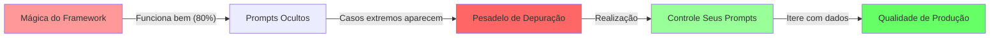

# Engenharia de Prompt e Contexto

## Introdução {#introduction}

Você construiu seu agente sem estado. Você controla seu fluxo. Tudo está funcionando lindamente... até chegar à produção. De repente, seu agente começa a alucinar. Ele esquece contexto importante. Dá respostas inconsistentes. O mesmo prompt que funcionou perfeitamente em testes agora produz lixo.

<Callout type="story" title="A Barreira dos 80%">
Sua demonstração foi impecável. O CEO adorou. Você recebeu luz verde para colocar em produção. Mas algo estranho aconteceu quando usuários reais começaram a usar:

- O agente funcionava perfeitamente para solicitações simples mas falhava espetacularmente em casos extremos
- Custos de tokens eram 10x maiores que o projetado porque contextos continuavam explodindo
- Usuários reclamavam de comportamento inconsistente—a mesma pergunta recebia respostas diferentes
- Mensagens de erro estavam sendo tratadas como instruções, causando loops bizarros

Você havia batido na barreira dos 80%. E o único caminho através? **Criar artesanalmente cada token.**
</Callout>

### A Verdade Desconfortável

Aqui está o que os fornecedores de frameworks não vão te contar: **Não existe abstração que possa te levar a 99% de confiabilidade.** A diferença entre uma demonstração e um sistema de produção não são modelos melhores ou frameworks mais elegantes—é disciplina de engenharia aplicada a cada token.

Este módulo vai te ensinar:
- Por que prompts de produção devem ser criados artesanalmente, não gerados
- Como gerenciar ativamente janelas de contexto antes que elas te gerenciem
- Padrões de tratamento de erros que transformam falhas em melhorias
- A mentalidade de engenharia que quebra o teto dos 80%

Vamos começar com a fundação: assumir o controle dos seus prompts.

## Fator 2: Assuma o Controle dos Seus Prompts {#own-your-prompts}

LLMs são funções puras. Mesmos tokens entram, tokens similares saem. Este fato simples tem uma implicação profunda: **A única maneira de melhorar a confiabilidade do seu agente é controlar exatamente quais tokens entram.**

<Diagram type="flow" title="A Jornada da Propriedade do Prompt">

</Diagram>

### A Evolução de um Prompt

Vamos observar um prompt evoluir do protótipo à produção:

<CodeExample title="De Prompts Genéricos para Produção" language="python">
```python
# Estágio 1: O Padrão do Framework (80% de qualidade)
def framework_prompt(user_input):
    """O que o framework te dá"""
    return f"Você é um assistente útil. Usuário: {user_input}"

# Estágio 2: Customização Básica (85% de qualidade)
def basic_prompt(user_input, tools):
    """Adicionando alguma estrutura"""
    return f"""Você é um agente de atendimento ao cliente.
    
Ferramentas disponíveis: {', '.join(tools)}

Usuário: {user_input}

Responda de forma útil."""

# Estágio 3: Prompt Estruturado (90% de qualidade)
def structured_prompt(user_input, tools, context):
    """Ficando sério sobre estrutura"""
    return f"""Você é um agente de atendimento ao cliente para TechCorp.

Suas capacidades:
{format_tools_detailed(tools)}

Contexto atual:
- ID do usuário: {context.user_id}
- Interações anteriores: {len(context.history)}
- Timestamp atual: {context.timestamp}

Solicitação do usuário: {user_input}

Responda com um objeto JSON contendo:
- "reasoning": Seu processo de pensamento
- "action": A ação a tomar
- "parameters": Parâmetros da ação
- "response": Mensagem para o usuário"""

# Estágio 4: Prompt de Produção (95%+ de qualidade)
class ProductionPromptBuilder:
    """Cada token é intencional"""
    
    def __init__(self):
        self.version = "2.3.1"  # Sim, versione seus prompts!
        self.token_budget = {
            "system": 150,
            "tools": 200,
            "context": 300,
            "history": 500,
            "instructions": 250
        }
    
    def build(self, request):
        """Constrói prompt com controle em nível de token"""
        sections = []
        
        # Prompt do sistema - cada palavra escolhida cuidadosamente
        sections.append(self._build_system_prompt(request))
        
        # Seção de ferramentas - descrições otimizadas
        sections.append(self._build_tools_section(request))
        
        # Contexto - comprimido e relevante
        sections.append(self._build_context_section(request))
        
        # Histórico - resumido inteligentemente
        sections.append(self._build_history_section(request))
        
        # Instruções - explícitas e não ambíguas
        sections.append(self._build_instructions(request))
        
        # Valida orçamento de tokens
        prompt = "\n\n".join(sections)
        self._validate_token_count(prompt)
        
        return prompt
    
    def _build_system_prompt(self, request):
        """Instruções do sistema - a fundação"""
        return f"""# Agente de Atendimento ao Cliente v{self.version}

Você é um agente especializado de atendimento ao cliente para clientes empresariais da TechCorp.

Princípios fundamentais:
- Precisão sobre velocidade: Sempre verifique antes de agir
- Segurança em primeiro lugar: Nunca exponha sistemas internos
- Empatia: Reconheça frustração do cliente
- Eficiência: Minimize idas e vindas

Sessão atual: {request.session_id}
Modelo: {request.model_name}"""

    def _build_tools_section(self, request):
        """Descrições de ferramentas - otimizadas para clareza"""
        tools_desc = []
        for tool in request.available_tools:
            # Cada descrição é cuidadosamente criada
            desc = self._get_optimized_tool_description(tool)
            tools_desc.append(f"- {tool.name}: {desc}")
        
        return f"""## Ações Disponíveis

Você pode realizar estas ações:
{chr(10).join(tools_desc)}

Sempre verifique parâmetros antes de usar qualquer ação."""

    def _build_context_section(self, request):
        """Contexto - apenas o que importa"""
        context_items = []
        
        # Contexto do usuário
        if request.user_profile:
            context_items.append(
                f"Cliente: nível {request.user_profile.tier}, "
                f"Idade da conta: {request.user_profile.account_age_days} dias"
            )
        
        # Estado atual
        if request.workflow_state:
            context_items.append(
                f"Workflow: {request.workflow_state.current_step} "
                f"({request.workflow_state.progress}% completo)"
            )
        
        # Problemas recentes
        if request.recent_errors:
            summary = self._summarize_errors(request.recent_errors)
            context_items.append(f"Problemas recentes: {summary}")
        
        return f"""## Contexto Atual

{chr(10).join(f'- {item}' for item in context_items)}"""

    def _build_instructions(self, request):
        """Instruções - explícitas e testáveis"""
        return """## Formato de Resposta

Você DEVE responder com um objeto JSON válido:

{
    "reasoning": "Breve explicação do seu processo de decisão",
    "confidence": 0.0-1.0,
    "action": "nome_da_acao ou 'respond'",
    "parameters": {...} ou null,
    "response": "Mensagem para usuário se action for 'respond'",
    "metadata": {
        "requires_human": boolean,
        "estimated_duration": "string de duração",
        "risk_level": "low|medium|high"
    }
}

JSON inválido causará falha do sistema. Valide antes de responder."""

    def _validate_token_count(self, prompt):
        """Garante que ficamos dentro do orçamento"""
        # Estimativa grosseira de tokens (use tiktoken em produção)
        estimated_tokens = len(prompt) / 4
        total_budget = sum(self.token_budget.values())
        
        if estimated_tokens > total_budget:
            raise ValueError(
                f"Prompt excede orçamento de tokens: "
                f"{estimated_tokens} > {total_budget}"
            )

# Por que isso importa:
# 1. Cada token tem um propósito
# 2. Versionamento permite testes A/B
# 3. Orçamentos de tokens previnem explosão de contexto
# 4. Formato estruturado reduz alucinação
# 5. Instruções explícitas melhoram consistência
```
</CodeExample>

### Padrões de Engenharia de Prompt

<CodeExample title="Otimização em Nível de Token" language="python">
```python
class PromptOptimizer:
    """Ferramentas para extrair valor máximo de cada token"""
    
    def __init__(self):
        self.abbreviations = {
            "customer": "cliente",
            "account": "conta",
            "transaction": "transacao",
            "configuration": "config"
        }
        self.stop_words = {"o", "a", "os", "as", "de", "do", "da", "em", "para"}
    
    def optimize_tool_description(self, tool):
        """Comprime descrições de ferramentas sem perder clareza"""
        original = tool.description
        
        # Passo 1: Remove palavras redundantes
        optimized = self._remove_stop_words(original)
        
        # Passo 2: Aplica abreviações do domínio
        optimized = self._apply_abbreviations(optimized)
        
        # Passo 3: Converte para modo imperativo
        optimized = self._make_imperative(optimized)
        
        # Garante que informações críticas são preservadas
        if not self._validates_critical_info(optimized, tool):
            return original  # Volta ao original se otimização foi longe demais
        
        return optimized
    
    def compress_error_context(self, errors):
        """Transforma erros verbosos em resumos acionáveis"""
        if not errors:
            return ""
        
        # Agrupa por tipo de erro
        error_groups = {}
        for error in errors:
            error_type = self._classify_error(error)
            if error_type not in error_groups:
                error_groups[error_type] = []
            error_groups[error_type].append(error)
        
        # Resume cada grupo
        summaries = []
        for error_type, group in error_groups.items():
            if len(group) == 1:
                summary = self._summarize_single_error(group[0])
            else:
                summary = f"{error_type}: {len(group)} ocorrências"
            summaries.append(summary)
        
        return "; ".join(summaries)
    
    def format_examples_efficiently(self, examples):
        """Inclui exemplos sem explosão de tokens"""
        if len(examples) <= 2:
            # Poucos exemplos: inclui completamente
            return "\n".join(f"Exemplo: {ex}" for ex in examples)
        
        # Muitos exemplos: mostra padrão
        return f"""Exemplos: {examples[0]}
Padrões similares: {len(examples)-1} mais como acima"""

class PromptTester:
    """Testa prompts sistematicamente"""
    
    def __init__(self, llm_client):
        self.llm = llm_client
        self.test_cases = []
    
    def add_test_case(self, name, input_data, expected_fields):
        """Define casos de teste para confiabilidade do prompt"""
        self.test_cases.append({
            "name": name,
            "input": input_data,
            "expected": expected_fields
        })
    
    async def test_prompt_version(self, prompt_builder, version):
        """Testa uma versão específica do prompt"""
        results = {
            "version": version,
            "passed": 0,
            "failed": 0,
            "errors": []
        }
        
        for test_case in self.test_cases:
            try:
                # Constrói prompt
                prompt = prompt_builder.build(test_case["input"])
                
                # Obtém resposta do LLM
                response = await self.llm.complete(prompt)
                
                # Valida resposta
                parsed = json.loads(response)
                
                # Verifica campos esperados
                for field in test_case["expected"]:
                    if field not in parsed:
                        raise ValueError(f"Campo faltando: {field}")
                
                results["passed"] += 1
                
            except Exception as e:
                results["failed"] += 1
                results["errors"].append({
                    "test": test_case["name"],
                    "error": str(e)
                })
        
        results["success_rate"] = results["passed"] / len(self.test_cases)
        return results
```
</CodeExample>

## Fator 3: Gerenciar Janelas de Contexto Explicitamente {#context-window-management}

Janelas de contexto são como RAM para seu agente. Deixe-as sem gerenciamento, e você terá o equivalente a um vazamento de memória—exceto que, em vez de travar, seu agente apenas fica progressivamente pior no seu trabalho.

<Callout type="warning" title="A Espiral da Morte do Contexto">
Aqui está como acontece:
1. Agente inicia com contexto limpo (500 tokens)
2. Faz uma chamada API, adiciona resultado (1500 tokens)
3. Encontra erro, adiciona stack trace (2500 tokens)
4. Tenta novamente com contexto completo (3500 tokens)
5. Fica confuso com erro no contexto, faz chamada errada (4500 tokens)
6. Qualidade degrada, custos aumentam, usuários reclamam
7. Você aumenta limite de contexto, problema piora

**A solução não são contextos maiores—é gerenciamento mais inteligente.**
</Callout>

### Construindo um Gerenciador de Contexto de Produção

<CodeExample title="Gerenciamento Dinâmico de Contexto" language="python">
```python
from typing import List, Dict, Any, Optional, Tuple
from dataclasses import dataclass
from abc import ABC, abstractmethod
import tiktoken

@dataclass
class ContextItem:
    """Um único item na janela de contexto"""
    type: str  # "message", "tool_result", "error", "summary"
    content: Any
    timestamp: float
    tokens: int
    priority: int  # 1-10, maior = mais importante
    compressible: bool = True
    
class ContextStrategy(ABC):
    """Classe base para estratégias de gerenciamento de contexto"""
    
    @abstractmethod
    def select_items(self, items: List[ContextItem], 
                    token_budget: int) -> List[ContextItem]:
        """Seleciona quais itens incluir no contexto"""
        pass

class RecencyStrategy(ContextStrategy):
    """Mantém itens mais recentes (simples mas eficaz)"""
    
    def select_items(self, items: List[ContextItem], 
                    token_budget: int) -> List[ContextItem]:
        # Ordena por timestamp, mais novo primeiro
        sorted_items = sorted(items, key=lambda x: x.timestamp, reverse=True)
        
        selected = []
        used_tokens = 0
        
        for item in sorted_items:
            if used_tokens + item.tokens <= token_budget:
                selected.append(item)
                used_tokens += item.tokens
            else:
                break
        
        # Retorna em ordem cronológica
        return sorted(selected, key=lambda x: x.timestamp)

class SmartCompressionStrategy(ContextStrategy):
    """Comprime itens antigos para caber mais contexto"""
    
    def __init__(self, compressor):
        self.compressor = compressor
    
    def select_items(self, items: List[ContextItem], 
                    token_budget: int) -> List[ContextItem]:
        # Separa comprimíveis e não-comprimíveis
        compressible = [i for i in items if i.compressible]
        non_compressible = [i for i in items if not i.compressible]
        
        # Inicia com itens não-comprimíveis
        selected = non_compressible[:]
        used_tokens = sum(i.tokens for i in selected)
        
        # Adiciona itens recentes comprimíveis sem compressão
        recent_threshold = time.time() - 300  # Últimos 5 minutos
        recent_items = [i for i in compressible 
                       if i.timestamp > recent_threshold]
        
        for item in sorted(recent_items, key=lambda x: x.priority, reverse=True):
            if used_tokens + item.tokens <= token_budget:
                selected.append(item)
                used_tokens += item.tokens
        
        # Comprime e adiciona itens antigos
        older_items = [i for i in compressible 
                      if i.timestamp <= recent_threshold]
        
        if older_items and used_tokens < token_budget:
            # Comprime itens antigos em resumos
            compressed = self._compress_items(
                older_items, 
                token_budget - used_tokens
            )
            selected.extend(compressed)
        
        return sorted(selected, key=lambda x: x.timestamp)

class ContextWindowManager:
    """Gerenciamento de janela de contexto de produção"""
    
    def __init__(self, 
                 max_tokens: int = 8000,
                 target_utilization: float = 0.8):
        self.max_tokens = max_tokens
        self.target_tokens = int(max_tokens * target_utilization)
        self.items: List[ContextItem] = []
        self.strategy = SmartCompressionStrategy(ContentCompressor())
        self.encoder = tiktoken.encoding_for_model("gpt-4")
        
        # Métricas
        self.compression_count = 0
        self.total_tokens_saved = 0
    
    def add_message(self, role: str, content: str, priority: int = 5):
        """Adiciona mensagem de conversa"""
        self.items.append(ContextItem(
            type="message",
            content={"role": role, "content": content},
            timestamp=time.time(),
            tokens=self._count_tokens(f"{role}: {content}"),
            priority=priority
        ))
        self._maybe_compress()
    
    def add_tool_result(self, tool: str, result: Any, priority: int = 6):
        """Adiciona resultado de execução de ferramenta"""
        # Pré-processamento inteligente
        processed_result = self._process_tool_result(tool, result)
        
        self.items.append(ContextItem(
            type="tool_result",
            content={"tool": tool, "result": processed_result},
            timestamp=time.time(),
            tokens=self._count_tokens(str(processed_result)),
            priority=priority
        ))
        self._maybe_compress()
    
    def add_error(self, error: Exception, context: str, priority: int = 7):
        """Adiciona erro com processamento inteligente"""
        # Não adiciona stack traces completos
        error_summary = self._summarize_error(error, context)
        
        self.items.append(ContextItem(
            type="error",
            content=error_summary,
            timestamp=time.time(),
            tokens=self._count_tokens(error_summary),
            priority=priority,
            compressible=False  # Mantém contexto de erro
        ))
        self._maybe_compress()
    
    def get_context(self) -> List[Dict[str, Any]]:
        """Obtém contexto otimizado para LLM"""
        # Seleciona itens dentro do orçamento
        selected = self.strategy.select_items(self.items, self.target_tokens)
        
        # Formata para consumo do LLM
        context = []
        for item in selected:
            if item.type == "message":
                context.append(item.content)
            elif item.type == "tool_result":
                context.append({
                    "role": "system",
                    "content": f"Ferramenta '{item.content['tool']}' retornou: {item.content['result']}"
                })
            elif item.type == "error":
                context.append({
                    "role": "system",
                    "content": f"Erro encontrado: {item.content}"
                })
            elif item.type == "summary":
                context.append({
                    "role": "system",
                    "content": f"Resumo da conversa anterior: {item.content}"
                })
        
        return context
```
</CodeExample>

## Próximos Passos

Você agora dominou os padrões críticos para engenharia de prompt e contexto:

- **Controle seus prompts** - Cada token deve ser intencional
- **Gerencie contexto ativamente** - Não deixe que ele te gerencie  
- **Processe erros inteligentemente** - Transforme falhas em melhorias

Estes padrões, combinados com o fluxo de controle e gerenciamento de estado do Módulo 2, dão a você a fundação para construir agentes prontos para produção.

Lembre-se: A diferença entre 80% e 99% de confiabilidade não são modelos melhores ou frameworks mais elegantes. É disciplina de engenharia aplicada a cada token, cada atualização de contexto e cada erro.

Nos próximos módulos, exploraremos os fatores restantes que completam o framework de Agentes 12 Fatores. Mas os princípios que você aprendeu aqui—propriedade, gerenciamento ativo e processamento inteligente—se aplicarão a tudo que segue.

## Quiz {#quiz}

<Quiz>
  <Question 
    question="Qual é a razão fundamental pela qual prompts de produção devem ser criados artesanalmente em vez de gerados?" 
    options={[
      "Prompts artesanais são mais baratos de produzir",
      "LLMs são funções puras: tokens consistentes entram significa comportamento previsível sai",
      "Prompts gerados são contra a maioria dos termos de serviço de APIs",
      "Prompts artesanais usam menos tokens"
    ]}
    correctAnswer={1}
    explanation="LLMs são funções puras - os mesmos tokens de entrada produzirão tokens de saída similares. Isso significa que a única maneira de melhorar a confiabilidade é controlar exatamente quais tokens entram no modelo. Prompts gerados por frameworks escondem esse controle de você, tornando impossível alcançar a precisão necessária para 99% de confiabilidade."
  />
  
  <Question 
    question="Qual estratégia para gerenciamento de janela de contexto é mais eficaz ao lidar com uma conversa longa que está se aproximando dos limites de tokens?" 
    options={[
      "Simplesmente aumentar o tamanho da janela de contexto para acomodar mais tokens",
      "Deletar todas as mensagens mais antigas que 5 minutos",
      "Usar compressão hierárquica: itens antigos são comprimidos mais agressivamente",
      "Sempre manter todo o histórico da conversa e deixar o modelo lidar com isso"
    ]}
    correctAnswer={2}
    explanation="Compressão hierárquica é a estratégia mais eficaz porque preserva contexto recente (que geralmente é mais relevante) enquanto ainda mantém informações importantes do início da conversa através de compressão progressiva. Simplesmente aumentar o tamanho do contexto leva à 'espiral da morte do contexto', enquanto deletar mensagens antigas perde informações potencialmente importantes."
  />
  
  <Question 
    question="Ao implementar tratamento de erros para agentes de produção, o que você deve fazer com informações de erro antes de adicioná-las ao contexto?" 
    options={[
      "Incluir o stack trace completo para máxima informação de depuração",
      "Ignorar erros para evitar confundir o LLM",
      "Processar erros em resumos concisos com sugestões acionáveis",
      "Apenas logar erros externamente e nunca mostrá-los ao LLM"
    ]}
    correctAnswer={2}
    explanation="Informações de erro brutas (especialmente stack traces) confundem LLMs e desperdiçam tokens. Ao processar erros em resumos concisos com dicas de contexto e ações sugeridas, você transforma falhas em oportunidades de aprendizado. A palavra-chave é 'processamento inteligente' - extrair informações significativas enquanto remove ruído como endereços de memória, UUIDs e detalhes de implementação."
  />
</Quiz>

## Exercício: Otimizador de Janela de Contexto {#exercise}

Construa um otimizador de janela de contexto que previne a "espiral da morte do contexto" gerenciando inteligentemente quais informações permanecem na conversa:

<CodeExample title="Exercício do Otimizador de Janela de Contexto" language="python">
```python
from typing import List, Dict, Any, Tuple
from dataclasses import dataclass
import time

@dataclass
class ContextItem:
    """Representa um item na janela de contexto"""
    type: str  # "message", "tool_result", "error", "summary"
    content: Any
    timestamp: float
    tokens: int
    priority: int  # 1-10, maior = mais importante
    compressible: bool = True

class ContextOptimizer:
    """
    Sua tarefa: Implementar um otimizador de contexto pronto para produção
    que previne overflow de contexto mantendo qualidade da conversa.
    """
    
    def __init__(self, max_tokens: int = 4000):
        self.max_tokens = max_tokens
        self.items: List[ContextItem] = []
        # TODO: Adicione variáveis de instância adicionais que precisar
    
    def add_message(self, role: str, content: str, priority: int = 5):
        """
        Adiciona mensagem de conversa ao contexto.
        
        Requisitos:
        - Rastrear contagem de tokens (estimativa: len(content) / 4)
        - Definir prioridade apropriada baseada no role
        - Disparar compressão se aproximando dos limites
        """
        # TODO: Implementar este método
        pass
    
    def add_tool_result(self, tool: str, result: Any, priority: int = 6):
        """
        Adiciona resultado de execução de ferramenta ao contexto.
        
        Requisitos:
        - Processar resultados grandes (ex: truncar listas, resumir dados)
        - Definir prioridade baseada na importância da ferramenta
        - Marcar como comprimível para otimização futura
        """
        # TODO: Implementar este método
        pass
    
    def add_error(self, error: Exception, context: str):
        """
        Adiciona informação de erro ao contexto.
        
        Requisitos:
        - Extrair apenas informações essenciais do erro
        - Remover stack traces e endereços de memória
        - Definir alta prioridade (erros são oportunidades de aprendizado)
        - Marcar como não-comprimível
        """
        # TODO: Implementar este método
        pass
    
    def get_optimized_context(self) -> List[Dict[str, str]]:
        """
        Obtém contexto otimizado para o LLM.
        
        Requisitos:
        - Permanecer dentro do orçamento de tokens
        - Preservar itens de alta prioridade
        - Comprimir itens antigos inteligentemente
        - Retornar em formato pronto para LLM
        """
        # TODO: Implementar este método
        pass
    
    def _compress_old_items(self):
        """
        Comprime itens antigos para liberar espaço de tokens.
        
        Requisitos:
        - Agrupar itens similares (ex: múltiplas chamadas de ferramenta)
        - Criar resumos concisos
        - Preservar informações-chave
        - Atualizar contagens de tokens
        """
        # TODO: Implementar este método
        pass
    
    def _estimate_tokens(self, content: str) -> int:
        """Estima contagem de tokens para conteúdo"""
        # Estimativa simples: ~4 caracteres por token
        return len(str(content)) // 4

# Teste sua implementação
def test_context_optimizer():
    optimizer = ContextOptimizer(max_tokens=1000)
    
    # Simula conversa que excederá limites de tokens
    
    # Mensagem inicial do usuário
    optimizer.add_message("user", "Preciso de ajuda com meu pedido #12345", priority=8)
    
    # Chamadas de ferramenta e resultados
    optimizer.add_tool_result("search_order", {
        "order_id": "12345",
        "status": "enviado",
        "tracking": "1Z999AA1234567890",
        "items": ["Widget A", "Widget B", "Widget C"],
        "history": [
            {"date": "2024-01-01", "status": "pedido"},
            {"date": "2024-01-02", "status": "processando"},
            {"date": "2024-01-03", "status": "enviado"}
        ]
    })
    
    # Adiciona múltiplas mensagens para aproximar do limite de tokens
    for i in range(10):
        optimizer.add_message("assistant", f"Verificando informação parte {i}...")
        optimizer.add_message("user", f"E sobre detalhe {i}?")
    
    # Adiciona um erro
    try:
        raise ConnectionError("Falha ao conectar com API de envio: timeout após 30s")
    except Exception as e:
        optimizer.add_error(e, "ao verificar status de envio")
    
    # Obtém contexto otimizado
    context = optimizer.get_optimized_context()
    
    # Verifica requisitos
    total_tokens = sum(len(str(item)) // 4 for item in context)
    print(f"Total de tokens no contexto: {total_tokens}")
    print(f"Número de itens de contexto: {len(context)}")
    print(f"Contexto permanece dentro do limite: {total_tokens <= 1000}")

if __name__ == "__main__":
    test_context_optimizer()
```
</CodeExample>

Este exercício te desafia a construir um dos componentes mais críticos de um sistema de agente de produção. Uma boa implementação irá:
- Prevenir overflow de contexto antes que aconteça
- Preservar as informações mais importantes
- Comprimir inteligentemente sem perder significado
- Tratar erros como informação de primeira classe

Lembre-se: O objetivo não é caber tudo—é caber o que importa.