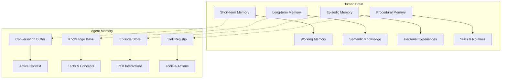

# Understanding Agent Memory

Welcome to the world of agent memory systems! In this module, we'll discover why memory is the key difference between simple chatbots and truly intelligent agents.

## The Problem: Stateless AI

Let's start with a simple chatbot to see the problem:

<CodeExample language="typescript" title="A Forgetful Chatbot">
function chatbot(message: string): string {
  if (message.includes("hello")) {
    return "Hi! I'm an AI assistant.";
  }
  if (message.includes("name")) {
    return "I don't remember your name.";
  }
  return "I'm not sure what you mean.";
}
</CodeExample>

This chatbot has no memory. Every conversation starts fresh:

<CodeExample language="typescript" title="The Forgetting Problem">
console.log(chatbot("Hello, I'm Alice"));
// Output: "Hi! I'm an AI assistant."

console.log(chatbot("What's my name?"));
// Output: "I don't remember your name."
</CodeExample>

**The Issue**: The chatbot forgot Alice's name immediately after she introduced herself.

<Callout type="insight" title="Richmond's Key Insight">
"If AI or AGI is meant to mimic human intelligence, and what determines intelligence in humans is their ability to recall—it's their memory—then it's a no-brainer that we need memory within the agents we're building." - Richmond Alake, MongoDB
</Callout>

## The Evolution of AI Applications

Richmond Alake outlined the evolution we've seen:

### 2022: Simple Chatbots
- No memory between conversations
- Basic Q&A functionality
- Limited context understanding

### 2023: RAG Systems  
- Static knowledge bases
- Better domain-specific answers
- Still no conversational memory

### 2024: Tool-Using Agents
- Function calling capabilities
- Can take actions
- But still stateless between sessions

### Now: Memory-Enabled Agents
- Remember conversations
- Learn user preferences  
- Build relationships over time

## What Makes an AI Agent?

According to Richmond, an AI agent is:

> "A computational entity with awareness of its environment through perception, cognitive abilities through an LLM, and can take action through tool use. But the most important bit is there is some form of memory—short-term or long-term."

Let's build this step by step.

## Building Your First Memory-Enabled Agent

### Step 1: Add Simple Memory Storage

<CodeExample language="typescript" title="Basic Memory Storage">
interface Memory {
  user: string;
  fact: string;
  timestamp: Date;
}

const memories: Memory[] = [];

function remember(user: string, fact: string) {
  memories.push({
    user,
    fact,
    timestamp: new Date()
  });
}
</CodeExample>

### Step 2: Add Memory Retrieval

<CodeExample language="typescript" title="Retrieving Memories">
function recall(user: string): Memory[] {
  return memories.filter(memory => memory.user === user);
}

function findMemoryAbout(user: string, topic: string): Memory | undefined {
  return memories.find(memory => 
    memory.user === user && 
    memory.fact.toLowerCase().includes(topic.toLowerCase())
  );
}
</CodeExample>

### Step 3: Create a Memory-Enabled Agent

Now let's build an agent that can remember:

<CodeExample language="typescript" title="Memory-Enabled Chatbot">
function memoryChatbot(user: string, message: string): string {
  // Check if user is introducing themselves
  if (message.includes("I'm ") || message.includes("My name is")) {
    const name = extractName(message);
    remember(user, `name is ${name}`);
    return `Nice to meet you, ${name}! I'll remember that.`;
  }
  
  // Check if user is asking about their name
  if (message.includes("my name")) {
    const nameMemory = findMemoryAbout(user, "name");
    if (nameMemory) {
      const name = nameMemory.fact.replace("name is ", "");
      return `Your name is ${name}.`;
    }
    return "I don't know your name yet. Could you tell me?";
  }
  
  return "How can I help you today?";
}
</CodeExample>

Helper function to extract names:

<CodeExample language="typescript" title="Name Extraction Helper">
function extractName(message: string): string {
  // Simple name extraction
  const patterns = [
    /I'm (\w+)/,
    /My name is (\w+)/
  ];
  
  for (const pattern of patterns) {
    const match = message.match(pattern);
    if (match) return match[1];
  }
  
  return "Friend";
}
</CodeExample>

### Step 4: Test the Memory-Enabled Agent

<CodeExample language="typescript" title="Testing Memory">
const userId = "user123";

console.log(memoryChatbot(userId, "Hi, I'm Alice"));
// Output: "Nice to meet you, Alice! I'll remember that."

console.log(memoryChatbot(userId, "What's my name?"));
// Output: "Your name is Alice."

// Later conversation...
console.log(memoryChatbot(userId, "Do you remember me?"));
// The agent now has context about Alice
</CodeExample>

## The Difference Memory Makes

Let's compare the two approaches:

**Without Memory:**
- Every interaction starts from scratch
- No personalization possible
- Cannot build relationships
- Limited context understanding

**With Memory:**
- Conversations have continuity
- Personalized responses
- Relationship building over time
- Rich context from history

<Callout type="success" title="Memory Transforms AI">
Memory is what transforms a simple chatbot into an intelligent agent that can be "believable, capable, and reliable"—Richmond's three key goals for agent systems.
</Callout>

## Types of Memory (Preview)

In the next module, we'll explore different types of memory that agents need:

- **Conversational Memory**: What was said in past conversations
- **Entity Memory**: Information about people, places, and things
- **Persona Memory**: The agent's personality and behavior patterns
- **Toolbox Memory**: Which tools to use in different situations

## Human Brain vs. Agent Memory

Richmond emphasized the connection to human intelligence:

<Diagram>

</Diagram>

Just as humans have specialized memory systems, our agents need different types of memory for different purposes.

## Knowledge Check

<Quiz>
  <Question
    question="What is the main problem with stateless AI chatbots?"
    options={[
      "They are too slow to respond",
      "They forget everything between conversations",
      "They consume too much memory",
      "They can't access the internet"
    ]}
    correct={1}
    explanation="Stateless chatbots have no memory between conversations, so they can't build relationships or provide personalized experiences."
  />
  
  <Question
    question="According to Richmond Alake, what makes an entity an AI agent?"
    options={[
      "Just having an LLM and tools",
      "Being connected to the internet",
      "Having perception, cognition, action capability, AND memory",
      "Being able to write code"
    ]}
    correct={2}
    explanation="Richmond defined agents as having environment awareness (perception), cognitive abilities (LLM), action capability (tools), AND some form of memory."
  />
  
  <Question
    question="Why did Richmond say memory is essential for AGI?"
    options={[
      "Memory makes agents faster",
      "Human intelligence is fundamentally tied to memory and recall ability",
      "Memory reduces computational costs",
      "Memory makes agents more secure"
    ]}
    correct={1}
    explanation="Richmond argued that since human intelligence is determined by the ability to recall (memory), AI systems aiming to mimic human intelligence must have memory."
  />
</Quiz>

## Exercise: Enhance the Memory Agent

Try enhancing our simple memory agent:

1. **Add Preference Memory**: Let users tell the agent they prefer bullet points or paragraphs
2. **Add Mood Tracking**: Remember if the user seems happy, frustrated, etc.
3. **Add Topic Interest**: Track what topics the user asks about most

<CodeExample language="typescript" title="Hint for Preference Memory">
// Add this to your remember function calls
if (message.includes("prefer bullet points")) {
  remember(user, "prefers bullet points format");
}
</CodeExample>

## Summary

In this module, we learned:

1. **The Problem**: Stateless AI can't build relationships or learn from interactions
2. **The Solution**: Memory enables agents to be believable, capable, and reliable
3. **The Evolution**: From simple chatbots to memory-enabled agents
4. **The Implementation**: Basic memory storage and retrieval in under 30 lines
5. **The Connection**: Agent memory mirrors human memory systems

## Next Steps

In the next module, we'll explore the different types of memory agents need, starting with simple implementations of each type. We'll see how Richmond's team at MongoDB models these memories as flexible documents that can adapt to any structure.

<Callout type="info" title="Remember This">
Memory isn't just about storage—it's about organizing information so the right memories surface at the right time. That's what we'll build in the coming modules.
</Callout>