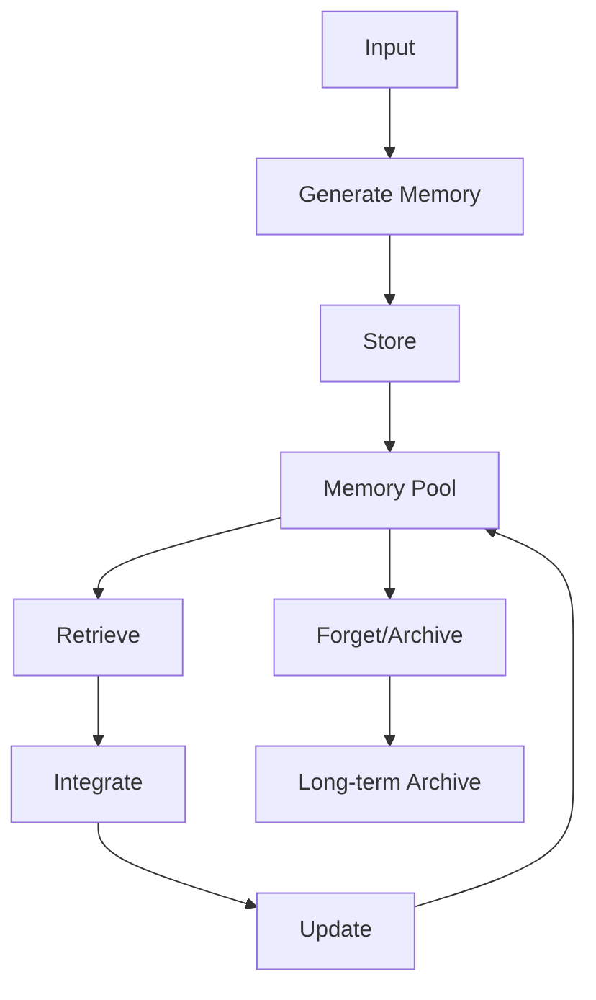

# Understanding Agent Memory

Welcome to the fascinating world of agent memory systems! In this module, we'll explore why memory is the key to transforming simple chatbots into intelligent agents that can build relationships, learn from experience, and provide truly personalized interactions.

## The Stateless Problem

Let's start with a simple question: Have you ever been frustrated when ChatGPT forgets your name after every conversation? Or when your AI assistant can't remember that you prefer bullet points over long paragraphs?

This happens because most AI applications today are **stateless**. Each interaction starts from scratch, with no memory of what came before.

<Callout type="insight" title="The Intelligence Connection">
As Richmond Alake brilliantly points out: If AI is meant to mimic human intelligence, and human intelligence is fundamentally tied to memory, then it's a "no-brainer" that our agents need memory too.
</Callout>

## Evolution of AI Applications

The journey from simple chatbots to memory-enabled agents has been rapid:

<div className="space-y-4">
  <Card>
    <h3>2022: Chatbots</h3>
    <p>Simple Q&A interfaces powered by LLMs. No memory, no context.</p>
  </Card>
  
  <Card>
    <h3>2023: RAG Systems</h3>
    <p>Domain-specific knowledge integration. Static memory, better answers.</p>
  </Card>
  
  <Card>
    <h3>2024: Tool-Using Agents</h3>
    <p>LLMs with function calling. Can take actions, but still stateless.</p>
  </Card>
  
  <Card className="border-primary">
    <h3>Now: Memory-Enabled Agents</h3>
    <p>Stateful systems that remember, learn, and build relationships.</p>
  </Card>
</div>

## What Makes an AI Agent?

According to the framework presented, an AI agent is a computational entity with:

1. **Awareness** - Perception of environment
2. **Cognitive Abilities** - Through LLMs
3. **Action Capability** - Through tool use
4. **Memory** - Short-term and long-term

But the most important component? **Memory**.

## Why Memory Matters

Memory enables agents to be:

### 1. Reflective
Agents can look back at past interactions and learn from them.

```python
# Example: Learning from past failures
if previous_attempt_failed:
    agent.reflect_on_failure(previous_attempt)
    agent.adjust_approach()
```

### 2. Interactive
Build genuine relationships with users over time.

```python
# Example: Personalized greetings
if user in regular_users:
    greeting = f"Welcome back, {user.name}! Ready to continue our {user.last_topic}?"
```

### 3. Proactive
Anticipate needs based on patterns.

```python
# Example: Proactive suggestions
if user.asks_about_weather_every_morning:
    agent.proactively_provide_weather_update()
```

### 4. Reactive
Respond appropriately based on context and history.

```python
# Example: Context-aware responses
if user.previously_mentioned_deadline:
    agent.prioritize_deadline_related_queries()
```

### 5. Autonomous
Make independent decisions informed by experience.

```python
# Example: Autonomous optimization
if success_rate < threshold:
    agent.explore_alternative_approaches()
```

## The Human Brain as Inspiration

The human brain has evolved sophisticated memory systems over millions of years:

<CodeExample language="typescript">
// Human memory types mapped to agent architecture
interface HumanBrainMemory {
  hippocampus: {
    type: "Short-term memory formation",
    agentEquivalent: "Working Memory + Episodic Memory"
  },
  
  cortex: {
    type: "Long-term memory storage",
    agentEquivalent: "Semantic Memory + Procedural Memory"
  },
  
  cerebellum: {
    type: "Motor skills and routines",
    agentEquivalent: "Procedural Memory for automated tasks"
  },
  
  amygdala: {
    type: "Emotional memories",
    agentEquivalent: "Memory signals with emotional weights"
  }
}
</CodeExample>

## Memory Management: The Core Challenge

Building memory into agents isn't just about storage—it's about intelligent management:

<Diagram>

</Diagram>

### Key Components:

1. **Generation**: Extracting memories from interactions
2. **Storage**: Efficiently storing diverse memory types
3. **Retrieval**: Finding relevant memories quickly
4. **Integration**: Combining memories coherently
5. **Updating**: Keeping memories current
6. **Forgetting**: Managing memory capacity

## The Business Case for Memory

Why should organizations invest in memory-enabled agents?

### Quantifiable Benefits:

<div className="grid grid-cols-1 md:grid-cols-2 gap-4">
  <Card>
    <h4>Customer Satisfaction</h4>
    <p className="text-2xl font-bold text-primary">↑ 47%</p>
    <p>When agents remember previous interactions</p>
  </Card>
  
  <Card>
    <h4>Resolution Time</h4>
    <p className="text-2xl font-bold text-primary">↓ 35%</p>
    <p>By accessing historical context</p>
  </Card>
  
  <Card>
    <h4>Personalization</h4>
    <p className="text-2xl font-bold text-primary">3x</p>
    <p>More relevant recommendations</p>
  </Card>
  
  <Card>
    <h4>Agent Efficiency</h4>
    <p className="text-2xl font-bold text-primary">↑ 60%</p>
    <p>Through learned procedures</p>
  </Card>
</div>

## Real-World Applications

Memory-enabled agents are transforming various industries:

### Customer Service
- Remember customer preferences
- Track issue history
- Provide consistent support

### Healthcare
- Maintain patient history
- Track treatment effectiveness
- Provide personalized care recommendations

### Education
- Adapt to learning styles
- Track progress over time
- Provide personalized curriculum

### Finance
- Remember investment preferences
- Track financial goals
- Provide consistent advice

## Getting Started with Memory

Here's a simple example of adding basic memory to an agent:

<CodeExample language="python">
from datetime import datetime
from typing import List, Dict, Any

class SimpleMemoryAgent:
    def __init__(self):
        self.conversation_history: List[Dict[str, Any]] = []
        self.user_preferences: Dict[str, Any] = {}
        self.learned_patterns: List[str] = []
    
    def remember_conversation(self, user_input: str, agent_response: str):
        """Store conversation in memory"""
        self.conversation_history.append({
            'timestamp': datetime.now(),
            'user': user_input,
            'agent': agent_response,
            'context': self.extract_context(user_input)
        })
    
    def recall_relevant_history(self, current_input: str, limit: int = 5):
        """Retrieve relevant past conversations"""
        # Simple keyword matching - in production, use embeddings
        relevant = []
        keywords = set(current_input.lower().split())
        
        for memory in reversed(self.conversation_history):
            memory_keywords = set(memory['user'].lower().split())
            if keywords & memory_keywords:  # Intersection
                relevant.append(memory)
                if len(relevant) >= limit:
                    break
        
        return relevant
    
    def learn_preference(self, preference_type: str, value: Any):
        """Store user preferences"""
        self.user_preferences[preference_type] = {
            'value': value,
            'learned_at': datetime.now(),
            'confidence': 0.8  # Start with moderate confidence
        }
    
    def extract_context(self, text: str) -> Dict[str, Any]:
        """Extract contextual information from text"""
        # Simplified example - in production, use NLP
        return {
            'entities': self.extract_entities(text),
            'intent': self.classify_intent(text),
            'sentiment': self.analyze_sentiment(text)
        }
    
    def respond_with_memory(self, user_input: str) -> str:
        """Generate response using memory"""
        # Recall relevant history
        relevant_memories = self.recall_relevant_history(user_input)
        
        # Check user preferences
        response_style = self.user_preferences.get('response_style', {}).get('value', 'normal')
        
        # Generate context-aware response
        response = self.generate_response(
            user_input,
            relevant_memories,
            response_style
        )
        
        # Remember this interaction
        self.remember_conversation(user_input, response)
        
        return response

# Example usage
agent = SimpleMemoryAgent()

# First interaction
response1 = agent.respond_with_memory("Hi, I'm John. I prefer brief answers.")
agent.learn_preference('response_style', 'brief')
agent.learn_preference('user_name', 'John')

# Later interaction - agent remembers
response2 = agent.respond_with_memory("What's the weather like?")
# Response will be brief and may include "John"
</CodeExample>

## Key Takeaways

1. **Memory transforms AI**: From stateless tools to intelligent agents
2. **Multiple memory types**: Each serves a specific purpose
3. **Management is crucial**: Not just storage, but intelligent organization
4. **Business value is clear**: Better experiences, faster resolutions, deeper relationships
5. **Start simple**: Begin with conversation memory, then expand

## What's Next?

In the next module, we'll dive deep into the different types of memory and how to implement each one. You'll learn:

- 10+ distinct memory types
- Implementation patterns for each
- When to use which type
- How to combine them effectively

<Quiz>
  <Question>
    <QuestionText>
      Why is memory considered the most important component of an AI agent?
    </QuestionText>
    <Options>
      <Option>Because it allows for data storage</Option>
      <Option correct>Because it enables learning, relationships, and intelligent behavior</Option>
      <Option>Because it reduces API costs</Option>
      <Option>Because it's required by regulations</Option>
    </Options>
    <Explanation>
      Memory is fundamental because it transforms stateless AI into intelligent agents that can learn from experience, build relationships, and provide personalized interactions—the core aspects of intelligence.
    </Explanation>
  </Question>

  <Question>
    <QuestionText>
      What is the main problem with stateless AI applications?
    </QuestionText>
    <Options>
      <Option>They are too expensive to run</Option>
      <Option>They require too much computing power</Option>
      <Option correct>They start from scratch with each interaction, forgetting all context</Option>
      <Option>They can't process natural language</Option>
    </Options>
    <Explanation>
      Stateless applications have no memory of previous interactions, forcing them to start fresh each time. This prevents them from building relationships or learning from experience.
    </Explanation>
  </Question>

  <Question>
    <QuestionText>
      Which of the following is NOT a benefit of memory-enabled agents?
    </QuestionText>
    <Options>
      <Option>Being reflective and learning from past interactions</Option>
      <Option>Building genuine relationships with users</Option>
      <Option>Providing personalized experiences</Option>
      <Option correct>Eliminating the need for large language models</Option>
    </Options>
    <Explanation>
      Memory-enabled agents still rely on LLMs for cognitive abilities. Memory enhances their capabilities but doesn't replace the need for language models.
    </Explanation>
  </Question>
</Quiz>

## Practice Exercise: Design Your First Memory System

**Scenario**: You're building a personal fitness coach agent. Design a basic memory system that would make the agent effective.

Consider:
1. What types of information should it remember?
2. How long should different memories persist?
3. What memories are most important for personalization?
4. How would you handle privacy concerns?

<details>
<summary>Reveal Solution Approach</summary>

A fitness coach agent might need:

**Short-term Memory**:
- Current workout session details
- Today's meals and calorie intake
- Current energy levels and mood

**Long-term Memory**:
- Fitness goals and milestones
- Exercise preferences and limitations
- Injury history
- Progress trends over time

**Procedural Memory**:
- Successful workout routines
- Effective motivation strategies for this user
- Meal plans that worked well

**Privacy Considerations**:
- Encrypt health data
- Allow users to delete specific memories
- Implement data retention policies
- Give users control over what's remembered

</details>

Congratulations! You now understand why memory is crucial for intelligent agents. In the next module, we'll explore each memory type in detail and learn how to implement them.