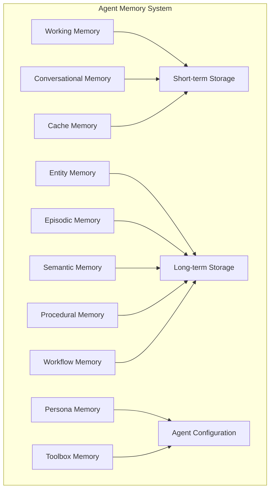

# Memory Types and Architecture

Now that we understand why memory matters, let's explore the different types of memory your agents need. We'll cover 10+ distinct memory types, each serving a specific purpose in creating intelligent, capable agents.

## The Memory Landscape

Just as the human brain has specialized regions for different types of memory, AI agents benefit from a diverse memory architecture:

<Diagram>

</Diagram>

## 1. Conversational Memory

The foundation of any interactive agent - remembering what was said.

### Implementation

<CodeExample language="typescript">
interface ConversationMemory {
  conversationId: string;
  messages: Message[];
  participants: string[];
  startTime: Date;
  lastActivity: Date;
  metadata: {
    topic: string[];
    sentiment: number;
    language: string;
    channel: string;
  };
}

interface Message {
  id: string;
  role: 'user' | 'agent' | 'system';
  content: string;
  timestamp: Date;
  metadata?: {
    intent?: string;
    entities?: Entity[];
    confidence?: number;
  };
}

class ConversationMemoryManager {
  private db: MongoDB;
  private maxMessages: number = 100;

  async storeMessage(conversationId: string, message: Message) {
    // Add message with automatic summarization for long conversations
    const conversation = await this.db.collection('conversations').findOne({
      conversationId
    });

    if (conversation && conversation.messages.length >= this.maxMessages) {
      // Summarize older messages
      const summary = await this.summarizeMessages(
        conversation.messages.slice(0, 50)
      );
      
      await this.db.collection('conversation_summaries').insertOne({
        conversationId,
        summary,
        messagesIncluded: 50,
        createdAt: new Date()
      });

      // Remove summarized messages
      conversation.messages = conversation.messages.slice(50);
    }

    // Store new message
    await this.db.collection('conversations').updateOne(
      { conversationId },
      {
        $push: { messages: message },
        $set: { lastActivity: new Date() },
        $addToSet: { 'metadata.topic': { $each: message.metadata?.entities?.map(e => e.type) || [] } }
      },
      { upsert: true }
    );
  }

  async retrieveContext(conversationId: string, options?: {
    includesSummary?: boolean;
    messageLimit?: number;
  }) {
    const conversation = await this.db.collection('conversations').findOne({
      conversationId
    });

    if (!conversation) return null;

    let context = {
      messages: conversation.messages.slice(-(options?.messageLimit || 10)),
      metadata: conversation.metadata
    };

    if (options?.includesSummary) {
      const summaries = await this.db.collection('conversation_summaries')
        .find({ conversationId })
        .sort({ createdAt: -1 })
        .limit(3)
        .toArray();
      
      context['summaries'] = summaries;
    }

    return context;
  }

  private async summarizeMessages(messages: Message[]): Promise<string> {
    // Use LLM to create concise summary
    const prompt = `Summarize the following conversation, highlighting key points, decisions made, and any important information:

${messages.map(m => `${m.role}: ${m.content}`).join('\n')}

Provide a concise summary:`;

    return await this.llm.generate(prompt);
  }
}
</CodeExample>

### Use Cases
- Customer support continuity
- Multi-turn task completion
- Context-aware responses
- Conversation analytics

## 2. Entity Memory

Track and remember information about people, places, and things.

<CodeExample language="typescript">
interface EntityMemory {
  entityId: string;
  name: string;
  type: 'person' | 'organization' | 'location' | 'product' | 'concept';
  aliases: string[];
  attributes: Map<string, any>;
  relationships: Relationship[];
  mentions: Mention[];
  embedding?: number[];
  confidence: number;
  firstSeen: Date;
  lastUpdated: Date;
}

interface Relationship {
  type: string; // 'works_for', 'located_in', 'owns', etc.
  targetEntityId: string;
  strength: number;
  evidence: string[];
  startDate?: Date;
  endDate?: Date;
}

class EntityMemoryManager {
  private db: MongoDB;
  private embedder: EmbeddingService;

  async extractAndStoreEntities(text: string, context: any) {
    // Extract entities using NER
    const entities = await this.nerService.extract(text);
    
    for (const entity of entities) {
      await this.updateEntity({
        name: entity.text,
        type: entity.type,
        mention: {
          text: text,
          context: context,
          timestamp: new Date(),
          confidence: entity.confidence
        }
      });
    }

    // Extract relationships
    const relationships = await this.extractRelationships(text, entities);
    await this.storeRelationships(relationships);
  }

  async updateEntity(entityData: Partial<EntityMemory> & { mention?: Mention }) {
    const existingEntity = await this.findEntity(entityData.name);
    
    if (existingEntity) {
      // Merge information
      await this.mergeEntityInformation(existingEntity, entityData);
    } else {
      // Create new entity
      const embedding = await this.embedder.embed(
        `${entityData.name} ${entityData.type} ${JSON.stringify(entityData.attributes)}`
      );
      
      await this.db.collection('entities').insertOne({
        entityId: generateId(),
        ...entityData,
        embedding,
        firstSeen: new Date(),
        lastUpdated: new Date(),
        mentions: entityData.mention ? [entityData.mention] : []
      });
    }
  }

  async queryEntities(query: string, type?: string): Promise<EntityMemory[]> {
    const queryEmbedding = await this.embedder.embed(query);
    
    const pipeline = [
      {
        $vectorSearch: {
          index: 'entity_embeddings',
          path: 'embedding',
          queryVector: queryEmbedding,
          numCandidates: 100,
          limit: 20
        }
      }
    ];

    if (type) {
      pipeline.push({ $match: { type } });
    }

    pipeline.push({
      $lookup: {
        from: 'entities',
        localField: 'relationships.targetEntityId',
        foreignField: 'entityId',
        as: 'relatedEntities'
      }
    });

    return await this.db.collection('entities').aggregate(pipeline).toArray();
  }

  async getEntityGraph(entityId: string, depth: number = 2): Promise<Graph> {
    // Recursive graph traversal to build entity relationship graph
    const visited = new Set<string>();
    const graph = { nodes: [], edges: [] };
    
    async function traverse(id: string, currentDepth: number) {
      if (currentDepth > depth || visited.has(id)) return;
      visited.add(id);
      
      const entity = await this.db.collection('entities').findOne({ entityId: id });
      if (!entity) return;
      
      graph.nodes.push({
        id: entity.entityId,
        label: entity.name,
        type: entity.type,
        attributes: entity.attributes
      });
      
      for (const rel of entity.relationships) {
        graph.edges.push({
          source: id,
          target: rel.targetEntityId,
          type: rel.type,
          strength: rel.strength
        });
        
        await traverse(rel.targetEntityId, currentDepth + 1);
      }
    }
    
    await traverse(entityId, 0);
    return graph;
  }
}
</CodeExample>

### Use Cases
- CRM-like functionality
- Knowledge graph building
- Personalization
- Context understanding

## 3. Episodic Memory

Remember sequences of events and complete experiences.

<CodeExample language="typescript">
interface Episode {
  episodeId: string;
  title: string;
  description: string;
  startTime: Date;
  endTime?: Date;
  duration?: number;
  participants: string[];
  events: Event[];
  outcome: 'success' | 'failure' | 'partial' | 'ongoing';
  learnings: Learning[];
  context: Record<string, any>;
  embedding?: number[];
  tags: string[];
}

interface Event {
  timestamp: Date;
  type: string;
  description: string;
  actor: string;
  action: string;
  result: any;
  significance: number; // 0-1
}

interface Learning {
  insight: string;
  applicableTo: string[];
  confidence: number;
  evidence: string[];
}

class EpisodicMemoryManager {
  private activeEpisodes: Map<string, Episode> = new Map();

  async startEpisode(title: string, context: any): Promise<string> {
    const episode: Episode = {
      episodeId: generateId(),
      title,
      description: await this.generateDescription(title, context),
      startTime: new Date(),
      participants: [context.userId, context.agentId],
      events: [],
      outcome: 'ongoing',
      learnings: [],
      context,
      tags: await this.generateTags(title, context)
    };

    this.activeEpisodes.set(episode.episodeId, episode);
    return episode.episodeId;
  }

  async recordEvent(episodeId: string, event: Omit<Event, 'timestamp'>) {
    const episode = this.activeEpisodes.get(episodeId);
    if (!episode) throw new Error('Episode not found');

    const fullEvent: Event = {
      ...event,
      timestamp: new Date(),
      significance: await this.calculateSignificance(event, episode)
    };

    episode.events.push(fullEvent);

    // Check for patterns or learnings
    if (episode.events.length % 5 === 0) {
      await this.extractLearnings(episode);
    }
  }

  async endEpisode(episodeId: string, outcome: Episode['outcome']) {
    const episode = this.activeEpisodes.get(episodeId);
    if (!episode) throw new Error('Episode not found');

    episode.endTime = new Date();
    episode.duration = episode.endTime.getTime() - episode.startTime.getTime();
    episode.outcome = outcome;

    // Final learning extraction
    await this.extractLearnings(episode);

    // Generate embedding for similarity search
    episode.embedding = await this.generateEpisodeEmbedding(episode);

    // Store in database
    await this.db.collection('episodes').insertOne(episode);

    // Clean up
    this.activeEpisodes.delete(episodeId);

    // Update related procedural memory if successful
    if (outcome === 'success') {
      await this.updateProceduralMemory(episode);
    }
  }

  async findSimilarEpisodes(context: any, limit: number = 5): Promise<Episode[]> {
    const contextEmbedding = await this.generateContextEmbedding(context);
    
    return await this.db.collection('episodes').aggregate([
      {
        $vectorSearch: {
          index: 'episode_embeddings',
          path: 'embedding',
          queryVector: contextEmbedding,
          numCandidates: 200,
          limit: limit * 2
        }
      },
      {
        $match: {
          // Prefer successful episodes
          outcome: { $in: ['success', 'partial'] }
        }
      },
      {
        $sort: {
          outcome: -1, // success first
          score: -1
        }
      },
      {
        $limit: limit
      }
    ]).toArray();
  }

  private async extractLearnings(episode: Episode) {
    // Analyze events for patterns
    const patterns = this.identifyPatterns(episode.events);
    
    for (const pattern of patterns) {
      if (pattern.confidence > 0.7) {
        const learning: Learning = {
          insight: pattern.description,
          applicableTo: [episode.context.taskType, ...pattern.contexts],
          confidence: pattern.confidence,
          evidence: pattern.supportingEvents.map(e => e.description)
        };
        
        episode.learnings.push(learning);
      }
    }
  }

  async applyLearnings(context: any): Promise<Learning[]> {
    // Find relevant learnings from past episodes
    const similarEpisodes = await this.findSimilarEpisodes(context, 10);
    
    const relevantLearnings = similarEpisodes
      .flatMap(ep => ep.learnings)
      .filter(learning => 
        learning.applicableTo.some(scope => 
          context.taskType.includes(scope) || scope.includes(context.taskType)
        )
      )
      .sort((a, b) => b.confidence - a.confidence);
    
    return relevantLearnings.slice(0, 5);
  }
}
</CodeExample>

### Use Cases
- Learning from complex interactions
- Debugging agent behavior
- Pattern recognition
- Experience replay

## 4. Procedural Memory

Store and refine learned procedures - the "how-to" knowledge.

<CodeExample language="typescript">
interface Procedure {
  procedureId: string;
  name: string;
  goal: string;
  preconditions: Condition[];
  steps: Step[];
  postconditions: Condition[];
  exceptions: Exception[];
  performance: PerformanceMetrics;
  version: number;
  parentProcedureId?: string; // For versioning
  learned: Date;
  lastExecuted?: Date;
  optimizations: Optimization[];
}

interface Step {
  stepId: string;
  action: string;
  parameters: ParameterSchema;
  expectedDuration: number;
  expectedOutcome: any;
  alternativeSteps?: Step[]; // Fallback options
  requiresApproval?: boolean;
}

interface PerformanceMetrics {
  executionCount: number;
  successCount: number;
  failureCount: number;
  averageDuration: number;
  successRate: number;
  lastFailureReason?: string;
}

class ProceduralMemoryManager {
  async learnFromEpisode(episode: Episode) {
    if (episode.outcome !== 'success') return;

    // Extract procedure pattern
    const procedure = this.extractProcedure(episode);
    
    // Check if similar procedure exists
    const existing = await this.findSimilarProcedure(procedure);
    
    if (existing) {
      // Merge and optimize
      await this.optimizeProcedure(existing, procedure);
    } else {
      // Store new procedure
      await this.storeProcedure(procedure);
    }
  }

  private extractProcedure(episode: Episode): Procedure {
    const significantEvents = episode.events.filter(e => e.significance > 0.5);
    
    return {
      procedureId: generateId(),
      name: `Procedure for ${episode.title}`,
      goal: episode.context.goal,
      preconditions: this.extractPreconditions(episode),
      steps: significantEvents.map((event, index) => ({
        stepId: `step_${index}`,
        action: event.action,
        parameters: this.extractParameters(event),
        expectedDuration: this.calculateStepDuration(event, episode),
        expectedOutcome: event.result
      })),
      postconditions: this.extractPostconditions(episode),
      exceptions: [],
      performance: {
        executionCount: 1,
        successCount: 1,
        failureCount: 0,
        averageDuration: episode.duration,
        successRate: 1.0
      },
      version: 1,
      learned: new Date(),
      optimizations: []
    };
  }

  async selectProcedure(goal: string, context: any): Promise<Procedure | null> {
    // Find procedures matching the goal
    const candidates = await this.db.collection('procedures').find({
      goal: { $regex: goal, $options: 'i' },
      'performance.successRate': { $gte: 0.7 }
    }).sort({
      'performance.successRate': -1,
      'performance.executionCount': -1
    }).limit(5).toArray();

    // Evaluate preconditions
    for (const procedure of candidates) {
      if (await this.checkPreconditions(procedure.preconditions, context)) {
        return procedure;
      }
    }

    return null;
  }

  async executeProcedure(procedure: Procedure, context: any): Promise<ExecutionResult> {
    const execution = {
      procedureId: procedure.procedureId,
      startTime: new Date(),
      steps: [],
      context
    };

    try {
      for (const step of procedure.steps) {
        const stepResult = await this.executeStep(step, context);
        
        execution.steps.push({
          stepId: step.stepId,
          result: stepResult,
          duration: stepResult.duration
        });

        if (!stepResult.success && step.alternativeSteps) {
          // Try alternatives
          for (const altStep of step.alternativeSteps) {
            const altResult = await this.executeStep(altStep, context);
            if (altResult.success) {
              execution.steps.push({
                stepId: altStep.stepId,
                result: altResult,
                duration: altResult.duration,
                wasAlternative: true
              });
              break;
            }
          }
        }
      }

      // Update performance metrics
      await this.updateProcedurePerformance(procedure.procedureId, {
        success: true,
        duration: Date.now() - execution.startTime.getTime()
      });

      return { success: true, execution };

    } catch (error) {
      // Record failure
      await this.updateProcedurePerformance(procedure.procedureId, {
        success: false,
        duration: Date.now() - execution.startTime.getTime(),
        failureReason: error.message
      });

      return { success: false, error: error.message, execution };
    }
  }

  async optimizeProcedure(existing: Procedure, newPattern: Procedure) {
    // Compare execution paths
    const optimizations = [];

    // Check for shorter paths
    if (newPattern.steps.length < existing.steps.length) {
      optimizations.push({
        type: 'path_shortening',
        description: 'Found shorter execution path',
        oldStepCount: existing.steps.length,
        newStepCount: newPattern.steps.length
      });
    }

    // Check for more reliable steps
    for (let i = 0; i < Math.min(existing.steps.length, newPattern.steps.length); i++) {
      if (existing.steps[i].action !== newPattern.steps[i].action) {
        optimizations.push({
          type: 'step_variation',
          description: `Alternative action for step ${i}`,
          original: existing.steps[i].action,
          alternative: newPattern.steps[i].action
        });
      }
    }

    // Create new version if significant optimizations found
    if (optimizations.length > 0) {
      const optimizedProcedure = {
        ...existing,
        procedureId: generateId(),
        version: existing.version + 1,
        parentProcedureId: existing.procedureId,
        optimizations,
        steps: this.mergeSteps(existing.steps, newPattern.steps)
      };

      await this.storeProcedure(optimizedProcedure);
    }
  }
}
</CodeExample>

### Use Cases
- Task automation
- Skill learning
- Process optimization
- Workflow templates

## 5. Semantic Memory

General knowledge about the world - facts, concepts, and relationships.

<CodeExample language="typescript">
interface SemanticFact {
  factId: string;
  subject: string;
  predicate: string;
  object: string;
  confidence: number;
  sources: Source[];
  validFrom?: Date;
  validUntil?: Date;
  contradictions?: Contradiction[];
  context?: string[];
  embedding?: number[];
}

interface KnowledgeGraph {
  facts: SemanticFact[];
  concepts: Concept[];
  relationships: ConceptRelationship[];
}

class SemanticMemoryManager {
  private reasoner: ReasoningEngine;
  
  async storeFact(fact: Omit<SemanticFact, 'factId' | 'embedding'>) {
    // Check for contradictions
    const contradictions = await this.findContradictions(fact);
    
    if (contradictions.length > 0) {
      // Resolve based on source reliability and recency
      const resolution = await this.resolveContradictions(fact, contradictions);
      if (!resolution.shouldStore) return;
      
      fact = resolution.resolvedFact;
    }

    // Generate embedding for similarity search
    const embedding = await this.generateFactEmbedding(fact);
    
    // Store with knowledge graph connections
    await this.db.collection('semantic_facts').insertOne({
      factId: generateId(),
      ...fact,
      embedding,
      storedAt: new Date()
    });

    // Update knowledge graph
    await this.updateKnowledgeGraph(fact);
  }

  async query(question: string): Promise<Answer> {
    // Parse question into structured query
    const structuredQuery = await this.parseQuestion(question);
    
    // Multiple retrieval strategies
    const strategies = [
      this.triplePatternMatch(structuredQuery),
      this.semanticSimilaritySearch(question),
      this.graphTraversal(structuredQuery)
    ];

    const results = await Promise.all(strategies);
    const facts = this.mergeResults(results);

    // Reason over facts
    const answer = await this.reasoner.deriveAnswer(question, facts);
    
    return {
      answer: answer.text,
      confidence: answer.confidence,
      supportingFacts: facts,
      reasoning: answer.reasoningChain
    };
  }

  async updateKnowledgeGraph(fact: SemanticFact) {
    // Extract concepts
    const concepts = [fact.subject, fact.object].map(text => ({
      name: text,
      type: this.classifyConcept(text)
    }));

    for (const concept of concepts) {
      await this.db.collection('concepts').updateOne(
        { name: concept.name },
        {
          $set: concept,
          $addToSet: { 
            relatedFacts: fact.factId,
            contexts: { $each: fact.context || [] }
          }
        },
        { upsert: true }
      );
    }

    // Store relationship
    await this.db.collection('concept_relationships').insertOne({
      source: fact.subject,
      relationship: fact.predicate,
      target: fact.object,
      factId: fact.factId,
      strength: fact.confidence
    });
  }

  async infer(premise1: string, premise2: string): Promise<Inference[]> {
    // Simple logical inference
    const facts1 = await this.query(premise1);
    const facts2 = await this.query(premise2);
    
    const inferences = [];
    
    // Transitive inference: If A→B and B→C, then A→C
    for (const f1 of facts1.supportingFacts) {
      for (const f2 of facts2.supportingFacts) {
        if (f1.object === f2.subject) {
          inferences.push({
            type: 'transitive',
            conclusion: {
              subject: f1.subject,
              predicate: `${f1.predicate}_${f2.predicate}`,
              object: f2.object,
              confidence: f1.confidence * f2.confidence * 0.9
            },
            evidence: [f1.factId, f2.factId]
          });
        }
      }
    }
    
    return inferences;
  }

  private async findContradictions(fact: SemanticFact): Promise<SemanticFact[]> {
    // Find facts with same subject-predicate but different objects
    return await this.db.collection('semantic_facts').find({
      subject: fact.subject,
      predicate: fact.predicate,
      object: { $ne: fact.object }
    }).toArray();
  }

  private async resolveContradictions(
    newFact: SemanticFact, 
    existing: SemanticFact[]
  ): Promise<{ shouldStore: boolean; resolvedFact: SemanticFact }> {
    // Resolution strategies
    const strategies = {
      byRecency: () => newFact, // Newer information wins
      byConfidence: () => [newFact, ...existing].sort((a, b) => b.confidence - a.confidence)[0],
      bySourceReliability: async () => {
        const facts = [newFact, ...existing];
        const scores = await Promise.all(
          facts.map(f => this.calculateSourceReliability(f.sources))
        );
        return facts[scores.indexOf(Math.max(...scores))];
      }
    };

    // Apply resolution strategy based on context
    const resolved = await strategies.bySourceReliability();
    
    return {
      shouldStore: resolved === newFact,
      resolvedFact: resolved
    };
  }
}
</CodeExample>

### Use Cases
- Question answering
- Fact checking
- Knowledge retrieval
- Logical reasoning

## 6. Working Memory

Short-term, task-focused memory for current operations.

<CodeExample language="typescript">
interface WorkingMemory {
  sessionId: string;
  agentId: string;
  currentGoal: Goal;
  activeContext: Context;
  stack: TaskStack[];
  scratchpad: Map<string, any>;
  attentionWeights: AttentionWeight[];
  constraints: Constraint[];
  startTime: Date;
  lastAccessed: Date;
  expiresAt: Date;
}

interface TaskStack {
  taskId: string;
  description: string;
  status: 'pending' | 'active' | 'completed' | 'failed';
  dependencies: string[];
  result?: any;
  priority: number;
}

interface AttentionWeight {
  itemId: string;
  weight: number;
  reason: string;
  decayRate: number;
}

class WorkingMemoryManager {
  private sessions: Map<string, WorkingMemory> = new Map();
  private cleanupInterval: NodeJS.Timer;

  constructor() {
    // Periodic cleanup of expired sessions
    this.cleanupInterval = setInterval(() => this.cleanup(), 60000);
  }

  async initialize(sessionId: string, goal: Goal, context: Context): Promise<WorkingMemory> {
    const memory: WorkingMemory = {
      sessionId,
      agentId: context.agentId,
      currentGoal: goal,
      activeContext: context,
      stack: this.decomposeGoal(goal),
      scratchpad: new Map(),
      attentionWeights: [],
      constraints: context.constraints || [],
      startTime: new Date(),
      lastAccessed: new Date(),
      expiresAt: new Date(Date.now() + 3600000) // 1 hour
    };

    this.sessions.set(sessionId, memory);
    
    // Initialize attention
    await this.updateAttention(memory);
    
    return memory;
  }

  async update(sessionId: string, updates: Partial<WorkingMemory>) {
    const memory = this.sessions.get(sessionId);
    if (!memory) throw new Error('Session not found');

    Object.assign(memory, updates);
    memory.lastAccessed = new Date();

    // Recalculate attention weights
    await this.updateAttention(memory);

    // Check memory pressure
    if (this.isMemoryPressureHigh(memory)) {
      await this.compressMemory(memory);
    }
  }

  async pushTask(sessionId: string, task: Omit<TaskStack, 'taskId'>) {
    const memory = this.sessions.get(sessionId);
    if (!memory) throw new Error('Session not found');

    const fullTask: TaskStack = {
      ...task,
      taskId: generateId()
    };

    memory.stack.push(fullTask);
    await this.updateAttention(memory);
  }

  async popTask(sessionId: string): Promise<TaskStack | null> {
    const memory = this.sessions.get(sessionId);
    if (!memory) throw new Error('Session not found');

    // Find highest priority incomplete task with satisfied dependencies
    const availableTasks = memory.stack.filter(task => 
      task.status === 'pending' &&
      task.dependencies.every(dep => 
        memory.stack.find(t => t.taskId === dep)?.status === 'completed'
      )
    );

    if (availableTasks.length === 0) return null;

    const nextTask = availableTasks.sort((a, b) => b.priority - a.priority)[0];
    nextTask.status = 'active';
    
    return nextTask;
  }

  private async updateAttention(memory: WorkingMemory) {
    const items = [
      ...Array.from(memory.scratchpad.entries()).map(([k, v]) => ({ id: k, value: v, type: 'scratchpad' })),
      ...memory.stack.map(task => ({ id: task.taskId, value: task, type: 'task' })),
      { id: 'goal', value: memory.currentGoal, type: 'goal' }
    ];

    memory.attentionWeights = items.map(item => {
      const relevance = this.calculateRelevance(item, memory.currentGoal);
      const recency = this.calculateRecency(item, memory);
      const importance = this.calculateImportance(item, memory);
      
      return {
        itemId: item.id,
        weight: (relevance * 0.4 + recency * 0.3 + importance * 0.3),
        reason: this.explainWeight(relevance, recency, importance),
        decayRate: 0.1
      };
    });

    // Normalize weights
    const totalWeight = memory.attentionWeights.reduce((sum, w) => sum + w.weight, 0);
    memory.attentionWeights.forEach(w => w.weight /= totalWeight);
  }

  private isMemoryPressureHigh(memory: WorkingMemory): boolean {
    const scratchpadSize = Array.from(memory.scratchpad.values())
      .reduce((size, value) => size + JSON.stringify(value).length, 0);
    
    return (
      memory.stack.length > 50 ||
      memory.scratchpad.size > 100 ||
      scratchpadSize > 100000 // 100KB
    );
  }

  private async compressMemory(memory: WorkingMemory) {
    // Remove low-attention items
    const lowAttentionThreshold = 0.01;
    
    const lowAttentionItems = memory.attentionWeights
      .filter(w => w.weight < lowAttentionThreshold)
      .map(w => w.itemId);

    // Archive to long-term memory before removing
    for (const itemId of lowAttentionItems) {
      if (memory.scratchpad.has(itemId)) {
        await this.archiveToLongTerm(memory.sessionId, itemId, memory.scratchpad.get(itemId));
        memory.scratchpad.delete(itemId);
      }
    }

    // Summarize completed tasks
    const completedTasks = memory.stack.filter(t => t.status === 'completed');
    if (completedTasks.length > 20) {
      const summary = await this.summarizeTasks(completedTasks.slice(0, 10));
      
      // Archive and remove
      await this.archiveToLongTerm(memory.sessionId, 'task_summary', summary);
      memory.stack = memory.stack.filter(t => 
        t.status !== 'completed' || !completedTasks.slice(0, 10).includes(t)
      );
    }
  }

  async persist(sessionId: string) {
    const memory = this.sessions.get(sessionId);
    if (!memory) return;

    // Save important information to long-term storage
    await this.db.collection('working_memory_archives').insertOne({
      sessionId,
      archivedAt: new Date(),
      goal: memory.currentGoal,
      completedTasks: memory.stack.filter(t => t.status === 'completed'),
      scratchpad: Object.fromEntries(memory.scratchpad),
      finalContext: memory.activeContext
    });

    this.sessions.delete(sessionId);
  }

  private cleanup() {
    const now = Date.now();
    for (const [sessionId, memory] of this.sessions.entries()) {
      if (memory.expiresAt.getTime() < now) {
        this.persist(sessionId);
      }
    }
  }
}
</CodeExample>

### Use Cases
- Multi-step task execution
- Context maintenance
- Goal tracking
- Temporary calculations

## 7. Persona Memory

Agent personality and behavioral patterns.

<CodeExample language="typescript">
interface PersonaMemory {
  agentId: string;
  name: string;
  role: string;
  personality: PersonalityTraits;
  communicationStyle: CommunicationStyle;
  expertise: Expertise[];
  values: Value[];
  behaviors: BehaviorPattern[];
  adaptations: Adaptation[];
  preferences: Preference[];
}

interface PersonalityTraits {
  // Big Five personality model
  openness: number; // 0-1
  conscientiousness: number;
  extraversion: number;
  agreeableness: number;
  emotionalStability: number;
  // Additional traits
  humor: number;
  formality: number;
  empathy: number;
}

interface CommunicationStyle {
  tone: 'formal' | 'casual' | 'friendly' | 'professional';
  verbosity: 'concise' | 'balanced' | 'detailed';
  vocabulary: 'simple' | 'moderate' | 'advanced';
  responseStructure: 'linear' | 'hierarchical' | 'conversational';
  emoji: 'never' | 'rarely' | 'occasionally' | 'frequently';
}

class PersonaMemoryManager {
  async createPersona(config: PersonaConfig): Promise<PersonaMemory> {
    const persona: PersonaMemory = {
      agentId: config.agentId,
      name: config.name,
      role: config.role,
      personality: this.initializePersonality(config),
      communicationStyle: this.initializeCommunicationStyle(config),
      expertise: config.expertise || [],
      values: config.values || this.getDefaultValues(config.role),
      behaviors: [],
      adaptations: [],
      preferences: []
    };

    await this.db.collection('personas').insertOne(persona);
    return persona;
  }

  async adaptFromFeedback(agentId: string, interaction: Interaction, feedback: Feedback) {
    const persona = await this.db.collection('personas').findOne({ agentId });
    if (!persona) return;

    const adaptation = this.analyzeAdaptation(interaction, feedback, persona);
    
    if (adaptation.confidence > 0.7) {
      // Apply gradual changes
      const updates = {};
      
      if (adaptation.personalityAdjustments) {
        for (const [trait, adjustment] of Object.entries(adaptation.personalityAdjustments)) {
          updates[`personality.${trait}`] = Math.max(0, Math.min(1, 
            persona.personality[trait] + adjustment * 0.1 // Small increments
          ));
        }
      }

      if (adaptation.styleAdjustments) {
        Object.assign(updates, adaptation.styleAdjustments);
      }

      await this.db.collection('personas').updateOne(
        { agentId },
        {
          $set: updates,
          $push: {
            adaptations: {
              ...adaptation,
              appliedAt: new Date()
            }
          }
        }
      );
    }
  }

  generateResponseModifiers(persona: PersonaMemory): ResponseModifiers {
    return {
      temperature: this.calculateTemperature(persona),
      systemPrompt: this.generateSystemPrompt(persona),
      filters: this.generateFilters(persona),
      postProcessors: this.generatePostProcessors(persona)
    };
  }

  private generateSystemPrompt(persona: PersonaMemory): string {
    const traits = [];
    
    // Personality traits
    if (persona.personality.openness > 0.7) traits.push('creative and open to new ideas');
    if (persona.personality.conscientiousness > 0.7) traits.push('detail-oriented and thorough');
    if (persona.personality.extraversion > 0.7) traits.push('engaging and expressive');
    if (persona.personality.agreeableness > 0.7) traits.push('supportive and understanding');
    if (persona.personality.empathy > 0.7) traits.push('empathetic and considerate');

    // Communication style
    const styleGuides = {
      tone: `Maintain a ${persona.communicationStyle.tone} tone`,
      verbosity: `Be ${persona.communicationStyle.verbosity} in responses`,
      vocabulary: `Use ${persona.communicationStyle.vocabulary} vocabulary`,
      structure: `Structure responses in a ${persona.communicationStyle.responseStructure} manner`
    };

    return `You are ${persona.name}, a ${persona.role}. 
Your personality: ${traits.join(', ')}.
${Object.values(styleGuides).join('. ')}.

Core values: ${persona.values.map(v => v.name).join(', ')}

Expertise areas: ${persona.expertise.map(e => e.domain).join(', ')}

Always maintain consistency with these characteristics while being helpful and accurate.`;
  }

  private generatePostProcessors(persona: PersonaMemory): PostProcessor[] {
    const processors: PostProcessor[] = [];

    // Emoji processor
    if (persona.communicationStyle.emoji !== 'never') {
      processors.push({
        name: 'emoji_injector',
        process: (text: string) => this.injectEmojis(text, persona.communicationStyle.emoji)
      });
    }

    // Vocabulary adjuster
    processors.push({
      name: 'vocabulary_adjuster',
      process: (text: string) => this.adjustVocabulary(text, persona.communicationStyle.vocabulary)
    });

    // Tone enforcer
    processors.push({
      name: 'tone_enforcer',
      process: (text: string) => this.enforceTone(text, persona.communicationStyle.tone)
    });

    return processors;
  }

  async trackBehavior(agentId: string, behavior: ObservedBehavior) {
    // Record behavioral patterns
    await this.db.collection('personas').updateOne(
      { agentId },
      {
        $push: {
          behaviors: {
            ...behavior,
            observedAt: new Date()
          }
        }
      }
    );

    // Analyze for consistent patterns
    const persona = await this.db.collection('personas').findOne({ agentId });
    const recentBehaviors = persona.behaviors.slice(-50);
    
    const patterns = this.identifyBehaviorPatterns(recentBehaviors);
    
    if (patterns.length > 0) {
      await this.consolidatePatterns(agentId, patterns);
    }
  }
}
</CodeExample>

### Use Cases
- Consistent agent personality
- Brand voice maintenance
- Personalized interactions
- Adaptive behavior

## 8. Toolbox Memory

Dynamic tool management and selection.

<CodeExample language="typescript">
interface Tool {
  toolId: string;
  name: string;
  category: string;
  description: string;
  inputSchema: JSONSchema;
  outputSchema: JSONSchema;
  examples: ToolExample[];
  requirements: Requirement[];
  performance: ToolPerformance;
  metadata: ToolMetadata;
}

interface ToolPerformance {
  totalExecutions: number;
  successRate: number;
  averageLatency: number;
  errorRate: number;
  lastError?: string;
  costPerExecution?: number;
}

interface ToolExample {
  description: string;
  input: any;
  expectedOutput: any;
  explanation?: string;
}

class ToolboxMemoryManager {
  private toolCache: Map<string, Tool> = new Map();
  
  async registerTool(tool: Tool) {
    // Validate tool schema
    this.validateToolSchema(tool);
    
    // Generate searchable content
    const searchableContent = `${tool.name} ${tool.description} ${tool.category} ${tool.examples.map(e => e.description).join(' ')}`;
    
    // Generate embedding for semantic search
    const embedding = await this.generateEmbedding(searchableContent);
    
    await this.db.collection('tools').insertOne({
      ...tool,
      embedding,
      searchableContent,
      registeredAt: new Date(),
      lastUpdated: new Date()
    });
    
    this.toolCache.set(tool.toolId, tool);
  }

  async selectTools(task: string, context: TaskContext, options?: {
    maxTools?: number;
    categories?: string[];
    performanceThreshold?: number;
  }): Promise<Tool[]> {
    const maxTools = options?.maxTools || 5;
    
    // Multi-strategy tool selection
    const strategies = [
      this.semanticSearch(task, maxTools * 2),
      this.categoryFilter(options?.categories),
      this.performanceFilter(options?.performanceThreshold || 0.8),
      this.contextMatch(context)
    ];
    
    const candidates = await this.combineStrategies(strategies);
    
    // Rank by relevance and performance
    const ranked = candidates
      .map(tool => ({
        tool,
        score: this.calculateToolScore(tool, task, context)
      }))
      .sort((a, b) => b.score - a.score)
      .slice(0, maxTools);
    
    return ranked.map(r => r.tool);
  }

  async learnFromExecution(execution: ToolExecution) {
    const updates = {
      $inc: {
        'performance.totalExecutions': 1,
        'performance.successRate': execution.success ? 1 : 0
      },
      $set: {
        'performance.lastError': execution.error,
        lastUsed: new Date()
      }
    };
    
    // Update running averages
    const tool = await this.db.collection('tools').findOne({ toolId: execution.toolId });
    
    const newAvgLatency = (
      (tool.performance.averageLatency * tool.performance.totalExecutions + execution.latency) /
      (tool.performance.totalExecutions + 1)
    );
    
    updates.$set['performance.averageLatency'] = newAvgLatency;
    
    await this.db.collection('tools').updateOne(
      { toolId: execution.toolId },
      updates
    );
    
    // Store execution example if interesting
    if (this.isInterestingExample(execution)) {
      await this.storeExample(execution);
    }
  }

  async suggestToolChain(goal: string, constraints: Constraint[]): Promise<ToolChain[]> {
    // Find successful execution patterns
    const patterns = await this.db.collection('tool_execution_patterns').find({
      'goal.embedding': {
        $near: await this.generateEmbedding(goal)
      },
      successRate: { $gte: 0.8 }
    }).limit(10).toArray();
    
    // Generate new chains based on patterns
    const chains = [];
    
    for (const pattern of patterns) {
      const adaptedChain = await this.adaptPattern(pattern, goal, constraints);
      if (adaptedChain) {
        chains.push(adaptedChain);
      }
    }
    
    // Sort by expected success probability
    return chains.sort((a, b) => b.expectedSuccess - a.expectedSuccess);
  }

  private async combineStrategies(strategies: Promise<Tool[]>[]): Promise<Tool[]> {
    const results = await Promise.all(strategies);
    const toolMap = new Map<string, { tool: Tool, votes: number }>();
    
    // Voting mechanism
    for (const toolSet of results) {
      for (const tool of toolSet) {
        const existing = toolMap.get(tool.toolId);
        if (existing) {
          existing.votes++;
        } else {
          toolMap.set(tool.toolId, { tool, votes: 1 });
        }
      }
    }
    
    // Return tools sorted by votes
    return Array.from(toolMap.values())
      .sort((a, b) => b.votes - a.votes)
      .map(item => item.tool);
  }

  async optimizeToolParameters(toolId: string, executionHistory: ToolExecution[]) {
    // Analyze successful executions
    const successfulExecutions = executionHistory.filter(e => e.success);
    
    if (successfulExecutions.length < 10) return; // Not enough data
    
    // Find parameter patterns
    const parameterAnalysis = this.analyzeParameters(successfulExecutions);
    
    // Generate optimized defaults
    const optimizedDefaults = {};
    
    for (const [param, analysis] of Object.entries(parameterAnalysis)) {
      if (analysis.type === 'numeric') {
        optimizedDefaults[param] = analysis.median;
      } else if (analysis.type === 'categorical') {
        optimizedDefaults[param] = analysis.mode;
      }
    }
    
    // Update tool configuration
    await this.db.collection('tools').updateOne(
      { toolId },
      {
        $set: {
          'metadata.optimizedDefaults': optimizedDefaults,
          'metadata.optimizationDate': new Date()
        }
      }
    );
  }
}
</CodeExample>

### Use Cases
- Dynamic tool discovery
- Tool chain optimization
- Performance tracking
- Capability expansion

## Memory Integration Patterns

Now let's look at how these memory types work together:

<CodeExample language="typescript">
class IntegratedMemorySystem {
  private memories: Map<string, BaseMemoryManager>;
  
  constructor() {
    this.memories = new Map([
      ['conversation', new ConversationMemoryManager()],
      ['entity', new EntityMemoryManager()],
      ['episodic', new EpisodicMemoryManager()],
      ['procedural', new ProceduralMemoryManager()],
      ['semantic', new SemanticMemoryManager()],
      ['working', new WorkingMemoryManager()],
      ['persona', new PersonaMemoryManager()],
      ['toolbox', new ToolboxMemoryManager()]
    ]);
  }

  async processInteraction(input: UserInput, context: Context): Promise<AgentResponse> {
    // 1. Update working memory
    const workingMemory = await this.memories.get('working').update(context.sessionId, {
      currentInput: input,
      timestamp: new Date()
    });

    // 2. Store in conversational memory
    await this.memories.get('conversation').storeMessage(
      context.conversationId,
      { role: 'user', content: input.text, timestamp: new Date() }
    );

    // 3. Extract and update entities
    const entities = await this.memories.get('entity').extractAndStoreEntities(
      input.text,
      context
    );

    // 4. Check for relevant episodes
    const similarEpisodes = await this.memories.get('episodic').findSimilarEpisodes(
      { ...context, input: input.text },
      5
    );

    // 5. Query semantic knowledge
    const relevantFacts = await this.memories.get('semantic').query(input.text);

    // 6. Select appropriate procedures
    const applicableProcedures = await this.memories.get('procedural').selectProcedure(
      context.goal,
      context
    );

    // 7. Select tools if needed
    const tools = await this.memories.get('toolbox').selectTools(
      input.text,
      context,
      { maxTools: 3 }
    );

    // 8. Apply persona
    const persona = await this.memories.get('persona').getPersona(context.agentId);
    const responseModifiers = this.memories.get('persona').generateResponseModifiers(persona);

    // 9. Generate response with full context
    const response = await this.generateResponse({
      input,
      workingMemory,
      entities,
      episodes: similarEpisodes,
      facts: relevantFacts,
      procedures: applicableProcedures,
      tools,
      responseModifiers
    });

    // 10. Update memories based on interaction
    await this.updateMemories(input, response, context);

    return response;
  }

  private async updateMemories(input: UserInput, response: AgentResponse, context: Context) {
    // Update conversation
    await this.memories.get('conversation').storeMessage(
      context.conversationId,
      { role: 'agent', content: response.text, timestamp: new Date() }
    );

    // Track tool usage
    if (response.toolsUsed) {
      for (const toolExecution of response.toolsUsed) {
        await this.memories.get('toolbox').learnFromExecution(toolExecution);
      }
    }

    // Update episode if active
    if (context.episodeId) {
      await this.memories.get('episodic').recordEvent(context.episodeId, {
        type: 'interaction',
        description: `User: ${input.text.slice(0, 50)}... Agent: ${response.text.slice(0, 50)}...`,
        actor: 'agent',
        action: 'respond',
        result: response,
        significance: response.significance || 0.5
      });
    }

    // Learn from successful interactions
    if (response.success) {
      await this.memories.get('procedural').learnFromInteraction({
        input,
        response,
        context
      });
    }
  }
}
</CodeExample>

## Key Takeaways

1. **Diverse memory types**: Each serves a specific purpose
2. **Integration is key**: Memories work best when combined
3. **Continuous learning**: Every interaction updates multiple memories
4. **Flexible architecture**: Add or modify memory types as needed
5. **Performance matters**: Optimize retrieval and storage

<Quiz>
  <Question>
    <QuestionText>
      Which memory type would be most appropriate for storing a user's preference for brief email summaries?
    </QuestionText>
    <Options>
      <Option>Working Memory</Option>
      <Option correct>Entity Memory</Option>
      <Option>Episodic Memory</Option>
      <Option>Procedural Memory</Option>
    </Options>
    <Explanation>
      Entity Memory is ideal for storing attributes and preferences about specific entities (like users). The preference would be stored as an attribute of the user entity.
    </Explanation>
  </Question>

  <Question>
    <QuestionText>
      What is the primary purpose of Episodic Memory in an agent system?
    </QuestionText>
    <Options>
      <Option>Storing conversation history</Option>
      <Option>Managing current task state</Option>
      <Option correct>Remembering sequences of events and learning from experiences</Option>
      <Option>Storing facts about the world</Option>
    </Options>
    <Explanation>
      Episodic Memory captures complete experiences as sequences of events, allowing agents to learn from past successes and failures. It's like remembering "that time when..."
    </Explanation>
  </Question>

  <Question>
    <QuestionText>
      Which memory types would work together to help an agent learn and improve a multi-step customer service process?
    </QuestionText>
    <Options>
      <Option>Only Procedural Memory</Option>
      <Option>Conversational and Entity Memory</Option>
      <Option correct>Episodic, Procedural, and Semantic Memory</Option>
      <Option>Working and Toolbox Memory</Option>
    </Options>
    <Explanation>
      Episodic Memory captures the complete interaction sequences, Procedural Memory extracts and refines the successful patterns into reusable procedures, and Semantic Memory stores learned facts and relationships discovered during the process.
    </Explanation>
  </Question>
</Quiz>

## Practice Exercise: Design a Memory Architecture

**Scenario**: You're building a personal health assistant that helps users manage medications, track symptoms, and communicate with healthcare providers.

Design a memory architecture that includes:
1. Which memory types you'll use and why
2. What specific information each memory type will store
3. How the memories will work together
4. Privacy and security considerations

Reveal Solution Approach

**Memory Architecture for Health Assistant:**

1. **Entity Memory**:
   - User profile (conditions, allergies, medications)
   - Healthcare providers (doctors, pharmacies)
   - Medications (dosages, schedules, interactions)

2. **Episodic Memory**:
   - Medical appointments and outcomes
   - Symptom progression episodes
   - Medication adherence patterns

3. **Procedural Memory**:
   - Medication reminder workflows
   - Symptom tracking procedures
   - Emergency response protocols

4. **Semantic Memory**:
   - Medical knowledge (drug interactions, symptoms)
   - Treatment guidelines
   - Health best practices

5. **Conversational Memory**:
   - Recent health discussions
   - Doctor communication history

6. **Working Memory**:
   - Current health goals
   - Active symptom tracking
   - Pending medication reminders

**Integration Example**:
When user reports a symptom:
1. Working Memory tracks the current symptom report
2. Entity Memory updates the user's health profile
3. Episodic Memory checks for similar past episodes
4. Semantic Memory provides relevant medical information
5. Procedural Memory suggests appropriate tracking/response procedures
6. Conversational Memory maintains context for follow-up questions

**Privacy Considerations**:
- All health data encrypted at rest and in transit
- Separate encryption keys for different memory types
- User-controlled data retention policies
- Audit logs for all data access
- HIPAA-compliant storage and processing

Excellent work! You now understand the full spectrum of memory types available for building intelligent agents. In the next module, we'll explore how to build comprehensive memory management systems.