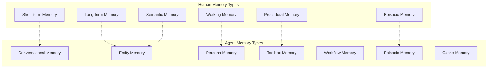

# Memory Types and Architecture

Now that we understand why memory matters, let's explore the different types of memory that make agents truly intelligent. We'll implement each type with simple, practical examples—just like Richmond Alake demonstrated in his MongoDB talk.

## The Memory Landscape

Richmond showed us that agents need different types of memory, just like humans:

<Diagram>

</Diagram>

<Callout type="insight" title="MongoDB as Memory Provider">
"MongoDB is the memory provider for agentic systems" - Richmond Alake. The flexible document model can adapt to any memory structure you need.
</Callout>

## 1. Conversational Memory

The most basic type—remembering what was said.

### Simple Implementation

<CodeExample language="typescript" title="Basic Conversation Memory">
interface ConversationMemory {
  conversationId: string;
  messages: Message[];
  lastActivity: Date;
}

interface Message {
  role: 'user' | 'agent';
  content: string;
  timestamp: Date;
}
</CodeExample>

Let's store conversations in MongoDB:

<CodeExample language="javascript" title="Storing Conversations">
// Store a new message
async function storeMessage(conversationId, role, content) {
  const message = {
    role,
    content,
    timestamp: new Date()
  };
  
  await db.collection('conversations').updateOne(
    { conversationId },
    { 
      $push: { messages: message },
      $set: { lastActivity: new Date() }
    },
    { upsert: true }
  );
}
</CodeExample>

Retrieve recent conversation context:

<CodeExample language="javascript" title="Getting Conversation Context">
async function getRecentMessages(conversationId, limit = 10) {
  const conversation = await db.collection('conversations').findOne(
    { conversationId },
    { 
      messages: { $slice: -limit }  // Get last N messages
    }
  );
  
  return conversation?.messages || [];
}
</CodeExample>

## 2. Persona Memory

Richmond demonstrated this when OpenAI added personality to ChatGPT. Persona memory shapes how your agent behaves.

### MongoDB Document Example

<CodeExample language="javascript" title="Persona Memory Document">
// This is how Richmond showed persona memory in MongoDB
const personaMemory = {
  agentId: "customer-support-bot",
  personality: {
    tone: "friendly and professional",
    style: "concise but helpful",
    expertise: ["product knowledge", "troubleshooting"]
  },
  responses: {
    greeting: "Hi! I'm here to help with any questions.",
    clarification: "Could you help me understand...",
    closing: "Is there anything else I can help with?"
  },
  preferences: {
    formatResponses: "bullet points",
    maxResponseLength: 200
  }
};
</CodeExample>

Simple persona retrieval:

<CodeExample language="javascript" title="Using Persona Memory">
async function getPersona(agentId) {
  return await db.collection('personas').findOne({ agentId });
}

function formatResponse(content, persona) {
  if (persona.preferences.formatResponses === "bullet points") {
    return content.split('.').map(s => `• ${s.trim()}`).join('\n');
  }
  return content;
}
</CodeExample>

## 3. Toolbox Memory

Richmond explained: "When you use your database as a toolbox where you're storing the JSON schema of your tools in MongoDB, you can scale."

### Tool Storage Pattern

<CodeExample language="javascript" title="Toolbox Memory Document">
const toolMemory = {
  toolId: "send-email",
  name: "Send Email",
  description: "Send an email to a specified recipient",
  schema: {
    type: "function",
    parameters: {
      type: "object",
      properties: {
        to: { type: "string" },
        subject: { type: "string" },
        body: { type: "string" }
      }
    }
  },
  usage: {
    successCount: 42,
    lastUsed: new Date(),
    averageExecutionTime: 1200
  }
};
</CodeExample>

Find the right tool for the job:

<CodeExample language="javascript" title="Tool Selection">
async function findRelevantTools(userIntent) {
  return await db.collection('tools').find({
    $or: [
      { name: { $regex: userIntent, $options: 'i' } },
      { description: { $regex: userIntent, $options: 'i' } }
    ]
  }).limit(5).toArray();
}
</CodeExample>

Update tool usage statistics:

<CodeExample language="javascript" title="Track Tool Usage">
async function recordToolUsage(toolId, executionTime, success) {
  await db.collection('tools').updateOne(
    { toolId },
    {
      $inc: { 
        'usage.successCount': success ? 1 : 0,
        'usage.totalUsage': 1
      },
      $set: { 
        'usage.lastUsed': new Date(),
        'usage.averageExecutionTime': executionTime
      }
    }
  );
}
</CodeExample>

## 4. Entity Memory

Track information about people, places, and things in your conversations.

### Entity Document Pattern

<CodeExample language="javascript" title="Entity Memory Document">
const entityMemory = {
  entityId: "user-alice-123",
  name: "Alice Johnson",
  type: "person",
  attributes: {
    role: "Software Engineer",
    company: "TechCorp",
    preferences: ["Python", "Machine Learning"],
    timezone: "PST"
  },
  relationships: [
    { type: "works_with", entity: "user-bob-456" },
    { type: "manages", entity: "project-ml-pipeline" }
  ],
  lastSeen: new Date()
};
</CodeExample>

Extract and store entities from conversations:

<CodeExample language="javascript" title="Entity Extraction">
function extractEntities(message) {
  // Simple entity extraction (in practice, use NLP)
  const entities = [];
  
  // Extract names (capitalized words)
  const namePattern = /\b[A-Z][a-z]+\b/g;
  const names = message.match(namePattern);
  
  names?.forEach(name => {
    entities.push({ name, type: "person", confidence: 0.8 });
  });
  
  return entities;
}
</CodeExample>

Store entity information:

<CodeExample language="javascript" title="Update Entity Memory">
async function updateEntity(entityId, newInfo) {
  await db.collection('entities').updateOne(
    { entityId },
    {
      $set: newInfo,
      $setOnInsert: { firstSeen: new Date() },
      $currentDate: { lastSeen: true }
    },
    { upsert: true }
  );
}
</CodeExample>

## 5. Workflow Memory

Richmond mentioned this as storing "failure experiences" to inform future executions.

### Workflow Document

<CodeExample language="javascript" title="Workflow Memory Document">
const workflowMemory = {
  workflowId: "user-onboarding",
  steps: [
    { name: "collect-email", status: "completed" },
    { name: "send-welcome", status: "failed", error: "email-invalid" },
    { name: "setup-profile", status: "pending" }
  ],
  failures: [
    {
      step: "send-welcome",
      error: "Invalid email format",
      timestamp: new Date(),
      resolution: "Validate email before sending"
    }
  ],
  context: {
    userId: "user-123",
    startTime: new Date()
  }
};
</CodeExample>

Learn from failures:

<CodeExample language="javascript" title="Learning from Failures">
async function recordFailure(workflowId, step, error, resolution) {
  await db.collection('workflows').updateOne(
    { workflowId },
    {
      $push: {
        failures: {
          step,
          error,
          resolution,
          timestamp: new Date()
        }
      }
    }
  );
}

async function getFailureLessons(workflowId, step) {
  const workflow = await db.collection('workflows').findOne({ workflowId });
  return workflow?.failures.filter(f => f.step === step) || [];
}
</CodeExample>

## 6. Episodic Memory

Remember specific interactions and experiences.

### Episode Document

<CodeExample language="javascript" title="Episodic Memory Document">
const episodeMemory = {
  episodeId: "support-ticket-resolution",
  summary: "Helped user resolve login issue",
  participants: ["user-alice-123", "support-agent"],
  outcome: "success",
  duration: 15, // minutes
  keyEvents: [
    { timestamp: new Date(), event: "User reported login issue" },
    { timestamp: new Date(), event: "Agent diagnosed browser cache problem" },
    { timestamp: new Date(), event: "User confirmed resolution" }
  ],
  lessons: [
    "Browser cache issues are common with login problems",
    "Always ask about recent browser updates"
  ]
};
</CodeExample>

## 7. Cache Memory

Short-term, fast-access memory for recent information.

### Cache Implementation

<CodeExample language="javascript" title="Simple Cache Memory">
class CacheMemory {
  constructor(maxSize = 100, ttl = 300000) { // 5 minutes TTL
    this.cache = new Map();
    this.maxSize = maxSize;
    this.ttl = ttl;
  }
  
  set(key, value) {
    // Remove oldest if at capacity
    if (this.cache.size >= this.maxSize) {
      const firstKey = this.cache.keys().next().value;
      this.cache.delete(firstKey);
    }
    
    this.cache.set(key, {
      value,
      timestamp: Date.now()
    });
  }
  
  get(key) {
    const item = this.cache.get(key);
    if (!item) return null;
    
    // Check if expired
    if (Date.now() - item.timestamp > this.ttl) {
      this.cache.delete(key);
      return null;
    }
    
    return item.value;
  }
}
</CodeExample>

## Building a Multi-Memory Agent

Now let's combine these memory types into a simple agent:

<CodeExample language="javascript" title="Memory-Enabled Agent">
class MemoryAgent {
  constructor(agentId, db) {
    this.agentId = agentId;
    this.db = db;
    this.cache = new CacheMemory();
  }
  
  async processMessage(userId, message) {
    // Get persona
    const persona = await this.getPersona();
    
    // Store conversation
    await this.storeMessage(userId, 'user', message);
    
    // Extract entities
    const entities = this.extractEntities(message);
    for (const entity of entities) {
      await this.updateEntity(entity);
    }
    
    // Generate response using all memory types
    const response = await this.generateResponse(userId, message, persona);
    
    // Store agent response
    await this.storeMessage(userId, 'agent', response);
    
    return response;
  }
}
</CodeExample>

## Knowledge Check

<Quiz>
  <Question
    question="According to Richmond Alake, what makes MongoDB ideal for agent memory?"
    options={[
      "It's faster than other databases",
      "The flexible document model can adapt to any memory structure",
      "It has built-in AI capabilities",
      "It's cheaper than other solutions"
    ]}
    correct={1}
    explanation="Richmond emphasized that MongoDB's flexible document model can adapt to any memory structure, making it perfect as a memory provider for agentic systems."
  />
  
  <Question
    question="What is the main advantage of toolbox memory over putting all tools in the context window?"
    options={[
      "Tools run faster",
      "Tools are more secure",
      "You can scale beyond the LLM's context limit",
      "Tools are easier to debug"
    ]}
    correct={2}
    explanation="Richmond explained that storing tools in a database allows you to scale beyond the LLM's context window limits by retrieving only relevant tools as needed."
  />
  
  <Question
    question="Why is workflow memory important for agent reliability?"
    options={[
      "It makes workflows run faster",
      "It allows agents to learn from failures and avoid repeating mistakes",
      "It reduces memory usage",
      "It improves security"
    ]}
    correct={1}
    explanation="Workflow memory captures failure experiences so agents can learn from past mistakes and make better decisions in future executions."
  />
</Quiz>

## Exercise: Build Your Memory System

Create a simple agent that uses multiple memory types:

1. **Conversational Memory**: Store and retrieve chat history
2. **Entity Memory**: Extract and remember user information
3. **Persona Memory**: Give your agent a personality

<CodeExample language="javascript" title="Starter Code Hint">
class MyMemoryAgent {
  async handleMessage(userId, message) {
    // 1. Store the conversation
    await this.storeConversation(userId, message);
    
    // 2. Extract entities (names, preferences, etc.)
    const entities = this.extractEntities(message);
    
    // 3. Get persona to shape response
    const persona = await this.getPersona();
    
    // 4. Generate memory-informed response
    return this.generateResponse(userId, message, entities, persona);
  }
}
</CodeExample>

## Summary

We explored 7 core memory types:

1. **Conversational Memory**: Chat history and context
2. **Persona Memory**: Agent personality and behavior
3. **Toolbox Memory**: Available tools and their usage patterns
4. **Entity Memory**: Information about people, places, and things
5. **Workflow Memory**: Process states and failure lessons
6. **Episodic Memory**: Specific interaction experiences
7. **Cache Memory**: Fast-access temporary storage

<Callout type="success" title="MongoDB Document Flexibility">
Each memory type maps naturally to MongoDB documents, giving you the flexibility to store any structure while maintaining powerful query capabilities.
</Callout>

## Next Steps

In the next module, we'll build a unified memory management system that coordinates all these memory types, handling storage, retrieval, and memory lifecycle management.

<Callout type="info" title="Memory is the Foundation">
These memory types form the foundation of intelligent agents. In production systems, they work together to create agents that are truly believable, capable, and reliable.
</Callout>