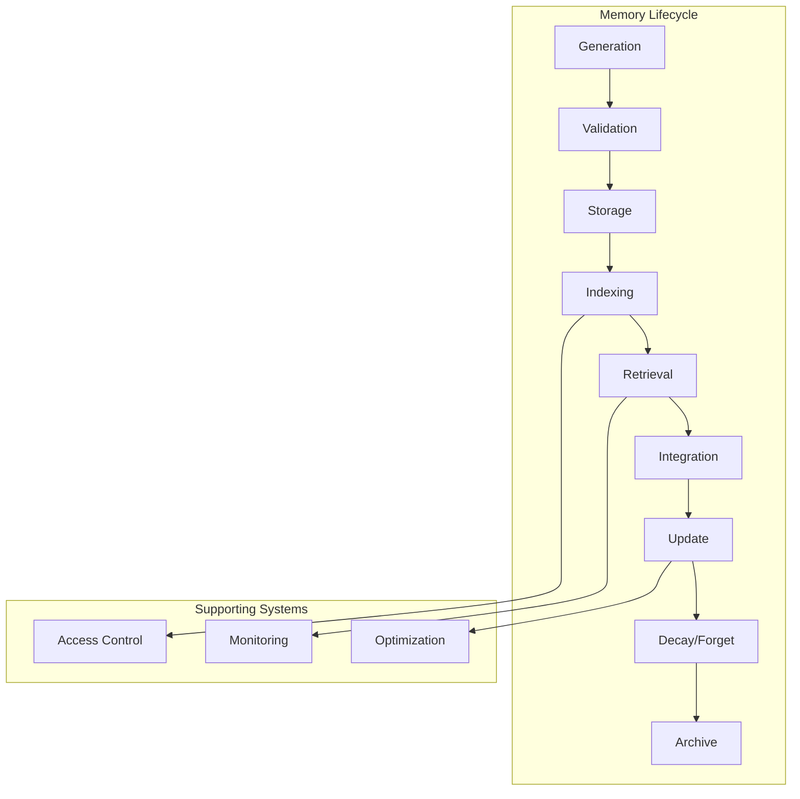

# Building Memory Management Systems

Having explored the different memory types, it's time to build the infrastructure that brings them all together. In this module, we'll create a comprehensive memory management system that handles the full lifecycle of memories—from generation to forgetting.

## The Memory Management Challenge

As Richmond Alake emphasized in his talk, memory management isn't just about storage. It's about intelligently organizing information in a way that makes agents believable, capable, and reliable.

<Callout type="insight" title="The Context Window Trap">
Having large context windows (like 100K+ tokens) doesn't mean you should stuff everything in there. That's like trying to remember your entire life history every time someone asks your name. Memory management is about putting the RIGHT information in the context at the RIGHT time.
</Callout>

## Core Components of Memory Management

<Diagram>

</Diagram>

## Building the Unified Memory Manager

Let's create a production-ready memory management system:

<CodeExample language="typescript">
interface MemoryManager {
  generate(input: any, context: Context): Promise<Memory[]>;
  validate(memory: Memory): Promise<ValidationResult>;
  store(memory: Memory): Promise<string>;
  retrieve(query: Query): Promise<Memory[]>;
  integrate(memories: Memory[]): Promise<IntegratedContext>;
  update(memoryId: string, updates: Partial<Memory>): Promise<void>;
  forget(criteria: ForgetCriteria): Promise<void>;
  archive(criteria: ArchiveCriteria): Promise<void>;
}

interface Memory {
  id: string;
  type: MemoryType;
  content: any;
  metadata: MemoryMetadata;
  signals: MemorySignals;
  access: AccessControl;
  lifecycle: LifecycleInfo;
}

interface MemoryMetadata {
  source: string;
  timestamp: Date;
  confidence: number;
  tags: string[];
  relatedMemories: string[];
  embedding?: number[];
  checksum: string;
}

interface MemorySignals {
  recency: number;
  frequency: number;
  importance: number;
  emotionalWeight: number;
  surprise: number;
  utility: number;
}

class UnifiedMemoryManager implements MemoryManager {
  private memoryTypes: Map<MemoryType, BaseMemoryHandler>;
  private storage: StorageBackend;
  private indexer: MemoryIndexer;
  private validator: MemoryValidator;
  private signalProcessor: SignalProcessor;
  private accessController: AccessController;
  
  constructor(config: MemoryConfig) {
    this.initializeComponents(config);
    this.setupMemoryTypes();
    this.startBackgroundProcesses();
  }

  async generate(input: any, context: Context): Promise<Memory[]> {
    const memories: Memory[] = [];
    
    // Parallel memory extraction
    const extractionTasks = Array.from(this.memoryTypes.entries()).map(
      async ([type, handler]) => {
        try {
          const extracted = await handler.extract(input, context);
          return extracted.map(content => this.createMemory(type, content, context));
        } catch (error) {
          console.error(`Failed to extract ${type} memories:`, error);
          return [];
        }
      }
    );
    
    const results = await Promise.all(extractionTasks);
    memories.push(...results.flat());
    
    // Deduplicate and enrich
    return await this.enrichMemories(this.deduplicateMemories(memories));
  }

  private createMemory(type: MemoryType, content: any, context: Context): Memory {
    const id = this.generateMemoryId(type, content);
    
    return {
      id,
      type,
      content,
      metadata: {
        source: context.source,
        timestamp: new Date(),
        confidence: this.calculateConfidence(content, context),
        tags: this.generateTags(content, type),
        relatedMemories: [],
        checksum: this.generateChecksum(content)
      },
      signals: {
        recency: 1.0,
        frequency: 1.0,
        importance: this.calculateImportance(content, context),
        emotionalWeight: this.calculateEmotionalWeight(content),
        surprise: this.calculateSurprise(content, context),
        utility: 0.5 // Initial neutral utility
      },
      access: {
        owner: context.userId,
        permissions: this.getDefaultPermissions(type),
        encryption: this.shouldEncrypt(content, type)
      },
      lifecycle: {
        created: new Date(),
        lastAccessed: new Date(),
        lastModified: new Date(),
        accessCount: 0,
        stage: 'active'
      }
    };
  }

  async validate(memory: Memory): Promise<ValidationResult> {
    const checks = [
      this.validator.checkSchema(memory),
      this.validator.checkIntegrity(memory),
      this.validator.checkConsistency(memory),
      this.validator.checkPermissions(memory),
      this.validator.checkCompliance(memory)
    ];
    
    const results = await Promise.all(checks);
    
    return {
      valid: results.every(r => r.valid),
      errors: results.flatMap(r => r.errors || []),
      warnings: results.flatMap(r => r.warnings || [])
    };
  }

  async store(memory: Memory): Promise<string> {
    // Validate before storage
    const validation = await this.validate(memory);
    if (!validation.valid) {
      throw new ValidationError('Memory validation failed', validation.errors);
    }
    
    // Encrypt if necessary
    if (memory.access.encryption) {
      memory.content = await this.encrypt(memory.content, memory.access.owner);
    }
    
    // Store in appropriate backend
    const stored = await this.storage.store(memory);
    
    // Index for retrieval
    await this.indexer.index(memory);
    
    // Update relationships
    await this.updateRelationships(memory);
    
    return stored.id;
  }

  async retrieve(query: Query): Promise<Memory[]> {
    // Check access permissions
    const permissions = await this.accessController.checkPermissions(
      query.userId,
      query.requestedMemoryTypes
    );
    
    if (!permissions.allowed) {
      throw new AccessError('Insufficient permissions for memory access');
    }
    
    // Multi-strategy retrieval
    const strategies = this.selectRetrievalStrategies(query);
    const retrievalTasks = strategies.map(strategy => 
      this.executeRetrievalStrategy(strategy, query, permissions)
    );
    
    const results = await Promise.all(retrievalTasks);
    const memories = this.mergeRetrievalResults(results);
    
    // Update access metadata
    await this.updateAccessMetadata(memories);
    
    // Apply signal-based filtering
    return this.applySignalFiltering(memories, query);
  }

  private selectRetrievalStrategies(query: Query): RetrievalStrategy[] {
    const strategies: RetrievalStrategy[] = [];
    
    // Always include recent memories
    strategies.push({
      type: 'temporal',
      params: { window: query.temporalWindow || 3600000 } // 1 hour default
    });
    
    // Vector search if query has natural language
    if (query.text) {
      strategies.push({
        type: 'vector',
        params: { 
          text: query.text, 
          topK: query.limit || 20,
          threshold: query.similarityThreshold || 0.7
        }
      });
    }
    
    // Keyword search
    if (query.keywords) {
      strategies.push({
        type: 'keyword',
        params: { keywords: query.keywords, fuzzy: true }
      });
    }
    
    // Graph traversal for related memories
    if (query.startMemoryId) {
      strategies.push({
        type: 'graph',
        params: { 
          startId: query.startMemoryId, 
          maxDepth: query.graphDepth || 2,
          relationTypes: query.relationTypes
        }
      });
    }
    
    // Tag-based retrieval
    if (query.tags) {
      strategies.push({
        type: 'tag',
        params: { tags: query.tags, matchAll: query.tagMatchAll }
      });
    }
    
    return strategies;
  }

  async integrate(memories: Memory[]): Promise<IntegratedContext> {
    // Sort by relevance and signals
    const prioritized = this.prioritizeMemories(memories);
    
    // Check for conflicts
    const conflicts = this.detectConflicts(prioritized);
    
    // Build integrated context
    const context: IntegratedContext = {
      primary: prioritized.slice(0, 5), // Most relevant memories
      supporting: prioritized.slice(5, 20), // Additional context
      conflicts: conflicts,
      summary: await this.generateContextSummary(prioritized),
      confidence: this.calculateContextConfidence(prioritized, conflicts),
      recommendations: await this.generateRecommendations(prioritized)
    };
    
    // Resolve conflicts if possible
    if (conflicts.length > 0) {
      context.resolutions = await this.resolveConflicts(conflicts);
    }
    
    return context;
  }

  private prioritizeMemories(memories: Memory[]): Memory[] {
    return memories
      .map(memory => ({
        memory,
        score: this.calculateMemoryScore(memory)
      }))
      .sort((a, b) => b.score - a.score)
      .map(item => item.memory);
  }

  private calculateMemoryScore(memory: Memory): number {
    const weights = {
      recency: 0.25,
      frequency: 0.15,
      importance: 0.3,
      emotionalWeight: 0.1,
      surprise: 0.1,
      utility: 0.1
    };
    
    return Object.entries(weights).reduce((score, [signal, weight]) => {
      return score + (memory.signals[signal] * weight);
    }, 0);
  }

  async update(memoryId: string, updates: Partial<Memory>): Promise<void> {
    // Retrieve current memory
    const current = await this.storage.get(memoryId);
    if (!current) throw new MemoryNotFoundError(memoryId);
    
    // Check permissions
    const canUpdate = await this.accessController.canUpdate(
      updates.access?.owner || current.access.owner,
      current
    );
    
    if (!canUpdate) {
      throw new AccessError('Cannot update memory: insufficient permissions');
    }
    
    // Merge updates
    const updated = this.mergeMemory(current, updates);
    
    // Update signals
    updated.signals.frequency += 0.1;
    updated.lifecycle.lastModified = new Date();
    
    // Validate updated memory
    const validation = await this.validate(updated);
    if (!validation.valid) {
      throw new ValidationError('Updated memory validation failed', validation.errors);
    }
    
    // Store updated memory
    await this.storage.update(memoryId, updated);
    
    // Re-index
    await this.indexer.reindex(updated);
  }

  async forget(criteria: ForgetCriteria): Promise<void> {
    // Implement gradual forgetting, not deletion
    const memoriesToForget = await this.findMemories(criteria);
    
    for (const memory of memoriesToForget) {
      // Calculate forgetting rate based on criteria
      const forgettingRate = this.calculateForgettingRate(memory, criteria);
      
      // Update memory signals
      memory.signals.recency *= (1 - forgettingRate);
      memory.signals.utility *= (1 - forgettingRate);
      
      // Move through lifecycle stages
      if (memory.signals.recency < 0.1) {
        memory.lifecycle.stage = 'dormant';
      }
      
      if (memory.signals.recency < 0.01) {
        memory.lifecycle.stage = 'archived';
        await this.archive({ memoryIds: [memory.id] });
      }
      
      await this.storage.update(memory.id, memory);
    }
  }

  private calculateForgettingRate(memory: Memory, criteria: ForgetCriteria): number {
    let rate = criteria.baseRate || 0.1;
    
    // Adjust based on memory characteristics
    if (memory.signals.importance < 0.3) rate *= 1.5;
    if (memory.signals.frequency < 0.2) rate *= 1.3;
    if (memory.signals.utility < 0.4) rate *= 1.2;
    
    // Protect important memories
    if (memory.signals.importance > 0.8) rate *= 0.5;
    if (memory.signals.emotionalWeight > 0.7) rate *= 0.6;
    
    return Math.min(rate, 0.5); // Cap at 50% forgetting per cycle
  }

  async archive(criteria: ArchiveCriteria): Promise<void> {
    const memories = await this.findMemories(criteria);
    
    for (const memory of memories) {
      // Compress memory for long-term storage
      const compressed = await this.compressMemory(memory);
      
      // Move to archive storage
      await this.storage.archive(compressed);
      
      // Remove from active storage
      await this.storage.delete(memory.id);
      
      // Update indexes
      await this.indexer.removeFromActive(memory.id);
      await this.indexer.addToArchive(compressed);
    }
  }

  // Background processes
  private startBackgroundProcesses() {
    // Signal decay process
    setInterval(() => this.decaySignals(), 3600000); // Every hour
    
    // Memory consolidation
    setInterval(() => this.consolidateMemories(), 86400000); // Daily
    
    // Garbage collection
    setInterval(() => this.cleanupMemories(), 3600000); // Every hour
    
    // Performance optimization
    setInterval(() => this.optimizeIndexes(), 86400000); // Daily
  }

  private async decaySignals() {
    const recentCutoff = new Date(Date.now() - 86400000); // 24 hours
    
    const memories = await this.storage.findByQuery({
      'lifecycle.lastAccessed': { $lt: recentCutoff }
    });
    
    for (const memory of memories) {
      // Apply time-based decay
      const hoursSinceAccess = 
        (Date.now() - memory.lifecycle.lastAccessed.getTime()) / 3600000;
      
      memory.signals.recency *= Math.exp(-0.1 * hoursSinceAccess);
      
      await this.storage.update(memory.id, memory);
    }
  }

  private async consolidateMemories() {
    // Find related memories that can be consolidated
    const candidates = await this.findConsolidationCandidates();
    
    for (const group of candidates) {
      if (group.length < 2) continue;
      
      // Create consolidated memory
      const consolidated = await this.createConsolidatedMemory(group);
      
      // Store new memory
      await this.store(consolidated);
      
      // Archive originals
      await this.archive({ memoryIds: group.map(m => m.id) });
    }
  }
}
</CodeExample>

## Implementing Retrieval Strategies

Effective retrieval is crucial for memory systems. Let's implement sophisticated retrieval strategies:

<CodeExample language="typescript">
interface RetrievalEngine {
  vector: VectorRetrieval;
  keyword: KeywordRetrieval;
  graph: GraphRetrieval;
  temporal: TemporalRetrieval;
  hybrid: HybridRetrieval;
}

class VectorRetrieval {
  constructor(
    private embedder: EmbeddingService,
    private vectorDB: VectorDatabase
  ) {}

  async search(query: string, options: VectorSearchOptions): Promise<Memory[]> {
    // Generate query embedding
    const queryEmbedding = await this.embedder.embed(query);
    
    // Search with pre-filtering
    const results = await this.vectorDB.search({
      vector: queryEmbedding,
      topK: options.topK || 20,
      filter: options.filter,
      includeDistance: true
    });
    
    // Post-process results
    return results
      .filter(r => r.distance >= (options.threshold || 0.7))
      .map(r => ({
        ...r.memory,
        relevanceScore: r.distance
      }));
  }

  async searchWithReranking(
    query: string, 
    options: VectorSearchOptions
  ): Promise<Memory[]> {
    // Initial retrieval
    const candidates = await this.search(query, {
      ...options,
      topK: (options.topK || 20) * 3 // Over-retrieve for reranking
    });
    
    // Rerank using cross-encoder
    const reranked = await this.rerank(query, candidates);
    
    return reranked.slice(0, options.topK || 20);
  }

  private async rerank(query: string, candidates: Memory[]): Promise<Memory[]> {
    // Use a cross-encoder model for more accurate ranking
    const scores = await Promise.all(
      candidates.map(memory => 
        this.crossEncoder.score(query, this.memoryToText(memory))
      )
    );
    
    return candidates
      .map((memory, i) => ({ memory, score: scores[i] }))
      .sort((a, b) => b.score - a.score)
      .map(item => item.memory);
  }
}

class GraphRetrieval {
  constructor(private graphDB: GraphDatabase) {}

  async traverse(
    startId: string, 
    options: GraphTraversalOptions
  ): Promise<Memory[]> {
    const visited = new Set<string>();
    const results: Memory[] = [];
    
    const traverse = async (id: string, depth: number, path: string[]) => {
      if (depth > options.maxDepth || visited.has(id)) return;
      visited.add(id);
      
      const memory = await this.graphDB.getNode(id);
      if (!memory) return;
      
      // Calculate relevance based on path
      memory.graphRelevance = this.calculatePathRelevance(path, options);
      results.push(memory);
      
      // Get connected memories
      const edges = await this.graphDB.getEdges(id, {
        types: options.relationTypes,
        direction: options.direction || 'both'
      });
      
      // Sort by edge weight for selective expansion
      const sortedEdges = edges.sort((a, b) => b.weight - a.weight);
      
      // Traverse top connections
      for (const edge of sortedEdges.slice(0, options.branchingFactor || 5)) {
        await traverse(edge.targetId, depth + 1, [...path, edge.type]);
      }
    };
    
    await traverse(startId, 0, []);
    
    return results.sort((a, b) => b.graphRelevance - a.graphRelevance);
  }

  async findCommunities(options: CommunityDetectionOptions): Promise<MemoryCommunity[]> {
    // Use Louvain algorithm for community detection
    const communities = await this.graphDB.detectCommunities({
      algorithm: 'louvain',
      resolution: options.resolution || 1.0
    });
    
    return communities.map(community => ({
      id: community.id,
      memories: community.nodes,
      cohesion: community.modularity,
      centralMemories: this.findCentralNodes(community),
      theme: this.extractCommunityTheme(community)
    }));
  }
}

class HybridRetrieval {
  constructor(
    private vector: VectorRetrieval,
    private keyword: KeywordRetrieval,
    private graph: GraphRetrieval,
    private temporal: TemporalRetrieval
  ) {}

  async search(query: Query): Promise<Memory[]> {
    // Parallel multi-strategy search
    const strategies = [];
    
    if (query.text) {
      strategies.push(this.vector.search(query.text, query.vectorOptions));
    }
    
    if (query.keywords) {
      strategies.push(this.keyword.search(query.keywords, query.keywordOptions));
    }
    
    if (query.temporalRange) {
      strategies.push(this.temporal.search(query.temporalRange));
    }
    
    if (query.graphStart) {
      strategies.push(this.graph.traverse(query.graphStart, query.graphOptions));
    }
    
    const results = await Promise.all(strategies);
    
    // Reciprocal Rank Fusion
    return this.reciprocalRankFusion(results);
  }

  private reciprocalRankFusion(resultSets: Memory[][]): Memory[] {
    const k = 60; // Fusion constant
    const scoreMap = new Map<string, number>();
    
    for (const results of resultSets) {
      results.forEach((memory, rank) => {
        const currentScore = scoreMap.get(memory.id) || 0;
        scoreMap.set(memory.id, currentScore + 1 / (k + rank + 1));
      });
    }
    
    // Sort by fused score
    const fusedResults = Array.from(scoreMap.entries())
      .sort((a, b) => b[1] - a[1])
      .map(([id, score]) => ({ id, score }));
    
    // Retrieve full memories
    return this.retrieveByIds(fusedResults.map(r => r.id));
  }
}

class AdaptiveRetrieval {
  private performanceHistory: Map<string, RetrievalPerformance> = new Map();
  
  async retrieve(query: Query, feedback?: RetrievalFeedback): Promise<Memory[]> {
    // Learn from feedback
    if (feedback) {
      await this.updatePerformanceModel(feedback);
    }
    
    // Select strategy based on query characteristics and past performance
    const strategy = this.selectOptimalStrategy(query);
    
    // Execute retrieval
    const results = await strategy.execute(query);
    
    // Track performance
    const trackingId = this.startPerformanceTracking(query, strategy);
    
    return {
      memories: results,
      trackingId // For feedback loop
    };
  }

  private selectOptimalStrategy(query: Query): RetrievalStrategy {
    const queryFeatures = this.extractQueryFeatures(query);
    const historicalPerformance = this.getHistoricalPerformance(queryFeatures);
    
    // Multi-armed bandit approach
    if (Math.random() < 0.1) {
      // Exploration: try random strategy
      return this.selectRandomStrategy();
    } else {
      // Exploitation: use best performing strategy
      return this.selectBestStrategy(queryFeatures, historicalPerformance);
    }
  }

  private extractQueryFeatures(query: Query): QueryFeatures {
    return {
      hasNaturalLanguage: !!query.text,
      queryLength: query.text?.length || 0,
      hasKeywords: !!query.keywords,
      keywordCount: query.keywords?.length || 0,
      hasTemporalConstraint: !!query.temporalRange,
      temporalSpan: this.calculateTemporalSpan(query.temporalRange),
      expectedResultCount: query.limit || 10,
      memoryTypes: query.memoryTypes || []
    };
  }
}
</CodeExample>

## Memory Integration and Context Building

Creating coherent context from multiple memories is crucial:

<CodeExample language="typescript">
class ContextBuilder {
  async buildContext(
    memories: Memory[], 
    goal: string,
    constraints: ContextConstraints
  ): Promise<StructuredContext> {
    // Group memories by type and relevance
    const grouped = this.groupMemories(memories);
    
    // Build hierarchical context
    const context: StructuredContext = {
      goal,
      primary: await this.selectPrimaryMemories(grouped, goal),
      supporting: await this.selectSupportingMemories(grouped, goal),
      background: await this.selectBackgroundMemories(grouped),
      conflicts: await this.identifyConflicts(memories),
      gaps: await this.identifyGaps(memories, goal),
      metadata: {
        totalMemories: memories.length,
        confidence: this.calculateConfidence(memories),
        completeness: this.calculateCompleteness(memories, goal)
      }
    };
    
    // Apply constraints
    return this.applyConstraints(context, constraints);
  }

  private async selectPrimaryMemories(
    grouped: GroupedMemories, 
    goal: string
  ): Promise<Memory[]> {
    const scorer = new RelevanceScorer(goal);
    const primary = [];
    
    // Prioritize procedural memories for task execution
    if (grouped.procedural.length > 0) {
      const relevant = await scorer.score(grouped.procedural);
      primary.push(...relevant.slice(0, 3));
    }
    
    // Add recent episodic memories
    if (grouped.episodic.length > 0) {
      const recent = grouped.episodic
        .filter(m => m.signals.recency > 0.7)
        .slice(0, 2);
      primary.push(...recent);
    }
    
    // Include critical entities
    if (grouped.entity.length > 0) {
      const critical = grouped.entity
        .filter(m => m.signals.importance > 0.8)
        .slice(0, 2);
      primary.push(...critical);
    }
    
    return primary;
  }

  async resolveConflicts(conflicts: Conflict[]): Promise<Resolution[]> {
    const resolutions = [];
    
    for (const conflict of conflicts) {
      const resolution = await this.resolveConflict(conflict);
      resolutions.push(resolution);
    }
    
    return resolutions;
  }

  private async resolveConflict(conflict: Conflict): Promise<Resolution> {
    // Strategy pattern for conflict resolution
    const strategies = {
      recency: () => this.resolveByRecency(conflict),
      confidence: () => this.resolveByConfidence(conflict),
      source: () => this.resolveBySourceReliability(conflict),
      consensus: () => this.resolveByConsensus(conflict),
      context: () => this.resolveByContext(conflict)
    };
    
    // Select resolution strategy based on conflict type
    const strategy = this.selectResolutionStrategy(conflict);
    const resolution = await strategies[strategy]();
    
    return {
      conflictId: conflict.id,
      strategy,
      resolution: resolution.memory,
      confidence: resolution.confidence,
      explanation: resolution.explanation
    };
  }

  async generateSummary(context: StructuredContext): Promise<ContextSummary> {
    // Create natural language summary
    const summary = await this.llm.generate({
      prompt: this.buildSummaryPrompt(context),
      maxTokens: 200
    });
    
    // Extract key points
    const keyPoints = this.extractKeyPoints(context);
    
    // Identify action items
    const actionItems = this.extractActionItems(context);
    
    return {
      text: summary,
      keyPoints,
      actionItems,
      confidence: context.metadata.confidence,
      warnings: this.generateWarnings(context)
    };
  }
}

class MemoryCompressor {
  async compress(memories: Memory[]): Promise<CompressedMemory> {
    // Group similar memories
    const clusters = await this.clusterMemories(memories);
    
    // Compress each cluster
    const compressed = await Promise.all(
      clusters.map(cluster => this.compressCluster(cluster))
    );
    
    return {
      original: memories.length,
      compressed: compressed.length,
      ratio: compressed.length / memories.length,
      data: compressed,
      index: this.buildCompressionIndex(memories, compressed)
    };
  }

  private async compressCluster(cluster: Memory[]): Promise<Memory> {
    // Extract common patterns
    const patterns = this.extractPatterns(cluster);
    
    // Create representative memory
    const representative: Memory = {
      id: this.generateCompressedId(cluster),
      type: cluster[0].type,
      content: {
        summary: await this.summarizeContent(cluster),
        patterns,
        exampleIds: cluster.slice(0, 3).map(m => m.id),
        count: cluster.length
      },
      metadata: {
        source: 'compression',
        timestamp: new Date(),
        confidence: this.calculateAverageConfidence(cluster),
        tags: this.mergeTags(cluster),
        relatedMemories: cluster.map(m => m.id),
        checksum: this.generateChecksum(patterns)
      },
      signals: this.mergeSignals(cluster),
      access: this.mergeAccess(cluster),
      lifecycle: {
        created: new Date(),
        lastAccessed: new Date(),
        lastModified: new Date(),
        accessCount: cluster.reduce((sum, m) => sum + m.lifecycle.accessCount, 0),
        stage: 'compressed'
      }
    };
    
    return representative;
  }
}
</CodeExample>

## Implementing Memory Signals

Richmond's concept of memory signals helps determine what to remember and what to forget:

<CodeExample language="typescript">
interface SignalProcessor {
  calculate(memory: Memory, context: Context): MemorySignals;
  update(memory: Memory, interaction: Interaction): MemorySignals;
  decay(signals: MemorySignals, timeDelta: number): MemorySignals;
  combine(signals: MemorySignals[]): MemorySignals;
}

class AdvancedSignalProcessor implements SignalProcessor {
  calculate(memory: Memory, context: Context): MemorySignals {
    return {
      recency: this.calculateRecency(memory),
      frequency: this.calculateFrequency(memory),
      importance: this.calculateImportance(memory, context),
      emotionalWeight: this.calculateEmotionalWeight(memory),
      surprise: this.calculateSurprise(memory, context),
      utility: this.calculateUtility(memory, context)
    };
  }

  private calculateRecency(memory: Memory): number {
    const ageInHours = (Date.now() - memory.lifecycle.lastAccessed.getTime()) / 3600000;
    
    // Exponential decay with different rates for different memory types
    const decayRates = {
      working: 0.5,      // Fast decay (half-life: 1.4 hours)
      conversational: 0.1, // Medium decay (half-life: 7 hours)
      episodic: 0.05,    // Slow decay (half-life: 14 hours)
      semantic: 0.01,    // Very slow decay (half-life: 70 hours)
      procedural: 0.005  // Minimal decay (half-life: 140 hours)
    };
    
    const rate = decayRates[memory.type] || 0.1;
    return Math.exp(-rate * ageInHours);
  }

  private calculateFrequency(memory: Memory): number {
    const accessCount = memory.lifecycle.accessCount;
    const ageInDays = (Date.now() - memory.lifecycle.created.getTime()) / 86400000;
    
    // Logarithmic scaling with time normalization
    const normalizedFrequency = accessCount / Math.max(1, ageInDays);
    return Math.min(1, Math.log(1 + normalizedFrequency) / Math.log(10));
  }

  private calculateImportance(memory: Memory, context: Context): number {
    let importance = 0.5; // Base importance
    
    // Type-based importance
    const typeImportance = {
      procedural: 0.8,   // How-to knowledge is valuable
      semantic: 0.7,     // Facts are important
      entity: 0.6,       // People/things matter
      episodic: 0.5,     // Experiences are contextual
      conversational: 0.3 // Conversations are transient
    };
    
    importance = typeImportance[memory.type] || importance;
    
    // Context-based adjustments
    if (this.isRelevantToGoal(memory, context.goal)) {
      importance *= 1.5;
    }
    
    if (this.involvesCriticalEntity(memory, context)) {
      importance *= 1.3;
    }
    
    if (memory.metadata.tags.includes('critical')) {
      importance *= 1.4;
    }
    
    return Math.min(1, importance);
  }

  private calculateEmotionalWeight(memory: Memory): number {
    // Analyze emotional content
    const emotions = this.detectEmotions(memory.content);
    
    if (emotions.length === 0) return 0.1;
    
    // Strong emotions make memories more persistent
    const maxIntensity = Math.max(...emotions.map(e => e.intensity));
    const emotionalDiversity = emotions.length / 6; // Assume 6 basic emotions
    
    return Math.min(1, maxIntensity * 0.7 + emotionalDiversity * 0.3);
  }

  private calculateSurprise(memory: Memory, context: Context): number {
    // Compare with expectations
    const expected = this.getExpectedValue(memory.type, context);
    const actual = memory.content;
    
    // Calculate divergence
    const divergence = this.calculateDivergence(expected, actual);
    
    // Novel information is more memorable
    return Math.tanh(divergence * 2); // Sigmoid-like scaling
  }

  private calculateUtility(memory: Memory, context: Context): number {
    let utility = 0.5; // Base utility
    
    // How often was this memory useful?
    const usefulness = memory.metadata.useCount / 
      Math.max(1, memory.lifecycle.accessCount);
    
    utility = utility * 0.3 + usefulness * 0.7;
    
    // Predictive utility
    if (this.predictsOutcome(memory, context)) {
      utility *= 1.3;
    }
    
    // Problem-solving utility
    if (this.solvesProblem(memory, context)) {
      utility *= 1.5;
    }
    
    return Math.min(1, utility);
  }

  update(memory: Memory, interaction: Interaction): MemorySignals {
    const current = memory.signals;
    
    // Update based on interaction type
    const updates = {
      recency: 1.0, // Reset to maximum
      frequency: current.frequency + 0.1,
      importance: this.updateImportance(current.importance, interaction),
      emotionalWeight: this.updateEmotionalWeight(current.emotionalWeight, interaction),
      surprise: current.surprise * 0.9, // Surprise decays
      utility: this.updateUtility(current.utility, interaction)
    };
    
    // Apply bounds
    return this.applyBounds(updates);
  }

  decay(signals: MemorySignals, timeDelta: number): MemorySignals {
    const hoursElapsed = timeDelta / 3600000;
    
    return {
      recency: signals.recency * Math.exp(-0.1 * hoursElapsed),
      frequency: signals.frequency * Math.exp(-0.01 * hoursElapsed),
      importance: signals.importance, // Importance doesn't decay
      emotionalWeight: signals.emotionalWeight * Math.exp(-0.05 * hoursElapsed),
      surprise: signals.surprise * Math.exp(-0.2 * hoursElapsed),
      utility: signals.utility * Math.exp(-0.02 * hoursElapsed)
    };
  }

  combine(signals: MemorySignals[]): MemorySignals {
    if (signals.length === 0) return this.defaultSignals();
    
    // Weighted combination based on signal confidence
    const weights = signals.map(s => this.calculateSignalConfidence(s));
    const totalWeight = weights.reduce((sum, w) => sum + w, 0);
    
    const combined = {
      recency: 0,
      frequency: 0,
      importance: 0,
      emotionalWeight: 0,
      surprise: 0,
      utility: 0
    };
    
    signals.forEach((signal, i) => {
      const weight = weights[i] / totalWeight;
      Object.keys(combined).forEach(key => {
        combined[key] += signal[key] * weight;
      });
    });
    
    return combined;
  }
}

// Forgetting mechanism based on signals
class ForgettingEngine {
  private thresholds = {
    archive: { recency: 0.1, utility: 0.2 },
    compress: { recency: 0.3, frequency: 0.2 },
    maintain: { importance: 0.7, emotionalWeight: 0.6 }
  };

  async processMemories(memories: Memory[]): Promise<ForgettingActions> {
    const actions: ForgettingActions = {
      archive: [],
      compress: [],
      maintain: [],
      boost: []
    };
    
    for (const memory of memories) {
      const action = this.determineAction(memory);
      actions[action].push(memory);
    }
    
    return actions;
  }

  private determineAction(memory: Memory): 'archive' | 'compress' | 'maintain' | 'boost' {
    const signals = memory.signals;
    
    // Protect important memories
    if (signals.importance > this.thresholds.maintain.importance ||
        signals.emotionalWeight > this.thresholds.maintain.emotionalWeight) {
      return 'maintain';
    }
    
    // Boost frequently accessed memories
    if (signals.frequency > 0.8 && signals.utility > 0.7) {
      return 'boost';
    }
    
    // Archive old, unused memories
    if (signals.recency < this.thresholds.archive.recency &&
        signals.utility < this.thresholds.archive.utility) {
      return 'archive';
    }
    
    // Compress similar, medium-value memories
    if (signals.recency < this.thresholds.compress.recency &&
        signals.frequency < this.thresholds.compress.frequency) {
      return 'compress';
    }
    
    return 'maintain';
  }

  async implementForgetting(actions: ForgettingActions): Promise<void> {
    // Archive old memories
    if (actions.archive.length > 0) {
      await this.archiveMemories(actions.archive);
    }
    
    // Compress redundant memories
    if (actions.compress.length > 0) {
      await this.compressMemories(actions.compress);
    }
    
    // Boost important memories
    if (actions.boost.length > 0) {
      await this.boostMemories(actions.boost);
    }
  }
}
</CodeExample>

## Production Considerations

### Performance Optimization

<CodeExample language="typescript">
class PerformanceOptimizer {
  private cache: MemoryCache;
  private batchProcessor: BatchProcessor;
  
  async optimizeRetrieval(query: Query): Promise<Memory[]> {
    // Check cache first
    const cacheKey = this.generateCacheKey(query);
    const cached = await this.cache.get(cacheKey);
    
    if (cached && !this.isStale(cached)) {
      return cached.memories;
    }
    
    // Use read replicas for queries
    const memories = await this.retrieveFromReplica(query);
    
    // Cache results
    await this.cache.set(cacheKey, {
      memories,
      timestamp: Date.now()
    }, this.calculateTTL(query));
    
    return memories;
  }

  async batchOperations(): Promise<void> {
    // Batch memory updates
    this.batchProcessor.on('memoryUpdate', async (updates) => {
      const batched = this.groupByCollection(updates);
      
      for (const [collection, ops] of batched) {
        await this.db.collection(collection).bulkWrite(ops);
      }
    });
    
    // Batch embedding generation
    this.batchProcessor.on('generateEmbeddings', async (texts) => {
      const embeddings = await this.embedder.batchEmbed(texts, {
        batchSize: 100,
        parallel: 4
      });
      
      return embeddings;
    });
  }

  async setupIndexes(): Promise<void> {
    // Compound indexes for common queries
    const indexes = [
      { 'type': 1, 'lifecycle.lastAccessed': -1 },
      { 'metadata.tags': 1, 'signals.importance': -1 },
      { 'access.owner': 1, 'type': 1, 'lifecycle.stage': 1 },
      { 'content.text': 'text' }, // Full-text search
      { 'metadata.embedding': 'vector' } // Vector index
    ];
    
    for (const index of indexes) {
      await this.db.collection('memories').createIndex(index);
    }
  }
}
</CodeExample>

### Monitoring and Observability

<CodeExample language="typescript">
class MemorySystemMonitor {
  private metrics: MetricsCollector;
  
  setupMonitoring() {
    // Memory operation metrics
    this.trackOperationMetrics();
    
    // System health metrics
    this.trackHealthMetrics();
    
    // Performance metrics
    this.trackPerformanceMetrics();
    
    // Business metrics
    this.trackBusinessMetrics();
  }

  private trackOperationMetrics() {
    // Storage operations
    this.metrics.counter('memory.stored.total');
    this.metrics.counter('memory.retrieved.total');
    this.metrics.counter('memory.updated.total');
    this.metrics.counter('memory.archived.total');
    
    // Retrieval strategies
    this.metrics.counter('retrieval.strategy.vector');
    this.metrics.counter('retrieval.strategy.keyword');
    this.metrics.counter('retrieval.strategy.graph');
    
    // Error tracking
    this.metrics.counter('memory.errors.validation');
    this.metrics.counter('memory.errors.storage');
    this.metrics.counter('memory.errors.retrieval');
  }

  private trackHealthMetrics() {
    // Memory distribution
    this.metrics.gauge('memory.count.by_type');
    this.metrics.gauge('memory.count.by_stage');
    
    // Signal distribution
    this.metrics.histogram('memory.signals.recency');
    this.metrics.histogram('memory.signals.importance');
    this.metrics.histogram('memory.signals.utility');
    
    // Storage utilization
    this.metrics.gauge('storage.size.bytes');
    this.metrics.gauge('storage.documents.count');
    this.metrics.gauge('index.size.bytes');
  }

  private trackPerformanceMetrics() {
    // Latency tracking
    this.metrics.histogram('operation.duration.store');
    this.metrics.histogram('operation.duration.retrieve');
    this.metrics.histogram('operation.duration.update');
    
    // Throughput
    this.metrics.gauge('throughput.operations_per_second');
    this.metrics.gauge('throughput.memories_per_second');
    
    // Cache performance
    this.metrics.gauge('cache.hit_rate');
    this.metrics.gauge('cache.size.bytes');
  }

  async generateHealthReport(): Promise<HealthReport> {
    const metrics = await this.metrics.collect();
    
    return {
      status: this.calculateOverallHealth(metrics),
      components: {
        storage: await this.checkStorageHealth(),
        retrieval: await this.checkRetrievalHealth(),
        processing: await this.checkProcessingHealth()
      },
      metrics: {
        totalMemories: metrics['memory.count.total'],
        activeMemories: metrics['memory.count.active'],
        retrievalLatency: metrics['operation.duration.retrieve.p95'],
        errorRate: this.calculateErrorRate(metrics)
      },
      recommendations: this.generateRecommendations(metrics)
    };
  }
}
</CodeExample>

## Key Takeaways

1. **Lifecycle Management**: Memory management spans generation to forgetting
2. **Multi-Strategy Retrieval**: Different queries need different retrieval approaches
3. **Signal-Based Decisions**: Use signals to determine what to keep, compress, or forget
4. **Integration is Complex**: Building coherent context requires sophisticated merging
5. **Performance Matters**: Caching, batching, and indexing are essential at scale

<Quiz>
  <Question>
    <QuestionText>
      What is the primary purpose of memory signals in a memory management system?
    </QuestionText>
    <Options>
      <Option>To encrypt sensitive memories</Option>
      <Option correct>To determine importance, relevance, and lifecycle decisions for memories</Option>
      <Option>To compress memory storage</Option>
      <Option>To validate memory schemas</Option>
    </Options>
    <Explanation>
      Memory signals (recency, frequency, importance, etc.) help the system make intelligent decisions about which memories to prioritize, maintain, compress, or archive. They're the key to adaptive memory management.
    </Explanation>
  </Question>

  <Question>
    <QuestionText>
      Why is the forgetting mechanism important in agent memory systems?
    </QuestionText>
    <Options>
      <Option>To save storage costs</Option>
      <Option>To comply with data regulations</Option>
      <Option correct>To prevent information overload and maintain relevant context</Option>
      <Option>To improve query performance</Option>
    </Options>
    <Explanation>
      Forgetting prevents agents from being overwhelmed with irrelevant information. Like human memory, selective forgetting helps maintain focus on what's important and relevant to current tasks.
    </Explanation>
  </Question>

  <Question>
    <QuestionText>
      Which retrieval strategy would be most effective for finding memories related to "all customer complaints about shipping delays last month"?
    </QuestionText>
    <Options>
      <Option>Vector search only</Option>
      <Option>Graph traversal from customer entities</Option>
      <Option correct>Hybrid retrieval combining temporal, keyword, and vector search</Option>
      <Option>Random sampling of memories</Option>
    </Options>
    <Explanation>
      This query has temporal constraints ("last month"), specific keywords ("shipping delays"), and semantic meaning ("complaints"). Hybrid retrieval can leverage all these aspects for comprehensive results.
    </Explanation>
  </Question>
</Quiz>

## Practice Exercise: Design a Memory Management System

**Scenario**: You're building a memory management system for a customer support agent that handles technical issues.

Design the system including:
1. Memory generation strategy for different interaction types
2. Retrieval strategy for finding relevant past solutions
3. Signal calculations specific to technical support
4. Forgetting policy that preserves important solutions

<details>
<summary>Reveal Solution Approach</summary>

**Memory Generation Strategy:**

1. **Conversational Memory**: Store all customer interactions
2. **Entity Memory**: Track customer profiles, products, error codes
3. **Episodic Memory**: Complete support ticket resolutions
4. **Procedural Memory**: Successful troubleshooting procedures
5. **Semantic Memory**: Technical knowledge, error-solution mappings

**Retrieval Strategy:**
```typescript
async retrieveRelevantSolutions(issue: TechnicalIssue) {
  // 1. Vector search for similar problem descriptions
  const similarIssues = await this.vectorSearch(issue.description);
  
  // 2. Entity search for product/error code
  const productMemories = await this.entitySearch({
    product: issue.product,
    errorCode: issue.errorCode
  });
  
  // 3. Procedural search for applicable solutions
  const procedures = await this.proceduralSearch({
    problemType: issue.category,
    successRate: { $gte: 0.8 }
  });
  
  // 4. Recent similar resolutions
  const recentResolutions = await this.episodicSearch({
    timeRange: '30d',
    outcome: 'resolved',
    similarity: 0.7
  });
  
  return this.rankBySolutionQuality([
    ...similarIssues,
    ...productMemories,
    ...procedures,
    ...recentResolutions
  ]);
}
```

**Signal Calculations:**
- **Importance**: Higher for unresolved issues, critical errors
- **Utility**: Based on solution success rate and reuse count
- **Recency**: Slower decay for verified solutions
- **Frequency**: Track how often solutions are referenced

**Forgetting Policy:**
- Never forget: Successful procedures with >90% success rate
- Compress: Similar issues with same resolution
- Archive: Resolved issues older than 6 months
- Forget: Failed troubleshooting attempts after learning extraction

</details>

Next, we'll explore advanced memory patterns including neuroscience-inspired approaches and cutting-edge forgetting mechanisms.