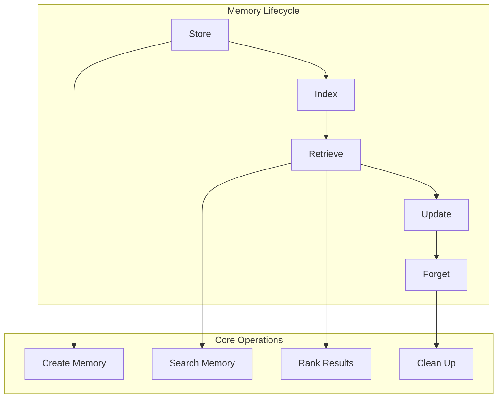

# Building Memory Management Systems

Now that we know the different memory types, let's build the systems that manage them. As Richmond Alake emphasized, memory management is about organizing information so agents can be "believable, capable, and reliable."

## The Core Challenge

Richmond made a crucial point about context windows:

<Callout type="warning" title="The Context Window Trap">
"Large context windows are not for you to stuff all your data in. That's for you to pull in the relevant memory and structure them in a way that is effective." - Richmond Alake
</Callout>

Memory management is about getting the RIGHT information at the RIGHT time.

## Memory Management Components

<Diagram>

</Diagram>

Let's build these step by step.

## Step 1: Basic Memory Storage

Start with simple CRUD operations:

<CodeExample language="javascript" title="Basic Memory Storage">
class MemoryStorage {
  constructor(db) {
    this.db = db;
  }
  
  // Create: Store a new memory
  async store(memory) {
    const result = await this.db.collection('memories').insertOne({
      ...memory,
      createdAt: new Date(),
      updatedAt: new Date()
    });
    
    return result.insertedId;
  }
  
  // Read: Get memory by ID
  async get(memoryId) {
    return await this.db.collection('memories').findOne({ _id: memoryId });
  }
}
</CodeExample>

Add update and delete operations:

<CodeExample language="javascript" title="Update and Delete Operations">
  // Update: Modify existing memory
  async update(memoryId, changes) {
    await this.db.collection('memories').updateOne(
      { _id: memoryId },
      { 
        $set: { 
          ...changes, 
          updatedAt: new Date() 
        } 
      }
    );
  }
  
  // Delete: Remove memory
  async delete(memoryId) {
    await this.db.collection('memories').deleteOne({ _id: memoryId });
  }
</CodeExample>

## Step 2: Simple Memory Search

Build basic search functionality:

<CodeExample language="javascript" title="Text Search">
class MemorySearch {
  constructor(db) {
    this.db = db;
  }
  
  // Search by text content
  async searchText(query, limit = 10) {
    return await this.db.collection('memories').find({
      $text: { $search: query }
    }).limit(limit).toArray();
  }
  
  // Search by memory type
  async searchByType(memoryType, limit = 10) {
    return await this.db.collection('memories').find({
      type: memoryType
    }).limit(limit).toArray();
  }
}
</CodeExample>

Add metadata and time-based search:

<CodeExample language="javascript" title="Advanced Search">
  // Search by user
  async searchByUser(userId, limit = 10) {
    return await this.db.collection('memories').find({
      userId: userId
    })
    .sort({ createdAt: -1 })
    .limit(limit)
    .toArray();
  }
  
  // Search recent memories
  async searchRecent(hours = 24, limit = 10) {
    const since = new Date(Date.now() - hours * 60 * 60 * 1000);
    
    return await this.db.collection('memories').find({
      createdAt: { $gte: since }
    })
    .sort({ createdAt: -1 })
    .limit(limit)
    .toArray();
  }
</CodeExample>

## Step 3: Memory Retrieval Strategies

Different situations need different retrieval approaches:

<CodeExample language="javascript" title="Retrieval Strategies">
class MemoryRetriever {
  constructor(db) {
    this.db = db;
    this.search = new MemorySearch(db);
  }
  
  // Strategy 1: Recent + Relevant
  async getContextualMemories(userId, query, limit = 5) {
    // Get recent memories from user
    const recent = await this.search.searchByUser(userId, 3);
    
    // Get relevant memories from text search
    const relevant = await this.search.searchText(query, 3);
    
    // Combine and deduplicate
    const combined = [...recent, ...relevant];
    const unique = this.deduplicateMemories(combined);
    
    return unique.slice(0, limit);
  }
}
</CodeExample>

Add more retrieval strategies:

<CodeExample language="javascript" title="More Retrieval Patterns">
  // Strategy 2: By importance and recency
  async getImportantMemories(userId, limit = 5) {
    return await this.db.collection('memories').find({
      userId: userId,
      importance: { $gte: 0.7 }
    })
    .sort({ importance: -1, createdAt: -1 })
    .limit(limit)
    .toArray();
  }
  
  // Strategy 3: Related memories
  async getRelatedMemories(memoryId, limit = 3) {
    const memory = await this.db.collection('memories').findOne({ _id: memoryId });
    if (!memory) return [];
    
    // Find memories with similar tags or entities
    return await this.db.collection('memories').find({
      _id: { $ne: memoryId },
      $or: [
        { tags: { $in: memory.tags || [] } },
        { entities: { $in: memory.entities || [] } }
      ]
    }).limit(limit).toArray();
  }
</CodeExample>

Helper method for deduplication:

<CodeExample language="javascript" title="Memory Deduplication">
  deduplicateMemories(memories) {
    const seen = new Set();
    return memories.filter(memory => {
      const id = memory._id.toString();
      if (seen.has(id)) return false;
      seen.add(id);
      return true;
    });
  }
</CodeExample>

## Step 4: Simple Memory Manager

Combine all operations into a unified interface:

<CodeExample language="javascript" title="Unified Memory Manager">
class SimpleMemoryManager {
  constructor(db) {
    this.storage = new MemoryStorage(db);
    this.retriever = new MemoryRetriever(db);
  }
  
  // Store any type of memory
  async remember(userId, content, type = 'general') {
    const memory = {
      userId,
      content,
      type,
      importance: this.calculateImportance(content),
      tags: this.extractTags(content),
      entities: this.extractEntities(content)
    };
    
    return await this.storage.store(memory);
  }
}
</CodeExample>

Add retrieval and helper methods:

<CodeExample language="javascript" title="Manager Methods">
  // Get relevant memories for a query
  async recall(userId, query, options = {}) {
    const limit = options.limit || 5;
    const strategy = options.strategy || 'contextual';
    
    switch (strategy) {
      case 'recent':
        return await this.retriever.searchByUser(userId, limit);
      case 'important':
        return await this.retriever.getImportantMemories(userId, limit);
      default:
        return await this.retriever.getContextualMemories(userId, query, limit);
    }
  }
  
  // Simple importance calculation
  calculateImportance(content) {
    // Longer content might be more important
    const lengthScore = Math.min(content.length / 100, 0.5);
    
    // Content with names might be more important
    const nameScore = (content.match(/[A-Z][a-z]+/g) || []).length * 0.1;
    
    return Math.min(lengthScore + nameScore, 1.0);
  }
</CodeExample>

Simple tag and entity extraction:

<CodeExample language="javascript" title="Content Analysis">
  extractTags(content) {
    // Simple keyword extraction
    const words = content.toLowerCase().split(/\s+/);
    const stopWords = ['the', 'a', 'an', 'and', 'or', 'but', 'in', 'on', 'at'];
    
    return words
      .filter(word => word.length > 3 && !stopWords.includes(word))
      .slice(0, 5); // Top 5 keywords as tags
  }
  
  extractEntities(content) {
    // Simple entity extraction (names)
    const entities = [];
    const namePattern = /\b[A-Z][a-z]+\b/g;
    const matches = content.match(namePattern);
    
    if (matches) {
      entities.push(...matches.slice(0, 3)); // Top 3 entities
    }
    
    return entities;
  }
</CodeExample>

## Step 5: Memory Lifecycle Management

Handle memory aging and cleanup:

<CodeExample language="javascript" title="Memory Lifecycle">
class MemoryLifecycle {
  constructor(db) {
    this.db = db;
  }
  
  // Age memories over time
  async ageMemories() {
    const oneDay = 24 * 60 * 60 * 1000;
    const cutoff = new Date(Date.now() - oneDay);
    
    // Reduce importance of old memories
    await this.db.collection('memories').updateMany(
      { createdAt: { $lt: cutoff } },
      { $mul: { importance: 0.9 } } // Reduce by 10%
    );
  }
  
  // Clean up low-importance memories
  async cleanup(threshold = 0.1) {
    const result = await this.db.collection('memories').deleteMany({
      importance: { $lt: threshold }
    });
    
    return result.deletedCount;
  }
}
</CodeExample>

Add memory consolidation:

<CodeExample language="javascript" title="Memory Consolidation">
  // Consolidate similar memories
  async consolidateSimilar() {
    const memories = await this.db.collection('memories').find({}).toArray();
    const groups = this.groupSimilarMemories(memories);
    
    let consolidated = 0;
    
    for (const group of groups) {
      if (group.length > 1) {
        await this.mergeMemories(group);
        consolidated++;
      }
    }
    
    return consolidated;
  }
  
  groupSimilarMemories(memories) {
    // Simple grouping by shared tags
    const groups = new Map();
    
    memories.forEach(memory => {
      const key = (memory.tags || []).sort().join(',');
      if (!groups.has(key)) groups.set(key, []);
      groups.get(key).push(memory);
    });
    
    return Array.from(groups.values());
  }
</CodeExample>

## Step 6: Putting It All Together

Create a complete memory system:

<CodeExample language="javascript" title="Complete Memory System">
class AgentMemorySystem {
  constructor(db) {
    this.manager = new SimpleMemoryManager(db);
    this.lifecycle = new MemoryLifecycle(db);
  }
  
  // Main interface for agents
  async processInteraction(userId, input, context = {}) {
    // 1. Store the current interaction
    await this.manager.remember(userId, input, 'conversation');
    
    // 2. Retrieve relevant memories
    const memories = await this.manager.recall(userId, input, {
      limit: 5,
      strategy: context.strategy || 'contextual'
    });
    
    // 3. Format for LLM context
    const memoryContext = this.formatMemoriesForLLM(memories);
    
    return {
      memories,
      context: memoryContext,
      timestamp: new Date()
    };
  }
}
</CodeExample>

Format memories for LLM consumption:

<CodeExample language="javascript" title="LLM Context Formatting">
  formatMemoriesForLLM(memories) {
    if (memories.length === 0) {
      return "No previous context available.";
    }
    
    const formatted = memories.map(memory => {
      const age = this.getMemoryAge(memory.createdAt);
      return `[${age}] ${memory.content}`;
    }).join('\n');
    
    return `Previous context:\n${formatted}`;
  }
  
  getMemoryAge(timestamp) {
    const now = new Date();
    const diff = now - new Date(timestamp);
    const minutes = Math.floor(diff / (1000 * 60));
    
    if (minutes < 60) return `${minutes}m ago`;
    const hours = Math.floor(minutes / 60);
    if (hours < 24) return `${hours}h ago`;
    const days = Math.floor(hours / 24);
    return `${days}d ago`;
  }
</CodeExample>

## Testing the Memory System

Let's test our memory system:

<CodeExample language="javascript" title="Testing Memory System">
// Example usage
const memorySystem = new AgentMemorySystem(db);

// Simulate a conversation
async function testConversation() {
  const userId = "user123";
  
  // First interaction
  const result1 = await memorySystem.processInteraction(
    userId, 
    "Hi, I'm Alice and I love pizza"
  );
  
  console.log("Stored:", result1.memories.length, "memories");
  
  // Later interaction
  const result2 = await memorySystem.processInteraction(
    userId,
    "What food do I like?"
  );
  
  console.log("Retrieved context:", result2.context);
  // Should mention pizza preference
}
</CodeExample>

## Knowledge Check

<Quiz>
  <Question
    question="What did Richmond mean about large context windows?"
    options={[
      "They should be filled with as much data as possible",
      "They are only for storing tool schemas", 
      "They should contain the RIGHT information at the RIGHT time",
      "They are not useful for agents"
    ]}
    correct={2}
    explanation="Richmond emphasized that large context windows aren't for stuffing all data - they're for pulling in relevant memories structured effectively."
  />
  
  <Question
    question="What's the main benefit of memory consolidation?"
    options={[
      "It makes queries faster",
      "It reduces storage costs and prevents duplicate information",
      "It improves security",
      "It makes memories more accurate"
    ]}
    correct={1}
    explanation="Memory consolidation reduces storage costs and prevents duplicate information while maintaining the essential knowledge."
  />
  
  <Question
    question="Why is memory aging important?"
    options={[
      "Old memories are always wrong",
      "It saves storage space",
      "It reflects the natural decay of relevance over time",
      "It improves query performance"
    ]}
    correct={2}
    explanation="Memory aging reflects how information naturally becomes less relevant over time, similar to how human memory works."
  />
</Quiz>

## Exercise: Build Your Memory Manager

Create your own memory management system:

1. **Basic Storage**: Implement create, read, update, delete operations
2. **Search**: Add text and metadata search capabilities  
3. **Retrieval**: Build contextual memory retrieval
4. **Lifecycle**: Add aging and cleanup mechanisms

<CodeExample language="javascript" title="Starter Template">
class MyMemoryManager {
  constructor(db) {
    this.db = db;
  }
  
  async store(memory) {
    // Your storage implementation
  }
  
  async search(query) {
    // Your search implementation
  }
  
  async getContext(userId, input) {
    // Your context retrieval implementation
  }
  
  async cleanup() {
    // Your cleanup implementation
  }
}
</CodeExample>

## Summary

We built a complete memory management system with:

1. **Basic Operations**: Create, read, update, delete memories
2. **Search Strategies**: Text, metadata, and time-based search
3. **Retrieval Patterns**: Contextual, recent, and importance-based retrieval
4. **Lifecycle Management**: Memory aging, consolidation, and cleanup
5. **LLM Integration**: Formatting memories for context windows

<Callout type="success" title="Key Insight">
The goal isn't to store everything—it's to surface the right memories at the right time. This makes agents more believable, capable, and reliable.
</Callout>

## Next Steps

In the next module, we'll explore advanced memory patterns inspired by neuroscience research, including forgetting mechanisms and memory signals that Richmond mentioned in his talk.

<Callout type="info" title="Production Ready">
These simple patterns form the foundation of production memory systems. Start simple, then add complexity as needed.
</Callout>