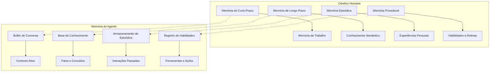

# Compreendendo a Memória de Agentes

Bem-vindo ao mundo dos sistemas de memória para agentes! Neste módulo, descobriremos por que a memória é a diferença chave entre chatbots simples e agentes verdadeiramente inteligentes.

## O Problema: IA Sem Estado

Vamos começar com um chatbot simples para ver o problema:

<CodeExample language="typescript" title="Um Chatbot Esquecido">
function chatbot(message: string): string {
  if (message.includes("hello")) {
    return "Hi! I'm an AI assistant.";
  }
  if (message.includes("name")) {
    return "I don't remember your name.";
  }
  return "I'm not sure what you mean.";
}
</CodeExample>

Este chatbot não tem memória. Toda conversa começa do zero:

<CodeExample language="typescript" title="O Problema do Esquecimento">
console.log(chatbot("Hello, I'm Alice"));
// Output: "Hi! I'm an AI assistant."

console.log(chatbot("What's my name?"));
// Output: "I don't remember your name."
</CodeExample>

**O Problema**: O chatbot esqueceu o nome de Alice imediatamente após ela se apresentar.

<Callout type="insight" title="Insight Principal de Richmond">
"Se a IA ou AGI deve imitar a inteligência humana, e o que determina a inteligência em humanos é sua capacidade de recordar—é sua memória—então é óbvio que precisamos de memória dentro dos agentes que estamos construindo." - Richmond Alake, MongoDB
</Callout>

## A Evolução das Aplicações de IA

Richmond Alake delineou a evolução que vimos:

### 2022: Chatbots Simples
- Sem memória entre conversas
- Funcionalidade básica de perguntas e respostas
- Compreensão limitada de contexto

### 2023: Sistemas RAG
- Bases de conhecimento estáticas
- Melhores respostas específicas do domínio
- Ainda sem memória conversacional

### 2024: Agentes que Usam Ferramentas
- Capacidades de chamada de funções
- Podem tomar ações
- Mas ainda sem estado entre sessões

### Agora: Agentes com Memória
- Lembram de conversas
- Aprendem preferências do usuário
- Constroem relacionamentos ao longo do tempo

## O que Torna uma IA um Agente?

De acordo com Richmond, um agente de IA é:

> "Uma entidade computacional com consciência de seu ambiente através da percepção, habilidades cognitivas através de um LLM, e pode tomar ações através do uso de ferramentas. Mas a parte mais importante é que existe alguma forma de memória—de curto ou longo prazo."

Vamos construir isso passo a passo.

## Construindo Seu Primeiro Agente com Memória

### Passo 1: Adicionar Armazenamento Simples de Memória

<CodeExample language="typescript" title="Armazenamento Básico de Memória">
interface Memory {
  user: string;
  fact: string;
  timestamp: Date;
}

const memories: Memory[] = [];

function remember(user: string, fact: string) {
  memories.push({
    user,
    fact,
    timestamp: new Date()
  });
}
</CodeExample>

### Passo 2: Adicionar Recuperação de Memória

<CodeExample language="typescript" title="Recuperando Memórias">
function recall(user: string): Memory[] {
  return memories.filter(memory => memory.user === user);
}

function findMemoryAbout(user: string, topic: string): Memory | undefined {
  return memories.find(memory => 
    memory.user === user && 
    memory.fact.toLowerCase().includes(topic.toLowerCase())
  );
}
</CodeExample>

### Passo 3: Criar um Agente com Memória

Agora vamos construir um agente que pode lembrar:

<CodeExample language="typescript" title="Chatbot com Memória">
function memoryChatbot(user: string, message: string): string {
  // Check if user is introducing themselves
  if (message.includes("I'm ") || message.includes("My name is")) {
    const name = extractName(message);
    remember(user, `name is ${name}`);
    return `Nice to meet you, ${name}! I'll remember that.`;
  }
  
  // Check if user is asking about their name
  if (message.includes("my name")) {
    const nameMemory = findMemoryAbout(user, "name");
    if (nameMemory) {
      const name = nameMemory.fact.replace("name is ", "");
      return `Your name is ${name}.`;
    }
    return "I don't know your name yet. Could you tell me?";
  }
  
  return "How can I help you today?";
}
</CodeExample>

Função auxiliar para extrair nomes:

<CodeExample language="typescript" title="Auxiliar de Extração de Nome">
function extractName(message: string): string {
  // Simple name extraction
  const patterns = [
    /I'm (\w+)/,
    /My name is (\w+)/
  ];
  
  for (const pattern of patterns) {
    const match = message.match(pattern);
    if (match) return match[1];
  }
  
  return "Friend";
}
</CodeExample>

### Passo 4: Testar o Agente com Memória

<CodeExample language="typescript" title="Testando a Memória">
const userId = "user123";

console.log(memoryChatbot(userId, "Hi, I'm Alice"));
// Output: "Nice to meet you, Alice! I'll remember that."

console.log(memoryChatbot(userId, "What's my name?"));
// Output: "Your name is Alice."

// Later conversation...
console.log(memoryChatbot(userId, "Do you remember me?"));
// The agent now has context about Alice
</CodeExample>

## A Diferença que a Memória Faz

Vamos comparar as duas abordagens:

**Sem Memória:**
- Toda interação começa do zero
- Nenhuma personalização possível
- Não pode construir relacionamentos
- Compreensão limitada de contexto

**Com Memória:**
- Conversas têm continuidade
- Respostas personalizadas
- Construção de relacionamento ao longo do tempo
- Contexto rico da história

<Callout type="success" title="A Memória Transforma a IA">
A memória é o que transforma um chatbot simples em um agente inteligente que pode ser "crível, capaz e confiável"—os três objetivos principais de Richmond para sistemas de agentes.
</Callout>

## Tipos de Memória (Prévia)

No próximo módulo, exploraremos diferentes tipos de memória que os agentes precisam:

- **Memória Conversacional**: O que foi dito em conversas passadas
- **Memória de Entidades**: Informações sobre pessoas, lugares e coisas
- **Memória de Persona**: Os padrões de personalidade e comportamento do agente
- **Memória de Ferramentas**: Quais ferramentas usar em diferentes situações

## Cérebro Humano vs. Memória de Agentes

Richmond enfatizou a conexão com a inteligência humana:

<Diagram>

</Diagram>

Assim como os humanos têm sistemas de memória especializados, nossos agentes precisam de diferentes tipos de memória para diferentes propósitos.

## Verificação de Conhecimento

<Quiz>
  <Question
    question="Qual é o principal problema com chatbots de IA sem estado?"
    options={[
      "Eles são muito lentos para responder",
      "Eles esquecem tudo entre conversas",
      "Eles consomem muita memória",
      "Eles não podem acessar a internet"
    ]}
    correct={1}
    explanation="Chatbots sem estado não têm memória entre conversas, então não podem construir relacionamentos ou fornecer experiências personalizadas."
  />
  
  <Question
    question="De acordo com Richmond Alake, o que torna uma entidade um agente de IA?"
    options={[
      "Apenas ter um LLM e ferramentas",
      "Estar conectado à internet",
      "Ter percepção, cognição, capacidade de ação E memória",
      "Ser capaz de escrever código"
    ]}
    correct={2}
    explanation="Richmond definiu agentes como tendo consciência do ambiente (percepção), habilidades cognitivas (LLM), capacidade de ação (ferramentas), E alguma forma de memória."
  />
  
  <Question
    question="Por que Richmond disse que a memória é essencial para AGI?"
    options={[
      "A memória torna os agentes mais rápidos",
      "A inteligência humana está fundamentalmente ligada à memória e capacidade de recordar",
      "A memória reduz custos computacionais",
      "A memória torna os agentes mais seguros"
    ]}
    correct={1}
    explanation="Richmond argumentou que, como a inteligência humana é determinada pela capacidade de recordar (memória), sistemas de IA que visam imitar a inteligência humana devem ter memória."
  />
</Quiz>

## Exercício: Aprimorar o Agente de Memória

Tente aprimorar nosso agente de memória simples:

1. **Adicionar Memória de Preferências**: Deixe os usuários dizerem ao agente que preferem pontos de lista ou parágrafos
2. **Adicionar Rastreamento de Humor**: Lembrar se o usuário parece feliz, frustrado, etc.
3. **Adicionar Interesse em Tópicos**: Rastrear sobre quais tópicos o usuário pergunta mais

<CodeExample language="typescript" title="Dica para Memória de Preferências">
// Add this to your remember function calls
if (message.includes("prefer bullet points")) {
  remember(user, "prefers bullet points format");
}
</CodeExample>

## Resumo

Neste módulo, aprendemos:

1. **O Problema**: IA sem estado não pode construir relacionamentos ou aprender com interações
2. **A Solução**: A memória permite que os agentes sejam críveis, capazes e confiáveis
3. **A Evolução**: De chatbots simples para agentes com memória
4. **A Implementação**: Armazenamento e recuperação básica de memória em menos de 30 linhas
5. **A Conexão**: A memória do agente espelha os sistemas de memória humana

## Próximos Passos

No próximo módulo, exploraremos os diferentes tipos de memória que os agentes precisam, começando com implementações simples de cada tipo. Veremos como a equipe de Richmond no MongoDB modela essas memórias como documentos flexíveis que podem se adaptar a qualquer estrutura.

<Callout type="info" title="Lembre-se Disso">
A memória não é apenas sobre armazenamento—é sobre organizar informações para que as memórias certas surjam no momento certo. É isso que construiremos nos próximos módulos.
</Callout>