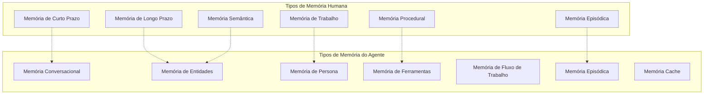

# Tipos de Memória e Arquitetura

Agora que entendemos por que a memória importa, vamos explorar os diferentes tipos de memória que tornam os agentes verdadeiramente inteligentes. Implementaremos cada tipo com exemplos simples e práticos—assim como Richmond Alake demonstrou em sua palestra no MongoDB.

## O Panorama da Memória

Richmond nos mostrou que os agentes precisam de diferentes tipos de memória, assim como os humanos:

<Diagram>

</Diagram>

<Callout type="insight" title="MongoDB como Provedor de Memória">
"MongoDB é o provedor de memória para sistemas agênticos" - Richmond Alake. O modelo de documento flexível pode se adaptar a qualquer estrutura de memória que você precise.
</Callout>

## 1. Memória Conversacional

O tipo mais básico—lembrar o que foi dito.

### Implementação Simples

<CodeExample language="typescript" title="Memória Conversacional Básica">
interface ConversationMemory {
  conversationId: string;
  messages: Message[];
  lastActivity: Date;
}

interface Message {
  role: 'user' | 'agent';
  content: string;
  timestamp: Date;
}
</CodeExample>

Vamos armazenar conversas no MongoDB:

<CodeExample language="javascript" title="Armazenando Conversas">
// Store a new message
async function storeMessage(conversationId, role, content) {
  const message = {
    role,
    content,
    timestamp: new Date()
  };
  
  await db.collection('conversations').updateOne(
    { conversationId },
    { 
      $push: { messages: message },
      $set: { lastActivity: new Date() }
    },
    { upsert: true }
  );
}
</CodeExample>

Recuperar contexto recente da conversa:

<CodeExample language="javascript" title="Obtendo Contexto da Conversa">
async function getRecentMessages(conversationId, limit = 10) {
  const conversation = await db.collection('conversations').findOne(
    { conversationId },
    { 
      messages: { $slice: -limit }  // Get last N messages
    }
  );
  
  return conversation?.messages || [];
}
</CodeExample>

## 2. Memória de Persona

Richmond demonstrou isso quando a OpenAI adicionou personalidade ao ChatGPT. A memória de persona molda como seu agente se comporta.

### Exemplo de Documento MongoDB

<CodeExample language="javascript" title="Documento de Memória de Persona">
// This is how Richmond showed persona memory in MongoDB
const personaMemory = {
  agentId: "customer-support-bot",
  personality: {
    tone: "friendly and professional",
    style: "concise but helpful",
    expertise: ["product knowledge", "troubleshooting"]
  },
  responses: {
    greeting: "Hi! I'm here to help with any questions.",
    clarification: "Could you help me understand...",
    closing: "Is there anything else I can help with?"
  },
  preferences: {
    formatResponses: "bullet points",
    maxResponseLength: 200
  }
};
</CodeExample>

Recuperação simples de persona:

<CodeExample language="javascript" title="Usando Memória de Persona">
async function getPersona(agentId) {
  return await db.collection('personas').findOne({ agentId });
}

function formatResponse(content, persona) {
  if (persona.preferences.formatResponses === "bullet points") {
    return content.split('.').map(s => `• ${s.trim()}`).join('\n');
  }
  return content;
}
</CodeExample>

## 3. Memória de Ferramentas

Richmond explicou: "Quando você usa seu banco de dados como uma caixa de ferramentas onde você está armazenando o esquema JSON de suas ferramentas no MongoDB, você pode escalar."

### Padrão de Armazenamento de Ferramentas

<CodeExample language="javascript" title="Documento de Memória de Ferramentas">
const toolMemory = {
  toolId: "send-email",
  name: "Send Email",
  description: "Send an email to a specified recipient",
  schema: {
    type: "function",
    parameters: {
      type: "object",
      properties: {
        to: { type: "string" },
        subject: { type: "string" },
        body: { type: "string" }
      }
    }
  },
  usage: {
    successCount: 42,
    lastUsed: new Date(),
    averageExecutionTime: 1200
  }
};
</CodeExample>

Encontrar a ferramenta certa para o trabalho:

<CodeExample language="javascript" title="Seleção de Ferramentas">
async function findRelevantTools(userIntent) {
  return await db.collection('tools').find({
    $or: [
      { name: { $regex: userIntent, $options: 'i' } },
      { description: { $regex: userIntent, $options: 'i' } }
    ]
  }).limit(5).toArray();
}
</CodeExample>

Atualizar estatísticas de uso de ferramentas:

<CodeExample language="javascript" title="Rastrear Uso de Ferramentas">
async function recordToolUsage(toolId, executionTime, success) {
  await db.collection('tools').updateOne(
    { toolId },
    {
      $inc: { 
        'usage.successCount': success ? 1 : 0,
        'usage.totalUsage': 1
      },
      $set: { 
        'usage.lastUsed': new Date(),
        'usage.averageExecutionTime': executionTime
      }
    }
  );
}
</CodeExample>

## 4. Memória de Entidades

Rastreie informações sobre pessoas, lugares e coisas em suas conversas.

### Padrão de Documento de Entidade

<CodeExample language="javascript" title="Documento de Memória de Entidades">
const entityMemory = {
  entityId: "user-alice-123",
  name: "Alice Johnson",
  type: "person",
  attributes: {
    role: "Software Engineer",
    company: "TechCorp",
    preferences: ["Python", "Machine Learning"],
    timezone: "PST"
  },
  relationships: [
    { type: "works_with", entity: "user-bob-456" },
    { type: "manages", entity: "project-ml-pipeline" }
  ],
  lastSeen: new Date()
};
</CodeExample>

Extrair e armazenar entidades das conversas:

<CodeExample language="javascript" title="Extração de Entidades">
function extractEntities(message) {
  // Simple entity extraction (in practice, use NLP)
  const entities = [];
  
  // Extract names (capitalized words)
  const namePattern = /\b[A-Z][a-z]+\b/g;
  const names = message.match(namePattern);
  
  names?.forEach(name => {
    entities.push({ name, type: "person", confidence: 0.8 });
  });
  
  return entities;
}
</CodeExample>

Armazenar informações de entidades:

<CodeExample language="javascript" title="Atualizar Memória de Entidades">
async function updateEntity(entityId, newInfo) {
  await db.collection('entities').updateOne(
    { entityId },
    {
      $set: newInfo,
      $setOnInsert: { firstSeen: new Date() },
      $currentDate: { lastSeen: true }
    },
    { upsert: true }
  );
}
</CodeExample>

## 5. Memória de Fluxo de Trabalho

Richmond mencionou isso como armazenar "experiências de falha" para informar execuções futuras.

### Documento de Fluxo de Trabalho

<CodeExample language="javascript" title="Documento de Memória de Fluxo de Trabalho">
const workflowMemory = {
  workflowId: "user-onboarding",
  steps: [
    { name: "collect-email", status: "completed" },
    { name: "send-welcome", status: "failed", error: "email-invalid" },
    { name: "setup-profile", status: "pending" }
  ],
  failures: [
    {
      step: "send-welcome",
      error: "Invalid email format",
      timestamp: new Date(),
      resolution: "Validate email before sending"
    }
  ],
  context: {
    userId: "user-123",
    startTime: new Date()
  }
};
</CodeExample>

Aprender com falhas:

<CodeExample language="javascript" title="Aprendendo com Falhas">
async function recordFailure(workflowId, step, error, resolution) {
  await db.collection('workflows').updateOne(
    { workflowId },
    {
      $push: {
        failures: {
          step,
          error,
          resolution,
          timestamp: new Date()
        }
      }
    }
  );
}

async function getFailureLessons(workflowId, step) {
  const workflow = await db.collection('workflows').findOne({ workflowId });
  return workflow?.failures.filter(f => f.step === step) || [];
}
</CodeExample>

## 6. Memória Episódica

Lembrar de interações e experiências específicas.

### Documento de Episódio

<CodeExample language="javascript" title="Documento de Memória Episódica">
const episodeMemory = {
  episodeId: "support-ticket-resolution",
  summary: "Helped user resolve login issue",
  participants: ["user-alice-123", "support-agent"],
  outcome: "success",
  duration: 15, // minutes
  keyEvents: [
    { timestamp: new Date(), event: "User reported login issue" },
    { timestamp: new Date(), event: "Agent diagnosed browser cache problem" },
    { timestamp: new Date(), event: "User confirmed resolution" }
  ],
  lessons: [
    "Browser cache issues are common with login problems",
    "Always ask about recent browser updates"
  ]
};
</CodeExample>

## 7. Memória Cache

Memória de curto prazo e acesso rápido para informações recentes.

### Implementação de Cache

<CodeExample language="javascript" title="Memória Cache Simples">
class CacheMemory {
  constructor(maxSize = 100, ttl = 300000) { // 5 minutes TTL
    this.cache = new Map();
    this.maxSize = maxSize;
    this.ttl = ttl;
  }
  
  set(key, value) {
    // Remove oldest if at capacity
    if (this.cache.size >= this.maxSize) {
      const firstKey = this.cache.keys().next().value;
      this.cache.delete(firstKey);
    }
    
    this.cache.set(key, {
      value,
      timestamp: Date.now()
    });
  }
  
  get(key) {
    const item = this.cache.get(key);
    if (!item) return null;
    
    // Check if expired
    if (Date.now() - item.timestamp > this.ttl) {
      this.cache.delete(key);
      return null;
    }
    
    return item.value;
  }
}
</CodeExample>

## Construindo um Agente com Múltiplas Memórias

Agora vamos combinar esses tipos de memória em um agente simples:

<CodeExample language="javascript" title="Agente com Memória">
class MemoryAgent {
  constructor(agentId, db) {
    this.agentId = agentId;
    this.db = db;
    this.cache = new CacheMemory();
  }
  
  async processMessage(userId, message) {
    // Get persona
    const persona = await this.getPersona();
    
    // Store conversation
    await this.storeMessage(userId, 'user', message);
    
    // Extract entities
    const entities = this.extractEntities(message);
    for (const entity of entities) {
      await this.updateEntity(entity);
    }
    
    // Generate response using all memory types
    const response = await this.generateResponse(userId, message, persona);
    
    // Store agent response
    await this.storeMessage(userId, 'agent', response);
    
    return response;
  }
}
</CodeExample>

## Verificação de Conhecimento

<Quiz>
  <Question
    question="De acordo com Richmond Alake, o que torna o MongoDB ideal para memória de agentes?"
    options={[
      "É mais rápido que outros bancos de dados",
      "O modelo de documento flexível pode se adaptar a qualquer estrutura de memória",
      "Tem capacidades de IA integradas",
      "É mais barato que outras soluções"
    ]}
    correct={1}
    explanation="Richmond enfatizou que o modelo de documento flexível do MongoDB pode se adaptar a qualquer estrutura de memória, tornando-o perfeito como provedor de memória para sistemas agênticos."
  />
  
  <Question
    question="Qual é a principal vantagem da memória de ferramentas sobre colocar todas as ferramentas na janela de contexto?"
    options={[
      "As ferramentas funcionam mais rápido",
      "As ferramentas são mais seguras",
      "Você pode escalar além do limite de contexto do LLM",
      "As ferramentas são mais fáceis de depurar"
    ]}
    correct={2}
    explanation="Richmond explicou que armazenar ferramentas em um banco de dados permite escalar além dos limites da janela de contexto do LLM, recuperando apenas as ferramentas relevantes conforme necessário."
  />
  
  <Question
    question="Por que a memória de fluxo de trabalho é importante para a confiabilidade do agente?"
    options={[
      "Faz os fluxos de trabalho funcionarem mais rápido",
      "Permite que os agentes aprendam com falhas e evitem repetir erros",
      "Reduz o uso de memória",
      "Melhora a segurança"
    ]}
    correct={1}
    explanation="A memória de fluxo de trabalho captura experiências de falha para que os agentes possam aprender com erros passados e tomar melhores decisões em execuções futuras."
  />
</Quiz>

## Exercício: Construa Seu Sistema de Memória

Crie um agente simples que use múltiplos tipos de memória:

1. **Memória Conversacional**: Armazene e recupere histórico de chat
2. **Memória de Entidades**: Extraia e lembre informações do usuário
3. **Memória de Persona**: Dê uma personalidade ao seu agente

<CodeExample language="javascript" title="Código Inicial - Dica">
class MyMemoryAgent {
  async handleMessage(userId, message) {
    // 1. Store the conversation
    await this.storeConversation(userId, message);
    
    // 2. Extract entities (names, preferences, etc.)
    const entities = this.extractEntities(message);
    
    // 3. Get persona to shape response
    const persona = await this.getPersona();
    
    // 4. Generate memory-informed response
    return this.generateResponse(userId, message, entities, persona);
  }
}
</CodeExample>

## Resumo

Exploramos 7 tipos principais de memória:

1. **Memória Conversacional**: Histórico de chat e contexto
2. **Memória de Persona**: Personalidade e comportamento do agente
3. **Memória de Ferramentas**: Ferramentas disponíveis e seus padrões de uso
4. **Memória de Entidades**: Informações sobre pessoas, lugares e coisas
5. **Memória de Fluxo de Trabalho**: Estados de processo e lições de falhas
6. **Memória Episódica**: Experiências de interação específicas
7. **Memória Cache**: Armazenamento temporário de acesso rápido

<Callout type="success" title="Flexibilidade de Documentos MongoDB">
Cada tipo de memória mapeia naturalmente para documentos MongoDB, dando a você a flexibilidade para armazenar qualquer estrutura enquanto mantém capacidades de consulta poderosas.
</Callout>

## Próximos Passos

No próximo módulo, construiremos um sistema unificado de gerenciamento de memória que coordena todos esses tipos de memória, lidando com armazenamento, recuperação e gerenciamento do ciclo de vida da memória.

<Callout type="info" title="A Memória é a Base">
Esses tipos de memória formam a base de agentes inteligentes. Em sistemas de produção, eles trabalham juntos para criar agentes que são verdadeiramente críveis, capazes e confiáveis.
</Callout>