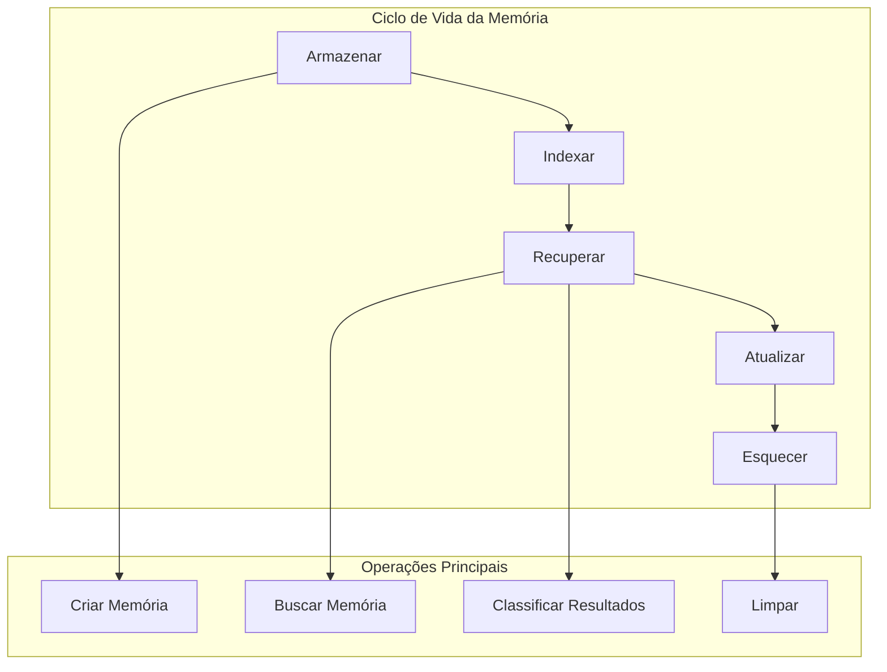

# Construindo Sistemas de Gerenciamento de Memória

Agora que conhecemos os diferentes tipos de memória, vamos construir os sistemas que os gerenciam. Como Richmond Alake enfatizou, o gerenciamento de memória é sobre organizar informações para que os agentes possam ser "críveis, capazes e confiáveis."

## O Desafio Principal

Richmond fez um ponto crucial sobre janelas de contexto:

<Callout type="warning" title="A Armadilha da Janela de Contexto">
"Janelas de contexto grandes não são para você encher com todos os seus dados. São para você puxar a memória relevante e estruturá-las de uma forma eficaz." - Richmond Alake
</Callout>

Gerenciamento de memória é sobre obter a informação CERTA no momento CERTO.

## Componentes do Gerenciamento de Memória

<Diagram>

</Diagram>

Vamos construir isso passo a passo.

## Passo 1: Armazenamento Básico de Memória

Comece com operações CRUD simples:

<CodeExample language="javascript" title="Armazenamento Básico de Memória">
class MemoryStorage {
  constructor(db) {
    this.db = db;
  }
  
  // Create: Store a new memory
  async store(memory) {
    const result = await this.db.collection('memories').insertOne({
      ...memory,
      createdAt: new Date(),
      updatedAt: new Date()
    });
    
    return result.insertedId;
  }
  
  // Read: Get memory by ID
  async get(memoryId) {
    return await this.db.collection('memories').findOne({ _id: memoryId });
  }
}
</CodeExample>

Adicionar operações de atualização e exclusão:

<CodeExample language="javascript" title="Operações de Atualização e Exclusão">
  // Update: Modify existing memory
  async update(memoryId, changes) {
    await this.db.collection('memories').updateOne(
      { _id: memoryId },
      { 
        $set: { 
          ...changes, 
          updatedAt: new Date() 
        } 
      }
    );
  }
  
  // Delete: Remove memory
  async delete(memoryId) {
    await this.db.collection('memories').deleteOne({ _id: memoryId });
  }
</CodeExample>

## Passo 2: Busca Simples de Memória

Construir funcionalidade básica de busca:

<CodeExample language="javascript" title="Busca por Texto">
class MemorySearch {
  constructor(db) {
    this.db = db;
  }
  
  // Search by text content
  async searchText(query, limit = 10) {
    return await this.db.collection('memories').find({
      $text: { $search: query }
    }).limit(limit).toArray();
  }
  
  // Search by memory type
  async searchByType(memoryType, limit = 10) {
    return await this.db.collection('memories').find({
      type: memoryType
    }).limit(limit).toArray();
  }
}
</CodeExample>

Adicionar busca por metadados e tempo:

<CodeExample language="javascript" title="Busca Avançada">
  // Search by user
  async searchByUser(userId, limit = 10) {
    return await this.db.collection('memories').find({
      userId: userId
    })
    .sort({ createdAt: -1 })
    .limit(limit)
    .toArray();
  }
  
  // Search recent memories
  async searchRecent(hours = 24, limit = 10) {
    const since = new Date(Date.now() - hours * 60 * 60 * 1000);
    
    return await this.db.collection('memories').find({
      createdAt: { $gte: since }
    })
    .sort({ createdAt: -1 })
    .limit(limit)
    .toArray();
  }
</CodeExample>

## Passo 3: Estratégias de Recuperação de Memória

Diferentes situações precisam de diferentes abordagens de recuperação:

<CodeExample language="javascript" title="Estratégias de Recuperação">
class MemoryRetriever {
  constructor(db) {
    this.db = db;
    this.search = new MemorySearch(db);
  }
  
  // Strategy 1: Recent + Relevant
  async getContextualMemories(userId, query, limit = 5) {
    // Get recent memories from user
    const recent = await this.search.searchByUser(userId, 3);
    
    // Get relevant memories from text search
    const relevant = await this.search.searchText(query, 3);
    
    // Combine and deduplicate
    const combined = [...recent, ...relevant];
    const unique = this.deduplicateMemories(combined);
    
    return unique.slice(0, limit);
  }
}
</CodeExample>

Adicionar mais estratégias de recuperação:

<CodeExample language="javascript" title="Mais Padrões de Recuperação">
  // Strategy 2: By importance and recency
  async getImportantMemories(userId, limit = 5) {
    return await this.db.collection('memories').find({
      userId: userId,
      importance: { $gte: 0.7 }
    })
    .sort({ importance: -1, createdAt: -1 })
    .limit(limit)
    .toArray();
  }
  
  // Strategy 3: Related memories
  async getRelatedMemories(memoryId, limit = 3) {
    const memory = await this.db.collection('memories').findOne({ _id: memoryId });
    if (!memory) return [];
    
    // Find memories with similar tags or entities
    return await this.db.collection('memories').find({
      _id: { $ne: memoryId },
      $or: [
        { tags: { $in: memory.tags || [] } },
        { entities: { $in: memory.entities || [] } }
      ]
    }).limit(limit).toArray();
  }
</CodeExample>

Método auxiliar para deduplicação:

<CodeExample language="javascript" title="Deduplicação de Memória">
  deduplicateMemories(memories) {
    const seen = new Set();
    return memories.filter(memory => {
      const id = memory._id.toString();
      if (seen.has(id)) return false;
      seen.add(id);
      return true;
    });
  }
</CodeExample>

## Passo 4: Gerenciador de Memória Simples

Combinar todas as operações em uma interface unificada:

<CodeExample language="javascript" title="Gerenciador de Memória Unificado">
class SimpleMemoryManager {
  constructor(db) {
    this.storage = new MemoryStorage(db);
    this.retriever = new MemoryRetriever(db);
  }
  
  // Store any type of memory
  async remember(userId, content, type = 'general') {
    const memory = {
      userId,
      content,
      type,
      importance: this.calculateImportance(content),
      tags: this.extractTags(content),
      entities: this.extractEntities(content)
    };
    
    return await this.storage.store(memory);
  }
}
</CodeExample>

Adicionar métodos de recuperação e auxiliares:

<CodeExample language="javascript" title="Métodos do Gerenciador">
  // Get relevant memories for a query
  async recall(userId, query, options = {}) {
    const limit = options.limit || 5;
    const strategy = options.strategy || 'contextual';
    
    switch (strategy) {
      case 'recent':
        return await this.retriever.searchByUser(userId, limit);
      case 'important':
        return await this.retriever.getImportantMemories(userId, limit);
      default:
        return await this.retriever.getContextualMemories(userId, query, limit);
    }
  }
  
  // Simple importance calculation
  calculateImportance(content) {
    // Longer content might be more important
    const lengthScore = Math.min(content.length / 100, 0.5);
    
    // Content with names might be more important
    const nameScore = (content.match(/[A-Z][a-z]+/g) || []).length * 0.1;
    
    return Math.min(lengthScore + nameScore, 1.0);
  }
</CodeExample>

Extração simples de tags e entidades:

<CodeExample language="javascript" title="Análise de Conteúdo">
  extractTags(content) {
    // Simple keyword extraction
    const words = content.toLowerCase().split(/\s+/);
    const stopWords = ['the', 'a', 'an', 'and', 'or', 'but', 'in', 'on', 'at'];
    
    return words
      .filter(word => word.length > 3 && !stopWords.includes(word))
      .slice(0, 5); // Top 5 keywords as tags
  }
  
  extractEntities(content) {
    // Simple entity extraction (names)
    const entities = [];
    const namePattern = /\b[A-Z][a-z]+\b/g;
    const matches = content.match(namePattern);
    
    if (matches) {
      entities.push(...matches.slice(0, 3)); // Top 3 entities
    }
    
    return entities;
  }
</CodeExample>

## Passo 5: Gerenciamento do Ciclo de Vida da Memória

Lidar com envelhecimento e limpeza de memória:

<CodeExample language="javascript" title="Ciclo de Vida da Memória">
class MemoryLifecycle {
  constructor(db) {
    this.db = db;
  }
  
  // Age memories over time
  async ageMemories() {
    const oneDay = 24 * 60 * 60 * 1000;
    const cutoff = new Date(Date.now() - oneDay);
    
    // Reduce importance of old memories
    await this.db.collection('memories').updateMany(
      { createdAt: { $lt: cutoff } },
      { $mul: { importance: 0.9 } } // Reduce by 10%
    );
  }
  
  // Clean up low-importance memories
  async cleanup(threshold = 0.1) {
    const result = await this.db.collection('memories').deleteMany({
      importance: { $lt: threshold }
    });
    
    return result.deletedCount;
  }
}
</CodeExample>

Adicionar consolidação de memória:

<CodeExample language="javascript" title="Consolidação de Memória">
  // Consolidate similar memories
  async consolidateSimilar() {
    const memories = await this.db.collection('memories').find({}).toArray();
    const groups = this.groupSimilarMemories(memories);
    
    let consolidated = 0;
    
    for (const group of groups) {
      if (group.length > 1) {
        await this.mergeMemories(group);
        consolidated++;
      }
    }
    
    return consolidated;
  }
  
  groupSimilarMemories(memories) {
    // Simple grouping by shared tags
    const groups = new Map();
    
    memories.forEach(memory => {
      const key = (memory.tags || []).sort().join(',');
      if (!groups.has(key)) groups.set(key, []);
      groups.get(key).push(memory);
    });
    
    return Array.from(groups.values());
  }
</CodeExample>

## Passo 6: Juntando Tudo

Criar um sistema de memória completo:

<CodeExample language="javascript" title="Sistema de Memória Completo">
class AgentMemorySystem {
  constructor(db) {
    this.manager = new SimpleMemoryManager(db);
    this.lifecycle = new MemoryLifecycle(db);
  }
  
  // Main interface for agents
  async processInteraction(userId, input, context = {}) {
    // 1. Store the current interaction
    await this.manager.remember(userId, input, 'conversation');
    
    // 2. Retrieve relevant memories
    const memories = await this.manager.recall(userId, input, {
      limit: 5,
      strategy: context.strategy || 'contextual'
    });
    
    // 3. Format for LLM context
    const memoryContext = this.formatMemoriesForLLM(memories);
    
    return {
      memories,
      context: memoryContext,
      timestamp: new Date()
    };
  }
}
</CodeExample>

Formatar memórias para consumo do LLM:

<CodeExample language="javascript" title="Formatação de Contexto do LLM">
  formatMemoriesForLLM(memories) {
    if (memories.length === 0) {
      return "No previous context available.";
    }
    
    const formatted = memories.map(memory => {
      const age = this.getMemoryAge(memory.createdAt);
      return `[${age}] ${memory.content}`;
    }).join('\n');
    
    return `Previous context:\n${formatted}`;
  }
  
  getMemoryAge(timestamp) {
    const now = new Date();
    const diff = now - new Date(timestamp);
    const minutes = Math.floor(diff / (1000 * 60));
    
    if (minutes < 60) return `${minutes}m ago`;
    const hours = Math.floor(minutes / 60);
    if (hours < 24) return `${hours}h ago`;
    const days = Math.floor(hours / 24);
    return `${days}d ago`;
  }
</CodeExample>

## Testando o Sistema de Memória

Vamos testar nosso sistema de memória:

<CodeExample language="javascript" title="Testando o Sistema de Memória">
// Example usage
const memorySystem = new AgentMemorySystem(db);

// Simulate a conversation
async function testConversation() {
  const userId = "user123";
  
  // First interaction
  const result1 = await memorySystem.processInteraction(
    userId, 
    "Hi, I'm Alice and I love pizza"
  );
  
  console.log("Stored:", result1.memories.length, "memories");
  
  // Later interaction
  const result2 = await memorySystem.processInteraction(
    userId,
    "What food do I like?"
  );
  
  console.log("Retrieved context:", result2.context);
  // Should mention pizza preference
}
</CodeExample>

## Verificação de Conhecimento

<Quiz>
  <Question
    question="O que Richmond quis dizer sobre janelas de contexto grandes?"
    options={[
      "Elas devem ser preenchidas com o máximo de dados possível",
      "Elas são apenas para armazenar esquemas de ferramentas", 
      "Elas devem conter a informação CERTA no momento CERTO",
      "Elas não são úteis para agentes"
    ]}
    correct={2}
    explanation="Richmond enfatizou que janelas de contexto grandes não são para encher com todos os dados - são para puxar memórias relevantes estruturadas efetivamente."
  />
  
  <Question
    question="Qual é o principal benefício da consolidação de memória?"
    options={[
      "Torna as consultas mais rápidas",
      "Reduz custos de armazenamento e evita informações duplicadas",
      "Melhora a segurança",
      "Torna as memórias mais precisas"
    ]}
    correct={1}
    explanation="A consolidação de memória reduz custos de armazenamento e evita informações duplicadas, mantendo o conhecimento essencial."
  />
  
  <Question
    question="Por que o envelhecimento da memória é importante?"
    options={[
      "Memórias antigas estão sempre erradas",
      "Economiza espaço de armazenamento",
      "Reflete o decaimento natural da relevância ao longo do tempo",
      "Melhora o desempenho das consultas"
    ]}
    correct={2}
    explanation="O envelhecimento da memória reflete como a informação naturalmente se torna menos relevante ao longo do tempo, similar a como funciona a memória humana."
  />
</Quiz>

## Exercício: Construa Seu Gerenciador de Memória

Crie seu próprio sistema de gerenciamento de memória:

1. **Armazenamento Básico**: Implemente operações de criar, ler, atualizar, deletar
2. **Busca**: Adicione capacidades de busca por texto e metadados  
3. **Recuperação**: Construa recuperação contextual de memória
4. **Ciclo de Vida**: Adicione mecanismos de envelhecimento e limpeza

<CodeExample language="javascript" title="Template Inicial">
class MyMemoryManager {
  constructor(db) {
    this.db = db;
  }
  
  async store(memory) {
    // Your storage implementation
  }
  
  async search(query) {
    // Your search implementation
  }
  
  async getContext(userId, input) {
    // Your context retrieval implementation
  }
  
  async cleanup() {
    // Your cleanup implementation
  }
}
</CodeExample>

## Resumo

Construímos um sistema completo de gerenciamento de memória com:

1. **Operações Básicas**: Criar, ler, atualizar, deletar memórias
2. **Estratégias de Busca**: Busca por texto, metadados e baseada em tempo
3. **Padrões de Recuperação**: Recuperação contextual, recente e baseada em importância
4. **Gerenciamento de Ciclo de Vida**: Envelhecimento, consolidação e limpeza de memória
5. **Integração com LLM**: Formatação de memórias para janelas de contexto

<Callout type="success" title="Insight Principal">
O objetivo não é armazenar tudo—é trazer à tona as memórias certas no momento certo. Isso torna os agentes mais críveis, capazes e confiáveis.
</Callout>

## Próximos Passos

No próximo módulo, exploraremos padrões avançados de memória inspirados na pesquisa em neurociência, incluindo mecanismos de esquecimento e sinais de memória que Richmond mencionou em sua palestra.

<Callout type="info" title="Pronto para Produção">
Esses padrões simples formam a base dos sistemas de memória de produção. Comece simples, depois adicione complexidade conforme necessário.
</Callout>