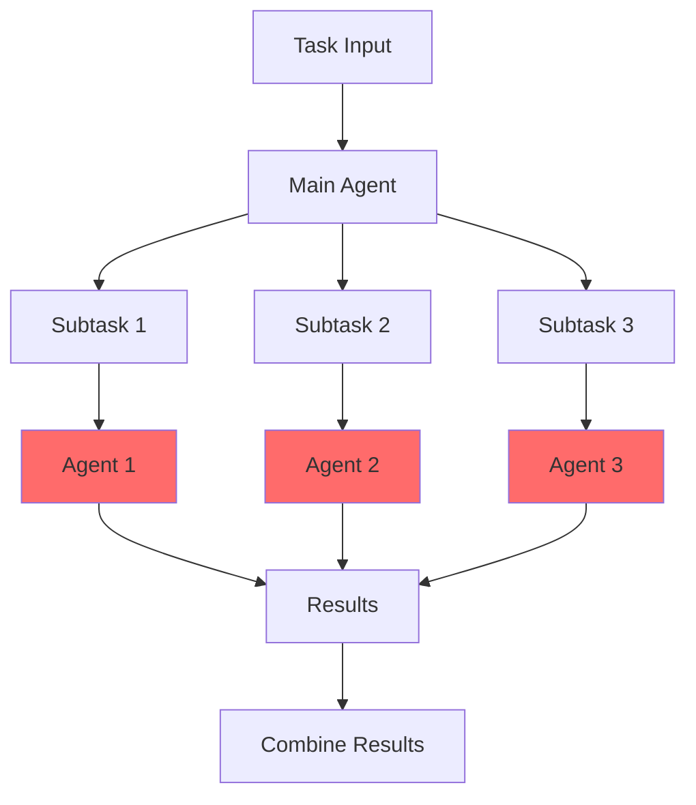
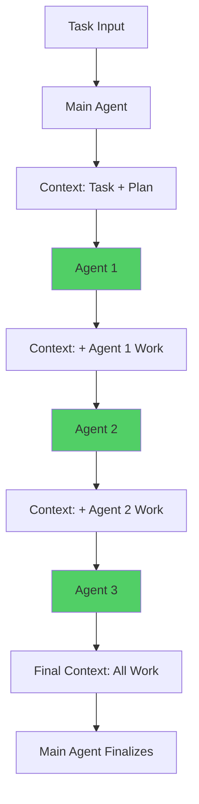

import { CodeExample } from '@/components/claude-sdk/CodeEditor'
import { Callout } from '@/components/ui/callout'
import { Quiz } from '@/components/claude-sdk/Quiz'
import { Diagram } from '@/components/claude-sdk/Diagram'

# Building Reliable AI Agent Architectures

## The Multi-Agent Trap {#introduction}

Picture this: You're excited about AI agents. You've heard about OpenAI Swarm, Microsoft Autogen, and CrewAI. The promise is seductive—multiple specialized agents working in parallel, each tackling part of your problem. It's like having a team of experts at your disposal.

But here's the uncomfortable truth that Cognition AI (the creators of Devon) recently revealed: **multi-agent systems are a trap**.

After building AI systems that serve over 50,000 users, I can confirm their findings. The more agents you add, the more your reliability plummets. Let me show you why this happens and, more importantly, what actually works in production.

<Callout type="warning">
  **Industry Reality**: Despite all the hype around multi-agent frameworks, almost no production applications successfully use them. There's a reason for this.
</Callout>

### Why Multi-Agent Frameworks Disappoint

A year ago, the AI community was buzzing with multi-agent frameworks. The architecture seemed logical:
1. Break down complex tasks
2. Assign specialized agents to each subtask
3. Run them in parallel for efficiency
4. Combine results for the final output

But ask yourself: How many applications are actually using these frameworks successfully in production?

The answer is telling: **almost none**.

This perfectly matches my experience building production AI systems. We spent hundreds of hours trying to make multi-agent systems reliable. What we discovered was sobering: complexity kills reliability.

### The Real-World Impact

Let's look at a concrete example. Imagine you ask your multi-agent system to "Build a Flappy Bird clone game." Here's what typically happens:

- **Agent 1** (Graphics): Creates dark, realistic art with physics-based rendering
- **Agent 2** (Gameplay): Builds colorful, cartoonish mechanics with arcade physics
- **Agent 3** (Integration): Tries to combine incompatible components

The result? A Frankenstein's monster that doesn't work.

## Two Principles That Change Everything {#principles}

Walden Yan, co-founder of Cognition AI, distills the solution down to two critical principles that are so important, you should rarely violate them:

### Principle 1: Share Context

Every agent needs the **full context** of what came before. Not summaries. Not filtered views. The complete picture.

Think of it like a relay race where each runner needs to know not just that they should run, but:
- Why the race started
- What happened in previous legs
- The strategy being employed
- Any obstacles encountered

### Principle 2: Actions Carry Implicit Decisions

When agents act on incomplete information, they make assumptions. These assumptions become implicit decisions that cascade through your system.

<Callout type="info">
  **Key Insight**: Every action an agent takes encodes decisions about the problem space. When agents can't see each other's decisions, they make conflicting assumptions that compound into system-wide failures.
</Callout>

Let's see these principles violated in action:

<CodeExample
  title="The Wrong Way: Parallel Agents Without Context"
  language="python"
  code={`import asyncio
from typing import List, Dict

class UnreliableMultiAgentSystem:
    """DON'T DO THIS: Parallel execution without context sharing"""
    
    async def process_task(self, task: str) -> str:
        # Main agent decomposes the task
        subtasks = self.decompose_task(task)
        
        # Agents work in parallel - THIS IS THE PROBLEM
        results = await asyncio.gather(
            self.agent_1.execute(subtasks[0]),
            self.agent_2.execute(subtasks[1]),
            self.agent_3.execute(subtasks[2])
        )
        
        # Try to combine incompatible results
        return self.combine_results(results)`}
  highlightLines={[10, 11, 12, 13, 14]}
/>

This architecture violates both principles:
1. Agents don't see each other's work (no shared context)
2. Each agent makes independent decisions that conflict

## Agent Architectures: Bad vs Good {#architectures}

Let's explore different architectural patterns, starting with what doesn't work and building up to what does.

### Architecture 1: Parallel Agents (Unreliable)

This is the most tempting architecture—and the most fragile:

<Diagram
  id="parallel-agents-bad"
  title="Unreliable Parallel Agent Architecture"
  description="Multiple agents work simultaneously without visibility"
/>



### Architecture 2: Parallel with Shared Initial Context (Better, Still Unreliable)

A slight improvement where agents see the initial context:

<CodeExample
  title="Parallel Agents with Initial Context"
  language="python"
  code={`class SlightlyBetterMultiAgent:
    """Still problematic: Parallel execution with only initial context"""
    
    async def process_task(self, task: str) -> str:
        context = {"task": task, "history": []}
        
        # Decompose with context
        subtasks = self.decompose_task(task, context)
        
        # Agents get initial context but can't see each other
        results = await asyncio.gather(
            self.agent_1.execute(subtasks[0], context),
            self.agent_2.execute(subtasks[1], context),
            self.agent_3.execute(subtasks[2], context)
        )
        
        return self.combine_results(results, context)`}
/>

This is better but still fails because agents can't see what others are doing in real-time.

### Architecture 3: Linear Sequential Agents (Reliable!)

Now let's look at what actually works:

<Diagram
  id="linear-agents-good"
  title="Reliable Linear Agent Architecture"
  description="Sequential execution with full context propagation"
/>



<CodeExample
  title="The Right Way: Linear Agent Architecture"
  language="python"
  code={`class ReliableLinearAgentSystem:
    """DO THIS: Sequential execution with full context propagation"""
    
    def process_task(self, task: str) -> str:
        # Initialize context with full history tracking
        context = {
            "task": task,
            "history": [],
            "decisions": []
        }
        
        # Main agent creates plan with reasoning
        plan = self.main_agent.create_plan(context)
        context["history"].append({
            "agent": "main",
            "action": "create_plan",
            "result": plan,
            "reasoning": plan.reasoning
        })
        
        # Execute agents sequentially
        for i, (agent, subtask) in enumerate(zip(self.agents, plan.subtasks)):
            # Each agent sees EVERYTHING that happened before
            result = agent.execute(subtask, context)
            
            # Add to context for next agent
            context["history"].append({
                "agent": f"agent_{i}",
                "action": subtask,
                "result": result,
                "reasoning": result.reasoning
            })
        
        # Main agent has complete visibility
        return self.main_agent.finalize(context)`}
  highlightLines={[22, 23, 26, 27, 28, 29, 30, 31]}
/>

Key differences in the reliable architecture:
1. **Sequential Execution**: Agents work one after another
2. **Full Context**: Each agent sees all previous work
3. **Decision Tracking**: Reasoning is preserved and shared
4. **No Conflicts**: Impossible for agents to make conflicting assumptions

### Architecture 4: Advanced Linear with Context Compression

For truly long-running tasks, you might need context compression:

<CodeExample
  title="Linear Architecture with Context Compression"
  language="python"
  code={`class AdvancedLinearAgentSystem:
    """For long-running tasks with context management"""
    
    def __init__(self, max_context_tokens: int = 20000):
        self.compressor = ContextCompressor(max_context_tokens)
        self.full_history = []  # Keep complete history
        
    def process_long_task(self, task: str) -> str:
        context = {"task": task, "history": []}
        
        for agent in self.agent_chain:
            # Compress context before each agent
            compressed = self.compressor.compress(context)
            
            # Agent works with compressed but complete context
            result = agent.execute(compressed)
            
            # Store full history separately
            self.full_history.append({
                "agent": agent.name,
                "compressed_context": compressed,
                "result": result
            })
            
            # Update context with new work
            context["history"].append(result)
            
        return self.finalize_with_full_history()`}
/>

<Callout type="warning">
  **Advanced Pattern Warning**: Context compression is hard to get right. Companies worth billions struggle with this. Only add it when absolutely necessary for long-running tasks.
</Callout>

## Context Engineering: The Real Game Changer {#context-engineering}

While everyone obsesses over prompt engineering, the real leverage is in **context engineering**.

### What is Context Engineering?

Context engineering is the practice of structuring and presenting information to AI agents in a way that maximizes their effectiveness. It involves:

1. **Information Architecture**: How you structure the context
2. **Decision Preservation**: Maintaining reasoning traces
3. **Relevance Filtering**: What to include vs. exclude
4. **Temporal Ordering**: How to sequence information

### Context Engineering Best Practices

<CodeExample
  title="Effective Context Structure"
  language="python"
  code={`class ContextEngineering:
    """Best practices for context management"""
    
    def structure_context(self, task, history):
        return {
            # Clear task definition
            "task": {
                "original": task,
                "decomposed": self.decompose(task),
                "constraints": self.extract_constraints(task),
                "success_criteria": self.define_success(task)
            },
            
            # Structured history with metadata
            "history": [
                {
                    "timestamp": entry.timestamp,
                    "agent": entry.agent,
                    "action": entry.action,
                    "reasoning": entry.reasoning,  # WHY, not just WHAT
                    "result": entry.result,
                    "impact": entry.downstream_effects
                }
                for entry in history
            ],
            
            # Extracted decisions for quick reference
            "key_decisions": self.extract_decisions(history),
            
            # Current state summary
            "current_state": self.summarize_state(history)
        }`}
/>

### The Power of Rich Context

Compare these two approaches:

**Poor Context** (Just Facts):
```
Task: Build a chatbot
Previous: Database schema created
Next: Implement API endpoints
```

**Rich Context** (Full Picture):
```
Task: Build a customer service chatbot for e-commerce
Constraints: Must integrate with existing PostgreSQL database
Previous: Created schema with user, conversation, and message tables
  - Decision: Chose PostgreSQL for transactional consistency
  - Schema supports multi-tenant architecture
  - Includes audit fields for compliance
Next: Implement RESTful API endpoints
  - Consider: Rate limiting for public endpoints
  - Maintain: Consistency with existing API patterns
```

The rich context prevents countless errors and misaligned implementations.

## Learning from Devon and Claude Code {#case-studies}

The most successful AI agents in production follow these principles religiously. Let's examine how industry leaders implement these patterns.

### Devon's Architecture

Devon, created by Cognition AI, is perhaps the most sophisticated AI coding agent available. Here's what we can learn:

1. **Strictly Linear Execution**: Devon never spawns parallel subtasks
2. **Comprehensive Context**: Every action includes full repository state
3. **Intelligent Compression**: Uses semantic understanding to compress context
4. **Decision Preservation**: Maintains a detailed audit trail

### Claude Code's Approach

Anthropic's Claude Code follows similar principles:

<Callout type="success">
  **Claude Code's Rules**:
  - Sub-agents only answer specific questions
  - Only the main agent writes code
  - Investigation work stays separate from main conversation
  - Full context visibility at every step
</Callout>

### Key Takeaways from Production Systems

Both Devon and Claude Code demonstrate that:

1. **Simplicity Wins**: Linear architectures outperform complex orchestration
2. **Context is King**: Better context beats more agents every time
3. **Sequential > Parallel**: Reliability matters more than theoretical speed
4. **Decisions Matter**: Preserve reasoning, not just outcomes

## Practical Implementation Guidelines {#implementation}

### When to Use Simple Linear Architecture

Use the simple linear pattern when:
- Task duration < 30 minutes
- Context size < 50,000 tokens
- Clear sequential dependencies exist
- Reliability is paramount

### When to Consider Context Compression

Only add compression when:
- Tasks run for hours or days
- Context exceeds model limits
- You have robust testing infrastructure
- The complexity is justified by clear benefits

### Architecture Decision Framework

Ask yourself these questions:

1. **Can this be done with a single agent?** If yes, stop here.
2. **Must subtasks run in parallel?** If no, use linear architecture.
3. **Will context exceed limits?** If no, avoid compression.
4. **Is 95% reliability sufficient?** If no, keep it simple.

<Callout type="info">
  **Remember**: The companies building the most advanced AI agents (Cognition, Anthropic, OpenAI) all chose simple architectures with rich context over complex multi-agent systems.
</Callout>

## Your Next Steps

Now that you understand reliable agent architectures:

1. **Audit Existing Systems**: Look for parallel execution patterns
2. **Refactor to Linear**: Convert parallel agents to sequential
3. **Enhance Context**: Add reasoning and decision tracking
4. **Measure Reliability**: Track success rates before/after
5. **Share Knowledge**: Help others avoid the multi-agent trap

The future of AI agents isn't about complex orchestration—it's about context engineering and architectural simplicity. Master these principles, and you'll build agents that actually work in production.

Ready to implement these patterns? The exercise section will walk you through building your own reliable agent system. Remember: start simple, share context, and let agents build on each other's work. That's the secret to production-ready AI agents.