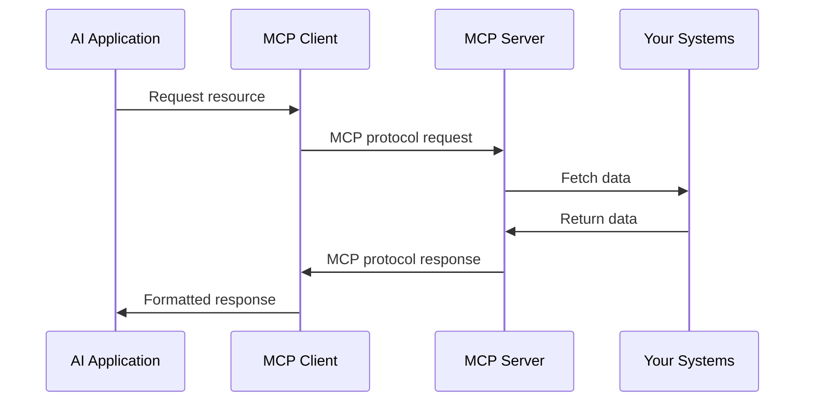

import { CodeExample } from '@/components/claude-sdk/CodeEditor'
import { Callout } from '@/components/ui/callout'
import { Diagram } from '@/components/claude-sdk/Diagram'

# What is MCP?

## Introduction {#introduction}

The Model Context Protocol (MCP) is revolutionizing how AI applications interact with external data sources and tools. Released by Anthropic in November 2024, MCP has rapidly become the standard for building professional agentic AI systems that go beyond simple chatbots.

<Callout type="info">
  **Key Insight**: MCP enables AI to move beyond simple text generation to become true agents capable of accessing resources and taking meaningful actions in the real world.
</Callout>

### The Problem MCP Solves

**Before MCP:**
- Every developer created custom API layers for external integrations
- Each integration required custom function definitions and schemas  
- No standardization across different tools and services
- Constant reinvention for common integrations

**After MCP:**
- Unified protocol layer that standardizes tool and resource definitions
- Consistent API across all integrations
- Reusable servers that can be shared across projects
- Standardized schemas, functions, and documentation

In this module, you'll discover:
- Why MCP was created and the problems it solves
- The fundamental concepts that make MCP work
- How to build production-ready AI systems with MCP
- Real-world enterprise applications and benefits

## Core Concepts {#core-concepts}

### Understanding the Protocol

MCP provides a standardized way for AI applications to:

1. **Access Resources**: Connect to data sources, files, and APIs
2. **Execute Tools**: Perform actions and operations
3. **Use Prompts**: Leverage pre-built prompt templates

<CodeExample
  title="Python MCP Server (Modern Approach)"
  language="python"
  code={`from mcp import FastMCP

# Create MCP server instance
mcp = FastMCP(
    name="production-server",
    host="localhost", 
    port=8050
)

# Define tools using decorators
@mcp.tool
def get_customer_data(customer_id: str) -> dict:
    """Retrieve customer information from database."""
    return {"id": customer_id, "name": "John Doe", "tier": "enterprise"}

@mcp.tool
def create_support_ticket(title: str, description: str) -> dict:
    """Create a new support ticket."""
    return {"ticket_id": "TICK-001", "status": "created"}

# Run server
if __name__ == "__main__":
    mcp.run(transport="stdio")  # or mcp.run_sse() for HTTP`}
  highlightLines={[3, 4, 5, 10, 11, 15, 16]}
/>

### Key Components

**1. Resources**
Resources are read-only data sources that AI can access. Examples include:
- Database records
- File contents
- API responses
- System information

**2. Tools**
Tools enable AI to perform actions. Examples include:
- Writing files
- Sending emails
- Executing commands
- Calling APIs

**3. Prompts**
Reusable prompt templates that ensure consistent AI behavior.

<Callout type="success">
  **Pro Tip**: Start with resources to expose data, then add tools for actions. This separation keeps your MCP server organized and secure.
</Callout>

## Architecture {#architecture}

### How MCP Works

MCP follows a client-server architecture:

1. **MCP Server**: Your application that exposes resources and tools
2. **MCP Client**: The AI application (like Claude) that connects to your server
3. **Transport Layer**: How they communicate (stdio, HTTP, WebSocket)

<Diagram
  id="mcp-architecture"
  title="MCP Architecture Overview"
  description="The flow of communication between AI applications and MCP servers"
/>

### Communication Flow

### Design Principles

MCP is built on several key principles:

1. **Simplicity**: Easy to implement and understand
2. **Security**: Controlled access with clear boundaries
3. **Flexibility**: Works with any programming language
4. **Extensibility**: Add capabilities as needed

## Use Cases {#use-cases}

### Real-World Applications

MCP enables powerful enterprise integrations:

**1. Customer Support Automation**
- Automated ticket triage and routing
- Intelligent escalation based on urgency
- Integration with Slack, JIRA, and CRM systems
- Knowledge base search and recommendations

**2. Workflow Automation**
- Multi-step business process automation
- Cross-system data synchronization
- Approval workflow orchestration
- Document processing and routing

**3. Data Analysis and Reporting**
- Real-time database queries and analysis
- Automated report generation
- Knowledge graph construction
- Business intelligence dashboards

**4. Development and DevOps**
- Code analysis and generation
- Automated testing and deployment
- Infrastructure monitoring and alerts
- Documentation synchronization

**5. Enterprise Integrations**
- CRM and sales automation
- HR system integrations
- Financial system connections
- Supply chain management

<CodeExample
  title="Example: Enterprise Knowledge Base"
  language="python"
  code={`@mcp.tool
def search_knowledge_base(query: str, category: str = "all") -> str:
    """Search company knowledge base for customer support."""
    # Connect to enterprise knowledge system
    results = kb_search_api.search(query, category)
    
    formatted_results = ""
    for result in results:
        formatted_results += f"Q: {result['question']}\n"
        formatted_results += f"A: {result['answer']}\n\n"
    
    return formatted_results

@mcp.tool  
def create_escalation_ticket(customer_id: str, issue: str, priority: str) -> dict:
    """Create high-priority escalation ticket."""
    ticket = jira_api.create_issue({
        "summary": f"Escalation for customer {customer_id}",
        "description": issue,
        "priority": priority,
        "labels": ["customer-escalation", "high-priority"]
    })
    return {"ticket_id": ticket.key, "status": "created"}`}
  runnable={false}
/>

## Benefits {#benefits}

### Why Use MCP?

1. **Standardization**: One protocol for all integrations
2. **Security**: Controlled, auditable access  
3. **Reusability**: Write once, use with any AI
4. **Flexibility**: Add capabilities incrementally
5. **Future-Proof**: Evolves with AI capabilities
6. **Enterprise-Ready**: Built for production environments
7. **Language Agnostic**: Python, TypeScript, Rust, and more

<Callout type="success">
  **Success Story**: Teams using MCP report 70% faster AI integration development and significantly improved security compared to custom solutions.
</Callout>

### Python Advantages for MCP

Python is particularly well-suited for MCP development:

**Fast Development**
- Simple decorator-based tool definitions
- Rich ecosystem of libraries for enterprise integrations
- Easy database and API connections

**Production Ready**
- Docker containerization support
- Async/await for high performance
- Built-in error handling and logging
- Lifecycle management for database connections

**Enterprise Integration**
- Seamless integration with existing Python infrastructure
- Support for major databases (PostgreSQL, MySQL, MongoDB)
- Enterprise authentication (LDAP, SAML, OAuth)
- Monitoring and observability tools

## Common Misconceptions {#misconceptions}

Let's clarify some common misunderstandings:

<Callout type="warning">
  **Myth**: "MCP is only for Claude"
  **Reality**: MCP is an open protocol that any AI application can implement
</Callout>

<Callout type="warning">
  **Myth**: "MCP replaces APIs"
  **Reality**: MCP complements existing APIs by making them AI-accessible
</Callout>

<Callout type="warning">
  **Myth**: "MCP is complex to implement"
  **Reality**: A basic MCP server can be created in under 50 lines of code
</Callout>

## Summary {#summary}

You've learned that MCP:

✅ **Standardizes** how AI connects to external systems
✅ **Separates** data access (resources) from actions (tools)
✅ **Simplifies** AI integration development
✅ **Secures** AI access to your systems

## Next Steps {#next-steps}

Ready to build your first MCP server? In the next module, you'll:
- Set up your Python development environment with MCP
- Create a production-ready MCP server
- Implement enterprise-grade tools and resources
- Test with OpenAI integration
- Deploy with Docker containerization

<Callout type="info">
  **Coming Up Next**: [Setting Up Your Production MCP Environment](/learn/paths/mcp-fundamentals/modules/02-setting-up-environment) - Build enterprise-ready MCP servers with Python!
</Callout>