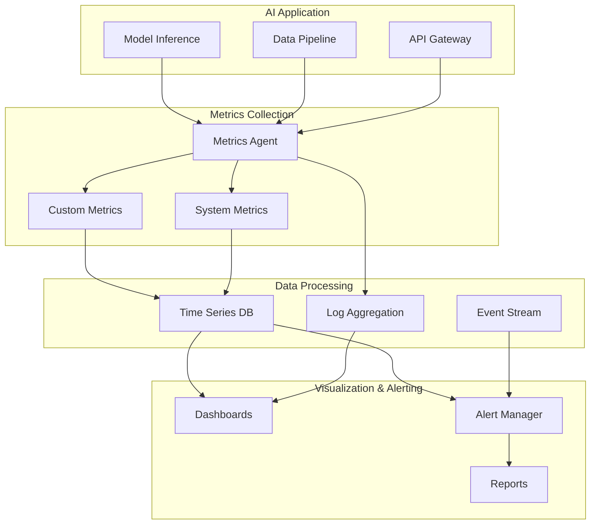

# AI System Monitoring & Observability

Welcome to the comprehensive guide on monitoring and observability for AI systems in production. This module covers the unique challenges of monitoring AI applications, from tracking model performance to detecting drift and ensuring system reliability.

## Learning Objectives

By the end of this module, you will be able to:

- **Understand the unique monitoring requirements** that distinguish AI systems from traditional software
- **Implement comprehensive metrics collection** for model performance, quality, and business impact
- **Design effective logging strategies** that balance insights with privacy concerns
- **Build real-time monitoring dashboards** that provide actionable visibility
- **Configure intelligent alerting** for model drift, degradation, and system issues
- **Master observability tools and platforms** specifically designed for AI workloads

## AI Monitoring Fundamentals {#ai-monitoring-fundamentals}

### Why AI Systems Need Different Monitoring

Traditional software monitoring focuses on availability, performance, and errors. AI systems require additional layers of monitoring:

#### Traditional Software Monitoring
- **Infrastructure metrics**: CPU, memory, disk, network
- **Application metrics**: Response time, throughput, error rates
- **Business metrics**: User engagement, conversion rates

#### AI-Specific Monitoring Requirements
- **Model performance metrics**: Accuracy, precision, recall, F1-score
- **Prediction quality**: Confidence scores, uncertainty quantification
- **Data quality**: Input distribution, feature drift, data completeness
- **Model behavior**: Output distribution, decision boundaries, fairness metrics
- **Resource consumption**: Token usage, GPU utilization, inference costs
- **Model lifecycle**: Version tracking, A/B test results, retraining triggers

### The Four Pillars of AI Observability

<Callout type="info">
**AI Observability** extends beyond traditional monitoring by providing deep insights into model behavior, data patterns, and system performance in production environments.
</Callout>

#### 1. Performance Monitoring
Track how well your AI system performs its intended function:
- Inference latency and throughput
- Resource utilization patterns
- Scalability metrics
- Cost per inference

#### 2. Model Quality Monitoring
Ensure your model maintains its effectiveness:
- Prediction accuracy over time
- Confidence score distributions
- Output quality metrics
- Business KPI impact

#### 3. Data Observability
Monitor the lifeblood of your AI system:
- Input data distributions
- Feature quality and completeness
- Data drift detection
- Anomaly identification

#### 4. Operational Health
Maintain system reliability and availability:
- Error rates and types
- System availability
- Recovery time objectives
- Dependency health

### Monitoring Architecture for AI Systems

A robust monitoring architecture for AI systems includes:



## Key Metrics for AI Systems {#key-metrics}

### Performance Metrics

#### Latency Metrics
Monitor inference latency at multiple percentiles:
- **P50 (Median)**: Typical user experience
- **P95**: Performance for most users
- **P99**: Worst-case scenarios
- **P99.9**: Extreme outliers

#### Throughput Metrics
- **Requests per second**: System capacity
- **Batch processing rate**: For batch inference
- **Queue depth**: Pending requests
- **Concurrency levels**: Parallel processing capability

### Model Quality Metrics

#### Accuracy Metrics
Track model performance against ground truth:
- **Classification**: Accuracy, precision, recall, F1-score
- **Regression**: MAE, MSE, RMSE, R-squared
- **Ranking**: NDCG, MAP, MRR
- **Generation**: BLEU, ROUGE, perplexity

#### Confidence and Uncertainty
- **Confidence distribution**: How certain is the model?
- **Calibration metrics**: Do confidence scores match accuracy?
- **Uncertainty quantification**: Epistemic vs. aleatoric uncertainty

### Business Impact Metrics

#### Direct Business Metrics
- **Conversion impact**: How predictions affect business outcomes
- **Revenue attribution**: Value generated by AI decisions
- **Cost savings**: Automation and efficiency gains
- **User satisfaction**: NPS, CSAT scores related to AI features

#### Cost Metrics
- **Infrastructure costs**: Compute, storage, networking
- **API costs**: For external services (e.g., OpenAI, Anthropic)
- **Token usage**: For LLM-based systems
- **Cost per inference**: Total cost divided by request count

### Data Quality Metrics

#### Input Data Monitoring
- **Feature distributions**: Statistical properties of input features
- **Missing data rates**: Percentage of incomplete inputs
- **Schema violations**: Malformed or unexpected data
- **Data freshness**: Age of input data

#### Drift Detection Metrics
- **Feature drift**: Changes in input distributions
- **Prediction drift**: Changes in output distributions
- **Concept drift**: Changes in the relationship between inputs and outputs
- **Performance drift**: Degradation in model accuracy over time

<Callout type="warning">
**Drift Detection** is critical for maintaining model quality. Even small changes in data distribution can significantly impact model performance.
</Callout>

### Statistical Methods for Drift Detection

#### For Numerical Features
- **Kolmogorov-Smirnov Test**: Compares entire distributions
- **Wasserstein Distance**: Measures distribution difference
- **Population Stability Index (PSI)**: Quantifies population shift
- **Jensen-Shannon Divergence**: Symmetric measure of distribution difference

#### For Categorical Features
- **Chi-square Test**: Tests independence of distributions
- **G-test**: Alternative to chi-square for small samples
- **Cramér's V**: Effect size for categorical associations

## Logging Strategies for AI {#logging-strategies}

### Structured Logging Best Practices

#### Log Schema Design
Design logs that capture the full context of AI operations:

```json
{
  "timestamp": "2024-03-15T10:23:45.123Z",
  "request_id": "req-abc123",
  "model": {
    "name": "recommendation-engine",
    "version": "v2.3.1",
    "variant": "personalized"
  },
  "inference": {
    "duration_ms": 145.3,
    "confidence": 0.923,
    "prediction": "product_123",
    "features_used": ["user_history", "item_popularity", "context_time"]
  },
  "resources": {
    "tokens": {"prompt": 150, "completion": 50},
    "gpu_time_ms": 89.2,
    "memory_mb": 512
  },
  "metadata": {
    "user_segment": "premium",
    "experiment": "new_algorithm_test",
    "region": "us-west-2"
  }
}
```

#### Privacy-Preserving Logging

<Callout type="warning">
**Privacy First**: Never log sensitive user data or PII. Use hashing, tokenization, or aggregation to maintain privacy while enabling debugging.
</Callout>

Strategies for privacy-preserving logs:
- **Input hashing**: Store hashes instead of raw inputs
- **Differential privacy**: Add noise to aggregated metrics
- **Data minimization**: Log only necessary information
- **Retention policies**: Delete logs after specified periods

### Log Aggregation and Analysis

#### Centralized Logging Architecture
- **Log collectors**: Fluentd, Logstash, Vector
- **Storage backends**: Elasticsearch, CloudWatch, BigQuery
- **Analysis tools**: Kibana, Grafana Loki, Datadog

#### Log Patterns for AI Systems

##### Inference Logs
```python
logger.info("inference_complete", extra={
    "request_id": request_id,
    "model_name": model_name,
    "model_version": model_version,
    "prediction": prediction,
    "confidence": confidence,
    "latency_ms": latency,
    "feature_vector_hash": hash_features(features)
})
```

##### Error and Exception Logs
```python
logger.error("inference_failed", extra={
    "request_id": request_id,
    "error_type": type(e).__name__,
    "error_message": str(e),
    "model_name": model_name,
    "retry_count": retry_count,
    "fallback_used": fallback_model is not None
})
```

##### Model Event Logs
```python
logger.info("model_loaded", extra={
    "model_name": model_name,
    "model_version": model_version,
    "load_time_ms": load_time,
    "model_size_mb": model_size,
    "device": "cuda:0" if torch.cuda.is_available() else "cpu"
})
```

### Debugging with Logs

#### Correlation and Tracing
- **Request tracing**: Follow requests through the entire system
- **Correlation IDs**: Link related events across services
- **Distributed tracing**: OpenTelemetry, Jaeger, Zipkin

#### Log-Based Debugging Patterns
1. **Performance bottlenecks**: Analyze latency distributions
2. **Error patterns**: Identify common failure modes
3. **Data quality issues**: Detect anomalous inputs
4. **Model behavior**: Understand prediction patterns

## Real-time Monitoring Dashboards {#monitoring-dashboards}

### Dashboard Design Principles

#### Information Hierarchy
1. **Overview metrics**: System health at a glance
2. **Key performance indicators**: Business-critical metrics
3. **Detailed views**: Drill-down capabilities
4. **Historical trends**: Time-series comparisons

#### Visual Design Best Practices
- **Use appropriate chart types**: Line for trends, heatmaps for distributions
- **Consistent color coding**: Red for alerts, green for healthy
- **Clear labeling**: Descriptive titles and axis labels
- **Responsive layout**: Adapt to different screen sizes

### Essential Dashboard Components

#### System Health Overview
- **Service availability**: Uptime and health checks
- **Error rates**: By service and error type
- **Latency percentiles**: P50, P95, P99
- **Active alerts**: Current issues requiring attention

#### Model Performance Dashboard
- **Accuracy trends**: Model performance over time
- **Confidence distributions**: Histogram of prediction confidence
- **Prediction volume**: Requests per time period
- **A/B test results**: Comparative model performance

#### Resource Utilization
- **Compute usage**: CPU, GPU, memory trends
- **Cost tracking**: Real-time spend monitoring
- **Token usage**: For LLM-based systems
- **Queue metrics**: Processing backlog

#### Data Quality Dashboard
- **Input distributions**: Feature value ranges
- **Drift scores**: Real-time drift detection
- **Data completeness**: Missing value rates
- **Anomaly detection**: Unusual patterns

### Building Effective Dashboards

#### Technology Stack
- **Grafana**: Open-source visualization platform
- **Datadog**: Enterprise monitoring solution
- **New Relic**: Application performance monitoring
- **Custom solutions**: React-based dashboards

#### Dashboard Configuration Example

```yaml
# Grafana Dashboard Configuration
panels:
  - title: "Model Inference Latency"
    type: graph
    targets:
      - expr: |
          histogram_quantile(0.95,
            sum(rate(ai_inference_duration_seconds_bucket[5m])) 
            by (le, model, version)
          )
    gridPos: {x: 0, y: 0, w: 12, h: 8}
    
  - title: "Prediction Confidence Heatmap"
    type: heatmap
    targets:
      - expr: "sum(rate(ai_prediction_confidence_bucket[5m])) by (le)"
    gridPos: {x: 12, y: 0, w: 12, h: 8}
    
  - title: "Model Drift Score"
    type: gauge
    targets:
      - expr: "ai_model_drift_score"
    thresholds:
      - value: 0.3
        color: yellow
      - value: 0.7
        color: red
    gridPos: {x: 0, y: 8, w: 6, h: 6}
```

## Alert Strategies and Thresholds {#alerting-strategies}

### Alert Design Philosophy

#### Alert Quality Over Quantity
- **Actionable alerts**: Every alert should have a clear response
- **Avoid alert fatigue**: Minimize false positives
- **Severity levels**: Critical, Warning, Info
- **Smart grouping**: Related alerts bundled together

### Types of AI System Alerts

#### Performance Alerts
```yaml
- alert: HighInferenceLatency
  expr: |
    histogram_quantile(0.95, 
      rate(ai_inference_duration_seconds_bucket[5m])
    ) > 1.0
  for: 5m
  severity: warning
  annotations:
    summary: "Model inference taking >1s at P95"
    runbook_url: "https://wiki/runbooks/ai-latency"
```

#### Model Quality Alerts
```yaml
- alert: ModelAccuracyDegraded
  expr: ai_model_accuracy < 0.85
  for: 30m
  severity: critical
  annotations:
    summary: "Model accuracy below 85% threshold"
    action: "Consider model rollback or retraining"
```

#### Resource Alerts
```yaml
- alert: HighTokenUsage
  expr: |
    sum(rate(ai_token_usage_total[1h])) > 100000
  for: 5m
  severity: warning
  annotations:
    summary: "Token usage exceeding budget"
    dashboard: "http://grafana/d/token-usage"
```

### Alert Routing and Escalation

#### Routing Strategy
```yaml
route:
  group_by: ['alertname', 'model', 'severity']
  group_wait: 30s
  group_interval: 5m
  repeat_interval: 12h
  receiver: 'ai-team'
  routes:
    - match:
        severity: critical
      receiver: 'pagerduty'
    - match:
        team: data-science
      receiver: 'ds-team'
    - match:
        severity: warning
      receiver: 'slack'
```

#### Escalation Policies
1. **Immediate response**: Critical production issues
2. **Business hours**: Non-critical performance degradation
3. **Daily review**: Trend-based alerts
4. **Weekly summary**: Low-priority notifications

### Alert Tuning and Optimization

#### Reducing False Positives
- **Time-based conditions**: Require sustained issues
- **Business hour awareness**: Different thresholds for peak times
- **Seasonal adjustments**: Account for known patterns
- **Dynamic thresholds**: Adapt based on historical data

#### Alert Testing
```python
# Alert testing framework
def test_alert_conditions():
    """Test alert rules against historical data"""
    
    # Load historical metrics
    metrics = load_metrics(days=30)
    
    # Simulate alert conditions
    alerts = evaluate_rules(metrics, alert_rules)
    
    # Calculate metrics
    false_positive_rate = calculate_false_positives(alerts, incidents)
    alert_coverage = calculate_incident_coverage(alerts, incidents)
    
    assert false_positive_rate < 0.05  # Less than 5% false positives
    assert alert_coverage > 0.95  # Catch 95% of real incidents
```

## Observability Tools & Platforms {#observability-tools}

### Open Source Tools

#### Prometheus + Grafana
- **Strengths**: Flexible, powerful query language, extensive integrations
- **Use case**: Custom metrics and dashboards
- **Limitations**: Requires setup and maintenance

#### OpenTelemetry
- **Strengths**: Vendor-neutral, comprehensive instrumentation
- **Use case**: Distributed tracing and metrics collection
- **Integration**: Works with multiple backends

#### Elasticsearch + Kibana
- **Strengths**: Powerful log analysis, full-text search
- **Use case**: Log aggregation and analysis
- **Scalability**: Handles large log volumes

### Commercial Platforms

#### Datadog
- **AI/ML Features**: Model performance tracking, custom metrics
- **Integration**: Pre-built dashboards for ML frameworks
- **Cost**: Based on data volume and hosts

#### New Relic
- **AI Monitoring**: Application performance with AI insights
- **Features**: Automated anomaly detection, smart alerts
- **Strength**: Deep application instrumentation

#### Weights & Biases
- **Focus**: ML experiment tracking and monitoring
- **Features**: Model versioning, performance comparison
- **Integration**: Native support for major ML frameworks

### AI-Specific Monitoring Platforms

#### Arize AI
- **Specialization**: ML observability platform
- **Features**: Drift detection, performance monitoring, explainability
- **Use case**: Production ML monitoring

#### Evidently AI
- **Focus**: Data and model monitoring
- **Features**: Drift detection, data quality checks
- **Deployment**: Open-source and cloud options

#### Fiddler AI
- **Capabilities**: Model monitoring and explainability
- **Features**: Bias detection, performance tracking
- **Enterprise**: SOC 2 compliant, enterprise features

### Platform Selection Criteria

#### Technical Requirements
- Metric collection capabilities
- Log aggregation and search
- Alert management
- API and integration options

#### Operational Considerations
- Setup and maintenance effort
- Scalability requirements
- Team expertise
- Budget constraints

#### AI-Specific Needs
- Model performance tracking
- Drift detection capabilities
- Experiment tracking
- Explainability features

## Best Practices and Common Pitfalls

### Best Practices

#### 1. Start with Business Metrics
- Define success in business terms
- Connect technical metrics to business outcomes
- Track ROI of AI investments

#### 2. Implement Progressive Monitoring
- Start simple, add complexity as needed
- Focus on critical metrics first
- Iterate based on learnings

#### 3. Automate Response Actions
- Automated rollbacks for critical issues
- Auto-scaling based on load
- Scheduled retraining triggers

#### 4. Document Everything
- Runbooks for common issues
- Alert response procedures
- Metric definitions and thresholds

### Common Pitfalls to Avoid

#### 1. Over-Monitoring
- Too many metrics dilute focus
- Alert fatigue from too many notifications
- High operational overhead

#### 2. Under-Monitoring
- Missing critical failure modes
- No visibility into model degradation
- Reactive instead of proactive

#### 3. Poor Alert Design
- Alerts without clear actions
- Too sensitive or too lenient thresholds
- No consideration for business context

#### 4. Ignoring Data Quality
- Focus only on model metrics
- Missing data pipeline issues
- No input validation monitoring

## Summary

Effective monitoring and observability are crucial for maintaining reliable AI systems in production. Key takeaways:

1. **AI systems require specialized monitoring** beyond traditional software metrics
2. **Comprehensive metrics collection** should cover performance, quality, and business impact
3. **Structured logging** enables debugging while preserving privacy
4. **Real-time dashboards** provide actionable visibility into system health
5. **Intelligent alerting** prevents issues before they impact users
6. **Choose tools** that match your team's needs and expertise

Remember: Good monitoring is not about collecting all possible data, but about gathering the right insights to maintain and improve your AI systems.

## Next Steps

After completing this module, you should:
1. Design a monitoring strategy for your AI applications
2. Implement key metrics collection in your systems
3. Build dashboards for your specific use cases
4. Configure alerts that match your SLOs
5. Continuously refine based on operational experience

In the next module, we'll explore **Model Versioning & Rollback Strategies**, building on the monitoring foundation to enable safe and controlled model updates.