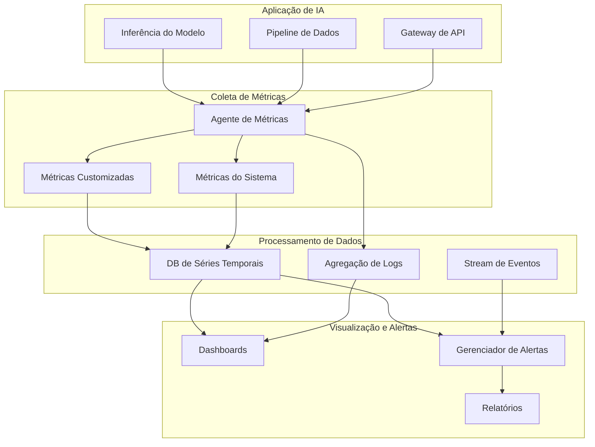

# Monitoramento e Observabilidade de Sistemas de IA

Bem-vindo ao guia abrangente sobre monitoramento e observabilidade para sistemas de IA em produção. Este módulo aborda os desafios únicos do monitoramento de aplicações de IA, desde o rastreamento de desempenho do modelo até a detecção de drift e garantia de confiabilidade do sistema.

## Objetivos de Aprendizagem

Ao final deste módulo, você será capaz de:

- **Entender os requisitos únicos de monitoramento** que distinguem sistemas de IA de software tradicional
- **Implementar coleta abrangente de métricas** para desempenho do modelo, qualidade e impacto nos negócios
- **Projetar estratégias eficazes de logging** que equilibrem insights com preocupações de privacidade
- **Construir dashboards de monitoramento em tempo real** que fornecem visibilidade acionável
- **Configurar alertas inteligentes** para drift do modelo, degradação e problemas do sistema
- **Dominar ferramentas e plataformas de observabilidade** especificamente projetadas para cargas de trabalho de IA

## Fundamentos do Monitoramento de IA {#ai-monitoring-fundamentals}

### Por Que Sistemas de IA Precisam de Monitoramento Diferente

O monitoramento de software tradicional foca em disponibilidade, desempenho e erros. Sistemas de IA requerem camadas adicionais de monitoramento:

#### Monitoramento de Software Tradicional
- **Métricas de infraestrutura**: CPU, memória, disco, rede
- **Métricas de aplicação**: Tempo de resposta, throughput, taxas de erro
- **Métricas de negócio**: Engajamento do usuário, taxas de conversão

#### Requisitos Específicos de Monitoramento de IA
- **Métricas de desempenho do modelo**: Acurácia, precisão, recall, F1-score
- **Qualidade da predição**: Scores de confiança, quantificação de incerteza
- **Qualidade dos dados**: Distribuição de entrada, drift de features, completude dos dados
- **Comportamento do modelo**: Distribuição de saída, limites de decisão, métricas de equidade
- **Consumo de recursos**: Uso de tokens, utilização de GPU, custos de inferência
- **Ciclo de vida do modelo**: Rastreamento de versões, resultados de testes A/B, gatilhos de retreinamento

### Os Quatro Pilares da Observabilidade de IA

<Callout type="info">
**Observabilidade de IA** estende-se além do monitoramento tradicional ao fornecer insights profundos sobre o comportamento do modelo, padrões de dados e desempenho do sistema em ambientes de produção.
</Callout>

#### 1. Monitoramento de Desempenho
Acompanhe o quão bem seu sistema de IA executa sua função pretendida:
- Latência e throughput de inferência
- Padrões de utilização de recursos
- Métricas de escalabilidade
- Custo por inferência

#### 2. Monitoramento de Qualidade do Modelo
Garanta que seu modelo mantenha sua eficácia:
- Acurácia de predição ao longo do tempo
- Distribuições de score de confiança
- Métricas de qualidade de saída
- Impacto nos KPIs de negócio

#### 3. Observabilidade de Dados
Monitore a força vital do seu sistema de IA:
- Distribuições de dados de entrada
- Qualidade e completude das features
- Detecção de drift de dados
- Identificação de anomalias

#### 4. Saúde Operacional
Mantenha a confiabilidade e disponibilidade do sistema:
- Taxas e tipos de erro
- Disponibilidade do sistema
- Objetivos de tempo de recuperação
- Saúde das dependências

### Arquitetura de Monitoramento para Sistemas de IA

Uma arquitetura robusta de monitoramento para sistemas de IA inclui:



## Métricas-Chave para Sistemas de IA {#key-metrics}

### Métricas de Desempenho

#### Métricas de Latência
Monitore a latência de inferência em múltiplos percentis:
- **P50 (Mediana)**: Experiência típica do usuário
- **P95**: Desempenho para a maioria dos usuários
- **P99**: Cenários de pior caso
- **P99.9**: Outliers extremos

#### Métricas de Throughput
- **Requisições por segundo**: Capacidade do sistema
- **Taxa de processamento em batch**: Para inferência em lote
- **Profundidade da fila**: Requisições pendentes
- **Níveis de concorrência**: Capacidade de processamento paralelo

### Métricas de Qualidade do Modelo

#### Métricas de Acurácia
Acompanhe o desempenho do modelo contra a verdade absoluta:
- **Classificação**: Acurácia, precisão, recall, F1-score
- **Regressão**: MAE, MSE, RMSE, R-quadrado
- **Ranking**: NDCG, MAP, MRR
- **Geração**: BLEU, ROUGE, perplexidade

#### Confiança e Incerteza
- **Distribuição de confiança**: Quão certo está o modelo?
- **Métricas de calibração**: Os scores de confiança correspondem à acurácia?
- **Quantificação de incerteza**: Incerteza epistêmica vs. aleatória

### Métricas de Impacto nos Negócios

#### Métricas Diretas de Negócio
- **Impacto na conversão**: Como as predições afetam os resultados de negócio
- **Atribuição de receita**: Valor gerado por decisões de IA
- **Economia de custos**: Ganhos de automação e eficiência
- **Satisfação do usuário**: Scores NPS, CSAT relacionados a recursos de IA

#### Métricas de Custo
- **Custos de infraestrutura**: Computação, armazenamento, rede
- **Custos de API**: Para serviços externos (ex: OpenAI, Anthropic)
- **Uso de tokens**: Para sistemas baseados em LLM
- **Custo por inferência**: Custo total dividido pela contagem de requisições

### Métricas de Qualidade de Dados

#### Monitoramento de Dados de Entrada
- **Distribuições de features**: Propriedades estatísticas das features de entrada
- **Taxas de dados ausentes**: Porcentagem de entradas incompletas
- **Violações de schema**: Dados malformados ou inesperados
- **Frescor dos dados**: Idade dos dados de entrada

#### Métricas de Detecção de Drift
- **Drift de features**: Mudanças nas distribuições de entrada
- **Drift de predição**: Mudanças nas distribuições de saída
- **Drift conceitual**: Mudanças na relação entre entradas e saídas
- **Drift de desempenho**: Degradação na acurácia do modelo ao longo do tempo

<Callout type="warning">
**Detecção de Drift** é crítica para manter a qualidade do modelo. Mesmo pequenas mudanças na distribuição de dados podem impactar significativamente o desempenho do modelo.
</Callout>

### Métodos Estatísticos para Detecção de Drift

#### Para Features Numéricas
- **Teste de Kolmogorov-Smirnov**: Compara distribuições inteiras
- **Distância de Wasserstein**: Mede diferença de distribuição
- **Índice de Estabilidade Populacional (PSI)**: Quantifica mudança populacional
- **Divergência Jensen-Shannon**: Medida simétrica de diferença de distribuição

#### Para Features Categóricas
- **Teste Qui-quadrado**: Testa independência de distribuições
- **Teste G**: Alternativa ao qui-quadrado para amostras pequenas
- **V de Cramér**: Tamanho do efeito para associações categóricas

## Estratégias de Logging para IA {#logging-strategies}

### Melhores Práticas de Logging Estruturado

#### Design do Schema de Log
Projete logs que capturem o contexto completo das operações de IA:

```json
{
  "timestamp": "2024-03-15T10:23:45.123Z",
  "request_id": "req-abc123",
  "model": {
    "name": "recommendation-engine",
    "version": "v2.3.1",
    "variant": "personalized"
  },
  "inference": {
    "duration_ms": 145.3,
    "confidence": 0.923,
    "prediction": "product_123",
    "features_used": ["user_history", "item_popularity", "context_time"]
  },
  "resources": {
    "tokens": {"prompt": 150, "completion": 50},
    "gpu_time_ms": 89.2,
    "memory_mb": 512
  },
  "metadata": {
    "user_segment": "premium",
    "experiment": "new_algorithm_test",
    "region": "us-west-2"
  }
}
```

#### Logging com Preservação de Privacidade

<Callout type="warning">
**Privacidade em Primeiro Lugar**: Nunca registre dados sensíveis do usuário ou PII. Use hashing, tokenização ou agregação para manter a privacidade enquanto permite debugging.
</Callout>

Estratégias para logs preservando privacidade:
- **Hashing de entrada**: Armazene hashes em vez de entradas brutas
- **Privacidade diferencial**: Adicione ruído a métricas agregadas
- **Minimização de dados**: Registre apenas informações necessárias
- **Políticas de retenção**: Delete logs após períodos especificados

### Agregação e Análise de Logs

#### Arquitetura de Logging Centralizada
- **Coletores de log**: Fluentd, Logstash, Vector
- **Backends de armazenamento**: Elasticsearch, CloudWatch, BigQuery
- **Ferramentas de análise**: Kibana, Grafana Loki, Datadog

#### Padrões de Log para Sistemas de IA

##### Logs de Inferência
```python
logger.info("inference_complete", extra={
    "request_id": request_id,
    "model_name": model_name,
    "model_version": model_version,
    "prediction": prediction,
    "confidence": confidence,
    "latency_ms": latency,
    "feature_vector_hash": hash_features(features)
})
```

##### Logs de Erro e Exceção
```python
logger.error("inference_failed", extra={
    "request_id": request_id,
    "error_type": type(e).__name__,
    "error_message": str(e),
    "model_name": model_name,
    "retry_count": retry_count,
    "fallback_used": fallback_model is not None
})
```

##### Logs de Eventos do Modelo
```python
logger.info("model_loaded", extra={
    "model_name": model_name,
    "model_version": model_version,
    "load_time_ms": load_time,
    "model_size_mb": model_size,
    "device": "cuda:0" if torch.cuda.is_available() else "cpu"
})
```

### Debugging com Logs

#### Correlação e Rastreamento
- **Rastreamento de requisições**: Acompanhe requisições por todo o sistema
- **IDs de correlação**: Vincule eventos relacionados entre serviços
- **Rastreamento distribuído**: OpenTelemetry, Jaeger, Zipkin

#### Padrões de Debugging Baseados em Log
1. **Gargalos de desempenho**: Analise distribuições de latência
2. **Padrões de erro**: Identifique modos comuns de falha
3. **Problemas de qualidade de dados**: Detecte entradas anômalas
4. **Comportamento do modelo**: Entenda padrões de predição

## Dashboards de Monitoramento em Tempo Real {#monitoring-dashboards}

### Princípios de Design de Dashboard

#### Hierarquia de Informação
1. **Métricas gerais**: Saúde do sistema em um relance
2. **Indicadores-chave de desempenho**: Métricas críticas de negócio
3. **Visualizações detalhadas**: Capacidades de drill-down
4. **Tendências históricas**: Comparações de séries temporais

#### Melhores Práticas de Design Visual
- **Use tipos de gráfico apropriados**: Linhas para tendências, heatmaps para distribuições
- **Codificação de cores consistente**: Vermelho para alertas, verde para saudável
- **Rotulagem clara**: Títulos descritivos e rótulos de eixo
- **Layout responsivo**: Adapte-se a diferentes tamanhos de tela

### Componentes Essenciais do Dashboard

#### Visão Geral da Saúde do Sistema
- **Disponibilidade do serviço**: Uptime e verificações de saúde
- **Taxas de erro**: Por serviço e tipo de erro
- **Percentis de latência**: P50, P95, P99
- **Alertas ativos**: Problemas atuais requerendo atenção

#### Dashboard de Desempenho do Modelo
- **Tendências de acurácia**: Desempenho do modelo ao longo do tempo
- **Distribuições de confiança**: Histograma de confiança de predição
- **Volume de predição**: Requisições por período de tempo
- **Resultados de testes A/B**: Desempenho comparativo de modelos

#### Utilização de Recursos
- **Uso de computação**: Tendências de CPU, GPU, memória
- **Rastreamento de custos**: Monitoramento de gastos em tempo real
- **Uso de tokens**: Para sistemas baseados em LLM
- **Métricas de fila**: Backlog de processamento

#### Dashboard de Qualidade de Dados
- **Distribuições de entrada**: Faixas de valores de features
- **Scores de drift**: Detecção de drift em tempo real
- **Completude dos dados**: Taxas de valores ausentes
- **Detecção de anomalias**: Padrões incomuns

### Construindo Dashboards Eficazes

#### Stack Tecnológico
- **Grafana**: Plataforma de visualização open-source
- **Datadog**: Solução de monitoramento empresarial
- **New Relic**: Monitoramento de desempenho de aplicação
- **Soluções customizadas**: Dashboards baseados em React

#### Exemplo de Configuração de Dashboard

```yaml
# Configuração de Dashboard Grafana
panels:
  - title: "Latência de Inferência do Modelo"
    type: graph
    targets:
      - expr: |
          histogram_quantile(0.95,
            sum(rate(ai_inference_duration_seconds_bucket[5m])) 
            by (le, model, version)
          )
    gridPos: {x: 0, y: 0, w: 12, h: 8}
    
  - title: "Heatmap de Confiança de Predição"
    type: heatmap
    targets:
      - expr: "sum(rate(ai_prediction_confidence_bucket[5m])) by (le)"
    gridPos: {x: 12, y: 0, w: 12, h: 8}
    
  - title: "Score de Drift do Modelo"
    type: gauge
    targets:
      - expr: "ai_model_drift_score"
    thresholds:
      - value: 0.3
        color: yellow
      - value: 0.7
        color: red
    gridPos: {x: 0, y: 8, w: 6, h: 6}
```

## Estratégias e Limites de Alerta {#alerting-strategies}

### Filosofia de Design de Alertas

#### Qualidade Sobre Quantidade de Alertas
- **Alertas acionáveis**: Todo alerta deve ter uma resposta clara
- **Evite fadiga de alertas**: Minimize falsos positivos
- **Níveis de severidade**: Crítico, Aviso, Info
- **Agrupamento inteligente**: Alertas relacionados agrupados

### Tipos de Alertas de Sistema de IA

#### Alertas de Desempenho
```yaml
- alert: AltaLatenciaInferencia
  expr: |
    histogram_quantile(0.95, 
      rate(ai_inference_duration_seconds_bucket[5m])
    ) > 1.0
  for: 5m
  severity: warning
  annotations:
    summary: "Inferência do modelo demorando >1s no P95"
    runbook_url: "https://wiki/runbooks/ai-latency"
```

#### Alertas de Qualidade do Modelo
```yaml
- alert: AcuraciaModeloDegradada
  expr: ai_model_accuracy < 0.85
  for: 30m
  severity: critical
  annotations:
    summary: "Acurácia do modelo abaixo do limite de 85%"
    action: "Considere rollback ou retreinamento do modelo"
```

#### Alertas de Recursos
```yaml
- alert: AltoUsoTokens
  expr: |
    sum(rate(ai_token_usage_total[1h])) > 100000
  for: 5m
  severity: warning
  annotations:
    summary: "Uso de tokens excedendo orçamento"
    dashboard: "http://grafana/d/token-usage"
```

### Roteamento e Escalonamento de Alertas

#### Estratégia de Roteamento
```yaml
route:
  group_by: ['alertname', 'model', 'severity']
  group_wait: 30s
  group_interval: 5m
  repeat_interval: 12h
  receiver: 'ai-team'
  routes:
    - match:
        severity: critical
      receiver: 'pagerduty'
    - match:
        team: data-science
      receiver: 'ds-team'
    - match:
        severity: warning
      receiver: 'slack'
```

#### Políticas de Escalonamento
1. **Resposta imediata**: Problemas críticos de produção
2. **Horário comercial**: Degradação de desempenho não-crítica
3. **Revisão diária**: Alertas baseados em tendências
4. **Resumo semanal**: Notificações de baixa prioridade

### Ajuste e Otimização de Alertas

#### Reduzindo Falsos Positivos
- **Condições baseadas em tempo**: Exigir problemas sustentados
- **Consciência de horário comercial**: Diferentes limites para horários de pico
- **Ajustes sazonais**: Considerar padrões conhecidos
- **Limites dinâmicos**: Adaptar baseado em dados históricos

#### Teste de Alertas
```python
# Framework de teste de alertas
def test_alert_conditions():
    """Testar regras de alerta contra dados históricos"""
    
    # Carregar métricas históricas
    metrics = load_metrics(days=30)
    
    # Simular condições de alerta
    alerts = evaluate_rules(metrics, alert_rules)
    
    # Calcular métricas
    false_positive_rate = calculate_false_positives(alerts, incidents)
    alert_coverage = calculate_incident_coverage(alerts, incidents)
    
    assert false_positive_rate < 0.05  # Menos de 5% de falsos positivos
    assert alert_coverage > 0.95  # Capturar 95% dos incidentes reais
```

## Ferramentas e Plataformas de Observabilidade {#observability-tools}

### Ferramentas Open Source

#### Prometheus + Grafana
- **Pontos fortes**: Flexível, linguagem de consulta poderosa, integrações extensas
- **Caso de uso**: Métricas customizadas e dashboards
- **Limitações**: Requer configuração e manutenção

#### OpenTelemetry
- **Pontos fortes**: Vendor-neutral, instrumentação abrangente
- **Caso de uso**: Rastreamento distribuído e coleta de métricas
- **Integração**: Funciona com múltiplos backends

#### Elasticsearch + Kibana
- **Pontos fortes**: Análise poderosa de logs, busca full-text
- **Caso de uso**: Agregação e análise de logs
- **Escalabilidade**: Lida com grandes volumes de logs

### Plataformas Comerciais

#### Datadog
- **Recursos de IA/ML**: Rastreamento de desempenho de modelo, métricas customizadas
- **Integração**: Dashboards pré-construídos para frameworks de ML
- **Custo**: Baseado em volume de dados e hosts

#### New Relic
- **Monitoramento de IA**: Desempenho de aplicação com insights de IA
- **Recursos**: Detecção automática de anomalias, alertas inteligentes
- **Ponto forte**: Instrumentação profunda de aplicação

#### Weights & Biases
- **Foco**: Rastreamento de experimentos e monitoramento de ML
- **Recursos**: Versionamento de modelo, comparação de desempenho
- **Integração**: Suporte nativo para principais frameworks de ML

### Plataformas Específicas de Monitoramento de IA

#### Arize AI
- **Especialização**: Plataforma de observabilidade de ML
- **Recursos**: Detecção de drift, monitoramento de desempenho, explicabilidade
- **Caso de uso**: Monitoramento de ML em produção

#### Evidently AI
- **Foco**: Monitoramento de dados e modelo
- **Recursos**: Detecção de drift, verificações de qualidade de dados
- **Implantação**: Opções open-source e cloud

#### Fiddler AI
- **Capacidades**: Monitoramento e explicabilidade de modelo
- **Recursos**: Detecção de viés, rastreamento de desempenho
- **Empresarial**: Compatível com SOC 2, recursos empresariais

### Critérios de Seleção de Plataforma

#### Requisitos Técnicos
- Capacidades de coleta de métricas
- Agregação e busca de logs
- Gerenciamento de alertas
- Opções de API e integração

#### Considerações Operacionais
- Esforço de configuração e manutenção
- Requisitos de escalabilidade
- Expertise da equipe
- Restrições orçamentárias

#### Necessidades Específicas de IA
- Rastreamento de desempenho de modelo
- Capacidades de detecção de drift
- Rastreamento de experimentos
- Recursos de explicabilidade

## Melhores Práticas e Armadilhas Comuns

### Melhores Práticas

#### 1. Comece com Métricas de Negócio
- Defina sucesso em termos de negócio
- Conecte métricas técnicas a resultados de negócio
- Acompanhe ROI de investimentos em IA

#### 2. Implemente Monitoramento Progressivo
- Comece simples, adicione complexidade conforme necessário
- Foque nas métricas críticas primeiro
- Itere baseado em aprendizados

#### 3. Automatize Ações de Resposta
- Rollbacks automáticos para problemas críticos
- Auto-scaling baseado em carga
- Gatilhos de retreinamento agendados

#### 4. Documente Tudo
- Runbooks para problemas comuns
- Procedimentos de resposta a alertas
- Definições de métricas e limites

### Armadilhas Comuns a Evitar

#### 1. Monitoramento Excessivo
- Muitas métricas diluem o foco
- Fadiga de alertas por muitas notificações
- Alta sobrecarga operacional

#### 2. Monitoramento Insuficiente
- Falta de modos críticos de falha
- Sem visibilidade da degradação do modelo
- Reativo em vez de proativo

#### 3. Design Ruim de Alertas
- Alertas sem ações claras
- Limites muito sensíveis ou muito tolerantes
- Sem consideração do contexto de negócio

#### 4. Ignorar Qualidade de Dados
- Focar apenas em métricas do modelo
- Perder problemas no pipeline de dados
- Sem monitoramento de validação de entrada

## Resumo

Monitoramento e observabilidade eficazes são cruciais para manter sistemas de IA confiáveis em produção. Principais pontos:

1. **Sistemas de IA requerem monitoramento especializado** além das métricas tradicionais de software
2. **Coleta abrangente de métricas** deve cobrir desempenho, qualidade e impacto nos negócios
3. **Logging estruturado** permite debugging preservando privacidade
4. **Dashboards em tempo real** fornecem visibilidade acionável da saúde do sistema
5. **Alertas inteligentes** previnem problemas antes de impactar usuários
6. **Escolha ferramentas** que correspondam às necessidades e expertise da sua equipe

Lembre-se: Bom monitoramento não é sobre coletar todos os dados possíveis, mas sobre reunir os insights certos para manter e melhorar seus sistemas de IA.

## Próximos Passos

Após completar este módulo, você deve:
1. Projetar uma estratégia de monitoramento para suas aplicações de IA
2. Implementar coleta de métricas-chave em seus sistemas
3. Construir dashboards para seus casos de uso específicos
4. Configurar alertas que correspondam aos seus SLOs
5. Refinar continuamente baseado na experiência operacional

No próximo módulo, exploraremos **Estratégias de Versionamento e Rollback de Modelo**, construindo sobre a base de monitoramento para permitir atualizações de modelo seguras e controladas.