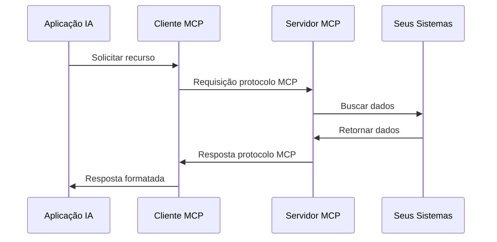

import { CodeExample } from '@/components/claude-sdk/CodeEditor'
import { Callout } from '@/components/ui/callout'
import { Diagram } from '@/components/claude-sdk/Diagram'

# O que é MCP?

## Introdução {#introduction}

O Model Context Protocol (MCP) está revolucionando como as aplicações de IA interagem com fontes de dados externas e ferramentas. Lançado pela Anthropic em novembro de 2024, o MCP rapidamente se tornou o padrão para construir sistemas de IA agênticos profissionais que vão além de simples chatbots.

<Callout type="info">
  **Insight Principal**: O MCP permite que a IA vá além da simples geração de texto para se tornar verdadeiros agentes capazes de acessar recursos e tomar ações significativas no mundo real.
</Callout>

### O Problema que o MCP Resolve

**Antes do MCP:**
- Cada desenvolvedor criava camadas de API personalizadas para integrações externas
- Cada integração exigia definições e esquemas de função personalizados
- Sem padronização entre diferentes ferramentas e serviços
- Reinvenção constante para integrações comuns

**Depois do MCP:**
- Camada de protocolo unificada que padroniza definições de ferramentas e recursos
- API consistente em todas as integrações
- Servidores reutilizáveis que podem ser compartilhados entre projetos
- Esquemas, funções e documentação padronizados

Neste módulo, você descobrirá:
- Por que o MCP foi criado e os problemas que resolve
- Os conceitos fundamentais que fazem o MCP funcionar
- Como construir sistemas de IA prontos para produção com MCP
- Aplicações empresariais do mundo real e benefícios

## Conceitos Principais {#core-concepts}

### Compreendendo o Protocolo

O MCP fornece uma maneira padronizada para aplicações de IA:

1. **Acessar Recursos**: Conectar-se a fontes de dados, arquivos e APIs
2. **Executar Ferramentas**: Realizar ações e operações
3. **Usar Prompts**: Aproveitar templates de prompt pré-construídos

<CodeExample
  title="Servidor MCP Python (Abordagem Moderna)"
  language="python"
  code={`from mcp import FastMCP

# Criar instância do servidor MCP
mcp = FastMCP(
    name="production-server",
    host="localhost", 
    port=8050
)

# Definir ferramentas usando decoradores
@mcp.tool
def get_customer_data(customer_id: str) -> dict:
    """Recuperar informações do cliente do banco de dados."""
    return {"id": customer_id, "name": "John Doe", "tier": "enterprise"}

@mcp.tool
def create_support_ticket(title: str, description: str) -> dict:
    """Criar um novo ticket de suporte."""
    return {"ticket_id": "TICK-001", "status": "created"}

# Executar servidor
if __name__ == "__main__":
    mcp.run(transport="stdio")  # ou mcp.run_sse() para HTTP`}
  highlightLines={[3, 4, 5, 10, 11, 15, 16]}
/>

### Componentes Principais

**1. Recursos**
Recursos são fontes de dados somente leitura que a IA pode acessar. Exemplos incluem:
- Registros de banco de dados
- Conteúdo de arquivos
- Respostas de API
- Informações do sistema

**2. Ferramentas**
Ferramentas permitem que a IA execute ações. Exemplos incluem:
- Escrever arquivos
- Enviar e-mails
- Executar comandos
- Chamar APIs

**3. Prompts**
Templates de prompt reutilizáveis que garantem comportamento consistente da IA.

<Callout type="success">
  **Dica Profissional**: Comece com recursos para expor dados, depois adicione ferramentas para ações. Essa separação mantém seu servidor MCP organizado e seguro.
</Callout>

## Arquitetura {#architecture}

### Como o MCP Funciona

O MCP segue uma arquitetura cliente-servidor:

1. **Servidor MCP**: Sua aplicação que expõe recursos e ferramentas
2. **Cliente MCP**: A aplicação de IA (como Claude) que se conecta ao seu servidor
3. **Camada de Transporte**: Como eles se comunicam (stdio, HTTP, WebSocket)

<Diagram
  id="mcp-architecture"
  title="Visão Geral da Arquitetura MCP"
  description="O fluxo de comunicação entre aplicações de IA e servidores MCP"
/>

### Fluxo de Comunicação

### Princípios de Design

O MCP é construído sobre vários princípios-chave:

1. **Simplicidade**: Fácil de implementar e entender
2. **Segurança**: Acesso controlado com limites claros
3. **Flexibilidade**: Funciona com qualquer linguagem de programação
4. **Extensibilidade**: Adicione capacidades conforme necessário

## Casos de Uso {#use-cases}

### Aplicações do Mundo Real

O MCP permite integrações empresariais poderosas:

**1. Automação de Suporte ao Cliente**
- Triagem e roteamento automatizado de tickets
- Escalonamento inteligente baseado em urgência
- Integração com Slack, JIRA e sistemas CRM
- Busca na base de conhecimento e recomendações

**2. Automação de Fluxo de Trabalho**
- Automação de processos de negócios em várias etapas
- Sincronização de dados entre sistemas
- Orquestração de fluxo de aprovação
- Processamento e roteamento de documentos

**3. Análise de Dados e Relatórios**
- Consultas e análises de banco de dados em tempo real
- Geração automatizada de relatórios
- Construção de grafos de conhecimento
- Dashboards de business intelligence

**4. Desenvolvimento e DevOps**
- Análise e geração de código
- Testes e implantação automatizados
- Monitoramento e alertas de infraestrutura
- Sincronização de documentação

**5. Integrações Empresariais**
- CRM e automação de vendas
- Integrações de sistema de RH
- Conexões de sistema financeiro
- Gestão da cadeia de suprimentos

<CodeExample
  title="Exemplo: Base de Conhecimento Empresarial"
  language="python"
  code={`@mcp.tool
def search_knowledge_base(query: str, category: str = "all") -> str:
    """Buscar na base de conhecimento da empresa para suporte ao cliente."""
    # Conectar ao sistema de conhecimento empresarial
    results = kb_search_api.search(query, category)
    
    formatted_results = ""
    for result in results:
        formatted_results += f"P: {result['question']}\n"
        formatted_results += f"R: {result['answer']}\n\n"
    
    return formatted_results

@mcp.tool  
def create_escalation_ticket(customer_id: str, issue: str, priority: str) -> dict:
    """Criar ticket de escalonamento de alta prioridade."""
    ticket = jira_api.create_issue({
        "summary": f"Escalonamento para cliente {customer_id}",
        "description": issue,
        "priority": priority,
        "labels": ["customer-escalation", "high-priority"]
    })
    return {"ticket_id": ticket.key, "status": "created"}`}
  runnable={false}
/>

## Benefícios {#benefits}

### Por Que Usar MCP?

1. **Padronização**: Um protocolo para todas as integrações
2. **Segurança**: Acesso controlado e auditável
3. **Reutilização**: Escreva uma vez, use com qualquer IA
4. **Flexibilidade**: Adicione capacidades incrementalmente
5. **À Prova de Futuro**: Evolui com as capacidades de IA
6. **Pronto para Empresas**: Construído para ambientes de produção
7. **Agnóstico de Linguagem**: Python, TypeScript, Rust e mais

<Callout type="success">
  **História de Sucesso**: Equipes usando MCP relatam desenvolvimento 70% mais rápido de integração de IA e segurança significativamente melhorada em comparação com soluções personalizadas.
</Callout>

### Vantagens do Python para MCP

Python é particularmente adequado para desenvolvimento MCP:

**Desenvolvimento Rápido**
- Definições de ferramentas simples baseadas em decoradores
- Rico ecossistema de bibliotecas para integrações empresariais
- Conexões fáceis com bancos de dados e APIs

**Pronto para Produção**
- Suporte para containerização Docker
- Async/await para alta performance
- Tratamento de erros e logging integrados
- Gerenciamento de ciclo de vida para conexões de banco de dados

**Integração Empresarial**
- Integração perfeita com infraestrutura Python existente
- Suporte para principais bancos de dados (PostgreSQL, MySQL, MongoDB)
- Autenticação empresarial (LDAP, SAML, OAuth)
- Ferramentas de monitoramento e observabilidade

## Equívocos Comuns {#misconceptions}

Vamos esclarecer alguns mal-entendidos comuns:

<Callout type="warning">
  **Mito**: "MCP é apenas para Claude"
  **Realidade**: MCP é um protocolo aberto que qualquer aplicação de IA pode implementar
</Callout>

<Callout type="warning">
  **Mito**: "MCP substitui APIs"
  **Realidade**: MCP complementa APIs existentes tornando-as acessíveis à IA
</Callout>

<Callout type="warning">
  **Mito**: "MCP é complexo de implementar"
  **Realidade**: Um servidor MCP básico pode ser criado em menos de 50 linhas de código
</Callout>

## Resumo {#summary}

Você aprendeu que o MCP:

✅ **Padroniza** como a IA se conecta a sistemas externos
✅ **Separa** acesso a dados (recursos) de ações (ferramentas)
✅ **Simplifica** o desenvolvimento de integração de IA
✅ **Protege** o acesso da IA aos seus sistemas

## Próximos Passos {#next-steps}

Pronto para construir seu primeiro servidor MCP? No próximo módulo, você irá:
- Configurar seu ambiente de desenvolvimento Python com MCP
- Criar um servidor MCP pronto para produção
- Implementar ferramentas e recursos de nível empresarial
- Testar com integração OpenAI
- Implantar com containerização Docker

<Callout type="info">
  **A Seguir**: [Configurando Seu Ambiente MCP de Produção](/learn/paths/mcp-fundamentals/modules/02-setting-up-environment) - Construa servidores MCP prontos para empresas com Python!
</Callout>